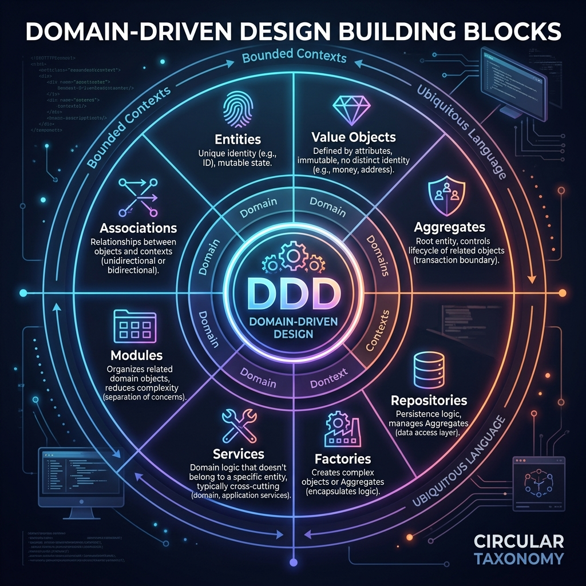
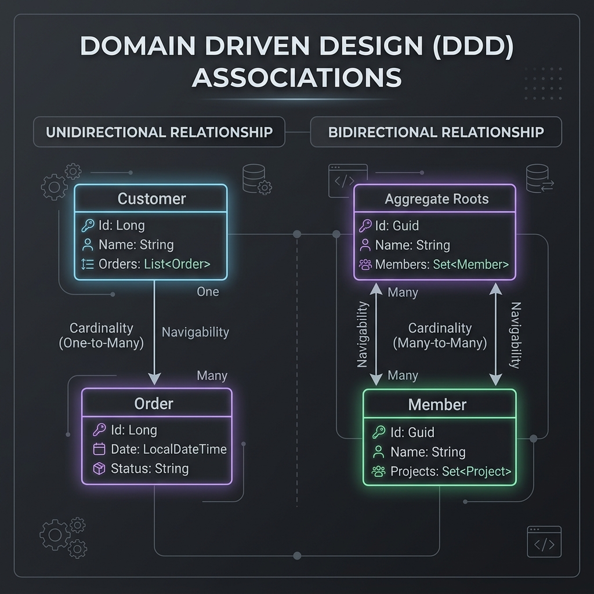
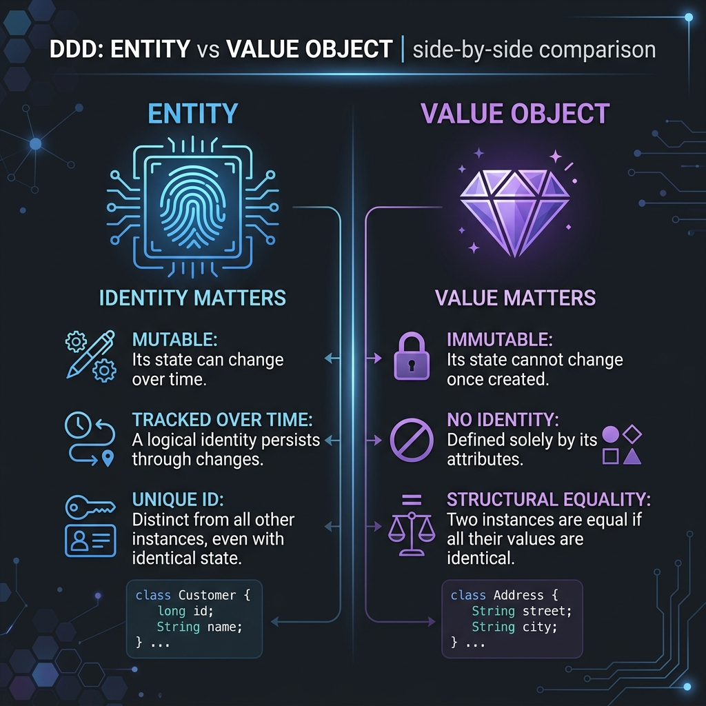
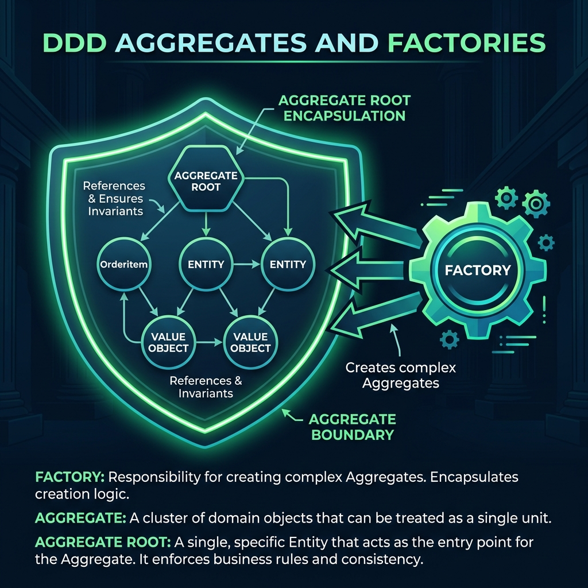
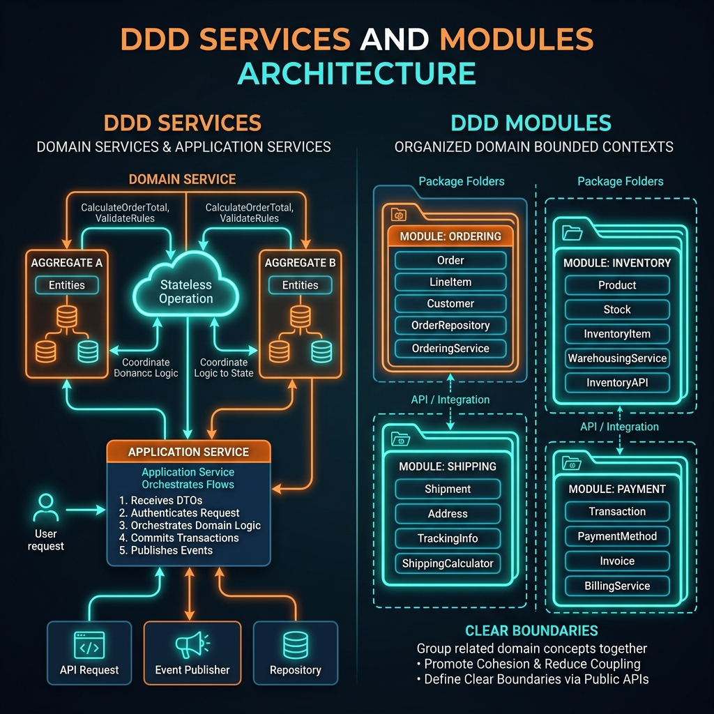
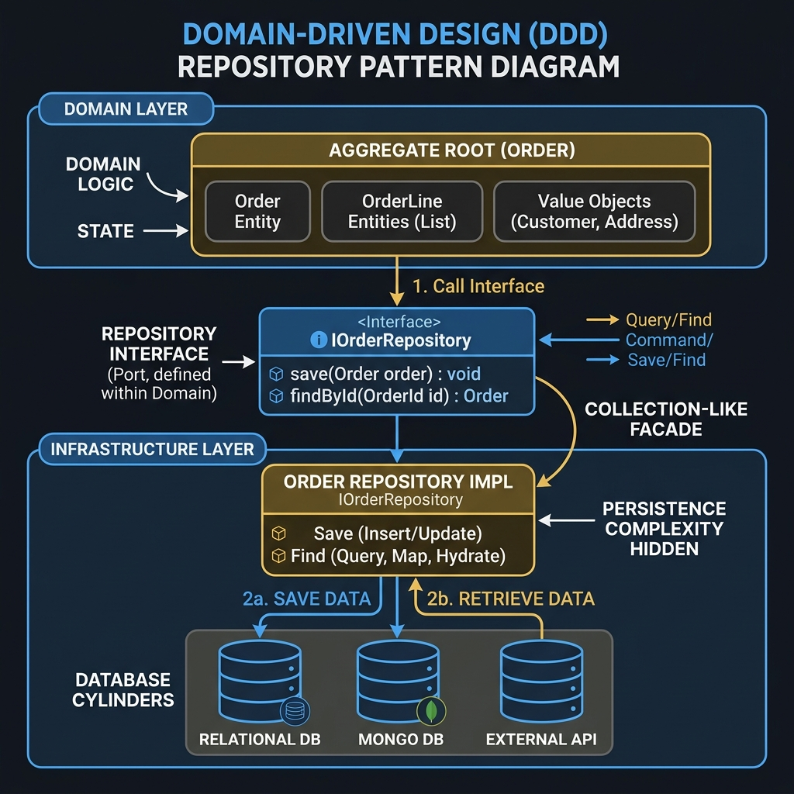

  

# Chapter 7: The Building Blocks of Domain-Driven Design

**🎯 The Big Goal:** Provide a comprehensive overview of the core building blocks used in Domain-Driven Design. This chapter serves as a unified reference guide for Associations, Entities, Value Objects, Services, Modules, Aggregates, Factories, and Repositories.

---

In Domain-Driven Design, we use a specific set of patterns to model the problem domain in software. These patterns help us transition from a conceptual model (the Ubiquitous Language) to a tactical implementation (the actual code). 

Here is a detailed breakdown of each core building block.

## 🔗 Associations

  

Associations define the relationships between different domain objects. In a complex model, associations can quickly become a tangled web, making the system difficult to understand and maintain. DDD provides guidelines to simplify them:

*   **Directionality:** Favor unidirectional associations over bidirectional ones. If `Customer` needs to know about `Order`, but `Order` doesn't strictly need to know about `Customer` to enforce its invariants, make the relationship unidirectional. This reduces coupling.
*   **Multiplicity:** Reduce multiplicity where possible. Instead of a many-to-many relationship, can it be simplified to a one-to-many or a one-to-one?
*   **Elimination:** If an association doesn't strictly serve a business use case, remove it. Only model what is necessary.

## 🆔 Entities vs. 💎 Value Objects

  

The two most fundamental elements of a domain model are Entities and Value Objects. Deciding which one to use is critical.

### Entities (Identity Matters)
An **Entity** is an object defined by a unique identity that persists over time, regardless of whether its attributes change.
*   **Identity:** Has a distinct ID (e.g., a UUID, an email address, an account number).
*   **Mutability:** Its inner state can change over its lifecycle.
*   **Example:** A `User`, an `Account`, a `Vehicle`. Two vehicles with the exact same make, model, and color are still different vehicles (different VINs).

### Value Objects (Value Matters)
A **Value Object** is an object defined solely by its attributes. It measures, quantifies, or describes something in the domain.
*   **No Identity:** It does not have an ID.
*   **Immutability:** Once created, it cannot be changed. If a value needs to change, you replace the entire object.
*   **Structural Equality:** Two Value Objects are considered equal if all their fields hold the exact same values.
*   **Example:** `Money`, `Address`, `Color`, `DateRange`. If two people live at "123 Main St", they share the same address value, even if they are different Entities.

## 🛡️ Aggregates & ⚙️ Factories

  

### Aggregates
An **Aggregate** is a cluster of domain objects (Entities and Value Objects) that are treated as a single transactional unit. 
*   **Aggregate Root:** Every Aggregate has one specific Entity that acts as the completely encapsulating root. 
*   **Enforcing Invariants:** The Root is responsible for enforcing all business rules (invariants) for the entire cluster. You cannot modify inner entities directly; you must ask the Root to perform the action.
*   **Transaction Boundary:** A database transaction should only modify one Aggregate at a time. This guarantees consistency without locking the entire database.

### Factories
When creating an Aggregate becomes too complex (e.g., it requires assembling many nested Entities and Value Objects, or fetching data from an external service just for creation), encapsulate that creation logic in a **Factory**.
*   A Factory's sole responsibility is to instantiate complex objects.
*   It ensures that the created object starts in a valid state.
*   It keeps the Domain Model clean by moving "how to build the object" out of the object itself.

## 🌩️ Services & 📁 Modules

  

### Services (Domain & Application)
Sometimes, an operation doesn't naturally belong to any single Entity or Value Object. Forcing it into one makes the design awkward. This is where Services come in. They are stateless operations.

*   **Domain Service:** Contains pure business logic that orchestrates multiple domain objects (e.g., a `FundsTransferService` that coordinates moving money between two `Account` aggregates).
*   **Application Service:** Contains no business logic. It orchestrates the use case workflow: receive a request, fetch objects from the database, call a Domain Service or an Aggregate, and save the result. It acts as the bridge between the outside world (UI/API) and the Domain Model.

### Modules (Packages/Namespaces)
**Modules** are essential for organizing related domain concepts together and reducing cognitive load. 
*   A Module should be cohesive (things inside it belong together) and have low coupling with other Modules.
*   They provide clear boundaries. You design the interfaces between Modules as carefully as you design the interfaces of individual classes.
*   In Java, these map directly to packages (e.g., `com.ecommerce.billing` vs `com.ecommerce.shipping`).

## 🗄️ Repositories

  

A **Repository** acts as a collection-like interface to access Domain Objects. It provides the illusion that all objects are stored in an in-memory collection.
*   **Only for Aggregate Roots:** You only create Repositories for Aggregate Roots. You do not create a Repository for every inner Entity. Saving an Aggregate Root saves the entire cluster.
*   **Separation of Concerns:** The Domain Layer defines the Repository *interface* (the pure contract). The Infrastructure Layer provides the concrete *implementation* (e.g., SQL queries, MongoDB connections). This hides the persistence complexity completely from the domain logic.

---

## 🤔 Reflection Questions

💡 View Answer: If an Aggregate Root contains multiple inner Entities, should I create a Repository for those inner Entities to make querying them easier?

No! This is a common anti-pattern. You must only ever interact with the persistence layer through the Aggregate Root's Repository. If you fetch an inner Entity directly, you bypass the Aggregate Root, which means you bypass the business rules it is supposed to enforce. If you need to query an inner entity heavily for display purposes, consider using CQRS (Chapter 6) to create a dedicated read model.

💡 View Answer: Why should Value Objects be immutable?

Immutability eliminates an entire class of side-effect bugs. If a Value Object is shared across multiple Entities (e.g., multiple users share the same `Address` object in memory), changing a field on that object would inadvertently change the address for everyone. By making it immutable, any change requires creating a brand new instance, ensuring thread safety and predictable behavior.

---

[← Previous Chapter: CQRS & Event Sourcing](../06_CQRS_Event_Sourcing/) · [📚 Back to Course Overview](../README.md)

