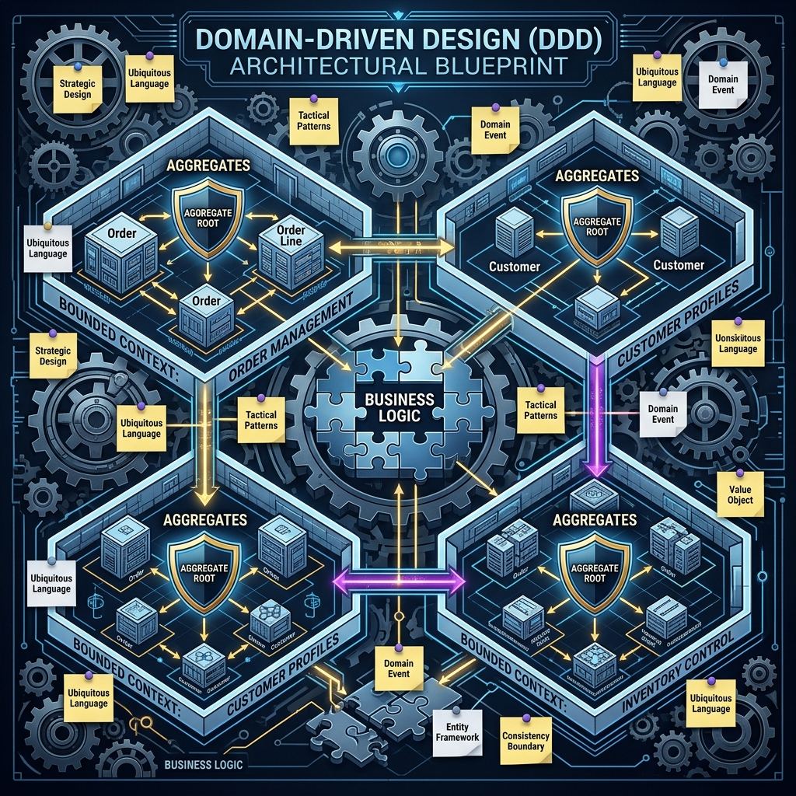

  
   
  <h1>🏛️ Domain-Driven Design (DDD)</h1>
  
<i>Tackling Complexity in the Heart of Software</i>

Welcome to the **Domain-Driven Design (DDD)** course. This curriculum synthesizes key concepts from the foundational literature of DDD, including the seminal work by Eric Evans (*The Blue Book*), Vernon Vaughn's practical guides, and modern insights from Vladik Khononov and the broader DDD community.

When building complex enterprise software, technology isn't the hardest part—**understanding the business domain** is. This course teaches you how to model complex logic, organize large systems into cohesive bounded contexts, and implement those models using robust tactical patterns in Java.

---

## 📚 Course Curriculum

| Chapter | Topic | Description |
|---------|-------|-------------|
| **01** | [The Ubiquitous Language](01_Ubiquitous_Language/) | Bridging the gap between domain experts and developers. |
| **02** | [Strategic Design](02_Strategic_Design/) | Bounded Contexts, Context Mapping, and system integration. |
| **03** | [Tactical Design](03_Tactical_Design/) | Entities, Value Objects, and Aggregate Roots. |
| **04** | [Repositories & Services](04_Repositories_Services/) | Application Orchestration, Domain Services, and persistence. |
| **05** | [Domain Events](05_Domain_Events/) | Eventually consistent side-effects and decoupling boundaries. |
| **06** | [CQRS & Event Sourcing](06_CQRS_Event_Sourcing/) | Separating reads from writes and treating events as truth. |
| **07** | [DDD Building Blocks](07_DDD_Building_Blocks/) | A visual encyclopedia of all core concepts and their relationships. |

---

## 📖 Source Material

This curriculum draws heavily from the following foundational texts:
- *Domain-Driven Design: Tackling Complexity in the Heart of Software* (Eric Evans)
- *Learning Domain-Driven Design* (Vladik Khononov)
- *Domain-Driven Design: A pragmatic approach* (Eduard Ghergu)
- *Domain-Driven Design: The First 15 Years* (Essays from the DDD Community)

## 💻 Language

All code examples provided in this curriculum are written in **Java (17+)**, showcasing modern object-oriented programming techniques perfectly suited for DDD tactical patterns.
