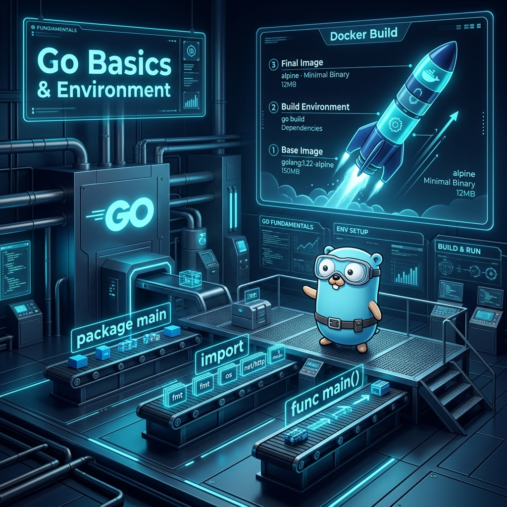

# 01: Go Basics and Environment

<p align="center">
  
</p>

> 🧠 **The Feynman Hook:** Go is opinionated on purpose. If Java is a Swiss Army knife with 200 tools, Go is a scalpel: one edge, perfectly sharp. The designer of C++, Bjarne Stroustrup, said "every feature added to a language is also a feature that programmers must defend against." Go's designers said: "no classes, no inheritance, one formatter, one way to loop." The result? You can read any Go codebase in the world and it looks like code you wrote yourself.

## 🎯 What You'll Learn

> **After this chapter, you will understand how to build, run, and Dockerize a Go program — and why Go's radical minimalism is its greatest strength.**

This guide pulls core concepts from *Go Programming: From Beginner to Professional*.

---

## 1. The Simplest Program

> **Feynman Insight:** Every Go program is a three-ingredient recipe: declare the package (`package main` tells the compiler "this is a runnable program, not a reusable library"), import what you need (`import "fmt"` is the printing toolkit), and define the entry point (`func main()` is where the OS starts execution). Remove any of the three and the program refuses to compile. This strict structure means you never open a Go file and wonder where execution begins.

Unlike C++ or Java, Go prefers ultra-lightweight syntax. It strips away classes, inheritance, and exception throwing — replacing them with a highly opinionated standard formatter (`gofmt`).

### `main.go`
```go
// Every Go program must start with a package declaration.
// The 'main' package tells the compiler this is an executable, not a library.
package main

// Import the formatting library for fast I/O
import "fmt"

func main() {
    fmt.Println("Welcome to Modern Golang!")
}
```

---

## 2. Dockerizing Go (The Zero-Overhead Container)

> **Feynman Insight:** Go compiles to a single native binary — no virtual machine, no runtime, no interpreter. Imagine if a recipe created a self-contained microwave that needed nothing else to cook the meal. That's a Go binary: it carries everything it needs. The `FROM scratch` Docker stage takes this further — it's an empty container with *literally nothing in it*, not even a shell. The Go binary runs directly against the Linux kernel. The result is a production image smaller than a mobile app icon: under 5MB.

Go is a compiled language that can target specific OS architectures. If we compile statically, we don't even need an underlying Linux distribution to run the binary inside Docker. We can use `scratch` (a literally empty container) to create production images smaller than 5 Megabytes!

### `Dockerfile`
This is a **Multi-Stage Build**. It compiles the code in Stage 1, and only copies the lightweight binary into Stage 2.

```dockerfile
# Stage 1: Build the binary using the heavy official Go image
FROM golang:1.22-alpine AS builder

# Set working directory
WORKDIR /app

# Copy source code
COPY main.go .

# Compile the binary.
# CGO_ENABLED=0 disables C-bindings, creating a 100% pure static Go binary.
RUN CGO_ENABLED=0 GOOS=linux go build -a -installsuffix cgo -o main .

# Stage 2: Create the minimal execution container
FROM scratch

# Copy the static binary from the builder stage
COPY --from=builder /app/main /main

# Execute
ENTRYPOINT ["/main"]
```

### `docker-compose.yml`
```yaml
version: '3.8'

services:
  go-basics:
    build: .
    container_name: golang_basics
```

### Running the Environment
Run this command in the directory holding these three files:
```bash
docker compose up --build
```
You will immediately see the container boot up, print "Welcome to Modern Golang!", and gracefully exit.

---

## 3. Variables, Types, and Short Declaration

> **Feynman Insight:** Go has one rule about variables: declare it, use it, or face a hard compiler error. In Python, unused variables silently litter your code. In Go, they are build failures. This forces a discipline that eliminates dead code by construction. The `:=` short declaration operator is Go's gift: it figures out the type automatically inside functions ("name := "Alice"` is a `string` — the compiler can see that). At the package level, you must use `var` because `:=` is too casual for global scope.

Go has standard data types, but offers a very unique initialization syntax called **Short Variable Declaration**.

### `main.go` (Variables Example)

```go
package main

import "fmt"

// Package-level variables MUST use the 'var' keyword
var globalServer string = "AWS_EU_WEST"

func main() {
    // 1. Explicit Declaration (Verbose)
    var age int = 30
    var price float64 = 19.99

    // 2. Type Inference
    var isVerified = true

    // 3. Short Variable Declaration (Idiomatic Go)
    // The ':=' operator declares AND initializes a new variable.
    // It is exclusively used inside functions.
    name := "Bjarne"   // Deduced to string
    userId := 4022     // Deduced to int

    // If you declare a variable in Go and DO NOT use it,
    // the compiler will throw a hard error and refuse to build!
    fmt.Printf("User %s (ID: %d) is verified: %t\n", name, userId, isVerified)
    fmt.Println("Server:", globalServer, "| Age:", age, "| Price:", price)
}
```

---

## 4. Control Flow (If, For, Switch)

> **Feynman Insight:** Other languages give you `while`, `do-while`, `for`, and `foreach`. Go gives you exactly one: `for`. The Go designers asked "can one keyword do all the work?" Yes: `for i := 0; i < 3; i++` is the classic loop. `for count > 0` is the while loop. `for {}` is the infinite loop. One keyword, three shapes — simpler to teach, simpler to read, impossible to confuse. The `if` statement adds a bonus: you can declare a variable that exists only inside the `if/else` block, making scope crystal clear.

Go is incredibly minimalist. There is no `while` loop or `do-while` loop. The `for` loop serves every repetitive purpose.

### `main.go` (Control Flow Example)

```go
package main

import "fmt"

func main() {
    // 1. The Standard For Loop
    fmt.Print("Standard Loop: ")
    for i := 0; i < 3; i++ {
        fmt.Print(i, " ")
    }
    fmt.Println()

    // 2. The "While" Loop (Just 'for' without semicolons)
    fmt.Print("While Loop: ")
    count := 2
    for count > 0 {
        fmt.Print(count, " ")
        count--
    }
    fmt.Println()

    // 3. If Initialization Statement
    // You can initialize a variable right inside the 'if' condition!
    // Its scope is strictly limited to the if/else block.
    if statusCode := 200; statusCode == 200 {
        fmt.Println("Success! Status:", statusCode)
    } // statusCode ceases to exist here.

    // 4. Switch statements
    // Go automatically breaks after every case! No need for explicit 'break'.
    osType := "darwin"
    switch osType {
    case "darwin":
        fmt.Println("Running on macOS")
    case "linux":
        fmt.Println("Running on Linux")
    default:
        fmt.Println("Unknown OS")
    }
}
```

---

## 🤔 Reflection Questions

1. **Why does Go require all declared variables to be used?**
<details>
<summary>💡 View Answer</summary>

Unused variables are a sign of dead code or programming mistakes. By making them a compile error — not just a warning — Go prevents bugs caused by off-by-one variable names (e.g., `config` vs `Config`), reduces cognitive overhead for code reviewers, and keeps codebases clean automatically. Python's `_` throwaway variable exists precisely because Python doesn't enforce this.
</details>

2. **Why does Go use `FROM scratch` in Docker instead of `FROM alpine`?**
<details>
<summary>💡 View Answer</summary>

`FROM alpine` adds ~5MB of Linux utilities (shell, `apk`, `busybox`). A Go static binary doesn't need any of these — it talks directly to the kernel. `FROM scratch` completely eliminates the attack surface: there are no shell injection vulnerabilities, no OS utilities to exploit, and no `apk` to install malicious packages. It also reduces the final image by those 5MB, which compounds across thousands of Kubernetes pods.
</details>

---

## 📝 Key Interview Talking Points

- **"Go compiles to a static binary with zero runtime dependencies"** — this is why Docker, Kubernetes, and Terraform are all written in Go.
- **The `:=` operator** only works inside functions — global variables always need `var`.
- **`gofmt`** is part of the toolchain, not an optional linter — Go codebases are universally formatted identically.
- **`FOR` absorbs WHILE** — Go has exactly three control flow keywords: `if`, `for`, `switch`.

In the next chapter (`02_Structs_and_Interfaces.md`), we look at how Go completely reinvented Object-Oriented Programming without classes.
