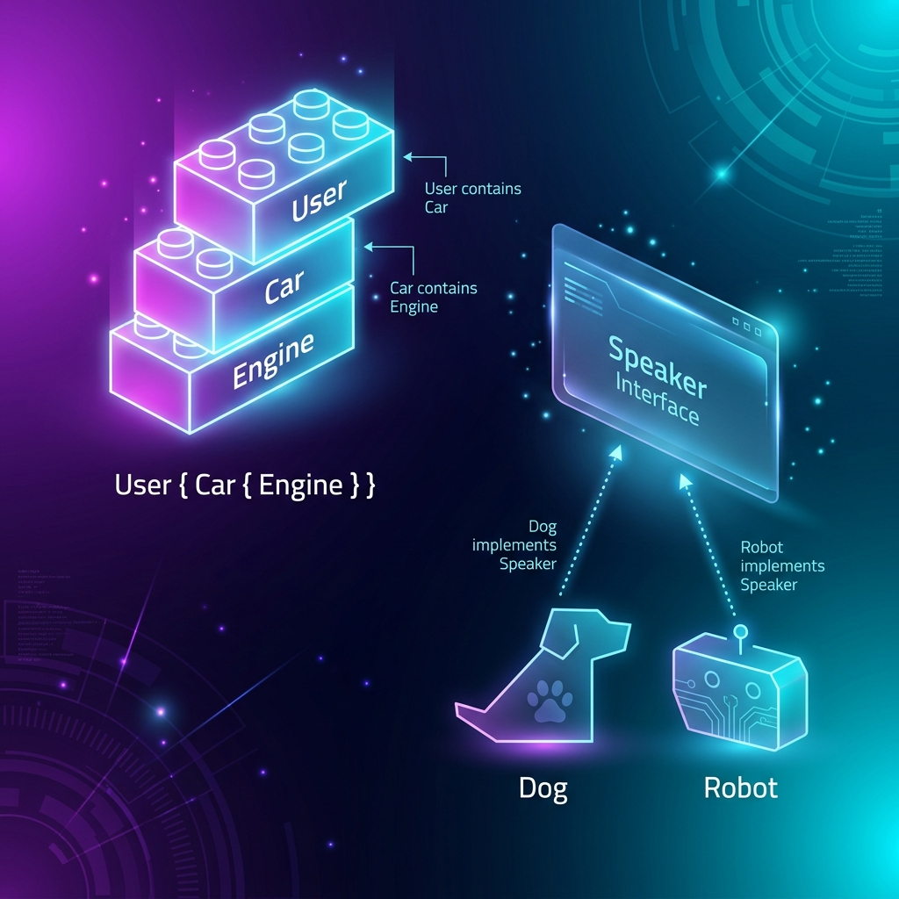

# 02: Structs and Interfaces (Go's OOP)

<p align="center">
  
</p>

> 🧠 **The Feynman Hook:** Every programming language asks "how do you describe a thing?" Java says: "write a class with private fields, a constructor, and methods inside curly braces." Go says: "define the data separately (Struct), then attach the behaviour externally (Methods), and describe capability abstractly (Interface) — and never inherit from anything." This is like the difference between a job description (Interface: "must be able to drive"), a person (Struct: Name, Age), and the actual CV item (Method: `func (p Person) Drive()`). A person meets the job requirement automatically — they don't need to declare `Person implements Driver`.

If you have a background in Java, Python, or C++, learning Go requires unlearning traditional Object-Oriented Programming (OOP).

Go has **no classes**, **no inheritance (`extends`)**, and **no constructors**. Instead, it utilises **Composition** via `Structs` and **Implicit Behaviour** via `Interfaces`.

---

## 1. Structs (Data Aggregation)

> **Feynman Insight:** A Struct is a blueprint for a compound noun. A `User` is not just a name, not just an email — it's a name AND an email AND an ID AND an active flag, all bundled into one named thing. Just like a passport is meaningless without all its fields together, a User Struct makes sense only as a unit. Go gives every unset field a **Zero Value** automatically — `int` becomes `0`, `string` becomes `""`, `bool` becomes `false`. This prevents null pointer crashes: there's no such thing as an uninitialised Struct field in Go.

A `struct` is simply a blueprint that groups together variables (fields).

### `main.go`
```go
package main

import "fmt"

// Define a struct
type User struct {
    ID       int
    Username string
    Email    string
    IsActive bool
}

func main() {
    // 1. Instantiation (Zero Value)
    // If you don't assign values, Go assigns "Zero Values" (0, "", false).
    var u1 User

    // 2. Instantiation (Struct Literal)
    u2 := User{
        ID:       101,
        Username: "gopher",
        Email:    "gopher@golang.org",
        IsActive: true,
    }

    // 3. Pointers to Structs (Fast references)
    // The built-in 'new' keyword allocates memory and returns a pointer (*User)
    u3 := new(User)
    u3.Username = "admin" // Notice we don't need '->' like C++. Go auto-dereferences!

    fmt.Printf("User 1: %+v\n", u1) // %+v prints the field names!
    fmt.Printf("User 2: %+v\n", u2)
    fmt.Printf("User 3 (Pointer): %+v\n", *u3)
}
```

---

## 2. Methods (Behaviour)

> **Feynman Insight:** In Java, methods live inside the class definition — the class is the container. In Go, a method is a function with a "Receiver Argument": a special first parameter that says "this function belongs to this type." Think of it like attaching a label to a toolbox: the `Scale` function has a label saying "I work on Rectangles." Value receivers work on a photocopy of the Struct. Pointer receivers work on the original — use the pointer when you need to *change* the Struct, the same way an editor works on the original manuscript, not a photocopy.

Instead of placing functions *inside* a class, Go attaches functions to structs using a **Receiver Argument**.

```go
package main

import "fmt"

type Rectangle struct {
    Width  float64
    Height float64
}

// VALUE RECEIVER: Operates on a *copy* of the struct.
// Use this if you don't need to modify the data.
func (r Rectangle) Area() float64 {
    return r.Width * r.Height
}

// POINTER RECEIVER: Operates on the *original* memory address.
// Use this if you need to mutate the struct!
func (r *Rectangle) Scale(multiplier float64) {
    r.Width *= multiplier
    r.Height *= multiplier
}

func main() {
    rect := Rectangle{Width: 10, Height: 5}

    fmt.Println("Original Area:", rect.Area()) // Output: 50

    rect.Scale(2) // Mutates the original struct

    fmt.Println("Scaled Area:", rect.Area())   // Output: 200
}
```

---

## 3. Composition (Instead of Inheritance)

> **Feynman Insight:** Inheritance (`extends`) says "a Car IS an Engine." Composition says "a Car HAS an Engine." Consider the real world: a car is not a subtype of engine — it *contains* one. Go takes this seriously: you embed a `Engine` struct inside `Car` as an anonymous field. Go then **promotes** all of Engine's methods onto Car automatically, so `myCar.Start()` works without you writing `myCar.Engine.Start()`. You get all the convenience of inheritance without the nightmare of deep class hierarchies.

Go intentionally omits `extends`. If a `Car` needs the features of an `Engine`, you embed an engine inside it. This is called **Struct Embedding** or **Composition over Inheritance**.

```go
package main

import "fmt"

type Engine struct {
    Horsepower int
}

func (e Engine) Start() {
    fmt.Printf("Engine starting with %d HP!\n", e.Horsepower)
}

// Car "embeds" Engine.
// It does not inherit from it, it holds it.
type Car struct {
    Make  string
    Model string
    Engine // Anonymous embedded field
}

func main() {
    myCar := Car{
        Make:  "Tesla",
        Model: "Model S",
        Engine: Engine{
            Horsepower: 1020,
        },
    }

    // Because Engine is embedded anonymously, we can call Start() directly on Car!
    // We don't have to write myCar.Engine.Start() (though that works too).
    myCar.Start()
}
```

---

## 4. Interfaces (Implicit Fulfillment)

> **Feynman Insight:** In Java, satisfying an interface requires a formal contract: `class Dog implements Speaker`. In Go, the contract is automatic: if something walks like a duck and quacks like a duck, Go says it *is* a duck — no declaration needed. This is called **structural typing**. Write a `Dog` struct with a `Speak() string` method, and it automatically satisfies any interface that requires `Speak() string`. This means you can make code polymorphic without touching the original struct — you can make third-party library types satisfy your interfaces without modifying the library.

This is Go's most powerful feature. In Java, a class must explicitly declare it implements an interface: `class User implements Notifier`.

In Go, **Interfaces are fulfilled implicitly**. If a Struct has the exact methods described by an Interface, it automatically fulfils that Interface. No `implements` keyword required!

```go
package main

import "fmt"

// 1. The Interface
// Describes BEHAVIOR, not data.
type Speaker interface {
    Speak() string
}

// 2. Struct A
type Dog struct {
    Name string
}

// Dog implicitly implements Speaker just by having this method!
func (d Dog) Speak() string {
    return "Woof! My name is " + d.Name
}

// 3. Struct B
type Robot struct {
    ModelID int
}

// Robot implicitly implements Speaker too!
func (r Robot) Speak() string {
    return fmt.Sprintf("Beep. I am unit %d", r.ModelID)
}

// 4. Polymorphic Function
// Accepts ANYTHING that fulfills the Speaker interface.
func Announce(s Speaker) {
    fmt.Println("Announcement:", s.Speak())
}

func main() {
    d := Dog{Name: "Rex"}
    r := Robot{ModelID: 9000}

    // Both can be passed into Announce because they both have a Speak() string method.
    Announce(d)
    Announce(r)
}
```

---

## 5. Dockerizing the Examples

To run any of the code snippets above locally, use the exact same multi-stage Docker setup from `01_Basics_and_Environment.md`.

### `Dockerfile`
```dockerfile
FROM golang:1.22-alpine AS builder
WORKDIR /app
COPY main.go .
RUN CGO_ENABLED=0 GOOS=linux go build -o app .

FROM scratch
COPY --from=builder /app/app /app
ENTRYPOINT ["/app"]
```

### `docker-compose.yml`
```yaml
version: '3.8'
services:
  go-oop:
    build: .
    container_name: golang_oop
```
```bash
docker compose up --build
```

---

## 🤔 Reflection Questions

1. **Why does Go use composition instead of inheritance?**
<details>
<summary>💡 View Answer</summary>

Deep inheritance hierarchies create **brittle coupling**: changing a base class can break dozens of subclasses unpredictably. The famous "Gorilla/Banana problem" — you wanted a banana, you got the gorilla holding the banana and the entire jungle. Composition is additive and explicit: a Car is assembled from parts (Engine, Transmission, Tyres). Each part can be swapped independently. Interfaces then define capability contracts ("can this thing drive?") without caring about the internal parts.
</details>

2. **What is the difference between a Value Receiver and a Pointer Receiver?**
<details>
<summary>💡 View Answer</summary>

A **Value Receiver** (`func (r Rectangle) Area()`) receives a **copy** of the struct. Mutations inside the function are discarded — the original is untouched. A **Pointer Receiver** (`func (r *Rectangle) Scale()`) receives the actual memory address. Mutations persist. Rule of thumb: use pointer receivers when the function modifies the struct OR when the struct is large (copying a 10-field struct every call wastes CPU). Consistency matters: if any receiver for a type is a pointer, all should be.
</details>

---

## 📝 Key Interview Talking Points

- **"Go has no classes — Structs hold data, Methods hold behaviour, Interfaces describe capability"** — three separate concerns, three separate tools.
- **Implicit interface satisfaction** means you can write interfaces against third-party code you don't control.
- **Anonymous embedding** is Go's composition mechanism — it promotes methods but does NOT create an IS-A relationship.
- **Value vs Pointer receivers** — the most common Go interview question. Value = read-only copy, Pointer = mutating original.
