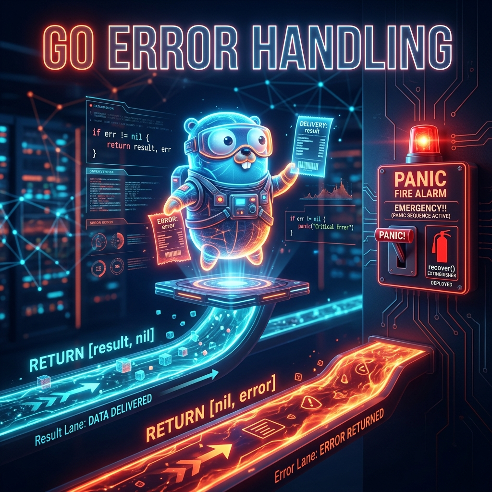

# 03: Error Handling

<p align="center">
  
</p>

> 🧠 **The Feynman Hook:** In most languages, errors are gremlins that hide in the dark — a `try/catch` block catches whatever might explode, but you rarely know *which specific line* threw and *what exactly when wrong*. Go abolishes this ambiguity. Every function that can fail returns two things: the result AND an error. Like a delivery driver who hands you both the parcel and a formal receipt — you look at the receipt (error) first. If it says "nil" (delivery succeeded), you open the parcel (result). If the receipt shows a problem, you deal with it *right there*, not three layers up the call stack.

In almost every other language (Java, C++, Python, C#), errors are handled via "Exceptions" (`try/catch`).

Go famously abandons this model. In Go, **errors are just values**. They are returned alongside the normal data. This makes error handling explicit, preventing hidden crashes and forcing the developer to deal with failure states actively.

---

## 1. The `error` Interface

> **Feynman Insight:** The `error` type in Go is just an interface with a single method: `Error() string`. That means anything that can describe itself as a string is an error. There's no special exception class, no stack-unwinding machinery, no `try` block syntax — just a regular function return value. This is intentionally boring: it forces errors to be just as visible and deliberate as successful return values.

An error in Go is simply anything that implements the built-in `error` interface.

```go
// The built-in error interface
type error interface {
    Error() string
}
// Anything that has an Error() string method is essentially an error!
```

### Returning and Checking Errors

Functions in Go can return multiple values. It is a universal Go idiom that the *last* value returned is of type `error`. If it's successful, the `error` is `nil`.

```go
package main

import (
    "errors"
    "fmt"
)

// A function returning an int AND an error
func Divide(a, b int) (int, error) {
    if b == 0 {
        // We use the errors package to generate a simple standard error
        return 0, errors.New("cannot divide by zero")
    }
    // Execution succeeded. Return the result, and nil for the error.
    return a / b, nil
}

func main() {
    // We catch BOTH values returned by the function using the := operator
    result, err := Divide(10, 2)

    // ALWAYS CHECK IF err IS NOT NIL!
    if err != nil {
        fmt.Println("Math failed:", err)
        return // End execution gracefully
    }

    fmt.Println("Result is:", result)

    // Triggering the error
    brokenResult, err := Divide(10, 0)
    if err != nil {
        fmt.Println("Math failed:", err) // Output: Math failed: cannot divide by zero
    } else {
        fmt.Println("Result is:", brokenResult)
    }
}
```

---

## 2. Advanced Error Formatting

> **Feynman Insight:** `errors.New()` gives you a plain, static message — like a Post-It note saying "Something went wrong." `fmt.Errorf()` is like a printed form with blanks filled in: "Order ID -5 is invalid: must be positive." The `%w` verb in `fmt.Errorf` goes further — it **wraps** the original error inside the new one, preserving the full chain. Callers can then use `errors.Is()` to inspect the chain: "Is this a database timeout error somewhere inside this wrapped chain?" even if it's wrapped three layers deep.

You can use the `fmt` package to create dynamic, formatted errors with context.

```go
package main

import "fmt"

func ProcessOrder(orderID int) error {
    if orderID < 0 {
        // fmt.Errorf allows us to inject variables into the error string
        return fmt.Errorf("invalid order ID: %d. Order IDs must be positive", orderID)
    }
    return nil // Success
}

func main() {
    err := ProcessOrder(-5)
    if err != nil {
        // Logging the error to the console
        fmt.Println("FATAL:", err)
    }
}
```

---

## 3. Panic and Recover (The "Break Glass" Option)

> **Feynman Insight:** `panic` is the fire alarm. Pull it only when the building is actually on fire — when there is no sensible way for the program to continue (e.g., the database is unreachable on startup, a nil pointer was dereferenced by a programming bug). `recover()` is the fire extinguisher: it can put out the fire *only if used inside a `deferred` function* — think of `defer` as the "always runs last, no matter what" cleanup crew. `defer` is also how Go replaces Java's `finally` block: `defer file.Close()` placed right after `file.Open()` guarantees the file is closed even if a panic erupts on line 500.

Go *does* have something resembling an exception: it's called a `panic`.

However, **you should almost never use it in library code**. A `panic` is reserved exclusively for unrecoverable state errors (e.g., the application cannot connect to the database on startup, so it must die).

### `main.go`
```go
package main

import "fmt"

func RiskCrash() {
    // 1. Defer: A function call preceded by 'defer' runs immediately BEFORE the surrounding function returns.
    // It is primarily used to close files or network connections reliably.
    defer fmt.Println("1. This runs right before RiskCrash exits.")

    // 2. Recover: The recover() function stops the program from crashing and captures the panic value.
    // IT ONLY WORKS INSIDE A DEFERRED FUNCTION!
    defer func() {
        if r := recover(); r != nil {
            fmt.Println("3. Recovered from major panic! Error was:", r)
        }
    }()

    fmt.Println("2. About to panic...")

    // 3. Panic: Instantly halts normal execution and begins unwinding the stack.
    panic("CRITICAL MEMORY FAILURE")

    fmt.Println("This line will never execute.")
}

func main() {
    fmt.Println("--- Starting ---")

    RiskCrash()

    // Because we 'recovered', the application keeps running!
    fmt.Println("--- Application Survived ---")
}
```

### Dockerizing the Environment
Using the standard template from `01_Basics_and_Environment.md`:

```dockerfile
FROM golang:1.22-alpine AS builder
WORKDIR /app
COPY main.go .
RUN CGO_ENABLED=0 go build -o app .

FROM scratch
COPY --from=builder /app/app /
ENTRYPOINT ["/app"]
```

```yaml
version: '3.8'
services:
  go-errors:
    build: .
    container_name: golang_error_handling
```

---

## 🤔 Reflection Questions

1. **Why is `if err != nil` considered better than `try/catch`?**
<details>
<summary>💡 View Answer</summary>

`try/catch` hides the error path: a developer can read 100 lines of code inside a `try` block without knowing exactly which line can fail or in what way. With `if err != nil` immediately after every fallible call, the error path is explicit and co-located with the call that produced it. It also makes error handling impossible to silently skip — in Java, an unchecked exception can propagate 50 call frames before anything notices. In Go, every caller must consciously decide what to do with the error.
</details>

2. **When should you `panic` vs return an `error`?**
<details>
<summary>💡 View Answer</summary>

Return an **error** for any failure that the caller could reasonably handle: file not found, invalid input, network timeout. Use **panic** exclusively for programmer mistakes that indicate a broken program state: nil pointer dereference, out-of-bounds index on a slice that should never be empty. Libraries should **never** panic — they have no way to know if their callers can handle it. Server frameworks (like HTTP handlers) typically wrap handlers in a deferred `recover` to convert panics into 500 responses rather than crashing the entire process.
</details>

---

## 📝 Key Interview Talking Points

- **"Errors are values in Go"** — the most important phrase. No hidden exception propagation.
- **The `defer` statement** executes right before the surrounding function returns, in LIFO order (last-in, first-out). Critical for resource cleanup.
- **`panic` is not for error handling** — it's for catastrophic programmer bugs. Libraries must never panic.
- **`fmt.Errorf("%w", err)` wraps errors** — callers can use `errors.Is()` and `errors.As()` to inspect the chain.
- **The comma-ok pattern** (`result, err :=`) is Go's universal idiom for handling dual return values.
