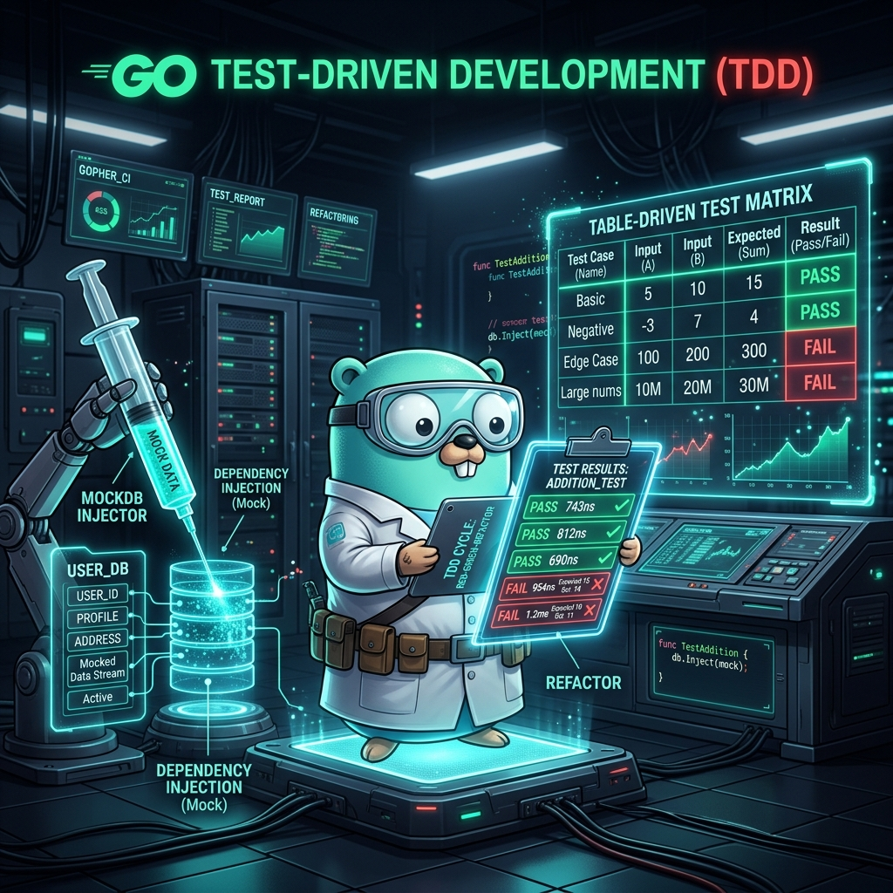

# 06: Test-Driven Development (TDD)

<p align="center">
  
</p>

> 🧠 **The Feynman Hook:** Most languages treat testing as an afterthought — a separate framework you add, configure, and learn independently. Go treats testing like a first-class feature of the language itself: `go test` is part of the compiler toolchain, test files live right next to the code they test, and the naming convention is enforced by the compiler itself. It's like a car factory where the safety testing rig is built directly into the assembly line — not a separate quality department in another building. If you don't have a `_test.go` file next to your `.go` file, the code isn't considered complete.

Go completely ignores third-party testing frameworks (like JUnit or pytest). Instead, testing is a first-class citizen embedded directly into the compiler toolchain: `go test`.

---

## 1. The Built-in `testing` Package

> **Feynman Insight:** A test file ending in `_test.go` is invisible to the compiler when building production binaries — it only activates when you run `go test`. A test function starting with `Test` and taking `*testing.T` is the contract: `t.Errorf()` marks the test as failed and continues (like a teacher marking an answer wrong and moving on), while `t.Fatalf()` marks it failed and stops immediately (like a teacher tearing up the paper). The `testing.T` parameter is the teacher's red pen.

Test files must end in `_test.go`. Test functions must start with `Test` and take a pointer to `testing.T` as their only parameter.

### `calculator.go` (The Implementation)
```go
package mathops

import "errors"

func Add(a, b int) int {
    return a + b
}

func Divide(a, b int) (int, error) {
    if b == 0 {
        return 0, errors.New("cannot divide by zero")
    }
    return a / b, nil
}
```

### `calculator_test.go` (The Test File)
```go
package mathops

import "testing"

// 1. The Basic Test
func TestAdd(t *testing.T) {
    result := Add(2, 3)
    expected := 5

    // If it fails, we explicitly call t.Errorf (which fails the test and continues)
    // or t.Fatalf (which explicitly stops execution immediately).
    if result != expected {
        t.Errorf("Expected %d, got %d", expected, result)
    }
}
```

---

## 2. Table-Driven Tests (The Go Idiom)

> **Feynman Insight:** Writing one test function per test case results in test files longer than the code being tested. Table-Driven Tests solve this with a single insight: a function's correctness is defined by a table of (inputs → expected outputs). Express that table as a slice of anonymous structs, loop through it, and run each row as a named sub-test via `t.Run()`. Sub-tests are beautiful: `go test -run TestDivide/Zero_Division_Error` runs only the "Zero Division Error" row. This is like having a single test harness that runs 1000 variations from a spreadsheet, instead of 1000 separate test functions.

The community standard is **Table-Driven Tests** — a massive array of structs containing all possible testing states, iterated with sub-tests.

```go
package mathops

import "testing"

func TestDivideTableDriven(t *testing.T) {
    // 1. Define the Struct slice describing the inputs and expected outputs
    tests := []struct {
        name        string
        a, b        int
        expected    int
        expectError bool
    }{
        {"Normal Division", 10, 2, 5, false},
        {"Negative Division", -10, 2, -5, false},
        {"Zero Division Error", 10, 0, 0, true},
        {"Large Number Division", 1000, 10, 100, false},
    }

    // 2. Loop through the test structs
    for _, tt := range tests {
        // 3. Run a sub-test block using t.Run (allows running specific tests by name on the CLI)
        t.Run(tt.name, func(t *testing.T) {

            result, err := Divide(tt.a, tt.b)

            if tt.expectError {
                if err == nil {
                    t.Errorf("Expected an error but got none!")
                }
            } else {
                if err != nil {
                    t.Errorf("Received unexpected error: %v", err)
                }
                if result != tt.expected {
                    t.Errorf("Expected %d, got %d", tt.expected, result)
                }
            }
        })
    }
}
```

**Running the tests:**
```bash
go test -v ./...
```

---

## 3. Mocking Dependencies via Interfaces

> **Feynman Insight:** You cannot unit test a function that calls the real Stripe API — not because it's hard, but because it's wrong: unit tests must be instant, isolated, and free. Go's implicit interface fulfillment makes mocking trivially easy. Define a `Datastore` interface for what your code needs from the database. In production, inject `PostgresDB`. In tests, inject `MockDB` — a fake struct that implements the same interface and returns whatever you program it to. No mocking frameworks, no annotations, no `@Mock` annotations — just Go's structural typing doing its job.

In Go, we don't need heavyweight mocking frameworks. Because Interfaces are fulfilled implicitly, we simply have our test pass a *fake struct* with the same methods.

### `database.go` (The Production Interface)
```go
package repository

import "fmt"

// 1. Define the Behavior
type Datastore interface {
    SaveUser(username string) error
}

type PostgresDB struct{}

func (db PostgresDB) SaveUser(username string) error {
    fmt.Println("Connecting to Real Postgres DB -> Network Latency...")
    return nil // Simulates a successful real network call
}

// 2. Dependency Injection
func RegisterNewUser(db Datastore, username string) error {
    // We only care that 'db' can SaveUser(). We don't care IF it's Postgres!
    return db.SaveUser(username)
}
```

### `database_test.go` (The Mock Injection)
```go
package repository

import "testing"

// 1. Create a Fake/Mock Implementation
type MockDB struct {
    MockError error // We can manipulate this from the test to simulate failures!
    CallCount int
}

// It implicitly fulfills Datastore!
func (m *MockDB) SaveUser(username string) error {
    m.CallCount++
    return m.MockError // Instantly returns whatever we programmed it to return
}

func TestRegisterNewUser(t *testing.T) {
    // Inject the fast, fake database into the Register function!
    mockStore := &MockDB{MockError: nil}

    err := RegisterNewUser(mockStore, "test_admin")

    if err != nil {
        t.Errorf("Expected registration to succeed")
    }

    if mockStore.CallCount != 1 {
        t.Errorf("Expected MockDB to be called exactly 1 time")
    }
}
```

### Dockerizing the Testing Execution
**`Dockerfile.test`**
```dockerfile
FROM golang:1.22-alpine
WORKDIR /app
COPY . .
# Setting the entrypoint strictly to run the test framework
ENTRYPOINT ["go", "test", "-v", "./..."]
```

```bash
docker build -f Dockerfile.test . && docker run --rm <image_id>
```

---

## 🤔 Reflection Questions

1. **Why is `t.Errorf` preferred over `t.Fatalf` in most cases?**
<details>
<summary>💡 View Answer</summary>

`t.Fatalf` immediately stops the current test function — like an exam invigilator snatching your paper the moment you make one mistake. You only see the first failure. `t.Errorf` marks the test failed but continues — like a teacher marking every mistake on the paper. You see *all* failures at once, which is dramatically more useful for debugging: if 5 cases fail, you want to know all 5, not just the first one. Reserve `t.Fatalf` for cases where a failure makes subsequent assertions meaningless (e.g., if a response is nil, testing `response.StatusCode` would panic).
</details>

2. **Why don't we need a mocking framework like Mockito in Go?**
<details>
<summary>💡 View Answer</summary>

Mockito in Java is necessary because Java requires explicit `implements` declarations, making it impossible to create a mock that satisfies an interface at runtime without knowing the class hierarchy at compile time. Go's **implicit interface satisfaction** means any struct with the right methods satisfies the interface automatically. A `MockDB` struct with a `SaveUser(username string) error` method implicitly satisfies `Datastore` — no annotations, no code generation, no reflection. Write the struct, inject it. Done.
</details>

---

## 📝 Key Interview Talking Points

- **`_test.go` files are excluded from production builds** — the compiler only compiles them during `go test`.
- **Table-Driven Tests** are the community standard — one function testing 50 cases via a struct slice.
- **`t.Run(name, func)`** creates named sub-tests — runnable independently via `go test -run TestName/SubTestName`.
- **Mocking is interface injection** — there's no mocking framework because Go's structural typing makes it unnecessary.
- **`go test -race`** detects concurrent data race conditions — always run this in CI pipelines.
- **`go test -cover`** reports test coverage percentage per package.
