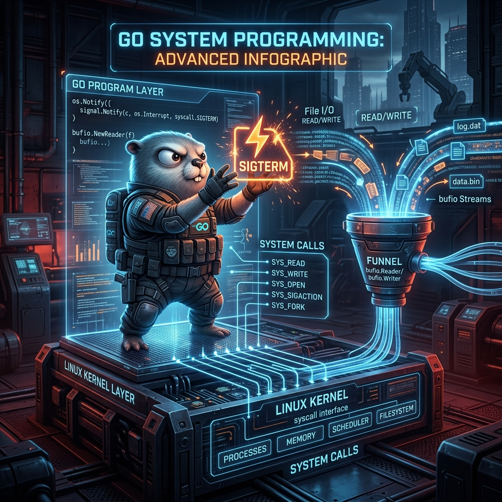

# 08: System Programming in Go

<p align="center">
  
</p>

> 🧠 **The Feynman Hook:** System programming is writing code that talks directly to the operating system — not just through a framework's HTTP abstraction. Go sits perfectly between C's raw power and Python's convenience. It gives you direct access to POSIX signals (the OS's way to say "please stop"), raw file descriptors, and `os.Args` — the exact command-line tokens the user typed. But unlike C, you don't wrestle with null-terminated strings and manual memory allocation. Go wraps these system calls in a clean, safe API that feels as natural as calling any other function.

Go sits in the unique territory right above C and C++, providing high-level networking/API design while possessing direct access to low-level POSIX System Calls.

---

## 1. Process Signal Handling (Graceful Shutdowns)

> **Feynman Insight:** When Docker runs `docker stop my-container`, it sends a `SIGTERM` signal to your process. If you don't handle it, the OS kills you hard after a timeout — active database connections are orphaned, in-flight requests are dropped, and customers see errors. Handling `SIGTERM` is like being a responsible tenant when given an eviction notice: you don't just walk out and leave the oven on — you turn everything off, inform the relevant parties, and then leave. A buffered signal channel (`make(chan os.Signal, 1)`) is critical because if the channel isn't ready when the OS delivers the signal, the signal is **dropped**.

When running inside Docker or Kubernetes, your app receives a `SIGTERM` signal when scaling down or deploying. We must build a **Graceful Shutdown** handler.

### `main.go`
```go
package main

import (
    "fmt"
    "os"
    "os/signal"
    "syscall"
    "time"
)

func main() {
    // 1. Create a channel capable of receiving OS Signals
    // It must be a buffered channel to prevent the OS from attempting to write
    // to full memory, which could drop the kill signal.
    sigChan := make(chan os.Signal, 1)

    // 2. Register which signals we want this channel to listen for
    // SIGINT  (Ctrl+C from keyboard)
    // SIGTERM (Docker/Kubernetes termination request)
    signal.Notify(sigChan, syscall.SIGINT, syscall.SIGTERM)

    // 3. Fire a background Goroutine to simulate active work running infinitely
    go func() {
        for {
            fmt.Println("[WORKER] Processing background job...")
            time.Sleep(2 * time.Second)
        }
    }()

    fmt.Println("[SYSTEM] Application booted. Waiting to be killed...")

    // 4. BLOCK the main thread on the signal channel!
    // The main process will sleep eternally exactly here until the OS kills us.
    receivedSignal := <-sigChan

    // 5. The Graceful Teardown Phase
    fmt.Printf("\n[SYSTEM] Received (%s) signal! Commencing graceful shutdown.\n", receivedSignal)
    fmt.Println("[SYSTEM] Unlocking Database...")
    time.Sleep(1 * time.Second)
    fmt.Println("[SYSTEM] Flushing remaining streams to disk...")
    time.Sleep(1 * time.Second)

    fmt.Println("[SYSTEM] All jobs gracefully terminated. Halting Process.")

    // We exit gracefully (OS exit code 0)
    os.Exit(0)
}
```

### Try it with Docker
Run `docker compose up`, then press `CTRL+C`. Docker sends `SIGTERM`. Your app intercepts it, announces the shutdown, simulates cleanup, and cleanly exits.

---

## 2. Reading POSIX Command Line Arguments

> **Feynman Insight:** `os.Args` is a slice of strings — exactly what the user typed, split on spaces. `os.Args[0]` is always the name of the binary itself (`./myapp`), so user-provided arguments start at index 1. This is identical to C's `argc`/`argv` — Go just wraps it in a slice instead of raw pointer arithmetic. CLI programs are the backbone of Linux tooling: every command you run in a terminal is a process reading `os.Args`. Understanding this is understanding Linux itself.

Instead of a bulky UI, system programs act as CLI utilities reading `os.Args` (the equivalent of C++'s `int argc, char** argv`).

```go
package main

import (
    "fmt"
    "os"
)

func main() {
    // Retrieve the arguments exactly as the user typed them in the bash terminal
    args := os.Args

    if len(args) < 2 {
        fmt.Println("Usage: ./myapp [username]")
        os.Exit(1) // Exit with a generic error code
    }

    // args[0] is perpetually the name of the executable itself (e.g. "./myapp")
    // The user's input begins at args[1]
    username := args[1]

    fmt.Printf("Authenticating user POSIX shell context: %s\n", username)
}
```

---

## 3. High-Performance File I/O (`bufio`)

> **Feynman Insight:** Reading a 10GB log file with `os.ReadFile()` loads all 10GB into RAM simultaneously — guaranteed to crash a container with a 4GB memory limit. `bufio.Scanner` is a **streaming reader**: it reads one line at a time, holds only one line in memory at any moment, and discards each line after processing. This is the difference between reading a book by carrying all 400 pages in both hands, and reading it one page at a time by turning pages. The `defer file.Close()` immediately after `os.Open()` is Go's insurance policy: the file descriptor is returned to the OS no matter what happens next — even if a panic erupts 300 lines later.

Go's standard library provides incredibly fast file interactions. Reading massive log files entirely into RAM causes Out-Of-Memory (OOM) Kubernetes crashes. We must stream files using `bufio` buffers.

### `main.go`
```go
package main

import (
    "bufio"
    "fmt"
    "os"
)

func main() {
    const filename = "/etc/hosts"

    // 1. Open the file
    // This executes a Linux `open()` syscall behind the scenes yielding a hardware file descriptor
    file, err := os.Open(filename)
    if err != nil {
        fmt.Printf("Fatal: Could not open %s\n", filename)
        os.Exit(1)
    }

    // 2. DEFER the close operation!
    // Never forget to close raw OS resources, or you'll run out of file descriptors ('Too many open files').
    // Wrapping it in defer guarantees execution no matter how the function exits!
    defer file.Close()

    // 3. Create a Buffered Scanner
    // The scanner reads chunk by chunk instead of loading gigabytes of data into RAM at once.
    scanner := bufio.NewScanner(file)

    fmt.Println("--- Scanning Host File ---")
    lineCount := 0
    for scanner.Scan() {
        lineCount++
        fmt.Printf("Line %d: %s\n", lineCount, scanner.Text())
    }

    if err := scanner.Err(); err != nil {
        fmt.Println("Error reading OS Stream:", err)
    }
}
```

---

## 4. Dockerizing System Programs

**`Dockerfile`**
```dockerfile
FROM golang:1.22-alpine AS builder
WORKDIR /app
COPY main.go .
RUN CGO_ENABLED=0 go build -o app .

FROM scratch
COPY --from=builder /app/app /
ENTRYPOINT ["/app"]
```

**`docker-compose.yml`**
```yaml
version: '3.8'
services:
  go-sys:
    build: .
    container_name: golang_system
```

```bash
docker compose up --build
```
*Note: Press `CTRL+C` while running to watch Docker send `SIGTERM` and verify your Graceful Shutdown handler intercepts it!*

---

## 🤔 Reflection Questions

1. **Why must the signal channel be buffered with capacity 1?**
<details>
<summary>💡 View Answer</summary>

The Go runtime delivers signals to channels asynchronously. If the channel is unbuffered (capacity 0), the sender (the OS signal delivery goroutine) blocks until a receiver is ready. If the main goroutine is briefly busy at the exact moment the `SIGTERM` arrives, the signal goroutine cannot send it into the channel — and the signal is **dropped**. A buffered channel of capacity 1 allows the signal to be deposited immediately without a receiver being ready, ensuring the signal is never lost. The main goroutine then picks it up when it reaches `<-sigChan`.
</details>

2. **Why is `defer file.Close()` placed immediately after `os.Open()`?**
<details>
<summary>💡 View Answer</summary>

Go's `defer` executes in LIFO order at function exit. Placing the `Close()` immediately after `Open()` is a defensive coding pattern: you declare the cleanup obligation the moment you acquire the resource. If you place it 50 lines later, a developer reading the code must mentally track "did we open a file? Is it still open here?" More critically, if any code between `Open()` and a later `Close()` returns early via an error, you can leak the file descriptor. `defer` is immune to early returns — it always runs.
</details>

---

## 📝 Key Interview Talking Points

- **`SIGTERM` vs `SIGKILL`**: `SIGTERM` is a polite request — your program can handle it. `SIGKILL` is a hard kill — no handler possible. Kubernetes sends `SIGTERM`, waits `terminationGracePeriodSeconds` (default 30s), then sends `SIGKILL`.
- **Buffered signal channels** (`make(chan os.Signal, 1)`) prevent signal loss during handler setup.
- **`defer file.Close()`** immediately after `os.Open()` is idiomatic Go for guaranteed resource cleanup.
- **`bufio.Scanner`** streams line-by-line — essential for large files. `os.ReadFile()` loads the whole file into memory (useful only for small files).
- **`os.Exit(0)`** vs simply returning from `main`: `os.Exit` skips running deferred functions. Prefer returning from `main` naturally so deferred cleanup runs.
