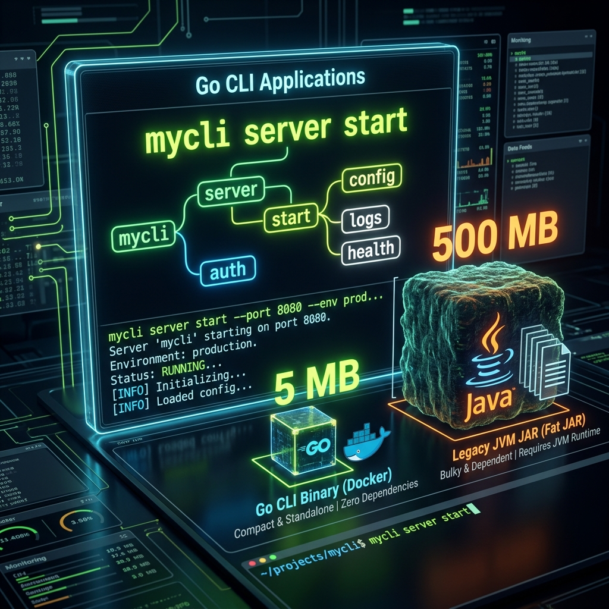

# 09: Building Modern CLI Applications

<p align="center">
  
</p>

> 🧠 **The Feynman Hook:** Docker, Kubernetes (`kubectl`), Terraform, GitHub CLI, and Hugo — all written in Go. Why? Because a Go CLI binary is the perfect tool: it compiles to a single file under 10MB with zero runtime dependencies. You don't need Java installed, Python installed, or Node.js installed. You copy one file to a server, and it works. Contrast with a Java CLI tool: you need to ship the entire JVM (hundreds of MB) just to run it. The `flag` package turns this binary into a professional tool that self-documents its own usage (`-help`), parses typed arguments automatically, and validates inputs at startup.

Based on *Building Modern CLI Applications in Go*, this module demonstrates why Go is the reigning champion of terminal applications.

---

## 1. The Built-in `flag` Package

> **Feynman Insight:** The `flag` package is like a self-filling form. You define the fields (flag names, types, defaults, and descriptions) upfront. When the user runs the program, `flag.Parse()` reads `os.Args`, fills in the form fields automatically, and makes them available as typed variables. The critical insight: flags return **pointers**, not values. `flag.String("host", "localhost", "...")` returns a `*string`. You must dereference it with `*hostPtr` to get the actual string. This is because the flags are populated into memory after `flag.Parse()` — the pointer ensures you're always reading the live, populated value.

The standard library provides everything you need to build simple configuration flags.

### `main.go`
```go
package main

import (
    "flag"
    "fmt"
    "os"
)

func main() {
    // 1. Define your Flags (Name, Default Value, Help Description)
    // These return POINTERS to the actual variables (e.g., *string)
    hostPtr := flag.String("host", "localhost", "The target host IP or Domain")
    portPtr := flag.Int("port", 8080, "The port to connect to")
    debugPtr := flag.Bool("debug", false, "Enable verbose debug logging")

    // 2. Parse the command-line input!
    // This MUST be called after defining all flags and before accessing them.
    flag.Parse()

    // 3. Application Logic
    if *debugPtr {
        fmt.Println("[DEBUG] Raw command line args:", os.Args)
        fmt.Println("[DEBUG] Number of parsed flags:", flag.NFlag())
    }

    // Notice we must dereference (*) the pointers to get the value
    fmt.Printf("Connecting to %s:%d...\n", *hostPtr, *portPtr)
}
```

### Try it with Docker

**`Dockerfile`**
```dockerfile
FROM golang:1.22-alpine AS builder
WORKDIR /app
COPY main.go .
RUN CGO_ENABLED=0 go build -o mycli .

FROM scratch
COPY --from=builder /app/mycli /
# The ENTRYPOINT allows us to pass arguments dynamically at runtime
ENTRYPOINT ["/mycli"]
```

Build the CLI securely inside the container:
```bash
docker build -t go-cli .
```

Run the container, passing arguments directly into it!
```bash
# 1. Defaults
docker run --rm go-cli
# Output: Connecting to localhost:8080...

# 2. Custom Flags
docker run --rm go-cli -host=db.production.local -port=5432 -debug
# Output:
# [DEBUG] Raw command line args: [/mycli -host=db.production.local -port=5432 -debug]
# [DEBUG] Number of parsed flags: 3
# Connecting to db.production.local:5432...

# 3. Auto-Generated Help Menu
docker run --rm go-cli -help
# Output:
# Usage of /mycli:
#   -debug
#         Enable verbose debug logging
#   -host string
#         The target host IP or Domain (default "localhost")
#   -port int
#         The port to connect to (default 8080)
```

---

## 2. Advanced CLI Tools (Cobra / Viper)

> **Feynman Insight:** The `flag` package handles flat flags like `-port 8080`. But real CLI tools have **verbs and nouns**: `kubectl get pods`, `kubectl describe node worker-1`, `git commit -m "message"`. These are nested subcommands, not flat flags. **Cobra** is the Go library that models this as a tree: the root command (`mycli`) has child commands (`server`), which have grandchild commands (`start`). Each node in the tree can have its own flags, its own help text, and its own `Run` function. Cobra is what powers `kubectl`, `docker`, and `gh`. **Viper** adds configuration file support — so `--port 8080` and `config.yaml: port: 8080` and `PORT=8080` environment variable all merge into one resolved value.

While the `flag` package is fantastic for quick scripts, enterprise tools like `kubectl` have deeply nested subcommands. You use the open-source **Cobra** framework (which literally powers `kubectl` and `Hugo`).

### Subcommand Example (Conceptual with Cobra)

```go
package main

import (
    "fmt"
    "github.com/spf13/cobra"
)

func main() {
    // 1. The Root Command (e.g. 'mycli')
    var rootCmd = &cobra.Command{
        Use:   "mycli",
        Short: "MyCLI is a lightning fast orchestrator",
        Run: func(cmd *cobra.Command, args []string) {
            fmt.Println("Please provide a subcommand! Try `mycli server start`")
        },
    }

    // 2. The Nested Subcommand (e.g. 'server')
    var serverCmd = &cobra.Command{
        Use:   "server",
        Short: "Manage the application server",
    }

    // 3. The Deep Action (e.g. 'start')
    var startCmd = &cobra.Command{
        Use:   "start",
        Short: "Starts the production server on port 8080",
        Run: func(cmd *cobra.Command, args []string) {
            fmt.Println("Starting REST API on 0.0.0.0:8080...")
        },
    }

    // Connect them together
    rootCmd.AddCommand(serverCmd)
    serverCmd.AddCommand(startCmd)

    // Execute the Root Command (which automatically parses os.Args)
    rootCmd.Execute()
}
```

---

## 🤔 Reflection Questions

1. **Why do `flag.String()` and `flag.Int()` return pointers instead of values?**
<details>
<summary>💡 View Answer</summary>

The `flag` package registers the flag *before* parsing. When you call `flag.String(...)`, it creates a `string` variable in memory and returns a pointer to it. At that point, the user hasn't typed anything yet — the value is just the default. When `flag.Parse()` runs, it reads `os.Args`, finds matching flag names, and **writes into those pre-registered memory addresses**. If these were values (not pointers), `Parse()` would have no way to update them — it would be writing into copies. The pointer ensures that `Parse()` updates the same memory location your code reads from with `*hostPtr`.
</details>

2. **When would you use Cobra over the built-in `flag` package?**
<details>
<summary>💡 View Answer</summary>

Use the built-in **`flag`** package for simple, single-purpose tools: one executable, flat flags, no subcommands (e.g., a data migration script, a health check utility). Use **Cobra** when your tool has: (1) multiple subcommands (`mycli deploy`, `mycli rollback`), (2) hierarchical commands nested three+ levels deep (`kubectl get namespace default`), (3) persistent flags that apply to all subcommands, (4) auto-generated shell completion (`mycli completion bash`). Cobra also integrates naturally with Viper for reading configuration from files, environment variables, and flags simultaneously.
</details>

---

## 📝 Key Interview Talking Points

- **Go produces self-contained static binaries** — no JVM, no Python interpreter, no runtime needed at deployment.
- **`flag.Parse()` must be called before accessing any flag value** — accessing `*hostPtr` before `flag.Parse()` gives you only the default value.
- **`-help` is auto-generated** by the `flag` package from the description strings you provide.
- **Cobra** is the standard for enterprise CLI tools. It generates shell tab-completion, man pages, and hierarchical help automatically.
- **`docker run --rm go-cli -flag=value`** — the `ENTRYPOINT ["/mycli"]` array form (not string form) allows Docker to correctly pass arguments through.
