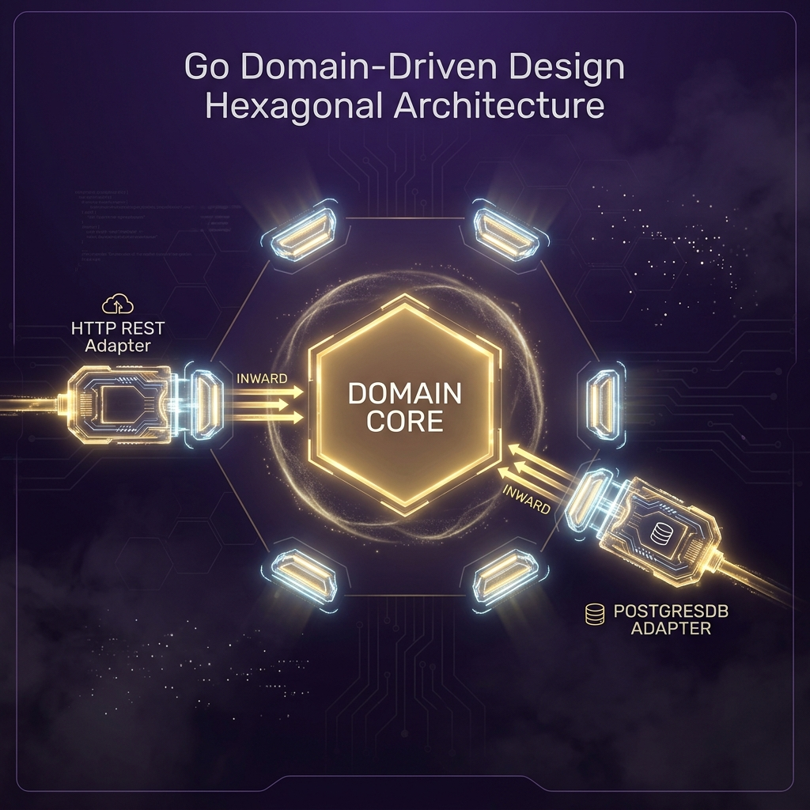

# 10: Domain-Driven Design (Hexagonal Architecture)

<p align="center">
  
</p>

> 🧠 **The Feynman Hook:** Imagine you're designing a heart transplant procedure. The heart surgeon (your Domain Core) must not know which hospital they're in, which brand of instruments they're using, or which insurance company is paying. The surgery procedure is the same regardless. In software, the Domain Core is the business logic — the rules of your application. The hospital building is the REST API adapter. The instruments are the PostgreSQL adapter. The insurance company is the billing adapter. They all plug in and out without the surgeon changing a single technique. This is Hexagonal Architecture: the business logic is at the centre, surrounded by swappable adapters.

As we enter Phase 4, we examine how to structure enterprise Go applications. For scripts, putting everything in `main.go` is fine. For Microservices, it guarantees chaos.

---

## 1. The Problem with Tight Coupling

> **Feynman Insight:** Tight coupling means your code knows too many details about its collaborators. If your REST handler directly imports the AWS S3 SDK, you've created a dependency chain: test the handler? You need AWS credentials. Switch to Google Cloud? You rewrite the handler. Tight coupling is like wiring your house lights directly to your electricity supplier — switching suppliers requires rewiring every light. **Interfaces (Ports)** are the wall socket standard: any compatible power source can plug in.

If your REST Controller directly imports an Amazon S3 SDK to upload an image, you are doomed. If you decide to switch to Google Cloud or a local disk, you must rewrite the entire REST API layer.

Worse: You cannot write Unit Tests without charging your credit card!

---

## 2. Hexagonal Architecture (Ports and Adapters)

> **Feynman Insight:** The Domain Core is a clean room. No outside contamination allowed. It doesn't import `net/http`, `database/sql`, or any AWS SDK. It defines only **what it needs** via interfaces (Ports): "I need something that can `SaveUser()`." It doesn't care if that's a PostgreSQL database or a flat file or an in-memory map. The Adapters are the hazmat suits that let the outside world touch the clean room without contaminating it. This is why swapping PostgreSQL for MongoDB is a one-file change — only the Adapter changes, never the Domain.

In Hexagonal Architecture, the Application **Core (Domain)** has absolutely zero dependencies. It communicates with the outside world purely through **Interfaces (Ports)**. The outside world plugs into these Ports using **Implementations (Adapters)**.

### The Domain (Core Logic)
This is pure Go code. No frameworks.

**`domain/user.go`**
```go
package domain

import "fmt"

// The Core Business Entity
type User struct {
    ID    string
    Email string
}

// THE PORT (Interface): This defines what the Domain NEEDS from the outside world.
// It doesn't care if it's MySQL, MongoDB, or a dummy map!
type UserRepository interface {
    Save(u User) error
    FindByID(id string) (User, error)
}

// The Core Service
type UserService struct {
    // The Service holds the Port Interface, never a concrete database struct!
    repo UserRepository
}

// Dependency Injection Factory
func NewUserService(repo UserRepository) UserService {
    return UserService{repo: repo}
}

// Business Logic
func (s UserService) RegisterUser(email string) error {
    if email == "" {
        return fmt.Errorf("email cannot be empty")
    }
    newUser := User{ID: "USR-001", Email: email}

    // Calls the interface, completely unaware of WHERE it's saving.
    return s.repo.Save(newUser)
}
```

---

## 3. The Adapters (Plugging into the Ports)

> **Feynman Insight:** An Adapter is a translator. The `PostgresUserRepository` speaks Postgres SQL but translates it into the `UserRepository` interface language that the Domain understands. The Domain says "Save this User." The Postgres Adapter says "INSERT INTO users... OK done." The domain never hears the word "INSERT" — it only ever sees `Save()`. The HTTP Adapter works in reverse: it hears HTTP requests and translates them into `UserService` method calls. The Domain never hears the word "HTTP."

### The Database Adapter (Driven Adapter)

**`adapters/postgres_repo.go`**
```go
package adapters

import (
    "fmt"
    "myapp/domain"
)

type PostgresUserRepository struct {
    ConnectionString string
}

// Implicitly fulfills domain.UserRepository!
func (db PostgresUserRepository) Save(u domain.User) error {
    fmt.Printf("[POSTGRES] Opening transaction... Executing INSERT for %s\n", u.Email)
    return nil // Simulates success
}

func (db PostgresUserRepository) FindByID(id string) (domain.User, error) {
    return domain.User{ID: id, Email: "found@db.local"}, nil
}
```

### The REST API Adapter (Driving Adapter)

**`adapters/http_handler.go`**
```go
package adapters

import (
    "fmt"
    "net/http"
    "myapp/domain"
)

type UserHandler struct {
    service domain.UserService
}

func NewUserHandler(service domain.UserService) UserHandler {
    return UserHandler{service: service}
}

// A standard Go net/http handler
func (h UserHandler) RegisterEndpoint(w http.ResponseWriter, r *http.Request) {
    email := r.URL.Query().Get("email")

    // Call the Domain Core
    err := h.service.RegisterUser(email)

    if err != nil {
        http.Error(w, err.Error(), http.StatusBadRequest)
        return
    }
    w.WriteHeader(http.StatusCreated)
    fmt.Fprintf(w, "User formally registered!")
}
```

---

## 4. The `main.go` Wiring (Dependency Injection)

> **Feynman Insight:** `main.go` in a Hexagonal system is the assembly foreman. It imports all the parts (adapters, domain), wires them together in the correct order, and starts the machine. The wiring order is inward-to-outward: create the database adapter first, inject it into the domain service, inject the service into the HTTP handler. If you flip the order, the Go compiler immediately tells you about the missing dependency. This is **manual dependency injection** — explicit and transparent. No magic `@Autowired` annotations, no reflection-based DI containers.

**`main.go`**
```go
package main

import (
    "log"
    "net/http"
    "myapp/domain"
    "myapp/adapters"
)

func main() {
    // 1. Instantiate the Database Adapter
    db := adapters.PostgresUserRepository{ConnectionString: "postgres://admin:pass@db:5432/core"}

    // 2. Inject the Database into the Core Domain Service
    userService := domain.NewUserService(db)

    // 3. Inject the Core Service into the HTTP REST Handler
    userHandler := adapters.NewUserHandler(userService)

    // 4. Start the Web Server
    http.HandleFunc("/register", userHandler.RegisterEndpoint)

    log.Println("Domain-Driven Microservice Booting on :8080...")
    log.Fatal(http.ListenAndServe(":8080", nil))
}
```

### Testing is Trivial
To test `domain/user.go`, we **never** invoke Docker or PostgreSQL. We pass a `MockUserRepository` (as learned in Module `06`) directly into `NewUserService` and execute the unit tests instantly.

---

## 5. Dockerizing the Hexagonal Architecture

**`Dockerfile`**
```dockerfile
FROM golang:1.22-alpine AS builder
WORKDIR /app
# We copy everything, so the Go compiler can find all adapter/domain packages
COPY . .
RUN CGO_ENABLED=0 go build -o my_microservice .

FROM scratch
COPY --from=builder /app/my_microservice /
EXPOSE 8080
ENTRYPOINT ["/my_microservice"]
```

**`docker-compose.yml`**
```yaml
version: '3.8'
services:
  go-ddd:
    build: .
    container_name: golang_hexagonal
    ports:
      - "8080:8080"
```

```bash
docker compose up --build
```

---

## 🤔 Reflection Questions

1. **What is the concrete benefit of the Domain Core having zero framework imports?**
<details>
<summary>💡 View Answer</summary>

Zero imports means **zero coupling** to external changes. If AWS updates their SDK's interface, your domain tests still pass — the domain never imported the SDK. If you migrate from net/http to Fiber (a faster HTTP framework), your domain is unchanged — only the HTTP Adapter changes. Most critically, unit tests against the Domain Core run in **milliseconds** with no containers, no network, no external services — just pure function calls with mock adapters.
</details>

2. **What is the difference between a Driving Adapter and a Driven Adapter?**
<details>
<summary>💡 View Answer</summary>

A **Driving Adapter** (also called Primary Adapter) initiates calls *into* the Domain Core. It is driven by an external stimulus: an HTTP request arrives, and the REST handler drives the Domain to process it. Examples: REST API handler, gRPC server, CLI command handler. A **Driven Adapter** (Secondary Adapter) is called *by* the Domain Core to reach the outside world. Examples: PostgreSQL repository, AWS S3 storage, email sending service. The Domain Core depends on the interface, not the concrete adapter.
</details>

---

## 📝 Key Interview Talking Points

- **"Ports and Adapters"** is the technical name. "Hexagonal Architecture" is the diagram name. "Clean Architecture" (Uncle Bob) is the popularised name. They describe the same principle.
- **The Domain Core imports nobody** — it defines interfaces that adapters must implement.
- **Dependency injection** flows from `main.go` outward to inward: outer layers (adapters) are created first and injected into inner layers (domain).
- **Swapping databases** in Hexagonal Architecture means writing one new Adapter struct. The Domain, HTTP handler, and tests are untouched.
- This directly enables the **TDD pattern**: write the `MockUserRepository`, test the `UserService` business rules, ship with confidence before PostgreSQL exists.
