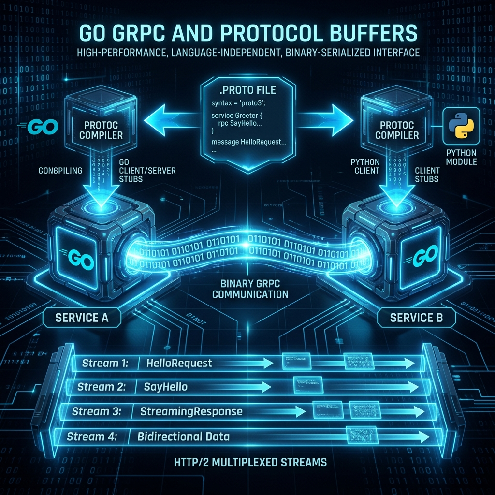

# 11: High-Performance Networking (gRPC & Protobufs)

<p align="center">
  
</p>

> 🧠 **The Feynman Hook:** When two microservices communicate with REST/JSON, they're sending a handwritten letter: human-readable, verbose, and slow to parse character by character. When they communicate with gRPC/Protobuf, they're sending a compressed binary telegram: exactly the bytes needed, nothing more, decoded at wire speed. A JSON payload for a `User` object might be 150 bytes of `{"id":1,"name":"Alice"}`. The same Protobuf message is 12 bytes. Multiply across 100,000 requests per second and you have a dramatic performance difference. More importantly, `.proto` files are the **single source of truth**: compile them once, and both the Go server and the Python client get identical, perfectly-matched API code generated automatically.

This module distils the knowledge from *gRPC Go for Professionals*.

---

## 1. The Protocol Buffer Definition

> **Feynman Insight:** A `.proto` file is a **language-neutral contract**. It says: "our API has a `MathService` with a `Multiply` method. You send it an `a` and a `b`. It returns a `result`." Then the `protoc` compiler generates Go code, Python code, Java code — all perfectly matched to each other. The field tags (the numbers `= 1`, `= 2`) are not default values — they are **binary field identifiers** that tell the binary serialiser exactly which bytes in the encoded message correspond to which field. This binary encoding is why Protobuf is 3-10x smaller than JSON.

Instead of writing Go Structs directly, you define your data models and API services in `.proto` files. Then, you use a compiler (`protoc`) to auto-generate identical network code for Go, Python, C++, and Java simultaneously!

**`calculator.proto`**
```protobuf
syntax = "proto3";

// Defines the Go package name generated by the compiler
option go_package = "example.com/myapp/calculator";

// 1. The Service (The API Endpoints)
service MathService {
    // rpc MethodName (RequestObject) returns (ResponseObject)
    rpc Multiply (MultiplyRequest) returns (MultiplyResponse);
}

// 2. The Data Models
message MultiplyRequest {
    // The numbers 1 and 2 are field tags, NOT default values!
    // They tell the binary serialiser exactly where to put this data in memory.
    int32 a = 1;
    int32 b = 2;
}

message MultiplyResponse {
    int32 result = 1;
}
```

---

## 2. Generating the Go Code

> **Feynman Insight:** You write the contract (`.proto`). The compiler writes the boilerplate. This is the greatest productivity trick in gRPC: no hand-writing serialisation logic, no maintaining client-server API documentation separately, no version mismatches between the Go server and the Python client. The compiler generates the `MultiplyRequest` struct, the binary encoder/decoder, the HTTP/2 client stub, and the server interface — all from your 15-line `.proto` file.

```bash
# 1. Install the compilers
sudo apt install protobuf-compiler
go install google.golang.org/protobuf/cmd/protoc-gen-go@latest
go install google.golang.org/grpc/cmd/protoc-gen-go-grpc@latest

# 2. Run the compiler over the calculator.proto file
protoc --go_out=. --go-grpc_out=. calculator.proto
```

---

## 3. Implementing the gRPC Server in Go

> **Feynman Insight:** The generated interface acts like a job description: "someone must implement `Multiply(ctx, *MultiplyRequest) (*MultiplyResponse, error)`." Your `mathServer` struct is the employee who fills that role. Go's implicit interface satisfaction means you don't declare "I implement MathServiceServer" — you just implement the method and the compiler verifies it fits. The `context.Context` parameter is the caller's timeout watch: if the client disconnects mid-flight, the context is cancelled and your server goroutine should check `ctx.Done()` and stop working.

**`server/main.go`**
```go
package main

import (
    "context"
    "log"
    "net"

    "google.golang.org/grpc"
    pb "myapp/calculator"
)

// 1. Define struct fulfilling the proto service interface
type mathServer struct {
    // Must embed this for forwards compatibility per official gRPC spec
    pb.UnimplementedMathServiceServer
}

// 2. The Implementation
func (s *mathServer) Multiply(ctx context.Context, req *pb.MultiplyRequest) (*pb.MultiplyResponse, error) {
    log.Printf("Received RPC Call: Multiply %d * %d\n", req.GetA(), req.GetB())

    // 3. Construct the Protocol Buffer response
    res := &pb.MultiplyResponse{
        Result: req.GetA() * req.GetB(),
    }

    return res, nil // Instantly serialized to binary and shot back to the client!
}

func main() {
    // Open a raw TCP socket (Not heavy HTTP!)
    lis, err := net.Listen("tcp", ":50051")
    if err != nil {
        log.Fatalf("failed to listen: %v", err)
    }

    // Create a new gRPC framework server
    grpcServer := grpc.NewServer()

    // Register our specific math implementation onto the framework
    pb.RegisterMathServiceServer(grpcServer, &mathServer{})

    log.Println("gRPC Server actively listening on port 50051")
    if err := grpcServer.Serve(lis); err != nil {
        log.Fatalf("failed to serve: %v", err)
    }
}
```

---

## 4. The gRPC Client

> **Feynman Insight:** The gRPC client call `client.Multiply(ctx, &pb.MultiplyRequest{A: 10, B: 5})` looks exactly like a local function call. It isn't — it serialises the request to binary, opens an HTTP/2 stream over an existing TCP connection, ships it across the network, receives a binary response, deserialises it, and returns the result. All of this complexity is hidden behind a single generated line. HTTP/2 **multiplexing** means 1000 concurrent RPC calls share a single TCP connection — no connection pool overhead, no TCP handshake per request.

**`client/main.go`**
```go
package main

import (
    "context"
    "log"
    "time"

    "google.golang.org/grpc"
    "google.golang.org/grpc/credentials/insecure"
    pb "myapp/calculator"
)

func main() {
    // 1. Establish the HTTP/2 connection in the background
    conn, err := grpc.Dial("localhost:50051", grpc.WithTransportCredentials(insecure.NewCredentials()))
    if err != nil {
        log.Fatalf("did not connect: %v", err)
    }
    defer conn.Close()

    // 2. Create the auto-generated Client
    client := pb.NewMathServiceClient(conn)

    // 3. Create an execution Context timeout (Fail if it takes longer than 1 second!)
    ctx, cancel := context.WithTimeout(context.Background(), time.Second)
    defer cancel()

    // 4. Execute the Remote Procedure Call (RPC)
    // To the developer, it looks EXACTLY like calling a local Go function!
    resp, err := client.Multiply(ctx, &pb.MultiplyRequest{A: 10, B: 5})
    if err != nil {
        log.Fatalf("RPC failed: %v", err)
    }

    log.Printf("The Microservice Response is: %d", resp.GetResult())
}
```

---

## 5. Dockerizing gRPC Services

**`Dockerfile` (for the Server)**
```dockerfile
FROM golang:1.22-alpine AS builder
WORKDIR /app
COPY . .
RUN CGO_ENABLED=0 go build -o grpc_server ./server/main.go

FROM scratch
COPY --from=builder /app/grpc_server /
EXPOSE 50051
ENTRYPOINT ["/grpc_server"]
```

**`docker-compose.yml`**
```yaml
version: '3.8'
services:
  go-grpc-server:
    build: .
    container_name: golang_grpc_server
    ports:
      - "50051:50051"
```

```bash
docker compose up --build
```

---

## 🤔 Reflection Questions

1. **Why are Protobuf field tags numbers (`= 1`, `= 2`) instead of field names?**
<details>
<summary>💡 View Answer</summary>

Binary encoding. JSON uses the field name string (`"name"`) in every message — 4 bytes for just the key. Protobuf uses the field tag number (`1`) encoded as a single byte. For a 1000-field message, the difference is enormous. Field tags also enable **schema evolution**: you can rename a field in the `.proto` file without breaking existing encoded messages, because the binary stream encodes `1` not "name." Removing field `2` and adding `4` is safe — old clients reading new messages simply skip unknown tags.
</details>

2. **Why do internal microservices use gRPC while public APIs use REST?**
<details>
<summary>💡 View Answer</summary>

REST/JSON is universally understood by browsers, mobile apps, and third-party integrators — they can inspect the JSON payload directly, debug it with browser developer tools, and consume it without any `.proto` file. gRPC's binary protocol isn't human-readable and requires the `.proto` file to decode. Between internal microservices (where you control both sides), gRPC's 3-10x payload compression and HTTP/2 multiplexing deliver dramatically better latency and throughput — and the shared `.proto` contract prevents API mismatches at compile time, not runtime.
</details>

---

## 📝 Key Interview Talking Points

- **Protobuf vs JSON**: Binary vs text, 3-10x smaller, schema-enforced at compile time vs at runtime.
- **HTTP/2 multiplexing**: 1000 concurrent RPC calls over **one** TCP connection. REST HTTP/1.1 requires one TCP connection per concurrent request.
- **`context.WithTimeout`** is mandatory in production gRPC clients — prevents hanging goroutines when the server is unresponsive.
- **`.proto` is the single source of truth**: generates client stubs AND server interfaces for every language simultaneously.
- **`UnimplementedMathServiceServer` embedding** provides default "method not implemented" responses for future gRPC methods — ensures forward compatibility without breaking existing deployments.
