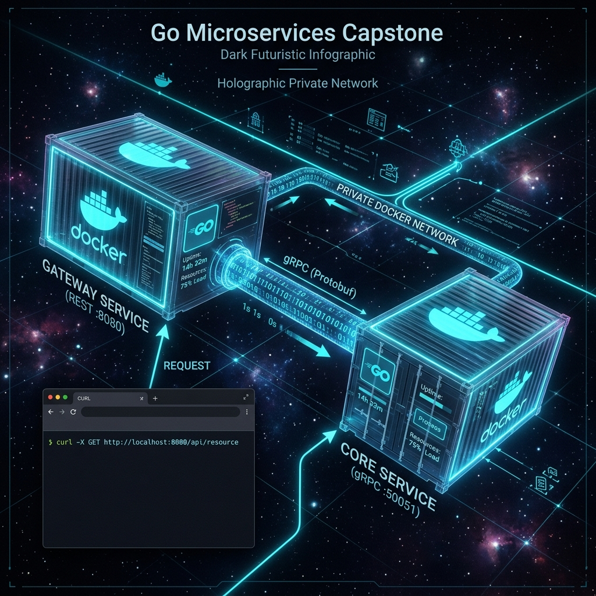

# 12: Capstone — Creating Microservices in Go

<p align="center">
  
</p>

> 🧠 **The Feynman Hook:** Imagine a restaurant with two teams: the waiter (Gateway Service) who speaks your language (HTTP/JSON) and takes your order, and the chef (Core Service) who speaks the kitchen language (gRPC/binary) and does the actual cooking. The waiter doesn't cook. The chef doesn't speak to customers. They communicate through a standardised ticket system (Protobuf). Docker Compose is the restaurant building — it creates a secure space where both teams work without being visible to the street. The street (your laptop browser) can only access the waiter's counter (port 8080). The kitchen (port 50051) is completely hidden inside the building.

This is the absolute capstone of the Golang Mastery Curriculum. We build a fully operational, multi-container architecture linking all previous concepts together.

---

## 1. The Project Structure

> **Feynman Insight:** Separating microservices into distinct directories is not just organisation — it's a **deployment contract**. Each folder becomes its own Docker image, its own Kubernetes Deployment, its own independent release cycle. The `gateway-service` folder can be deployed 10 times a day. The stable `core-service` may only be deployed weekly. Monorepos (one repo, multiple services) work well for small teams where shared `.proto` files need consistency — a single `git push` can update both services' shared types simultaneously.

```text
Golang/
├── docker-compose.yml
├── gateway-service/
│   ├── main.go
│   ├── Dockerfile
│   └── go.mod
└── core-service/
    ├── main.go
    ├── Dockerfile
    ├── go.mod
    └── proto/
        └── core.proto
```

---

## 2. The Core Service (Backend gRPC)

> **Feynman Insight:** The Core Service is the expert that knows nothing about the outside world. It only speaks gRPC. It listens on port `50051` which is **not exposed** to the public network — it's on a private Docker network. Only the Gateway can reach it. This is the principle of **least privilege** applied to networking: the Core has the most sensitive business logic, so it's the least accessible. If the Core service had a bug, an attacker with access to port 8080 couldn't directly exploit it — they'd have to use it through the Gateway's validation layer.

Because this service is not exposed to the public internet, it runs purely on gRPC.

### `core-service/main.go`
```go
package main

import (
    "context"
    "log"
    "net"
    "google.golang.org/grpc"
    pb "myapp/core/proto"
)

type server struct {
    pb.UnimplementedCoreServiceServer
}

func (s *server) ProcessData(ctx context.Context, req *pb.DataRequest) (*pb.DataResponse, error) {
    log.Printf("[CORE] Received request from Gateway for: %s", req.GetPayload())

    // Simulate heavy backend database processing...
    return &pb.DataResponse{Result: "PROCESSED: " + req.GetPayload()}, nil
}

func main() {
    // 1. Listen on a TCP socket specifically for gRPC traffic
    lis, err := net.Listen("tcp", ":50051")
    if err != nil {
        log.Fatalf("[CORE] Failed to listen: %v", err)
    }

    // 2. Start the highly concurrent gRPC Server
    grpcServer := grpc.NewServer()
    pb.RegisterCoreServiceServer(grpcServer, &server{})

    log.Println("[CORE] Backend Microservice Booted - Listening on tcp/50051")
    if err := grpcServer.Serve(lis); err != nil {
        log.Fatalf("[CORE] Failed to serve: %v", err)
    }
}
```

---

## 3. The API Gateway (Frontend REST)

> **Feynman Insight:** The Gateway is the public-facing translator. Its job is three things: (1) accept a human-readable HTTP request, (2) translate it into a binary gRPC call to the Core, (3) translate the binary gRPC response back into human-readable JSON. It's a protocol adapter. Critically, the Gateway accesses the Core by its **Docker container name** (`core-service:50051`) not `localhost` — Docker Compose creates an internal DNS server that maps container names to their internal IPs. This is how the two services find each other without hardcoding IP addresses.

This service faces the user. It accepts standard HTTP JSON requests, opens a lightning-fast HTTP/2 gRPC connection to the Core service, and returns the result as JSON.

### `gateway-service/main.go`
```go
package main

import (
    "context"
    "encoding/json"
    "log"
    "net/http"
    "os"
    "time"

    "google.golang.org/grpc"
    "google.golang.org/grpc/credentials/insecure"
    pb "myapp/core/proto"
)

func ProcessHandler(w http.ResponseWriter, r *http.Request) {
    // 1. Retrieve the target value from the URL query (e.g., ?payload=HelloWorld)
    payload := r.URL.Query().Get("payload")

    // 2. Access the Core Service
    // IMPORTANT: It accesses the service by its DOCKER CONTAINER NAME ("core-service"), not localhost!
    backend_addr := os.Getenv("CORE_SERVICE_ADDR")
    if backend_addr == "" {
        backend_addr = "core-service:50051" // Default Docker Compose DNS resolution
    }

    conn, err := grpc.Dial(backend_addr, grpc.WithTransportCredentials(insecure.NewCredentials()))
    if err != nil {
        http.Error(w, "Gateway Failed to connect to Core Backend", http.StatusInternalServerError)
        return
    }
    defer conn.Close()

    // 3. Execute the gRPC Call
    client := pb.NewCoreServiceClient(conn)
    ctx, cancel := context.WithTimeout(context.Background(), 2*time.Second)
    defer cancel()

    rpcResp, err := client.ProcessData(ctx, &pb.DataRequest{Payload: payload})
    if err != nil {
        http.Error(w, "Core Service Processing Failed", http.StatusInternalServerError)
        return
    }

    // 4. Return to the User as JSON
    w.Header().Set("Content-Type", "application/json")
    json.NewEncoder(w).Encode(map[string]string{
        "status": "success",
        "data":   rpcResp.GetResult(),
    })
}

func main() {
    // Standard Go built-in router
    http.HandleFunc("/api/process", ProcessHandler)

    log.Println("[GATEWAY] Booted - Listening for Public HTTP REST traffic on :8080")
    log.Fatal(http.ListenAndServe(":8080", nil))
}
```

---

## 4. The Docker Orchestration

> **Feynman Insight:** The `docker-compose.yml` is the restaurant floor plan and staff roster. `depends_on: core-service` tells the kitchen (Core) to open before the dining room (Gateway) opens — you don't seat customers before the chef is standing at the stove. The `CORE_SERVICE_ADDR` environment variable injected into the Gateway is the equivalent of a restaurant staff notice board: "Today's kitchen is at table station 3." The services don't hardcode each other's addresses — they read from configuration, allowing the same container images to run in development, staging, and production with different wiring.

### `docker-compose.yml`
```yaml
version: '3.8'

services:
  # The Backend gRPC worker
  core-service:
    build:
      context: ./core-service
    container_name: golang_core
    # Notice we DO NOT expose port 50051 to the public.
    # It communicates implicitly on the internal Docker network.

  # The Frontend API Gateway
  gateway-service:
    build:
      context: ./gateway-service
    container_name: golang_gateway
    depends_on:
      - core-service
    ports:
      - "8080:8080"
    environment:
      # Inject the Core Service's internal Docker DNS name into the Gateway
      - CORE_SERVICE_ADDR=core-service:50051
```

### Starting the System
```bash
docker compose up --build
```

Test the full stack with `curl`:
```bash
curl "http://localhost:8080/api/process?payload=GoIsIncredible"
# Expected output:
# {"data":"PROCESSED: GoIsIncredible","status":"success"}
```

---

## 🤔 Reflection Questions

1. **Why is port 50051 (the Core Service) not exposed in docker-compose?**
<details>
<summary>💡 View Answer</summary>

**Security through network isolation.** Docker Compose creates a private virtual network for all services in the same `docker-compose.yml`. Containers on this network can reach each other by container name. By not adding `ports: - "50051:50051"` for the Core Service, port 50051 is **never mapped to the host machine**. A user on your laptop, or an internet attacker reaching your server, cannot connect to port 50051 directly — only the Gateway container, which shares the same internal Docker network, can reach the Core. This implements the principle of least exposure.
</details>

2. **How does the Gateway find the Core Service without a hardcoded IP address?**
<details>
<summary>💡 View Answer</summary>

Docker Compose automatically creates an internal DNS server for each project network. Every service in the `docker-compose.yml` is registered in this DNS with its **service name** as the hostname. When the Gateway calls `grpc.Dial("core-service:50051")`, Docker's internal DNS resolves `core-service` to the Core container's internal IP address. This means you never hardcode `10.0.0.5:50051` — the DNS handles discovery automatically. In Kubernetes, the equivalent is a `Service` resource that provides a stable DNS name for a set of pods.
</details>

---

## 📝 Final Key Interview Talking Points

This capstone demonstrates every pillar of modern Go engineering:

| Concept | Where Applied |
|---|---|
| **Goroutines** | gRPC server handles each request in a separate goroutine |
| **Interfaces** | Protobuf service interface implemented by `server` struct |
| **Error Handling** | Every `grpc.Dial`, `client.ProcessData` call checked |
| **Context** | `context.WithTimeout` enforces 2-second RPC deadline |
| **Environment Config** | `os.Getenv("CORE_SERVICE_ADDR")` for 12-factor app compliance |
| **Static Binary** | Both services use `FROM scratch` — sub-10MB Docker images |
| **Graceful Shutdown** | Extendable with `signal.Notify` pattern from Chapter 08 |

> You have mastered Go. From the absolute basics of variable declaration, through Struct composition, explicit Error Handling, Goroutine multithreading, and System Operations, you have arrived at the pinnacle: a multi-container Dockerized architecture speaking high-performance RPC protocols. The standard library in Go provides all of these capabilities out of the box — no heavy frameworks, no massive virtual machines, no complex inheritance patterns. Just pure, pragmatic software engineering.
