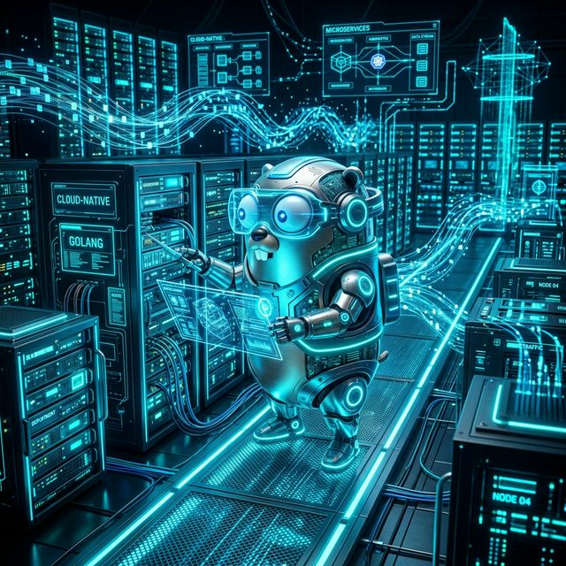

# The Golang Mastery Curriculum

<p align="center">
  
</p>

Welcome to the **Golang Mastery Guide**. This repository contains a complete, 12-part curriculum designed to take you from absolute beginner to building production-ready, multi-container microservices. 

This curriculum was synthesized from 17 professional-grade textbooks (including textbooks on gRPC, Concurrency, TDD, and Domain-Driven Design). 

> **Docker Native**: Every single module and code example in this curriculum is **100% Dockerized**. You do not need to install Go on your local machine to run any of this code. Each module contains a `Dockerfile` and `docker-compose.yml` for isolated zero-overhead execution using `FROM scratch` multi-stage builds.

---

## 📚 Curriculum Structure

### Phase 1: Foundations
*Unlearn classic Object-Oriented Programming and embrace Go's hyper-minimalist syntax and implicit interfaces.*

* [**01: Basics and Environment**](./01_Basics_and_Environment.md) - Go syntax, pointers, implicit variable declaration (`:=`), and multi-stage `FROM scratch` Docker builds.
* [**02: Structs and Interfaces**](./02_Structs_and_Interfaces.md) - Composition over Inheritance, Pointer vs Value Receivers, and Implicit Interface fulfillment.
* [**03: Error Handling**](./03_Error_Handling.md) - Why Go abandons `try/catch`, explicit error returns, `defer`, `panic`, and `recover`.

### Phase 2: Advanced Mechanics & Functional Patterns
*Master Go's world-class concurrency model and functional programming capabilities.*

* [**04: Concurrency (Goroutines & Channels)**](./04_Concurrency_Goroutines_Channels.md) - The CSP Model, spawning Goroutines, `sync.WaitGroup`, buffered channels, and the `select` statement.
* [**05: Functional Programming**](./05_Functional_Programming.md) - First-class functions, Closures, and writing generic `Map`, `Filter`, and `Reduce` pipelines using Go 1.18+ Generics.
* [**06: Test-Driven Development (TDD)**](./06_Test_Driven_Development.md) - The built-in `testing` package, Table-Driven Tests (`t.Run`), and Dependency Injection for Mocking.

### Phase 3: Systems & Data Architecture
*Leverage Go as a massive data-processing and UNIX-level systems language.*

* [**07: Data Structures and Algorithms**](./07_Data_Structures_and_Algorithms.md) - The Slice Header, Capacity reallocation (`make`), Hash Maps, and Generic Queues.
* [**08: System Programming**](./08_System_Programming.md) - Raw POSIX interactions, `SIGINT`/`SIGTERM` Graceful Shutdowns, and high-performance `bufio` disk streaming.
* [**09: Building Modern CLI Apps**](./09_Building_Modern_CLI_Apps.md) - Building zero-dependency CLI binaries using the `flag` package and deep nested subcommands via Cobra.

### Phase 4: Enterprise Microservices (The Capstone)
*The ultimate goal: Domain-Driven APIs communicating over binary protocols.*

* [**10: Domain-Driven Design (Hexagonal Architecture)**](./10_Domain_Driven_Design.md) - Ports and Adapters, Decoupling core business logic from databases and HTTP frameworks.
* [**11: gRPC and Protobufs**](./11_gRPC_and_Protobufs.md) - Replacing slow JSON/REST with incredibly fast Protocol Buffers over multiplexed HTTP/2 Streams.
* [**12: Capstone Project (Multi-Container Microservices)**](./12_Creating_Microservices.md) - Building a full Docker Compose architecture linking an HTTP REST Gateway Service directly to a backend gRPC Core Service.

---

## 🚀 How to Run the Code

Navigate into any module, read the source code described in the file, create the specified files (`main.go`, `Dockerfile`, `docker-compose.yml`), and run:

```bash
docker compose up --build
```

Happy Coding!
