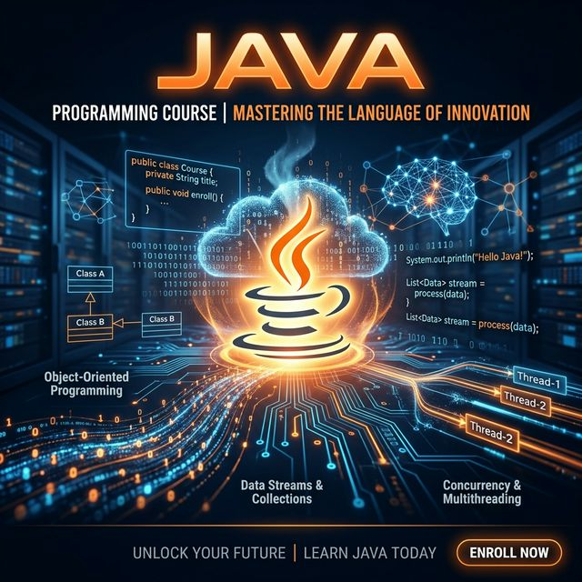

# ☕ The Complete Java Course

## Introduction

Welcome to the **Complete Java Course** — a comprehensive, visually-rich deep dive into the Java programming language, built using the **Richard Feynman Technique**. Every concept is explained through powerful analogies first, then grounded in precise code examples. This course is distilled from **8 authoritative Java books**, organized into a clear learning progression.

Whether you're refreshing your fundamentals, preparing for certification, or mastering modern Java with **Virtual Threads**, **Records**, and **Pattern Matching**, this is your single destination.

---

## 📚 Source Material

This course draws on **8 authoritative Java books**:

| Book | Author(s) | Focus |
|------|-----------|-------|
| *Core Java, Vol. I — Fundamentals* | Cay S. Horstmann | Java fundamentals, OOP, I/O, Databases |
| *Effective Java* (3rd Ed) | Joshua Bloch | Best practices, idioms, API design |
| *Head First Java* | Sierra, Bates, Gee | Conceptual clarity, visual learning |
| *Java: The Complete Reference* | Herbert Schildt | Comprehensive language reference |
| *Java: A Beginner's Guide* | Herbert Schildt | Beginner-friendly, step-by-step |
| *Java Concurrency in Practice* | Brian Goetz | Multithreading, concurrency |
| *Modern Java in Action* | Urma, Fusco | Lambdas, Streams, Functional programming |
| *Java: The Complete Reference (9th Ed)* | Herbert Schildt | Generics, NIO, modern features |

---

## 🗺️ Course Map

| Part | Title | Difficulty | Key Topics |
|------|-------|-----------|------------|
| 1 | [Java Fundamentals](docs/Part-01-Java-Fundamentals.md) | ⭐ Beginner | JVM/JDK/JRE, data types, memory model, control flow |
| 2 | [OOP Essentials](docs/Part-02-OOP-Essentials.md) | ⭐⭐ Intermediate | Encapsulation, inheritance, polymorphism, interfaces |
| 3 | [Core APIs](docs/Part-03-Core-APIs.md) | ⭐⭐ Intermediate | Strings, String Pool, Collections, HashMap, java.time |
| 4 | [Exception Handling](docs/Part-04-Exception-Handling.md) | ⭐⭐ Intermediate | try/catch/finally, checked vs unchecked, try-with-resources |
| 5 | [Generics & Type Safety](docs/Part-05-Generics-And-Type-Safety.md) | ⭐⭐⭐ Advanced | Type parameters, bounds, wildcards, PECS, type erasure |
| 6 | [Lambda Expressions](docs/Part-06-Lambda-Expressions.md) | ⭐⭐⭐ Advanced | Functional interfaces, method references, composition |
| 7 | [Streams API](docs/Part-07-Streams-API.md) | ⭐⭐⭐ Advanced | Stream pipelines, collectors, flatMap, parallel streams |
| 8 | [Concurrency](docs/Part-08-Concurrency.md) | ⭐⭐⭐ Advanced | Threads, synchronization, CompletableFuture, Virtual Threads |
| 9 | [I/O & NIO](docs/Part-09-IO-And-NIO.md) | ⭐⭐ Intermediate | Path/Files API, streams, serialization, try-with-resources |
| 10 | [Design Patterns](docs/Part-10-Design-Patterns.md) | ⭐⭐⭐ Advanced | Singleton, Builder, Factory, Decorator, Strategy, Observer |
| 11 | [Testing](docs/Part-11-Testing.md) | ⭐⭐⭐ Advanced | JUnit 5, Mockito, TDD, Test Pyramid, parameterized tests |
| 12 | [Modern Java Features](docs/Part-12-Modern-Java-Features.md) | ⭐⭐⭐ Advanced | Records, Sealed Classes, Pattern Matching, Text Blocks |
| 13 | [JDBC & Databases](docs/Part-13-JDBC-And-Databases.md) | ⭐⭐⭐ Advanced | JDBC, PreparedStatement, transactions, connection pooling |

---

## 🎯 Learning Paths

### 🟢 Path A: Core Java Mastery (Parts 1–5, 9)
**Time:** 4–6 weeks | **Goal:** Solid Java fundamentals + certification readiness

### 🔵 Path B: Functional & Modern Java (Parts 6–8, 12)
**Time:** 3–4 weeks | **Goal:** Master lambdas, streams, and modern idioms

### 🟣 Path C: Software Engineering (Parts 10–11, 13)
**Time:** 2–3 weeks | **Goal:** Patterns, Testing, and Database connectivity

### 🔴 Path D: Complete Course (Parts 1–13)
**Time:** 12–16 weeks | **Goal:** Full expert-level Java proficiency

---

## 🏗️ How Each Part Is Structured

Every part follows a consistent format:

1. **Centered Cover Image** — visual introduction to the topic
2. **Source References** — which books informed this chapter
3. **Learning Objectives** — what you'll master
4. **Feynman-Style Theory** — analogies that make abstract concepts concrete
5. **Concept Images** — visual infographics for every major concept
6. **Code Examples** — practical, runnable Java code
7. **Best Practices** — guidance from *Effective Java* and other sources
8. **Exercises** — practice problems to solidify learning
9. **References** — links to source books

---

## Navigation

* ↩️ [Back to Java + Spring Boot](../README.md)
* ➡️ [Spring Boot Course](../SpringBoot/README.md)
