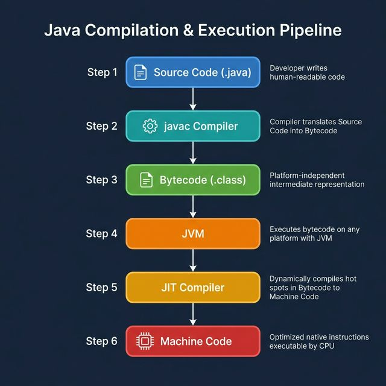
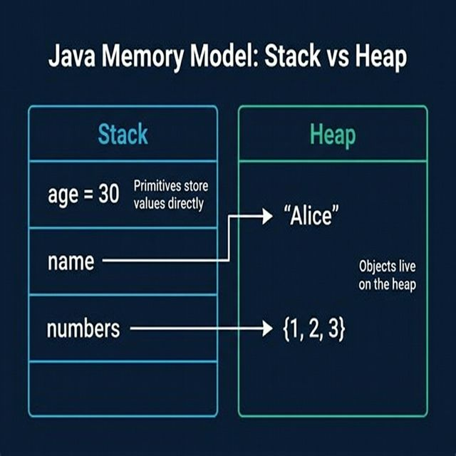

# Part 1: Java Fundamentals

> **Sources:** *Thinking in Java* (Ch. 1–3) · *OCA Java SE 8 Programmer I* (Ch. 1–2) · *Java Coding Problems* (Ch. 1)

---

## 🎯 Learning Objectives

By the end of this part, you will:
- Understand the JVM, JDK, and Java platform architecture
- Master primitive data types, variables, and operators
- Write control flow statements confidently
- Understand Java's type system and memory model
- Write compilable, well-structured Java programs

---

## 1. The Java Platform

### 1.1 Why Java?

Java was designed around five key principles:

1. **Simple & familiar** — C/C++-like syntax without dangerous features (no pointers, no manual memory management)
2. **Object-oriented** — Everything is an object (except primitives)
3. **Platform-independent** — "Write once, run anywhere" via the JVM
4. **Robust & secure** — Strong type checking, exception handling, garbage collection
5. **High-performance** — JIT compilation bridges the interpreted/compiled gap

### 1.2 JDK, JRE, and JVM

<p align="center">

</p>

### 1.3 The Compilation & Execution Pipeline

<p align="center">

</p>

**Key insight:** Java bytecode is platform-independent. The JVM is platform-specific. This is how Java achieves portability.

### 1.4 Your First Java Program

```java
public class HelloWorld {
    public static void main(String[] args) {
        System.out.println("Hello, World!");
    }
}
```

**Rules to remember:**
- The filename **must** match the public class name: `HelloWorld.java`
- `main` must be `public static void main(String[] args)` — this is the entry point
- Java is **case-sensitive**: `String` ≠ `string`

---

## 2. Building Blocks: Data Types & Variables

### 2.1 Primitive Data Types

Java has exactly **8 primitive types**:

| Type | Size | Default | Range | Example |
|------|------|---------|-------|---------|
| `byte` | 8 bits | `0` | −128 to 127 | `byte b = 42;` |
| `short` | 16 bits | `0` | −32,768 to 32,767 | `short s = 1000;` |
| `int` | 32 bits | `0` | −2³¹ to 2³¹−1 | `int i = 100_000;` |
| `long` | 64 bits | `0L` | −2⁶³ to 2⁶³−1 | `long l = 99L;` |
| `float` | 32 bits | `0.0f` | ≈ ±3.4 × 10³⁸ | `float f = 3.14f;` |
| `double` | 64 bits | `0.0` | ≈ ±1.7 × 10³⁰⁸ | `double d = 3.14;` |
| `boolean` | JVM-specific | `false` | `true` / `false` | `boolean b = true;` |
| `char` | 16 bits | `\u0000` | 0 to 65,535 (Unicode) | `char c = 'A';` |

**Important nuances:**
- Use underscores for readability: `int million = 1_000_000;`
- `long` literals need the `L` suffix: `long big = 3_000_000_000L;`
- `float` literals need the `f` suffix: `float pi = 3.14f;`
- `char` can hold Unicode: `char omega = '\u03A9';` → Ω

### 2.2 Reference Types vs. Primitives

```java
// Primitive — holds the actual value
int age = 30;

// Reference — holds a pointer to an object on the heap
String name = "Alice";       // String is a reference type
int[] numbers = {1, 2, 3};   // Arrays are reference types
```

**Memory model:**

<p align="center">

</p>

### 2.3 Variable Declaration & Initialization

```java
// Declaration
int count;

// Declaration + Initialization
int count = 0;

// Multiple declarations (same type)
int x, y, z;
int a = 1, b = 2, c = 3;

// Constants
final double PI = 3.14159265358979;
final int MAX_SIZE = 100;
```

**Scope rules:**
- **Local variables** must be initialized before use (compiler enforces this)
- **Instance variables** (fields) get default values
- **Class variables** (`static`) get default values

```java
public class ScopeDemo {
    int instanceVar;            // defaults to 0
    static boolean classVar;    // defaults to false

    public void method() {
        int localVar;
        // System.out.println(localVar); // COMPILE ERROR — not initialized!
        localVar = 10;
        System.out.println(localVar);   // OK
    }
}
```

### 2.4 Type Casting & Promotion

**Widening (implicit)** — safe, no data loss:
```java
int i = 42;
long l = i;        // int → long (automatic)
double d = l;      // long → double (automatic)
```

**Narrowing (explicit)** — potential data loss, requires cast:
```java
double d = 3.999;
int i = (int) d;   // d truncated to 3
long big = 1_000_000_000_000L;
int small = (int) big;  // Overflow! Unpredictable result
```

**Numeric promotion in expressions:**
```java
byte a = 10, b = 20;
// byte c = a + b;  // COMPILE ERROR! Result is promoted to int
int c = a + b;      // OK
```

> **Rule:** In any arithmetic expression, `byte`, `short`, and `char` are automatically promoted to `int`.

---

## 3. Operators

### 3.1 Arithmetic Operators

| Operator | Description | Example | Result |
|----------|-------------|---------|--------|
| `+` | Addition | `5 + 3` | `8` |
| `-` | Subtraction | `5 - 3` | `2` |
| `*` | Multiplication | `5 * 3` | `15` |
| `/` | Division | `7 / 2` | `3` (integer division!) |
| `%` | Modulus | `7 % 2` | `1` |

**Pitfall — Integer division:**
```java
int result = 7 / 2;    // 3, not 3.5!
double result = 7.0 / 2; // 3.5 (at least one operand is double)
```

### 3.2 Unary Operators

```java
int x = 5;

// Pre-increment: increment first, then use
int a = ++x;  // x=6, a=6

// Post-increment: use first, then increment
int b = x++;  // b=6, x=7

// Logical complement
boolean flag = !true;  // false

// Negation
int neg = -x;  // -7
```

### 3.3 Compound Assignment Operators

```java
int x = 10;
x += 5;    // x = x + 5  → 15
x -= 3;    // x = x - 3  → 12
x *= 2;    // x = x * 2  → 24
x /= 4;    // x = x / 4  → 6
x %= 4;    // x = x % 4  → 2
```

**Hidden casting:** Compound operators include an implicit cast:
```java
byte b = 10;
b += 5;          // OK! Equivalent to: b = (byte)(b + 5);
// b = b + 5;    // COMPILE ERROR — result is int, can't assign to byte
```

### 3.4 Relational & Equality Operators

```java
int a = 5, b = 10;

a == b   // false  (equality)
a != b   // true   (inequality)
a < b    // true   (less than)
a > b    // false  (greater than)
a <= b   // true   (less than or equal)
a >= b   // false  (greater than or equal)

// instanceof for reference types
String s = "hello";
boolean isString = s instanceof String;  // true
```

### 3.5 Logical Operators

```java
boolean a = true, b = false;

a && b    // false  (logical AND — short-circuit)
a || b    // true   (logical OR — short-circuit)
!a        // false  (logical NOT)

a & b     // false  (bitwise AND — no short-circuit)
a | b     // true   (bitwise OR — no short-circuit)
a ^ b     // true   (XOR — true if exactly one is true)
```

**Short-circuit evaluation matters:**
```java
String s = null;
// This is SAFE because && short-circuits:
if (s != null && s.length() > 0) { ... }

// This would CRASH with & because both sides are evaluated:
// if (s != null & s.length() > 0) { ... }  // NullPointerException!
```

### 3.6 Ternary Operator

```java
int score = 85;
String grade = (score >= 90) ? "A" : "B or below";
// Equivalent to:
// String grade;
// if (score >= 90) grade = "A";
// else grade = "B or below";
```

### 3.7 Operator Precedence

From highest to lowest:

| Priority | Operators |
|----------|-----------|
| 1 | Post-unary: `x++`, `x--` |
| 2 | Pre-unary: `++x`, `--x`, `+`, `-`, `!`, `~`, `(type)` |
| 3 | Multiplicative: `*`, `/`, `%` |
| 4 | Additive: `+`, `-` |
| 5 | Shift: `<<`, `>>`, `>>>` |
| 6 | Relational: `<`, `>`, `<=`, `>=`, `instanceof` |
| 7 | Equality: `==`, `!=` |
| 8 | Bitwise: `&`, `^`, `|` |
| 9 | Logical: `&&`, `||` |
| 10 | Ternary: `? :` |
| 11 | Assignment: `=`, `+=`, `-=`, etc. |

> **Best practice:** When in doubt, use parentheses for clarity.

---

## 4. Control Flow Statements

### 4.1 The `if` Statement

```java
int temperature = 30;

if (temperature > 35) {
    System.out.println("It's hot!");
} else if (temperature > 20) {
    System.out.println("It's warm.");
} else if (temperature > 10) {
    System.out.println("It's cool.");
} else {
    System.out.println("It's cold!");
}
```

### 4.2 The `switch` Statement

**Classic switch:**
```java
int dayOfWeek = 3;

switch (dayOfWeek) {
    case 1:
        System.out.println("Monday");
        break;
    case 2:
        System.out.println("Tuesday");
        break;
    case 3:
        System.out.println("Wednesday");
        break;
    default:
        System.out.println("Other day");
        break;
}
```

**Enhanced switch (Java 14+):**
```java
String dayName = switch (dayOfWeek) {
    case 1 -> "Monday";
    case 2 -> "Tuesday";
    case 3 -> "Wednesday";
    case 4 -> "Thursday";
    case 5 -> "Friday";
    case 6, 7 -> "Weekend";
    default -> "Invalid";
};
```

**Allowed switch types:** `byte`, `short`, `char`, `int`, `String`, `enum`, and their wrappers.

### 4.3 Loops

**`for` loop:**
```java
for (int i = 0; i < 10; i++) {
    System.out.println("Iteration: " + i);
}
```

**Enhanced `for-each` loop:**
```java
int[] numbers = {10, 20, 30, 40, 50};
for (int num : numbers) {
    System.out.println(num);
}
```

**`while` loop:**
```java
int count = 0;
while (count < 5) {
    System.out.println("Count: " + count);
    count++;
}
```

**`do-while` loop** (executes at least once):
```java
int count = 0;
do {
    System.out.println("Count: " + count);
    count++;
} while (count < 5);
```

### 4.4 Flow Control: `break`, `continue`, and Labels

```java
// break — exits the loop
for (int i = 0; i < 100; i++) {
    if (i == 5) break;
    System.out.println(i);  // Prints 0,1,2,3,4
}

// continue — skips to next iteration
for (int i = 0; i < 10; i++) {
    if (i % 2 == 0) continue;
    System.out.println(i);  // Prints 1,3,5,7,9
}

// Labels — for nested loops
outer:
for (int i = 0; i < 5; i++) {
    for (int j = 0; j < 5; j++) {
        if (j == 3) break outer;  // Breaks the outer loop!
        System.out.println(i + "," + j);
    }
}
```

---

## 5. Packages & Imports

### 5.1 Package Declaration

```java
package com.mycompany.myapp.model;

public class User {
    // class body
}
```

### 5.2 Import Statements

```java
import java.util.ArrayList;           // Single class import
import java.util.List;
import java.util.*;                    // Wildcard import (all classes in java.util)
import static java.lang.Math.PI;      // Static import
import static java.lang.Math.*;       // Wildcard static import
```

**`java.lang` is auto-imported** — no need to import `String`, `System`, `Math`, etc.

**Order matters:**
```java
package com.example;      // 1. Package declaration (optional, at most one)

import java.util.*;       // 2. Imports (optional)
import static java.lang.Math.*;

public class MyClass {    // 3. Class declaration
    // ...
}
```

---

## 6. Best Practices

1. **Use meaningful variable names:** `customerAge` > `x`
2. **Follow naming conventions:**
   - Classes: `PascalCase` → `StudentRecord`
   - Methods/variables: `camelCase` → `calculateTotal`
   - Constants: `UPPER_SNAKE_CASE` → `MAX_RETRY_COUNT`
   - Packages: `lowercase` → `com.company.project`
3. **Prefer `final` for constants** and variables that shouldn't change
4. **Use enhanced switch** when available (Java 14+)
5. **Always use braces** for `if`/`for`/`while` — even for single statements
6. **Use underscores in numeric literals** for readability: `1_000_000`

---

## 7. Common Pitfalls

| Pitfall | Example | Fix |
|---------|---------|-----|
| Integer division | `7/2` gives `3`, not `3.5` | Use `7.0/2` or cast |
| Missing `break` in switch | Fall-through to next case | Add `break` or use enhanced switch |
| Uninitialized local variables | Compile error | Always initialize locals |
| Overflow on narrowing cast | `(byte) 200` gives `-56` | Check ranges before casting |
| `==` on Strings | Compares references, not values | Use `.equals()` |
| Floating-point precision | `0.1 + 0.2 != 0.3` | Use `BigDecimal` for money |

---

## 8. Exercises

1. **Data Types:** Write a program that declares variables of each primitive type, prints their values and sizes.
2. **Calculator:** Build a command-line calculator that reads two numbers and an operator (+, -, *, /) from `args` and prints the result.
3. **FizzBuzz:** Print numbers 1–100. For multiples of 3 print "Fizz", for 5 print "Buzz", for both print "FizzBuzz".
4. **Operator Precedence:** Predict the output of `int x = 5; int y = x++ + ++x + x--;` then verify.
5. **Grade Calculator:** Write a switch expression that maps numeric scores (0–100) to letter grades.
6. **Pyramid:** Use nested loops to print a right-aligned pyramid of asterisks.

---

## 📖 References

- *Thinking in Java*, Bruce Eckel — Chapters 1–3
- *OCA: Oracle Certified Associate Java SE 8 Programmer I Study Guide* — Chapters 1–2
- *Java Coding Problems*, Anghel Leonard — Chapter 1 (Objects, Immutability, Switch)
- [Oracle Java Tutorials](https://docs.oracle.com/javase/tutorial/java/nutsandbolts/)

---

[← Back to Course Index](../README.md) | [Next: Part 2 — OOP Essentials →](Part-02-OOP-Essentials.md)
