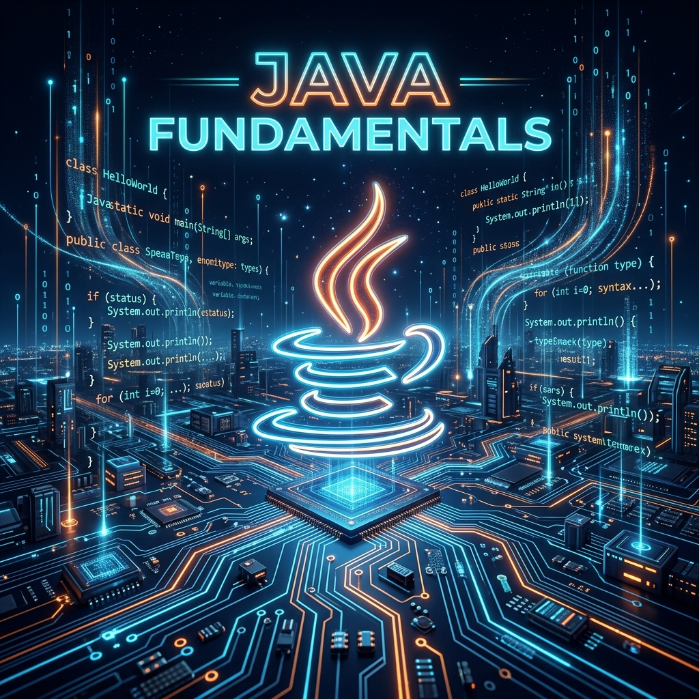
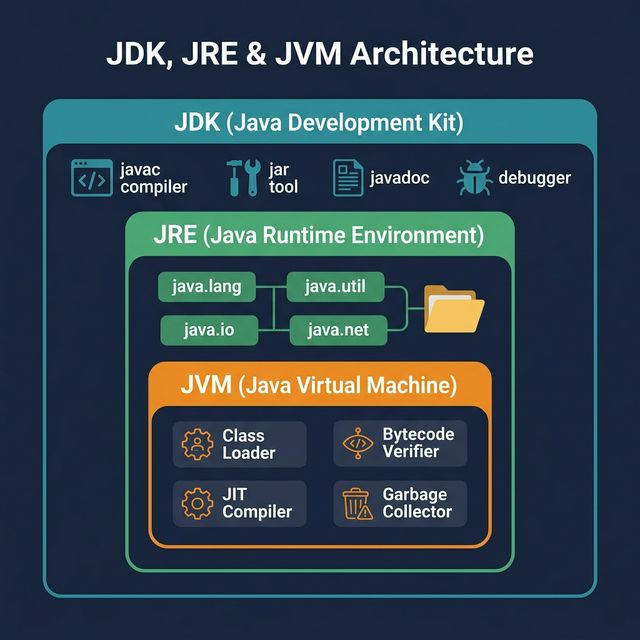
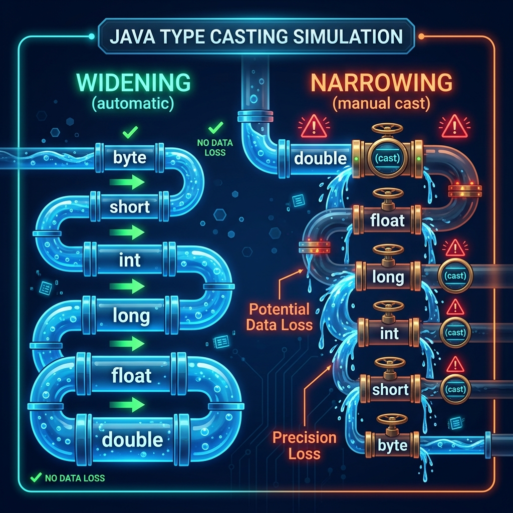
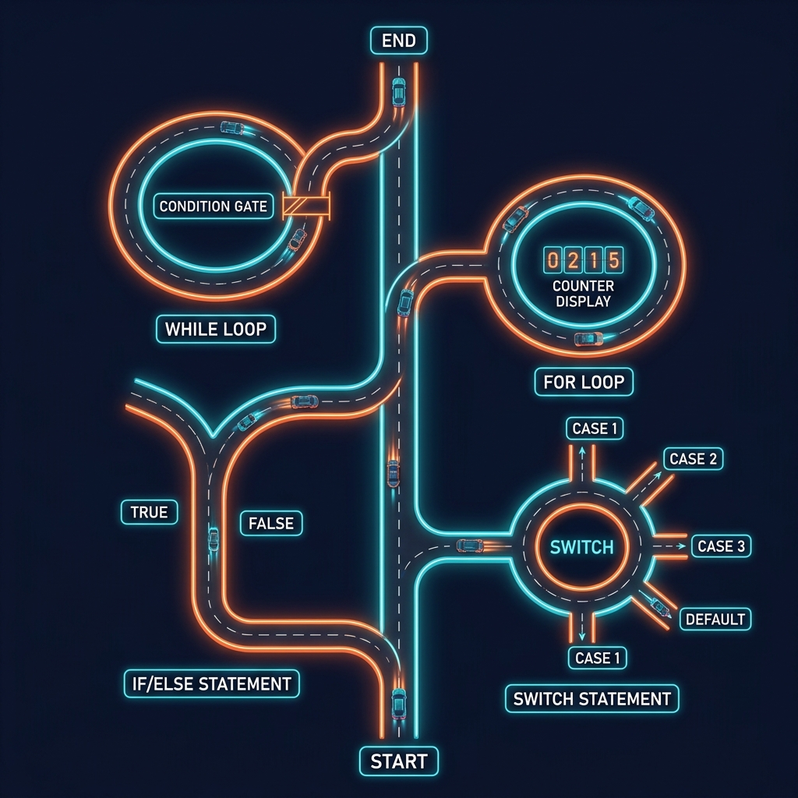

# Part 1: Java Fundamentals

<p align="center">

</p>

> **Sources:** *Core Java, Vol. I* (Horstmann) · *Head First Java* (Sierra, Bates, Gee) · *Java: The Complete Reference* (Schildt) · *Java: A Beginner's Guide* (Schildt) · *Effective Java* (Bloch)

---

## 🎯 Learning Objectives

By the end of this part, you will:
- Understand the JVM, JDK, and Java platform architecture — and *why* they were designed this way
- Master primitive data types, variables, and operators at a deep level
- Write control flow statements confidently
- Understand Java's type system and memory model through visual analogies
- Write compilable, well-structured Java programs

---

## 1. The Java Platform — A Factory Analogy

### 1.1 Why Java?

Imagine you write a letter. Normally, you'd need to rewrite it in French for a French reader, in German for a German reader, and so on. **Java solved this problem for software.** You write your program once, and it runs on any computer — Windows, Mac, Linux, or even a toaster with a chip.

Java was designed around five key principles that Cay Horstmann (*Core Java, Vol. I*) and Herbert Schildt (*Java: The Complete Reference*) both emphasize:

1. **Simple & familiar** — C/C++-like syntax without dangerous features (no pointers, no manual memory management)
2. **Object-oriented** — Everything is an object (except primitives)
3. **Platform-independent** — "Write once, run anywhere" via the JVM
4. **Robust & secure** — Strong type checking, exception handling, garbage collection
5. **High-performance** — JIT compilation bridges the interpreted/compiled gap

> **Feynman Insight:** Think of Java like writing a recipe in a universal language. Instead of writing separate recipes for electric ovens, gas stoves, and microwaves, you write *one* recipe in a universal format. A smart kitchen assistant (the JVM) reads your recipe and translates it into the exact steps that *your specific appliance* needs.

### 1.2 JDK, JRE, and JVM — The Three Layers

Think of it like a Russian nesting doll:

- **JDK** (Java Development Kit) — The complete toolbox. Contains the compiler (`javac`), debugger, and all development tools. This is what *you* install as a developer.
- **JRE** (Java Runtime Environment) — The runtime. Contains the JVM plus standard libraries. This is what *users* need to run Java programs.
- **JVM** (Java Virtual Machine) — The engine. This is the program that actually executes your Java bytecode on the specific operating system.

<p align="center">

</p>

> **Kathy Sierra's analogy** (*Head First Java*): The JDK is like a fully equipped workshop (saw, drill, sandpaper, plus a showroom). The JRE is just the showroom — you can display and run finished products, but you can't build new ones. The JVM is the electrical system that powers everything.

### 1.3 The Compilation & Execution Pipeline — The Java Factory

Here is the key insight that makes Java unique: Java uses a **two-step process** that no other mainstream language used in 1995.

<p align="center">

</p>

**Step 1: Compilation (javac)**
```
HelloWorld.java  →  javac  →  HelloWorld.class (bytecode)
```

The `javac` compiler does NOT produce machine code for your specific CPU. It produces **bytecode** — a set of instructions for an imaginary, ideal computer called the JVM.

**Step 2: Execution (JVM)**
```
HelloWorld.class  →  JVM  →  Running Program
```

The JVM reads the bytecode and does several things:
1. **Class Loader** — Finds and loads the `.class` file into memory
2. **Bytecode Verifier** — Checks that the bytecode is safe and valid (no stack manipulation tricks, no illegal memory access)
3. **JIT Compiler** (Just-In-Time) — Translates frequently-used bytecode ("hot spots") into native machine code for maximum speed
4. **Execution Engine** — Runs the native code on your CPU

> **Feynman Insight:** Imagine a universal sheet-music format. A composer writes music once in this format. Then a brilliant pianist (the JVM) sits at whatever piano is available — a grand piano in New York, an upright in Tokyo — and reads the same sheet music, but plays it perfectly adapted to *that specific piano*. The JIT compiler is like the pianist's muscle memory — after playing the same passage 10 times, the pianist memorizes it and plays it from memory instead of reading the sheet.

**Key insight** (Horstmann, *Core Java*): Java bytecode is platform-independent. The JVM is platform-specific. This is how Java achieves portability.

### 1.4 Your First Java Program

```java
public class HelloWorld {
    public static void main(String[] args) {
        System.out.println("Hello, World!");
    }
}
```

Let's dissect every word, because every word matters:

| Token | Meaning |
|-------|---------|
| `public` | Anyone can access this class |
| `class` | This is a class (Java's basic unit of code) |
| `HelloWorld` | The name — **must** match the filename `HelloWorld.java` |
| `public static void main(String[] args)` | The entry point — the JVM looks for this exact signature |
| `System.out.println(...)` | Print to the console and move to the next line |

> **Schildt's Rule** (*Java: A Beginner's Guide*): Java is **case-sensitive**: `String` ≠ `string` ≠ `STRING`. The filename **must** match the public class name exactly. `myClass.java` containing `public class MyClass` will not compile.

---

## 2. Building Blocks: Data Types & Variables

### 2.1 Primitive Data Types — The Eight Containers

Think of primitive types as different-sized containers in a warehouse. Each container can hold a specific kind of data and has a fixed capacity. You pick the smallest container that fits your data.

<p align="center">

</p>

Java has exactly **8 primitive types**. Horstmann (*Core Java*) calls these the "building blocks of all computation":

| Type | Size | Default | Range | Example |
|------|------|---------|-------|---------|
| `byte` | 8 bits | `0` | −128 to 127 | `byte b = 42;` |
| `short` | 16 bits | `0` | −32,768 to 32,767 | `short s = 1000;` |
| `int` | 32 bits | `0` | −2³¹ to 2³¹−1 (≈ ±2.1 billion) | `int i = 100_000;` |
| `long` | 64 bits | `0L` | −2⁶³ to 2⁶³−1 | `long l = 99L;` |
| `float` | 32 bits | `0.0f` | ≈ ±3.4 × 10³⁸ (6–7 decimal digits) | `float f = 3.14f;` |
| `double` | 64 bits | `0.0` | ≈ ±1.7 × 10³⁰⁸ (15–16 decimal digits) | `double d = 3.14;` |
| `boolean` | JVM-specific | `false` | `true` / `false` | `boolean b = true;` |
| `char` | 16 bits | `\u0000` | 0 to 65,535 (Unicode) | `char c = 'A';` |

> **Feynman Insight:** Why do we have `byte`, `short`, `int`, AND `long` when they all store whole numbers? Think of it like choosing a delivery truck. If you're delivering a single letter, you don't send a semi-truck — you use a bicycle courier (`byte`). For a few packages, use a van (`int`). For an entire warehouse, use the semi (`long`). Using the right size saves memory, which matters when you have millions of values.

**Important nuances** (Schildt, *Java: The Complete Reference*):
- Use underscores for readability: `int million = 1_000_000;`
- `long` literals need the `L` suffix: `long big = 3_000_000_000L;`
- `float` literals need the `f` suffix: `float pi = 3.14f;`
- `char` can hold Unicode: `char omega = '\u03A9';` → Ω

> **Joshua Bloch's warning** (*Effective Java*, Item 48): Never use `float` or `double` for monetary calculations! `0.1 + 0.2` does NOT equal `0.3` in floating-point arithmetic. Use `BigDecimal` for money.

### 2.2 Reference Types vs. Primitives — The Apartment Analogy

This is one of the most important distinctions in all of Java. Sierra and Bates (*Head First Java*) explain it brilliantly:

- A **primitive variable** is like a cup that holds the actual drink. The variable `int age = 30` literally contains the number 30.
- A **reference variable** is like a remote control that points to a TV. The variable `String name = "Alice"` does NOT contain the string — it contains the *address* of where the string lives in memory.

```java
// Primitive — holds the actual value directly
int age = 30;

// Reference — holds a pointer (address) to an object on the heap
String name = "Alice";       // String is a reference type
int[] numbers = {1, 2, 3};   // Arrays are reference types
```

**This distinction matters because of how Java passes data:**

```java
// Primitives are COPIED
int a = 5;
int b = a;    // b gets a COPY of 5
b = 10;       // a is still 5!

// References share the same object
int[] arr1 = {1, 2, 3};
int[] arr2 = arr1;    // arr2 points to the SAME array
arr2[0] = 99;         // arr1[0] is now 99 too!
```

### 2.3 The Memory Model — Stack vs. Heap

This is where things get real. Every Java developer needs to understand this, because it explains *why* reference types behave the way they do.

<p align="center">

</p>

> **Feynman Insight:** Think of your computer's memory as a building with two sections:
>
> **The Stack** (a filing cabinet) — Fast, organized, temporary. Each method call gets a drawer. When the method finishes, the drawer is removed. Local variables and primitives live here. Every thread gets its own stack.
>
> **The Heap** (a warehouse) — Large, shared, persistent. Objects live here. When you write `new Person("Alice")`, the Person object is created in the warehouse. The filing cabinet (stack) just stores a label (reference) that says "Person is in aisle 7, shelf 3." The garbage collector periodically cleans up objects nobody is referencing anymore.

**Memory model** (Horstmann, *Core Java*):

| Feature | Stack | Heap |
|---------|-------|------|
| Stores | Primitives, references, method frames | Objects, arrays |
| Speed | Very fast (LIFO) | Slower (random access) |
| Size | Small (~512KB–1MB per thread) | Large (configurable, often gigabytes) |
| Lifetime | Destroyed when method returns | Survives until garbage collected |
| Thread safety | Private to each thread | Shared across all threads |

### 2.4 Variable Declaration & Initialization

```java
// Declaration
int count;

// Declaration + Initialization
int count = 0;

// Multiple declarations (same type)
int x, y, z;
int a = 1, b = 2, c = 3;

// Constants (Bloch: prefer constants for magic numbers)
final double PI = 3.14159265358979;
final int MAX_SIZE = 100;
```

**Scope rules** (Schildt, *Java: The Complete Reference*):
- **Local variables** must be initialized before use (compiler enforces this)
- **Instance variables** (fields) get default values
- **Class variables** (`static`) get default values

```java
public class ScopeDemo {
    int instanceVar;            // defaults to 0
    static boolean classVar;    // defaults to false

    public void method() {
        int localVar;
        // System.out.println(localVar); // COMPILE ERROR — not initialized!
        localVar = 10;
        System.out.println(localVar);   // OK
    }
}
```

> **Bloch's Rule** (*Effective Java*, Item 57): *"Minimize the scope of local variables."* Declare variables as close to their first use as possible. This makes your code easier to read and reduces the chance of bugs.

---

## 3. Type Casting & Promotion — The Pipe System

Type casting is about converting one data type to another. Think of it as a plumbing system where water (data) flows through pipes of different sizes.

<p align="center">

</p>

### 3.1 Widening (Implicit) — Water Flows Freely to Bigger Pipes

When you move data from a smaller type to a larger type, Java does it automatically. No data is lost, just like water flowing from a small pipe into a bigger one:

```java
int i = 42;
long l = i;        // int → long (automatic) — perfectly safe
double d = l;      // long → double (automatic) — perfectly safe
```

The widening chain: `byte → short → int → long → float → double`

### 3.2 Narrowing (Explicit) — Forcing Water Into Smaller Pipes

When you try to move data from a larger type to a smaller type, you might lose data — like water spilling when forced through a smaller pipe. Java requires you to explicitly acknowledge this danger with a cast:

```java
double d = 3.999;
int i = (int) d;   // d truncated to 3 — the .999 is LOST!

long big = 1_000_000_000_000L;
int small = (int) big;  // Overflow! Unpredictable result — the number wraps around
```

### 3.3 Numeric Promotion in Expressions

This is a subtle but important rule that Schildt (*Java: The Complete Reference*) emphasizes:

```java
byte a = 10, b = 20;
// byte c = a + b;  // COMPILE ERROR! Result is promoted to int
int c = a + b;      // OK — Java automatically promotes to int in expressions
```

> **Rule (Horstmann):** In any arithmetic expression, `byte`, `short`, and `char` are automatically promoted to `int` before the operation is performed. This is because the JVM's arithmetic operations only work with `int` and larger types.

---

## 4. Operators — The Complete Reference

### 4.1 Arithmetic Operators

| Operator | Description | Example | Result |
|----------|-------------|---------|--------|
| `+` | Addition | `5 + 3` | `8` |
| `-` | Subtraction | `5 - 3` | `2` |
| `*` | Multiplication | `5 * 3` | `15` |
| `/` | Division | `7 / 2` | `3` (integer division!) |
| `%` | Modulus (remainder) | `7 % 2` | `1` |

> **Feynman Insight — The Integer Division Trap:** This is the #1 source of bugs for Java beginners. When you divide two integers, Java performs **integer division** — it throws away the decimal part entirely, like cutting a pie and throwing away the crumbs:
> ```java
> int result = 7 / 2;      // 3, NOT 3.5!
> double result = 7.0 / 2; // 3.5 — at least one operand must be double
> ```

### 4.2 Unary Operators

```java
int x = 5;

// Pre-increment: increment FIRST, then use the value
int a = ++x;  // x becomes 6, then a gets 6. Result: x=6, a=6

// Post-increment: use the value FIRST, then increment
int b = x++;  // b gets 6 (current value), then x becomes 7. Result: b=6, x=7

// Logical complement
boolean flag = !true;  // false

// Negation
int neg = -x;  // -7
```

> **Head First Java tip:** If you ever see `++x` or `x++` inside a larger expression, stop and think carefully. The order matters!

### 4.3 Compound Assignment Operators

```java
int x = 10;
x += 5;    // x = x + 5  → 15
x -= 3;    // x = x - 3  → 12
x *= 2;    // x = x * 2  → 24
x /= 4;    // x = x / 4  → 6
x %= 4;    // x = x % 4  → 2
```

**Hidden casting** — a subtle but important detail (Schildt):
```java
byte b = 10;
b += 5;          // OK! Equivalent to: b = (byte)(b + 5);
// b = b + 5;    // COMPILE ERROR — result is int, can't assign to byte
```

The compound operator `+=` includes an implicit cast, but the expanded form `b = b + 5` does not!

### 4.4 Relational & Equality Operators

```java
int a = 5, b = 10;

a == b   // false  (equality)
a != b   // true   (inequality)
a < b    // true   (less than)
a > b    // false  (greater than)
a <= b   // true   (less than or equal)
a >= b   // false  (greater than or equal)

// instanceof for reference types
String s = "hello";
boolean isString = s instanceof String;  // true
```

### 4.5 Logical Operators — Short-Circuit Evaluation

```java
boolean a = true, b = false;

a && b    // false  (logical AND — short-circuit)
a || b    // true   (logical OR — short-circuit)
!a        // false  (logical NOT)

a & b     // false  (bitwise AND — no short-circuit)
a | b     // true   (bitwise OR — no short-circuit)
a ^ b     // true   (XOR — true if exactly one is true)
```

> **Feynman Insight — Why short-circuit matters in real life:**
> ```java
> String s = null;
> // This is SAFE because && short-circuits:
> if (s != null && s.length() > 0) { ... }
> // If s is null, Java sees the left side is false, and NEVER evaluates s.length()
>
> // This would CRASH with & because both sides are always evaluated:
> // if (s != null & s.length() > 0) { ... }  // NullPointerException!
> ```
> Short-circuit evaluation is not just an optimization — it's a **safety mechanism**.

### 4.6 Ternary Operator

```java
int score = 85;
String grade = (score >= 90) ? "A" : "B or below";
```

### 4.7 Operator Precedence

From highest to lowest priority:

| Priority | Operators |
|----------|-----------|
| 1 | Post-unary: `x++`, `x--` |
| 2 | Pre-unary: `++x`, `--x`, `+`, `-`, `!`, `~`, `(type)` |
| 3 | Multiplicative: `*`, `/`, `%` |
| 4 | Additive: `+`, `-` |
| 5 | Shift: `<<`, `>>`, `>>>` |
| 6 | Relational: `<`, `>`, `<=`, `>=`, `instanceof` |
| 7 | Equality: `==`, `!=` |
| 8 | Bitwise: `&`, `^`, `|` |
| 9 | Logical: `&&`, `||` |
| 10 | Ternary: `? :` |
| 11 | Assignment: `=`, `+=`, `-=`, etc. |

> **Bloch's best practice** (*Effective Java*): When in doubt, use parentheses for clarity. Code is read far more often than it is written.

---

## 5. Control Flow Statements — The Road System

Think of your program as a car driving down a highway. Control flow statements are the intersections, roundabouts, and loops that determine where the car goes.

<p align="center">

</p>

### 5.1 The `if` Statement — The Fork in the Road

Your car arrives at a fork. The road sign says "Is the temperature above 35°?" If yes, turn left. If no, continue straight.

```java
int temperature = 30;

if (temperature > 35) {
    System.out.println("It's hot!");
} else if (temperature > 20) {
    System.out.println("It's warm.");
} else if (temperature > 10) {
    System.out.println("It's cool.");
} else {
    System.out.println("It's cold!");
}
```

### 5.2 The `switch` Statement — The Roundabout

Instead of a series of forks, imagine a roundabout with multiple exits. Your car enters, checks the exit number, and takes the matching one.

**Classic switch:**
```java
int dayOfWeek = 3;

switch (dayOfWeek) {
    case 1:
        System.out.println("Monday");
        break;   // Without break, execution "falls through" to the next case!
    case 2:
        System.out.println("Tuesday");
        break;
    case 3:
        System.out.println("Wednesday");
        break;
    default:
        System.out.println("Other day");
        break;
}
```

**Enhanced switch (Java 14+)** — Schildt (*Java: The Complete Reference*) calls this "the future of switch":
```java
String dayName = switch (dayOfWeek) {
    case 1 -> "Monday";
    case 2 -> "Tuesday";
    case 3 -> "Wednesday";
    case 4 -> "Thursday";
    case 5 -> "Friday";
    case 6, 7 -> "Weekend";
    default -> "Invalid";
};
```

> **Feynman Insight — Why enhanced switch is better:** The old switch has a dangerous trap — if you forget `break`, execution silently falls through to the next case and runs code you didn't intend. The new arrow syntax `->` eliminates fall-through entirely. It's like the difference between a roundabout with guardrails (new) and one without (old).

**Allowed switch types:** `byte`, `short`, `char`, `int`, `String`, `enum`, and their wrappers.

### 5.3 Loops — The Circular Tracks

**`for` loop** — Like a race track with a lap counter:
```java
for (int i = 0; i < 10; i++) {
    System.out.println("Lap: " + i);
}
```

**Enhanced `for-each` loop** — When you want to visit every item without caring about the index:
```java
int[] numbers = {10, 20, 30, 40, 50};
for (int num : numbers) {
    System.out.println(num);
}
```

> **Head First Java tip:** Use `for-each` whenever you don't need the index. It's cleaner, less error-prone, and clearly communicates "I want every element."

**`while` loop** — Like a security gate: check the condition first, then enter:
```java
int count = 0;
while (count < 5) {
    System.out.println("Count: " + count);
    count++;
}
```

**`do-while` loop** — Like an amusement park ride: you ride first, then check if you want to ride again. It always executes **at least once**:
```java
int count = 0;
do {
    System.out.println("Count: " + count);
    count++;
} while (count < 5);
```

### 5.4 Flow Control: `break`, `continue`, and Labels

```java
// break — exits the loop immediately (the emergency exit)
for (int i = 0; i < 100; i++) {
    if (i == 5) break;
    System.out.println(i);  // Prints 0,1,2,3,4
}

// continue — skips to next iteration (the "skip this one" button)
for (int i = 0; i < 10; i++) {
    if (i % 2 == 0) continue;
    System.out.println(i);  // Prints 1,3,5,7,9
}

// Labels — for escaping nested loops (the nuclear option)
outer:
for (int i = 0; i < 5; i++) {
    for (int j = 0; j < 5; j++) {
        if (j == 3) break outer;  // Breaks the OUTER loop, not just the inner one!
        System.out.println(i + "," + j);
    }
}
```

> **Bloch's caution** (*Effective Java*): Labeled breaks are valid Java, but they make code harder to follow. If you find yourself needing labels, consider extracting the nested logic into a separate method with a `return` statement instead.

---

## 6. Packages & Imports

### 6.1 Package Declaration

```java
package com.mycompany.myapp.model;

public class User {
    // class body
}
```

> **Feynman Insight:** Packages are like the folder system on your computer. Just as you organize files into `Documents/Work/Reports/` to avoid chaos, Java organizes classes into packages like `com.mycompany.app.model` to avoid name collisions. If two companies both create a class called `User`, packages keep them separate: `com.acme.User` vs. `com.widgets.User`.

### 6.2 Import Statements

```java
import java.util.ArrayList;           // Single class import
import java.util.List;
import java.util.*;                    // Wildcard import (all classes in java.util)
import static java.lang.Math.PI;      // Static import
import static java.lang.Math.*;       // Wildcard static import
```

**`java.lang` is auto-imported** — no need to import `String`, `System`, `Math`, etc.

**Order matters** (Horstmann, *Core Java*):
```java
package com.example;      // 1. Package declaration (optional, at most one)

import java.util.*;       // 2. Imports (optional)
import static java.lang.Math.*;

public class MyClass {    // 3. Class declaration
    // ...
}
```

---

## 7. Best Practices — From the Masters

These practices come from Joshua Bloch (*Effective Java*), Cay Horstmann (*Core Java*), and the collective wisdom of the Java community:

1. **Use meaningful variable names:** `customerAge` > `x` — your future self will thank you
2. **Follow naming conventions:**
   - Classes: `PascalCase` → `StudentRecord`
   - Methods/variables: `camelCase` → `calculateTotal`
   - Constants: `UPPER_SNAKE_CASE` → `MAX_RETRY_COUNT`
   - Packages: `lowercase` → `com.company.project`
3. **Prefer `final` for constants** and variables that shouldn't change (Bloch, Item 17)
4. **Use enhanced switch** when available (Java 14+) to eliminate fall-through bugs
5. **Always use braces** for `if`/`for`/`while` — even for single statements
6. **Use underscores in numeric literals** for readability: `1_000_000`
7. **Minimize variable scope** — declare variables as close to first use as possible (Bloch, Item 57)
8. **Never use `float`/`double` for monetary calculations** — use `BigDecimal` (Bloch, Item 48)

---

## 8. Common Pitfalls

| Pitfall | Example | Fix |
|---------|---------|-----|
| Integer division | `7/2` gives `3`, not `3.5` | Use `7.0/2` or cast to `double` |
| Missing `break` in switch | Fall-through to next case | Add `break` or use enhanced switch |
| Uninitialized local variables | Compile error | Always initialize locals |
| Overflow on narrowing cast | `(byte) 200` gives `-56` | Check ranges before casting |
| `==` on Strings | Compares references, not values | Use `.equals()` |
| Floating-point precision | `0.1 + 0.2 != 0.3` | Use `BigDecimal` for money |
| Compound assignment hidden cast | `byte b = 100; b += 200;` silently overflows | Be aware of implicit narrowing |

---

## 9. Exercises

1. **Data Types:** Write a program that declares variables of each primitive type, prints their values, and demonstrates the widening chain (`byte → short → int → long → float → double`).
2. **Calculator:** Build a command-line calculator that reads two numbers and an operator (+, -, *, /) from `args` and prints the result. Handle integer division correctly.
3. **FizzBuzz:** Print numbers 1–100. For multiples of 3 print "Fizz", for 5 print "Buzz", for both print "FizzBuzz".
4. **Operator Precedence:** Predict the output of `int x = 5; int y = x++ + ++x + x--;` then verify by running it.
5. **Grade Calculator:** Write a switch expression (Java 14+) that maps numeric scores (0–100) to letter grades (A, B, C, D, F).
6. **Pyramid:** Use nested loops to print a right-aligned pyramid of asterisks with a configurable height.
7. **Memory Explorer:** Write a program that demonstrates the difference between primitive copying and reference sharing using arrays.

---

## 📖 References

- *Core Java, Volume I — Fundamentals*, Cay S. Horstmann — Chapters 1–3 (Java Architecture, Data Types, Operators, Control Flow)
- *Head First Java*, Kathy Sierra, Bert Bates, Trisha Gee — Chapters 1–4 (Objects, Primitives, Methods)
- *Java: The Complete Reference*, Herbert Schildt — Chapters 1–5 (Overview, Data Types, Operators, Control Statements)
- *Java: A Beginner's Guide*, Herbert Schildt — Chapters 1–3 (Fundamentals)
- *Effective Java*, Joshua Bloch — Items 48 (BigDecimal), 57 (Minimize scope)
- [Oracle Java Tutorials](https://docs.oracle.com/javase/tutorial/java/nutsandbolts/)

---

[← Back to Course Index](../README.md) | [Next: Part 2 — OOP Essentials →](Part-02-OOP-Essentials.md)
