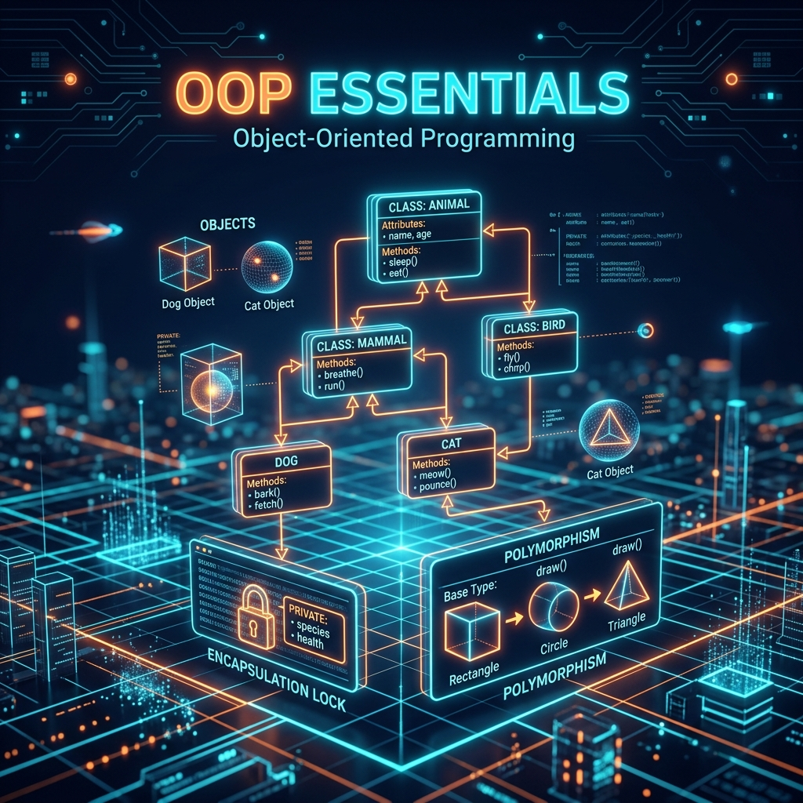
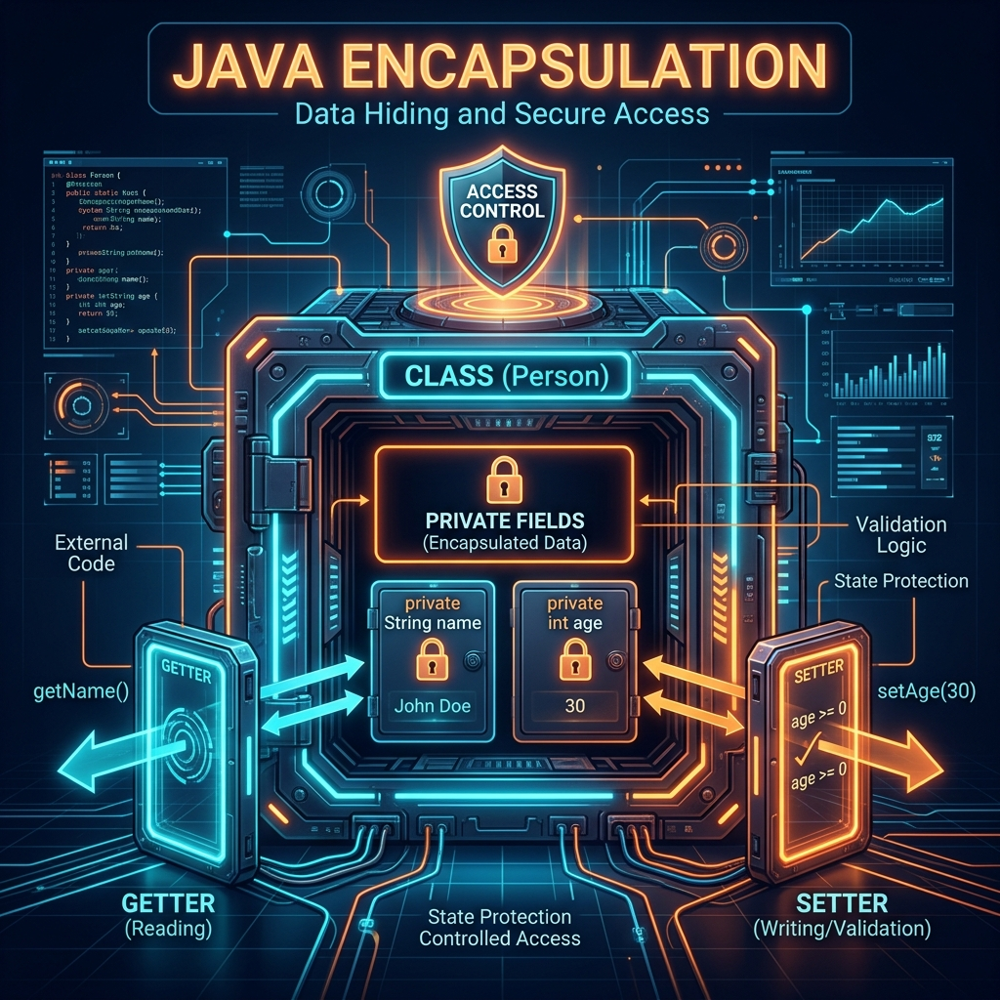
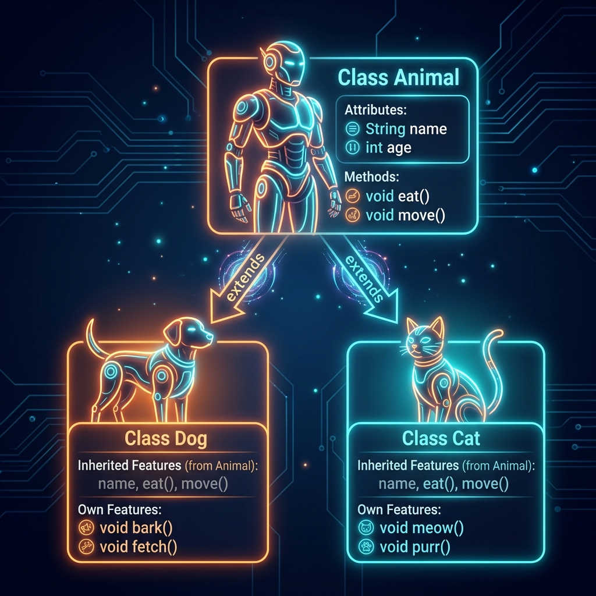
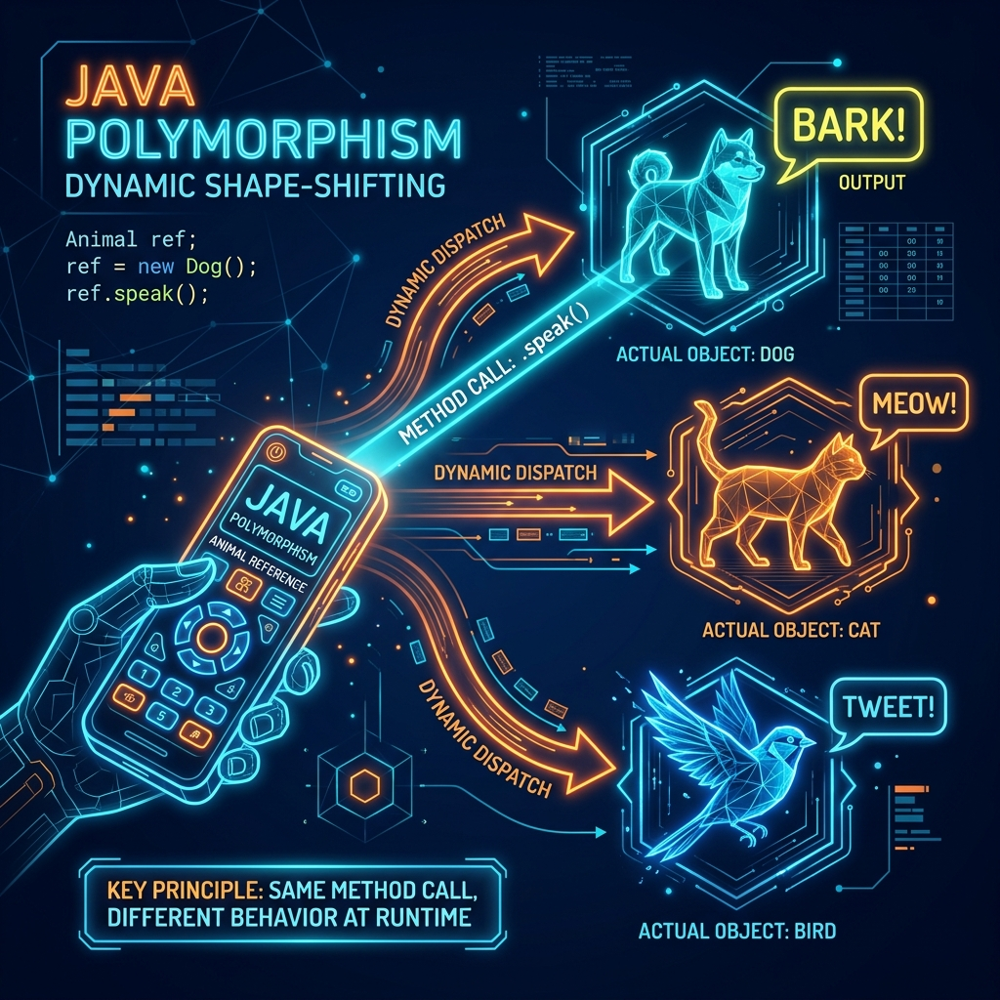
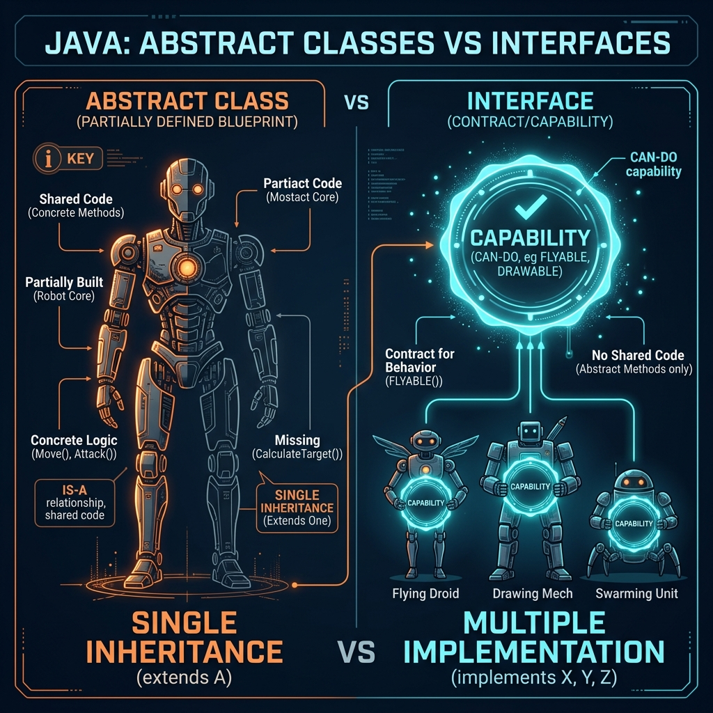
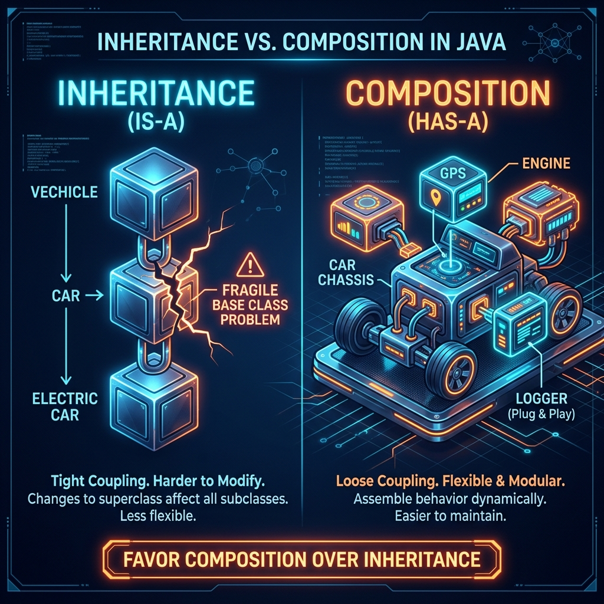

# Part 2: OOP Essentials

<p align="center">

</p>

> **Sources:** *Effective Java* (Bloch) · *Core Java, Vol. I* (Horstmann) · *Head First Java* (Sierra, Bates, Gee) · *Java: The Complete Reference* (Schildt) · *Java: A Beginner's Guide* (Schildt)

---

## 🎯 Learning Objectives

By the end of this part, you will:
- Design classes with encapsulation, constructors, and access control
- Apply inheritance and understand the `extends` / `implements` keywords
- Master polymorphism, method overriding, and dynamic dispatch
- Distinguish abstract classes from interfaces and know when to use each
- Understand composition vs. inheritance trade-offs — and why Bloch says "favor composition"

---

## 1. Classes & Objects — The Blueprint Analogy

### 1.1 What Is an Object?

> **Feynman Insight:** Imagine you're building a city. A **class** is the architectural blueprint for a house. An **object** is an actual house built from that blueprint. You can build 100 houses from one blueprint — they all have the same structure (rooms, doors, windows), but each house has its own paint color, furniture, and people living inside.

In Java, a class defines the *structure* (fields) and *behavior* (methods). An object is a specific instance with its own data.

### 1.2 Anatomy of a Java Class

```java
package com.example.model;

public class Person {
    // ─── Fields (state) — what the object KNOWS ───
    private String name;
    private int age;

    // ─── Constructor — how to BUILD the object ───
    public Person(String name, int age) {
        this.name = name;
        this.age = age;
    }

    // ─── Methods (behavior) — what the object DOES ───
    public String getName() {
        return name;
    }

    public void setName(String name) {
        this.name = name;
    }

    public int getAge() {
        return age;
    }

    public void setAge(int age) {
        if (age < 0) throw new IllegalArgumentException("Age cannot be negative");
        this.age = age;
    }

    @Override
    public String toString() {
        return "Person{name='" + name + "', age=" + age + "}";
    }
}
```

### 1.3 Creating Objects

```java
Person alice = new Person("Alice", 30);
Person bob = new Person("Bob", 25);

System.out.println(alice);        // Person{name='Alice', age=30}
System.out.println(alice.getName()); // Alice
```

**What happens with `new`** — Horstmann (*Core Java*) breaks it down into five precise steps:

1. Memory is allocated on the **heap**
2. Fields are initialized to **default values** (`null`, `0`, `false`)
3. Instance initializer blocks run (in order of appearance)
4. The **constructor** body executes
5. A **reference** to the new object is returned

### 1.4 The `this` Keyword

`this` is the object's way of referring to itself. Think of it as the object saying "me":

```java
public class Point {
    private int x, y;

    // 'this' disambiguates field from parameter
    public Point(int x, int y) {
        this.x = x;   // "MY x = the parameter x"
        this.y = y;
    }

    // 'this()' calls another constructor (constructor chaining)
    public Point() {
        this(0, 0);  // Must be FIRST statement
    }

    // 'this' as a reference — enables fluent API
    public Point translate(int dx, int dy) {
        this.x += dx;
        this.y += dy;
        return this;   // Returns "myself" so you can chain: point.translate(1,2).translate(3,4)
    }
}
```

---

## 2. Encapsulation — The Vault

Encapsulation is the most fundamental principle of OOP. Bloch (*Effective Java*, Item 16) states it firmly: *"In public classes, use accessor methods, not public fields."*

<p align="center">

</p>

> **Feynman Insight:** Imagine a bank vault. You don't let customers walk into the vault and grab cash (public fields). Instead, they go to a teller window (getter/setter methods) where transactions are controlled, validated, and logged. If someone tries to withdraw more than they have, the teller stops them. That's encapsulation — **protecting data by controlling access**.

### 2.1 Access Modifiers

| Modifier | Class | Package | Subclass | World |
|----------|-------|---------|----------|-------|
| `private` | ✅ | ❌ | ❌ | ❌ |
| *(default/package-private)* | ✅ | ✅ | ❌ | ❌ |
| `protected` | ✅ | ✅ | ✅ | ❌ |
| `public` | ✅ | ✅ | ✅ | ✅ |

> **Bloch's Rule** (*Effective Java*, Item 15): *"Minimize the accessibility of classes and members."* Make everything as private as possible. Start with `private` and only widen access when you have a concrete reason.

### 2.2 JavaBeans Convention

```java
public class Employee {
    private String firstName;
    private boolean active;

    // Getter for non-boolean
    public String getFirstName() { return firstName; }

    // Setter
    public void setFirstName(String firstName) { this.firstName = firstName; }

    // Getter for boolean — uses 'is' prefix
    public boolean isActive() { return active; }
    public void setActive(boolean active) { this.active = active; }
}
```

### 2.3 Immutable Classes — The Gold Standard

Joshua Bloch (*Effective Java*, Item 17) dedicates an entire chapter to immutability because it is one of the most powerful tools for writing correct, thread-safe code.

An immutable class cannot be modified after creation:

```java
public final class ImmutablePerson {
    private final String name;
    private final int age;
    private final List<String> hobbies;

    public ImmutablePerson(String name, int age, List<String> hobbies) {
        this.name = name;
        this.age = age;
        this.hobbies = List.copyOf(hobbies);  // Defensive copy!
    }

    public String getName() { return name; }
    public int getAge() { return age; }
    public List<String> getHobbies() { return hobbies; }  // Already immutable

    // No setters!
}
```

> **Feynman Insight:** An immutable object is like a photograph — once taken, it can never change. You can show it to anyone, copy it, share it between threads, and it will always be the same. A mutable object is like a whiteboard — anyone can erase and rewrite it, which leads to chaos when multiple people are using it simultaneously.

**Rules for immutability** (Bloch):
1. Class is `final` (cannot be subclassed)
2. All fields are `private final`
3. No setters
4. Defensive copies of mutable fields in constructor and getters

---

## 3. Constructors & Initialization

### 3.1 Constructor Overloading

```java
public class Rectangle {
    private double width;
    private double height;

    // No-arg constructor — delegates to the parameterized one
    public Rectangle() {
        this(1.0, 1.0);
    }

    // Parameterized constructor
    public Rectangle(double width, double height) {
        this.width = width;
        this.height = height;
    }

    // Copy constructor — builds a clone from an existing object
    public Rectangle(Rectangle other) {
        this(other.width, other.height);
    }
}
```

### 3.2 Initialization Order

This is a classic interview question. Horstmann (*Core Java*) lays out the exact sequence:

1. **Static** content (once per class, in order of appearance):
   - Static fields → default values
   - Static initializer blocks
2. **Instance** content (each time `new` is called):
   - Instance fields → default values
   - Instance initializer blocks (in order of appearance)
   - Constructor body

```java
public class InitOrder {
    private int x = initX();                    // Step 3: Instance field

    static { System.out.println("Static block"); }  // Step 1: Static initializer

    { System.out.println("Instance block, x=" + x); }  // Step 4: Instance initializer

    private static int STATIC_FIELD = initStatic();  // Step 2: Static field

    public InitOrder() {                         // Step 5: Constructor
        System.out.println("Constructor");
    }

    private int initX() { System.out.println("initX"); return 42; }
    private static int initStatic() { System.out.println("initStatic"); return 99; }
}
```

> **Feynman Insight:** Think of building a house. The **static** stuff happens when the architectural firm is founded (once ever): setting up the company name and logo. The **instance** stuff happens each time you build a new house: pour foundation (default values), install framework (initializer blocks), then do the custom interior work (constructor).

---

## 4. Inheritance — The Family Tree

Inheritance lets you create new classes that reuse, extend, and modify the behavior defined in existing classes. But Bloch warns: it's a powerful tool that's easy to misuse.

<p align="center">

</p>

> **Feynman Insight:** Inheritance is like a family tree. A child inherits traits from their parent — eye color, height, last name. But the child can also develop their own unique traits and even "override" inherited ones (maybe the child dyes their hair a different color from the parent). In Java, a `Dog` inherits `eat()` and `name` from `Animal`, but can override `speak()` with its own "Bark!" implementation.

### 4.1 The `extends` Keyword

```java
public class Animal {
    protected String name;

    public Animal(String name) {
        this.name = name;
    }

    public void speak() {
        System.out.println(name + " makes a sound");
    }

    public void eat() {
        System.out.println(name + " is eating");
    }
}

public class Dog extends Animal {
    private String breed;

    public Dog(String name, String breed) {
        super(name);          // MUST be first statement — calls parent constructor
        this.breed = breed;
    }

    @Override
    public void speak() {
        System.out.println(name + " barks!");
    }

    // Dog inherits eat() from Animal
    // Dog overrides speak() with its own implementation
    public void fetch() {
        System.out.println(name + " fetches the ball!");
    }
}
```

### 4.2 Rules of Inheritance

Schildt (*Java: The Complete Reference*) and Horstmann (*Core Java*) both emphasize these immutable rules:

- Java supports **single inheritance** only (one parent class)
- Every class implicitly extends `java.lang.Object`
- `super()` calls the parent constructor — must be first statement
- If no `super()` is explicit, the compiler inserts `super()` (no-arg)
- `final` classes cannot be extended
- `final` methods cannot be overridden

### 4.3 Method Overriding Rules

For a method in a subclass to **override** a parent method:

| Rule | Description |
|------|-------------|
| Same signature | Same method name and parameter types |
| Covariant return | Return type must be the same or a subtype |
| Access modifier | Cannot be more restrictive (e.g., can't go `public` → `private`) |
| Exceptions | Cannot throw new/broader checked exceptions |
| Not `final` | The parent method must not be `final` |
| Not `static` | Static methods are **hidden**, not overridden |
| Not `private` | Private methods are not inherited |

```java
public class Animal {
    public Animal reproduce() { return new Animal("baby"); }
    protected void rest() { }
}

public class Dog extends Animal {
    @Override
    public Dog reproduce() { return new Dog("puppy", "Lab"); }  // Covariant return ✅

    @Override
    public void rest() { }   // Wider access (protected → public) is OK ✅
}
```

---

## 5. Polymorphism — The Shape-Shifter

Polymorphism is the crown jewel of OOP. It means "many forms" — a single reference type can point to different object types, and the *correct* method is called at runtime.

<p align="center">

</p>

> **Feynman Insight:** Imagine a universal remote control labeled "Animal." You point it at a Dog and press "speak" — you hear a bark. You point it at a Cat — you hear a meow. Point it at a Bird — you hear a tweet. The remote (reference type) is always "Animal," but the **actual device** (object type) determines what happens. The remote doesn't need to know what specific animal it's controlling — it just presses "speak" and trusts the animal to respond correctly.

### 5.1 Polymorphism in Action

```java
Animal myPet = new Dog("Rex", "Shepherd");
myPet.speak();    // "Rex barks!" — Dog's method is called at RUNTIME
myPet.eat();      // "Rex is eating" — inherited from Animal

// myPet.fetch();  // COMPILE ERROR — Animal reference doesn't know about fetch()
```

**Key insight** (Horstmann, *Core Java*): The **compiler** checks the **reference type** (Animal). The **JVM** executes the **object type's** method (Dog) at runtime. This is **dynamic dispatch**.

### 5.2 Casting

```java
Animal animal = new Dog("Rex", "Shepherd");

// Downcasting — must be explicit
Dog dog = (Dog) animal;   // OK at runtime because animal IS a Dog
dog.fetch();              // Now we can call Dog-specific methods

// Safe downcasting with instanceof (Java 16+ pattern matching)
if (animal instanceof Dog d) {
    d.fetch();  // d is automatically cast — no explicit (Dog) needed!
}

// Unsafe cast — ClassCastException at runtime!
Animal cat = new Animal("Kitty");
// Dog notADog = (Dog) cat;  // ClassCastException!
```

### 5.3 Virtual Methods — The Default in Java

In Java, **all non-static, non-final, non-private methods are virtual** by default. The JVM determines which method to call based on the actual object type, not the reference type.

```java
public class Shape {
    public double area() { return 0; }
}

public class Circle extends Shape {
    private double radius;
    public Circle(double radius) { this.radius = radius; }

    @Override
    public double area() { return Math.PI * radius * radius; }
}

public class Rectangle extends Shape {
    private double width, height;
    public Rectangle(double w, double h) { this.width = w; this.height = h; }

    @Override
    public double area() { return width * height; }
}

// Polymorphic code — the magic of OOP:
Shape[] shapes = { new Circle(5), new Rectangle(3, 4), new Circle(2) };
for (Shape s : shapes) {
    System.out.println("Area: " + s.area());  // Calls the correct override automatically!
}
// Output:
// Area: 78.53981633974483
// Area: 12.0
// Area: 12.566370614359172
```

---

## 6. Abstract Classes — The Partial Blueprint

An abstract class is like a blueprint that's intentionally incomplete. It provides some finished rooms but leaves other rooms for the builder (subclass) to design.

```java
public abstract class Vehicle {
    protected String make;
    protected int year;

    public Vehicle(String make, int year) {
        this.make = make;
        this.year = year;
    }

    // Abstract method — no body, MUST be overridden by concrete subclass
    public abstract double fuelEfficiency();

    // Concrete method — inherited as-is
    public String getDescription() {
        return year + " " + make;
    }
}

public class ElectricCar extends Vehicle {
    private double batteryCapacity;

    public ElectricCar(String make, int year, double batteryCapacity) {
        super(make, year);
        this.batteryCapacity = batteryCapacity;
    }

    @Override
    public double fuelEfficiency() {
        return batteryCapacity * 3.5;  // miles per kWh
    }
}
```

**Rules** (Schildt, *Java: The Complete Reference*):
- Cannot instantiate an abstract class: `new Vehicle(...)` → compile error
- Can have constructors (called via `super()`)
- Can have both abstract and concrete methods
- First **concrete** subclass must implement ALL inherited abstract methods

---

## 7. Interfaces — The Capability Contract

### 7.1 Abstract Class vs. Interface

This is one of the most important design decisions in Java. Bloch (*Effective Java*, Item 20) says: *"Prefer interfaces to abstract classes."*

<p align="center">

</p>

> **Feynman Insight:** An **abstract class** is like a partially assembled car at the factory — it has an engine and wheels, but the interior is unfinished. Only vehicles that ARE cars can extend it. An **interface** is like a pilot's license — it certifies that something CAN fly. A plane can have a pilot's license. A drone can have one too. Even a person with a jetpack could have one. They're completely different things, but they all share the **capability** of flying.

### 7.2 Interface Basics

```java
public interface Flyable {
    // Constant (implicitly public static final)
    int MAX_ALTITUDE = 10000;

    // Abstract method (implicitly public abstract)
    void fly();
    double getAltitude();

    // Default method (Java 8+) — provides a default implementation
    default void land() {
        System.out.println("Landing...");
    }

    // Static method (Java 8+)
    static boolean canFly(Object obj) {
        return obj instanceof Flyable;
    }

    // Private method (Java 9+) — helper for default methods
    private void logFlight() {
        System.out.println("Flight logged");
    }
}
```

### 7.3 Implementing Interfaces

```java
public class Airplane implements Flyable, Serializable {
    private double altitude;

    @Override
    public void fly() {
        altitude = 30000;
        System.out.println("Flying at " + altitude + " feet");
    }

    @Override
    public double getAltitude() {
        return altitude;
    }

    // land() is inherited from Flyable's default method
}
```

**A class can implement multiple interfaces** — Java's way of supporting multiple inheritance of type.

### 7.4 Comparison Table

| Feature | Abstract Class | Interface |
|---------|---------------|-----------|
| Inheritance | Single (`extends`) | Multiple (`implements`) |
| Constructors | ✅ Yes | ❌ No |
| Instance fields | ✅ Yes | ❌ Only constants |
| Method types | Any | `abstract`, `default`, `static`, `private` |
| Access modifiers on methods | Any | `public` only (abstract/default) |
| Use when... | IS-A + shared state/code | CAN-DO capability contract |

> **Bloch's Design Guideline** (*Effective Java*, Item 20): *"Prefer interfaces for defining types. Use abstract classes only when you need to share code among closely related classes."*

---

## 8. Composition vs. Inheritance — The Critical Decision

This is perhaps the most important lesson in all of OOP, and one that Bloch dedicates significant attention to in *Effective Java* (Items 16–18).

<p align="center">

</p>

### 8.1 The Problem with Deep Inheritance

```
                    Animal
                   /      \
              Mammal      Bird
             /     \        \
           Dog     Cat    Parrot
          /   \
     Poodle  Bulldog
```

Deep hierarchies become **fragile** — changes to `Animal` can break `Poodle`. This is called the **Fragile Base Class Problem**.

> **Feynman Insight:** Inheritance is like building with Lego towers — each block must sit exactly on the one below it. If you change a block near the bottom, everything above it might fall. Composition is like building with Lego modules — you snap together independent pieces (engine, GPS, logger) that can be swapped, rearranged, or replaced without affecting the others.

### 8.2 Favor Composition (Bloch, Item 18)

```java
// Instead of inheriting from Engine, Logger, GPS...
public class Car {
    private final Engine engine;         // HAS-A engine
    private final Logger logger;         // HAS-A logger
    private final GPSNavigator gps;      // HAS-A GPS

    public Car(Engine engine, Logger logger, GPSNavigator gps) {
        this.engine = engine;
        this.logger = logger;
        this.gps = gps;
    }

    public void drive(String destination) {
        engine.start();
        gps.navigateTo(destination);
        logger.log("Driving to " + destination);
    }
}
```

**Benefits:**
- More flexible — swap implementations at runtime
- No fragile base class problem
- Supports multiple "inheritance" of behavior via delegation
- Easier to test (mock individual components)

---

## 9. The `Object` Class — The Common Ancestor

Every Java class inherits from `java.lang.Object`. Bloch (*Effective Java*) dedicates Items 10–14 to getting these methods right:

### 9.1 `toString()`

```java
@Override
public String toString() {
    return "Person{name='" + name + "', age=" + age + "}";
}
```

> **Bloch, Item 12:** *"Always override toString."* A good `toString` makes debugging dramatically easier.

### 9.2 `equals()` and `hashCode()`

```java
@Override
public boolean equals(Object o) {
    if (this == o) return true;
    if (o == null || getClass() != o.getClass()) return false;
    Person person = (Person) o;
    return age == person.age && Objects.equals(name, person.name);
}

@Override
public int hashCode() {
    return Objects.hash(name, age);
}
```

> **Bloch's Contract (Item 11):** If `a.equals(b)` then `a.hashCode() == b.hashCode()`. Violating this breaks `HashMap`, `HashSet`, and every collection that uses hashing. This is arguably the most commonly violated contract in all of Java.

---

## 10. Nested & Inner Classes

```java
public class Outer {
    private int x = 10;

    // Static nested class — doesn't have access to outer instance
    public static class StaticNested {
        public void hello() { System.out.println("Static nested"); }
    }

    // Inner class — has access to outer instance
    public class Inner {
        public void hello() { System.out.println("x = " + x); }
    }

    // Local class — inside a method
    public void method() {
        class Local {
            void hello() { System.out.println("Local, x = " + x); }
        }
        new Local().hello();
    }

    // Anonymous class — inline implementation
    public Runnable getRunnable() {
        return new Runnable() {
            @Override
            public void run() {
                System.out.println("Anonymous, x = " + x);
            }
        };
    }
}
```

> **Bloch, Item 24:** *"Favor static member classes over nonstatic."* Non-static inner classes hold a hidden reference to the outer instance, which can cause memory leaks.

---

## 11. Best Practices — The Collected Wisdom

These come directly from Joshua Bloch (*Effective Java*), Horstmann (*Core Java*), and Sierra/Bates (*Head First Java*):

1. **Favor composition over inheritance** — use `has-a` relationships (Bloch, Item 18)
2. **Program to an interface, not an implementation** — declare variables as `List`, not `ArrayList` (Bloch, Item 64)
3. **Override `toString()`, `equals()`, `hashCode()`** for value objects (Bloch, Items 10–12)
4. **Use `@Override` annotation** — catches typos at compile time (Bloch, Item 40)
5. **Follow the Liskov Substitution Principle** — subclass behavior must be compatible with parent
6. **Keep inheritance hierarchies shallow** — max 2–3 levels
7. **Mark classes as `final`** when not designed for extension (Bloch, Item 19)
8. **Minimize mutability** — make classes immutable whenever possible (Bloch, Item 17)

---

## 12. Exercises

1. **Shape Hierarchy:** Create an abstract `Shape` class with `area()` and `perimeter()` methods. Implement `Circle`, `Rectangle`, and `Triangle`.
2. **Interface Design:** Create a `Drawable` interface with `draw()` and a default `erase()` method. Implement it in multiple shapes.
3. **Immutable Class:** Create an immutable `Money` class with `amount` and `currency`. Support `add()` and `subtract()` that return new instances.
4. **Composition:** Redesign a `Car` using composition (Engine, Transmission, Chassis) instead of inheritance.
5. **equals/hashCode:** Implement `equals()` and `hashCode()` for a `Student` class. Verify they work correctly with `HashSet`.

---

## 📖 References

- *Effective Java*, Joshua Bloch — Items 10–20 (equals, hashCode, toString, Comparable, accessibility, immutability, composition, inheritance, interfaces)
- *Core Java, Volume I — Fundamentals*, Cay S. Horstmann — Chapters 4–6 (Objects, Classes, Inheritance, Interfaces)
- *Head First Java*, Kathy Sierra, Bert Bates, Trisha Gee — Chapters 5–8 (Classes, OOP, Polymorphism, Interfaces)
- *Java: The Complete Reference*, Herbert Schildt — Chapters 6–9 (Classes, Inheritance, Packages, Interfaces)

---

[← Part 1: Java Fundamentals](Part-01-Java-Fundamentals.md) | [Back to Course Index](../README.md) | [Next: Part 3 — Core APIs →](Part-03-Core-APIs.md)
