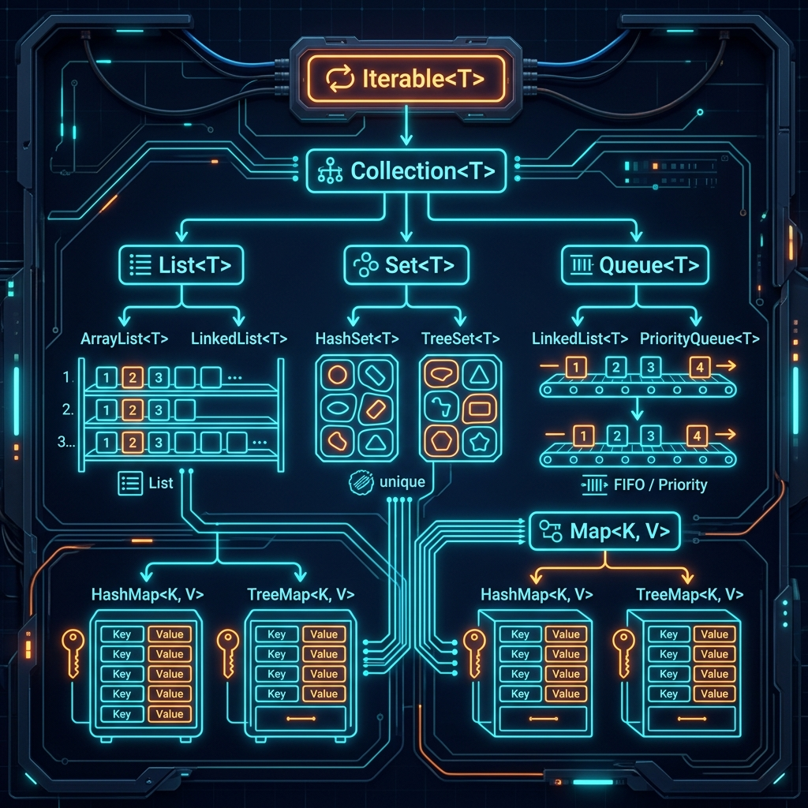
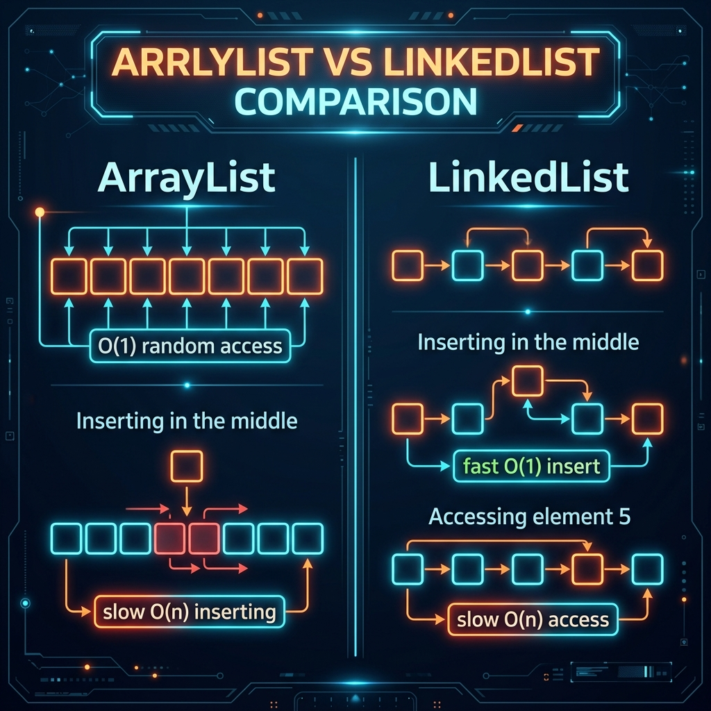
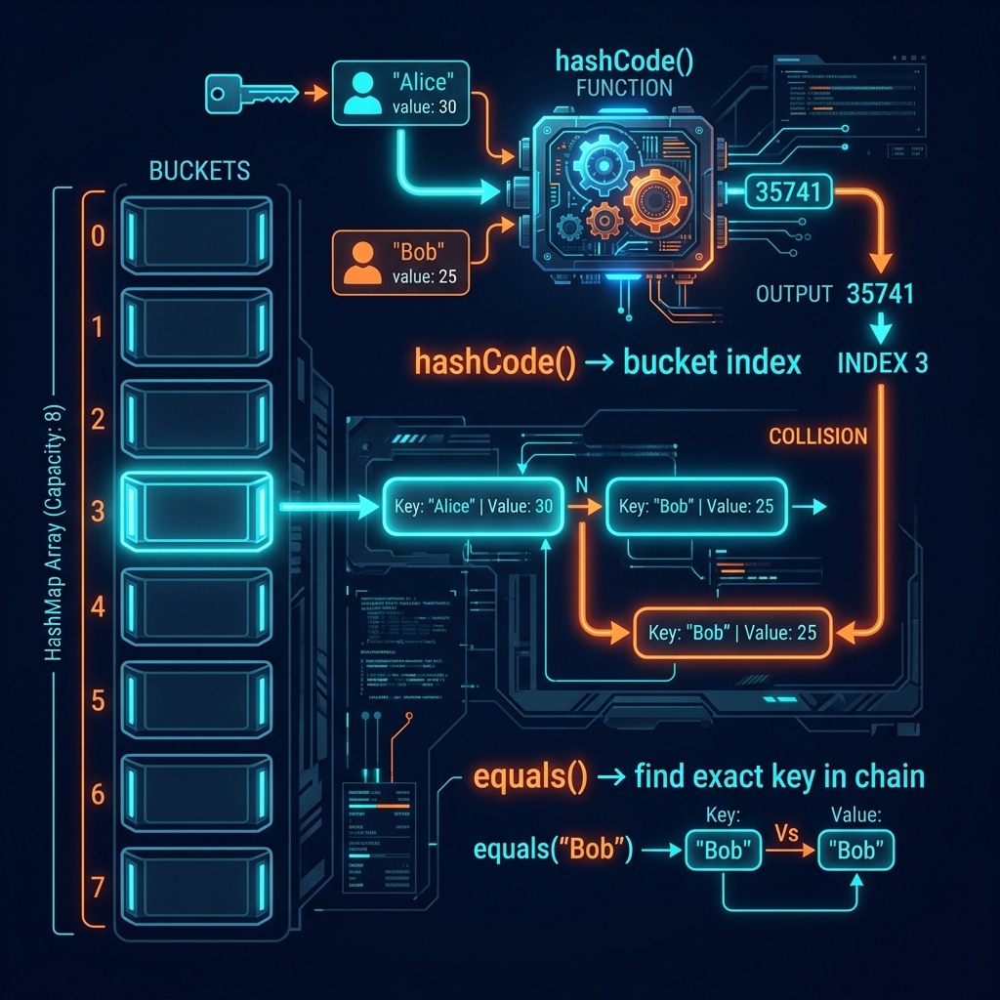

# Part 3: Core APIs

<p align="center">

</p>

> **Sources:** *Core Java, Vol. I* (Horstmann) · *Effective Java* (Bloch) · *Java: The Complete Reference* (Schildt) · *Head First Java* (Sierra, Bates, Gee)

---

## 🎯 Learning Objectives

By the end of this part, you will:
- Master the String API and understand the String Pool
- Work confidently with arrays and the Collections Framework
- Choose the right collection for every scenario (List vs Set vs Map)
- Understand how HashMap works internally and why `equals()/hashCode()` matter
- Use wrapper classes, autoboxing, and the Date/Time API

---

## 1. Strings — Java's Most Used Class

### 1.1 Strings Are Immutable

This is the single most important fact about Java Strings. Bloch (*Effective Java*, Item 17) calls immutability "a cornerstone of good design."

> **Feynman Insight:** A String in Java is like a printed book. Once printed, you can't change the words inside — you can only print a new edition. When you write `name = name.toUpperCase()`, you're not changing the original string — you're creating an entirely new string and pointing your variable to it. The old string still exists in memory until the garbage collector cleans it up.

```java
String original = "Hello";
String modified = original.toUpperCase();  // Creates a NEW String "HELLO"

System.out.println(original);  // Still "Hello" — unchanged!
System.out.println(modified);  // "HELLO"
```

### 1.2 The String Pool — Memory Magic

Java keeps a special area in memory called the **String Pool** (inside the heap) to save memory by reusing identical strings.

<p align="center">

</p>

> **Feynman Insight:** Imagine a city library. When you say `String s1 = "Hello"`, Java first checks if the library already has a book titled "Hello." If yes, it gives you a library card pointing to that same book. If you then say `String s2 = "Hello"`, you get *another card pointing to the same book*. But if you say `String s3 = new String("Hello")`, you're insisting on printing your own personal copy — even though an identical book already exists in the library.

```java
String s1 = "Hello";              // Goes into the String Pool
String s2 = "Hello";              // Reuses the SAME object from the pool
String s3 = new String("Hello");  // Creates a NEW object outside the pool

System.out.println(s1 == s2);     // true — same reference (same book)
System.out.println(s1 == s3);     // false — different references (different copies)
System.out.println(s1.equals(s3)); // true — same CONTENT (same text)
```

> **Bloch's Rule** (*Effective Java*, Item 6): *"Avoid creating unnecessary objects."* Use string literals (`"Hello"`) instead of `new String("Hello")` — the constructor form always creates a redundant copy.

### 1.3 Essential String Methods

```java
String s = "Hello, World!";

s.length()              // 13
s.charAt(0)             // 'H'
s.indexOf("World")      // 7
s.substring(7)          // "World!"
s.substring(0, 5)       // "Hello"
s.toUpperCase()         // "HELLO, WORLD!"
s.toLowerCase()         // "hello, world!"
s.trim()                // Removes leading/trailing whitespace
s.strip()               // Like trim() but handles Unicode whitespace (Java 11+)
s.contains("World")     // true
s.startsWith("Hello")   // true
s.endsWith("!")         // true
s.replace("World", "Java")  // "Hello, Java!"
s.isEmpty()             // false
s.isBlank()             // false (Java 11+ — true if only whitespace)
```

### 1.4 StringBuilder — For When You Need Mutability

String concatenation in loops creates a new String object every iteration. For performance-critical code, use `StringBuilder`:

```java
// BAD — creates ~1000 intermediate String objects
String result = "";
for (int i = 0; i < 1000; i++) {
    result += i + ", ";  // Each += creates a new String!
}

// GOOD — one mutable buffer, no waste
StringBuilder sb = new StringBuilder();
for (int i = 0; i < 1000; i++) {
    sb.append(i).append(", ");
}
String result = sb.toString();
```

> **Horstmann's tip** (*Core Java*): `StringBuilder` is not thread-safe (faster). `StringBuffer` is thread-safe (slower). In 99% of cases, use `StringBuilder`.

### 1.5 Text Blocks (Java 13+)

```java
String json = """
        {
            "name": "Alice",
            "age": 30,
            "city": "Madrid"
        }
        """;
```

---

## 2. Arrays — The Foundation

### 2.1 Array Basics

> **Feynman Insight:** An array is like a row of mailboxes in an apartment building. Each mailbox has a fixed number, starting from 0. You can go directly to mailbox #5 (random access, O(1)), but you can't add new mailboxes without rebuilding the entire row.

```java
// Declaration + Initialization
int[] numbers = new int[5];           // 5 slots, all initialized to 0
String[] names = {"Alice", "Bob", "Charlie"};
int[] scores = new int[]{90, 85, 95}; // Explicit with new

// Accessing elements
System.out.println(names[0]);  // "Alice"
System.out.println(names.length);  // 3 (not a method — it's a field!)

// ArrayIndexOutOfBoundsException
// System.out.println(names[3]);  // CRASH — valid indices are 0, 1, 2
```

### 2.2 Multi-dimensional Arrays

```java
// 2D array — like a grid/spreadsheet
int[][] matrix = {
    {1, 2, 3},
    {4, 5, 6},
    {7, 8, 9}
};

System.out.println(matrix[1][2]);  // 6 (row 1, column 2)

// Jagged arrays — rows can have different lengths
int[][] jagged = new int[3][];
jagged[0] = new int[]{1, 2};
jagged[1] = new int[]{3, 4, 5};
jagged[2] = new int[]{6};
```

### 2.3 java.util.Arrays Utility

```java
import java.util.Arrays;

int[] arr = {5, 3, 1, 4, 2};

Arrays.sort(arr);               // [1, 2, 3, 4, 5] — in-place sort
int idx = Arrays.binarySearch(arr, 3);  // 2 — must be sorted first!
int[] copy = Arrays.copyOf(arr, 10);    // Copy with new size
Arrays.fill(arr, 0);            // Fill all elements with 0
System.out.println(Arrays.toString(arr));  // "[0, 0, 0, 0, 0]"
boolean eq = Arrays.equals(arr, copy);     // Content comparison
```

---

## 3. The Collections Framework — Java's Data Structure Library

The Collections Framework is one of Java's greatest strengths. Horstmann (*Core Java*) dedicates 100+ pages to it because choosing the right collection is one of the most impactful performance decisions you'll make.

<p align="center">

</p>

> **Feynman Insight:** The Collections Framework is like a hardware store. For every job, there's a perfect tool:
> - Need an ordered list you access by index? → **ArrayList** (a numbered shelf)
> - Need fast insertion/removal at both ends? → **LinkedList** (a chain)
> - Need unique items with no order? → **HashSet** (a bag of unique marbles)
> - Need unique items in sorted order? → **TreeSet** (a sorted trophy case)
> - Need key-value lookups? → **HashMap** (a dictionary/phone book)
> - Need a first-in-first-out queue? → **LinkedList** or **ArrayDeque** (a waiting line)

### 3.1 List — Ordered, Allows Duplicates

<p align="center">

</p>

```java
// ArrayList — backed by a resizable array. Best for random access.
List<String> names = new ArrayList<>();
names.add("Alice");
names.add("Bob");
names.add("Charlie");

names.get(1);            // "Bob" — O(1) random access
names.set(1, "Barbara"); // Replace at index
names.remove(0);         // Remove "Alice" — shifts all elements O(n)
names.contains("Bob");   // false (was replaced)
names.size();            // 2

// LinkedList — backed by doubly-linked nodes. Best for frequent insertion/removal.
List<String> linked = new LinkedList<>();
linked.addFirst("Start");
linked.addLast("End");
```

**When to use which** (Bloch, *Effective Java*):

| Operation | ArrayList | LinkedList |
|-----------|----------|------------|
| Get by index | **O(1)** ✅ | O(n) ❌ |
| Add at end | **O(1)** amortized | **O(1)** |
| Add in middle | O(n) | **O(1)** (if you have the node) |
| Memory | Compact | More overhead (node pointers) |
| **Default choice** | **✅ Yes** | Only for deque operations |

> **Bloch's Recommendation** (*Effective Java*): *"Almost always use ArrayList."* LinkedList's theoretical advantages rarely matter in practice due to CPU cache effects.

### 3.2 Set — Unique Elements

```java
// HashSet — unordered, O(1) operations. The workhorse.
Set<String> uniqueNames = new HashSet<>();
uniqueNames.add("Alice");
uniqueNames.add("Bob");
uniqueNames.add("Alice");   // Duplicate! Not added.
System.out.println(uniqueNames.size());  // 2

// TreeSet — sorted order, O(log n) operations
Set<Integer> sorted = new TreeSet<>();
sorted.add(30);
sorted.add(10);
sorted.add(20);
System.out.println(sorted);  // [10, 20, 30] — always sorted!

// LinkedHashSet — maintains insertion order, O(1) operations
Set<String> ordered = new LinkedHashSet<>();
ordered.add("Charlie");
ordered.add("Alice");
ordered.add("Bob");
System.out.println(ordered);  // [Charlie, Alice, Bob] — insertion order preserved
```

### 3.3 Map — Key-Value Pairs

<p align="center">

</p>

> **Feynman Insight — How HashMap Actually Works:** Imagine a library with numbered shelves (the "bucket array"). When you store a book with the key "Alice", the librarian runs Alice's name through a magic formula (`hashCode()`) that produces a shelf number (say, shelf 3). The book is placed on shelf 3. When you ask for Alice's book, the librarian runs the same formula, goes directly to shelf 3, and finds it in O(1) time. But what if "Bob" also maps to shelf 3? That's a **collision** — both books end up on the same shelf, chained together. The librarian then uses `.equals()` to check each book's label to find the right one.

```java
Map<String, Integer> ages = new HashMap<>();
ages.put("Alice", 30);
ages.put("Bob", 25);
ages.put("Charlie", 35);

ages.get("Alice");              // 30
ages.getOrDefault("Dave", 0);   // 0 (key not found)
ages.containsKey("Bob");        // true
ages.containsValue(25);         // true
ages.remove("Charlie");

// Iteration
for (Map.Entry<String, Integer> entry : ages.entrySet()) {
    System.out.println(entry.getKey() + " → " + entry.getValue());
}

// Modern merge operations
ages.merge("Alice", 1, Integer::sum);  // Alice's age becomes 31
ages.computeIfAbsent("Dave", k -> 28); // Only computes if key is absent
```

### 3.4 Choosing the Right Collection

| Need | Best Choice | Why |
|------|------------|-----|
| Ordered, indexed access | `ArrayList` | O(1) get, cache-friendly |
| Unique elements, fast lookup | `HashSet` | O(1) contains |
| Unique elements, sorted | `TreeSet` | Natural order, O(log n) |
| Key-value pairs | `HashMap` | O(1) get/put |
| Key-value, sorted keys | `TreeMap` | O(log n), sorted iteration |
| FIFO queue | `ArrayDeque` | Faster than LinkedList |
| Thread-safe map | `ConcurrentHashMap` | Lock-striping, high concurrency |

---

## 4. Wrapper Classes & Autoboxing

### 4.1 Why Wrappers Exist

Collections can't hold primitives (`int`, `double`, etc.). Wrapper classes bridge this gap:

| Primitive | Wrapper |
|-----------|---------|
| `int` | `Integer` |
| `double` | `Double` |
| `boolean` | `Boolean` |
| `char` | `Character` |
| `long` | `Long` |
| `float` | `Float` |
| `byte` | `Byte` |
| `short` | `Short` |

### 4.2 Autoboxing & Unboxing

Java automatically converts between primitives and wrappers:

```java
// Autoboxing: primitive → wrapper (automatic)
Integer wrapped = 42;     // int 42 → Integer.valueOf(42)
List<Integer> list = new ArrayList<>();
list.add(10);             // int 10 → Integer.valueOf(10)

// Unboxing: wrapper → primitive (automatic)
int unwrapped = wrapped;  // Integer → int
int first = list.get(0);  // Integer → int
```

> **Bloch's Warning** (*Effective Java*, Item 61): *"Prefer primitives to boxed primitives."* Autoboxing can create performance traps:
> ```java
> // TERRIBLE — creates ~2 billion unnecessary Integer objects
> Long sum = 0L;
> for (long i = 0; i < Integer.MAX_VALUE; i++) {
>     sum += i;  // Unbox, add, re-box — every iteration!
> }
>
> // CORRECT — use primitive long
> long sum = 0L;
> for (long i = 0; i < Integer.MAX_VALUE; i++) {
>     sum += i;
> }
> ```

### 4.3 The Integer Cache Trap

```java
Integer a = 127;
Integer b = 127;
System.out.println(a == b);  // true — cached! (values -128 to 127 are cached)

Integer c = 128;
Integer d = 128;
System.out.println(c == d);  // false — different objects! Not cached!
System.out.println(c.equals(d));  // true — always use .equals() for wrappers
```

---

## 5. The Date and Time API (java.time)

The `java.time` package (Java 8+) replaced the terrible old `Date` and `Calendar` classes:

```java
import java.time.*;
import java.time.format.DateTimeFormatter;

// Current date/time
LocalDate today = LocalDate.now();           // 2024-03-15
LocalTime now = LocalTime.now();             // 14:30:45.123
LocalDateTime dateTime = LocalDateTime.now(); // 2024-03-15T14:30:45.123
ZonedDateTime zoned = ZonedDateTime.now();   // With timezone

// Creating specific dates
LocalDate birthday = LocalDate.of(1990, 5, 15);
LocalDate parsed = LocalDate.parse("2024-03-15");

// Manipulation (immutable — returns new objects!)
LocalDate tomorrow = today.plusDays(1);
LocalDate nextMonth = today.plusMonths(1);
LocalDate lastYear = today.minusYears(1);

// Formatting
DateTimeFormatter formatter = DateTimeFormatter.ofPattern("dd/MM/yyyy");
String formatted = today.format(formatter);  // "15/03/2024"

// Duration & Period
Duration duration = Duration.between(LocalTime.of(9, 0), LocalTime.of(17, 0));  // 8 hours
Period period = Period.between(birthday, today);  // Years, months, days
```

> **Horstmann's Rule** (*Core Java*): Always use `java.time` classes for new code. Never use `java.util.Date` or `java.util.Calendar` — they're mutable, error-prone, and fundamentally broken in design.

---

## 6. Best Practices

1. **Use `.equals()` for String comparison** — never `==` (Bloch, Item 10)
2. **Prefer `StringBuilder`** for string concatenation in loops
3. **Choose `ArrayList` by default** — only use `LinkedList` for deque operations (Bloch)
4. **Program to the interface** — `List<String>` not `ArrayList<String>` (Bloch, Item 64)
5. **Use `Map.getOrDefault()`** instead of null checks
6. **Use `java.time`** — never the old Date/Calendar classes
7. **Prefer primitives over wrappers** in performance-sensitive code (Bloch, Item 61)
8. **Use `List.of()`, `Set.of()`, `Map.of()`** for immutable collections (Java 9+)

---

## 7. Exercises

1. **String Manipulation:** Write a method that takes a sentence and returns it with each word reversed but in the original order.
2. **Collection Converter:** Convert a `List<String>` to a `Set<String>` to remove duplicates, then back to a sorted `List<String>`.
3. **Word Counter:** Read a text and count the frequency of each word using a `HashMap<String, Integer>`.
4. **Custom Sorting:** Sort a list of `Person` objects by age (then by name for ties) using `Comparator.comparing()`.
5. **Date Calculator:** Write a program that calculates the exact number of days between two dates entered as strings.

---

## 📖 References

- *Core Java, Volume I — Fundamentals*, Cay S. Horstmann — Chapters 5, 9 (Strings, Collections)
- *Effective Java*, Joshua Bloch — Items 6 (unnecessary objects), 17 (immutability), 61 (primitives vs wrappers), 64 (interface types)
- *Java: The Complete Reference*, Herbert Schildt — Chapters 15–18 (String, Collections, java.time)
- *Head First Java*, Kathy Sierra, Bert Bates — Chapters 15–16 (Collections, Generics)

---

[← Part 2: OOP Essentials](Part-02-OOP-Essentials.md) | [Back to Course Index](../README.md) | [Next: Part 4 — Exception Handling →](Part-04-Exception-Handling.md)
