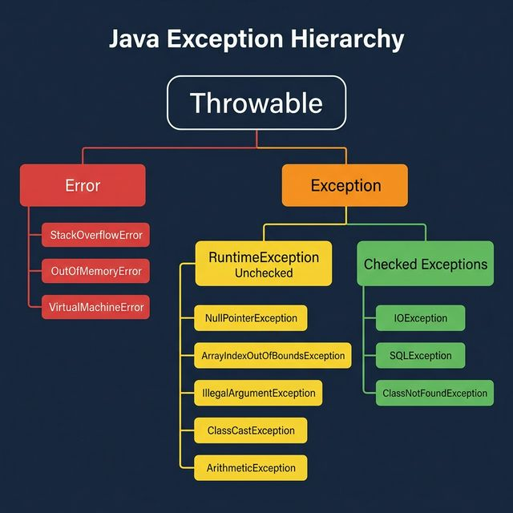

# Part 4: Exception Handling & Error Management

> **Sources:** *Thinking in Java* (Ch. 9) · *OCA Java SE 8 Programmer I* (Ch. 6) · *OCP Java SE 8 Programmer II* (Ch. 6)

---

## 🎯 Learning Objectives

By the end of this part, you will:
- Understand the exception hierarchy and categories
- Use `try-catch-finally` and `try-with-resources` correctly
- Create custom exceptions
- Apply multi-catch and exception chaining
- Follow best practices for robust error handling

---

## 1. Exception Hierarchy

<p align="center">

</p>

### Categories

| Category | Examples | Must Catch? | Recoverable? |
|----------|---------|-------------|-------------|
| **Checked Exceptions** | `IOException`, `SQLException`, `ClassNotFoundException` | ✅ Yes (or declare) | Usually yes |
| **Unchecked Exceptions** (`RuntimeException`) | `NullPointerException`, `IllegalArgumentException` | ❌ No | Often indicates bugs |
| **Errors** | `OutOfMemoryError`, `StackOverflowError` | ❌ No | Usually not |

---

## 2. try-catch-finally

### 2.1 Basic Structure

```java
try {
    // Code that might throw an exception
    int result = 10 / 0;
} catch (ArithmeticException e) {
    // Handle the exception
    System.err.println("Cannot divide by zero: " + e.getMessage());
} finally {
    // ALWAYS executes (cleanup code)
    System.out.println("Cleanup done");
}
```

### 2.2 Multiple Catch Blocks

Order matters — catch **most specific** first:

```java
try {
    String s = null;
    s.length();  // Throws NullPointerException
} catch (NullPointerException e) {
    System.err.println("Null reference: " + e.getMessage());
} catch (RuntimeException e) {
    System.err.println("Runtime error: " + e.getMessage());
} catch (Exception e) {
    System.err.println("General error: " + e.getMessage());
}
// Compile error if you put Exception before RuntimeException (unreachable catch)
```

### 2.3 Multi-Catch (Java 7+)

```java
try {
    // Code that might throw different exceptions
    Object obj = "Hello";
    Integer num = (Integer) obj;
} catch (ClassCastException | NumberFormatException | ArithmeticException e) {
    // Handle multiple exception types in ONE catch block
    System.err.println("Error: " + e.getMessage());
    // Note: 'e' is effectively final — cannot reassign
}
```

**Rules:** The exception types in multi-catch cannot be related (no parent-child).

### 2.4 The `finally` Block

```java
FileInputStream fis = null;
try {
    fis = new FileInputStream("data.txt");
    // Process file
} catch (FileNotFoundException e) {
    System.err.println("File not found");
} finally {
    // Always runs — even if exception occurs
    if (fis != null) {
        try {
            fis.close();
        } catch (IOException e) {
            System.err.println("Error closing file");
        }
    }
}
```

> **Important behaviors:**
> - `finally` runs even if `try` or `catch` has a `return` statement
> - `finally` does NOT run if `System.exit()` is called or the JVM crashes
> - If both `catch` and `finally` throw, the `finally` exception wins (original is lost!)

---

## 3. try-with-resources (Java 7+)

Automatically closes resources that implement `AutoCloseable`:

```java
// Resource is automatically closed after the try block
try (FileInputStream fis = new FileInputStream("data.txt");
     BufferedReader reader = new BufferedReader(new InputStreamReader(fis))) {

    String line;
    while ((line = reader.readLine()) != null) {
        System.out.println(line);
    }
} catch (IOException e) {
    System.err.println("I/O Error: " + e.getMessage());
}
// No finally needed! Resources are automatically closed in REVERSE declaration order
```

### 3.1 Implementing AutoCloseable

```java
public class DatabaseConnection implements AutoCloseable {
    private final String url;

    public DatabaseConnection(String url) {
        this.url = url;
        System.out.println("Opening connection to " + url);
    }

    public void query(String sql) {
        System.out.println("Executing: " + sql);
    }

    @Override
    public void close() {
        System.out.println("Closing connection to " + url);
    }
}

// Usage:
try (var db = new DatabaseConnection("jdbc:mysql://localhost/mydb")) {
    db.query("SELECT * FROM users");
}  // close() is called automatically
```

### 3.2 Suppressed Exceptions

When both the primary code and `close()` throw exceptions:

```java
try (var resource = new MyResource()) {
    resource.doWork();   // Throws RuntimeException
}   // close() also throws IOException

// The RuntimeException is the PRIMARY exception
// The IOException is SUPPRESSED and attached to it
catch (RuntimeException e) {
    System.err.println("Primary: " + e.getMessage());
    for (Throwable suppressed : e.getSuppressed()) {
        System.err.println("Suppressed: " + suppressed.getMessage());
    }
}
```

---

## 4. Throwing Exceptions

### 4.1 `throw` Statement

```java
public void setAge(int age) {
    if (age < 0) {
        throw new IllegalArgumentException("Age cannot be negative: " + age);
    }
    if (age > 150) {
        throw new IllegalArgumentException("Age seems unrealistic: " + age);
    }
    this.age = age;
}
```

### 4.2 `throws` Declaration

For checked exceptions, declare them in the method signature:

```java
public String readFile(String path) throws IOException {
    return Files.readString(Path.of(path));
}

// Caller MUST handle or propagate:
public void processFile() {
    try {
        String content = readFile("data.txt");
    } catch (IOException e) {
        System.err.println("Could not read file: " + e.getMessage());
    }
}

// OR propagate further:
public void processFile() throws IOException {
    String content = readFile("data.txt");
}
```

---

## 5. Custom Exceptions

### 5.1 Checked Custom Exception

```java
public class InsufficientFundsException extends Exception {
    private final double deficit;

    public InsufficientFundsException(double deficit) {
        super("Insufficient funds. Deficit: $" + String.format("%.2f", deficit));
        this.deficit = deficit;
    }

    public double getDeficit() {
        return deficit;
    }
}

// Usage:
public void withdraw(double amount) throws InsufficientFundsException {
    if (amount > balance) {
        throw new InsufficientFundsException(amount - balance);
    }
    balance -= amount;
}
```

### 5.2 Unchecked Custom Exception

```java
public class InvalidConfigException extends RuntimeException {
    public InvalidConfigException(String key) {
        super("Invalid configuration key: " + key);
    }

    public InvalidConfigException(String key, Throwable cause) {
        super("Invalid configuration key: " + key, cause);
    }
}
```

### 5.3 Exception Chaining

```java
try {
    loadConfiguration();
} catch (IOException e) {
    // Wrap the original exception — preserve the root cause
    throw new InvalidConfigException("config.yml", e);
}

// Later, to find the root cause:
catch (InvalidConfigException e) {
    Throwable rootCause = e.getCause();
    System.err.println("Root cause: " + rootCause.getMessage());
}
```

---

## 6. Assertions

```java
// Enable with: java -ea MyApp
// or: java -enableassertions MyApp

public double calculateDiscount(double price, double discountPercent) {
    assert price > 0 : "Price must be positive: " + price;
    assert discountPercent >= 0 && discountPercent <= 100 : "Invalid discount: " + discountPercent;

    double discount = price * discountPercent / 100;
    assert discount <= price : "Discount exceeds price";

    return discount;
}
```

**Rules:**
- Assertions are **disabled by default** in production
- **Never** use assertions for input validation in public methods
- **Do** use assertions for internal invariants and postconditions
- Assertion failures throw `AssertionError` (an `Error`, not an `Exception`)

---

## 7. Exception Handling Patterns

### 7.1 The "Catch-Log-Rethrow" Anti-Pattern

```java
// ❌ BAD — logs AND rethrows, causing duplicate logging up the stack
try {
    riskyOperation();
} catch (Exception e) {
    logger.error("Error!", e);
    throw e;  // Will be logged again by caller
}

// ✅ BETTER — catch and wrap, OR catch and handle, but not both
try {
    riskyOperation();
} catch (IOException e) {
    throw new ServiceException("Could not complete operation", e);
}
```

### 7.2 The "Pokemon" Anti-Pattern

```java
// ❌ BAD — catches everything, hides real bugs
try {
    complexOperation();
} catch (Exception e) {
    // Silently swallowed
}

// ✅ BETTER — catch specific exceptions, handle appropriately
try {
    complexOperation();
} catch (FileNotFoundException e) {
    return defaultConfig();
} catch (ParseException e) {
    throw new IllegalStateException("Corrupt config file", e);
}
```

---

## 8. Best Practices

1. **Catch specific exceptions** — never catch `Exception` or `Throwable` unless at the top level
2. **Prefer unchecked exceptions** for programming errors (invalid arguments, null references)
3. **Use checked exceptions** for recoverable conditions (I/O errors, network failures)
4. **Always use try-with-resources** for `AutoCloseable` objects
5. **Include context** in exception messages: what operation failed, what values caused it
6. **Don't use exceptions for control flow** — they're expensive (stack trace creation)
7. **Log or throw, never both** — avoid duplicate logging
8. **Preserve the cause chain** — always pass the original exception when wrapping
9. **Document exceptions** with `@throws` Javadoc for public APIs
10. **Fail fast** — validate inputs early, throw immediately

---

## 9. Common Pitfalls

| Pitfall | Problem | Fix |
|---------|---------|-----|
| Catching `Exception` | Hides bugs | Catch specific types |
| Empty catch blocks | Silent failures | Log or handle |
| `finally` return | Overrides try/catch return | Don't return in finally |
| Lost exception in finally | Finally exception shadows original | Use try-with-resources |
| Not closing resources | Memory/resource leaks | Use try-with-resources |
| Throwing `Exception` | Callers can't handle specifically | Throw specific types |

---

## 10. Exercises

1. **Custom Exception:** Create a `UserNotFoundException` (checked) and an `InvalidInputException` (unchecked). Write a service class that uses both.
2. **try-with-resources:** Write a file copy utility using `try-with-resources` that properly handles I/O exceptions.
3. **Exception Chaining:** Write a configuration loader that catches `IOException` from file reading, wraps it in a `ConfigurationException`, and preserves the cause chain.
4. **Suppressed Exceptions:** Create a custom `AutoCloseable` resource whose `close()` method throws. Demonstrate how to access suppressed exceptions.
5. **Validation Library:** Build a `Validator` class with methods like `requireNonNull()`, `requirePositive()`, `requireInRange()` that throw descriptive exceptions.

---

## 📖 References

- *Thinking in Java*, Bruce Eckel — Chapter 9 (Error Handling with Exceptions)
- *OCA: Oracle Certified Associate Java SE 8 Programmer I Study Guide* — Chapter 6 (Exceptions)
- *OCP: Oracle Certified Professional Java SE 8 Programmer II Study Guide* — Chapter 6 (Exceptions & Assertions)
- [Java Exception Handling Best Practices](https://docs.oracle.com/javase/tutorial/essential/exceptions/)

---

[← Part 3: Core APIs](Part-03-Core-APIs.md) | [Back to Course Index](../README.md) | [Next: Part 5 — Generics & Type Safety →](Part-05-Generics-And-Type-Safety.md)
