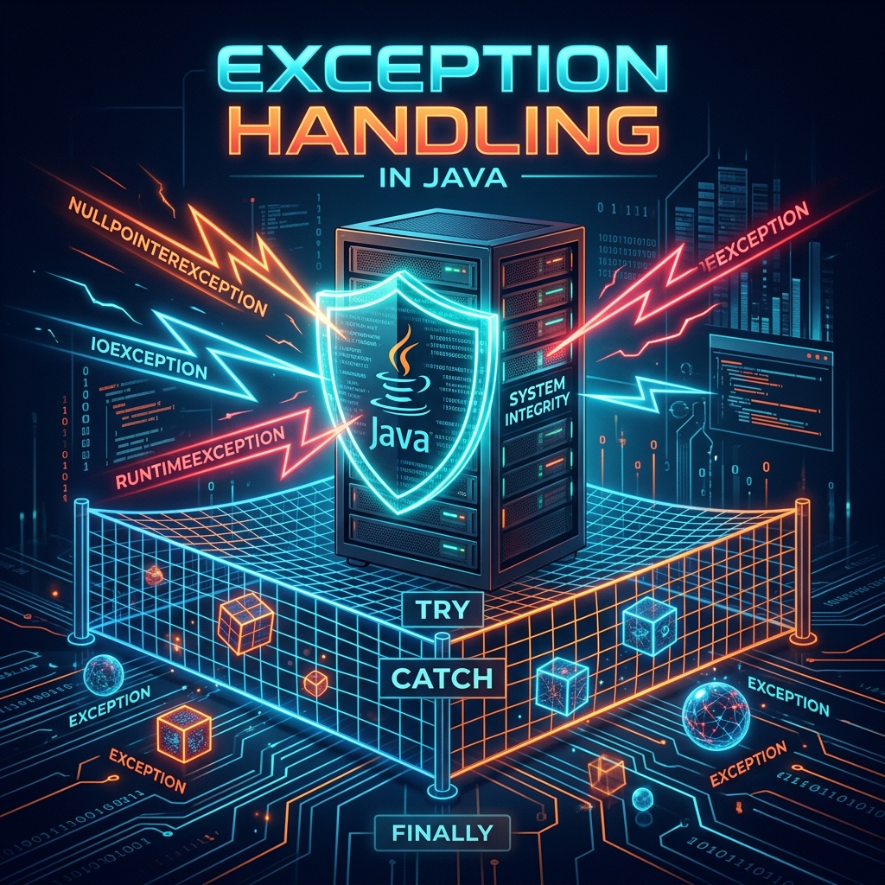
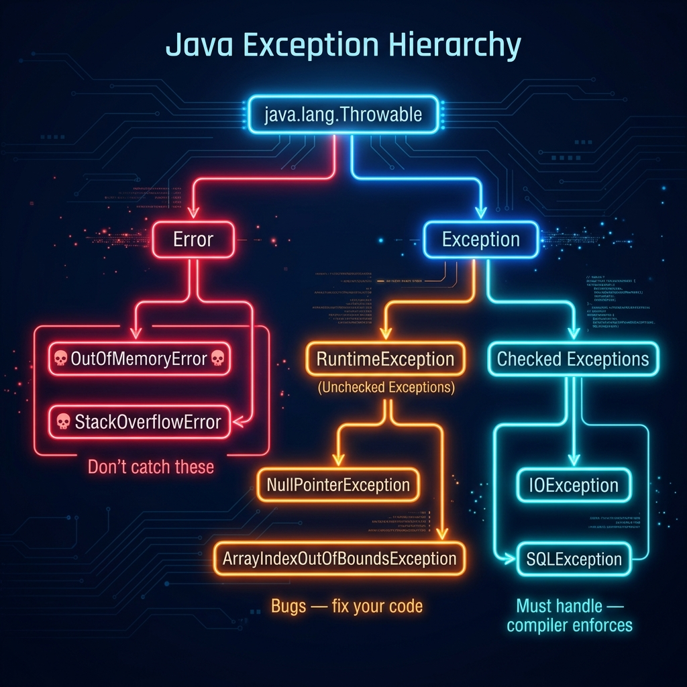
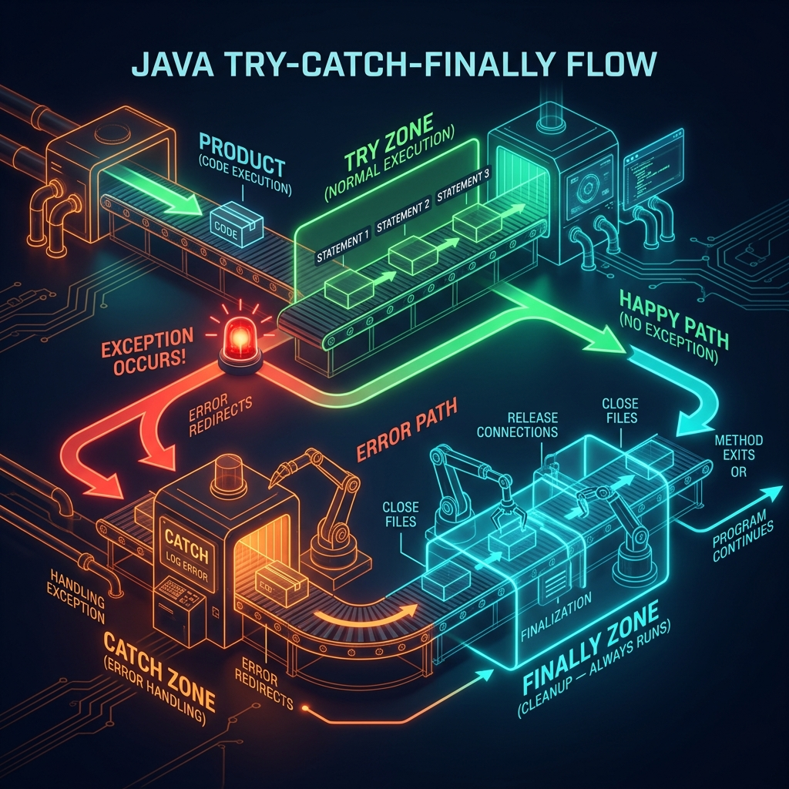

# Part 4: Exception Handling

<p align="center">

</p>

> **Sources:** *Effective Java* (Bloch, Items 69–77) · *Core Java, Vol. I* (Horstmann) · *Java: The Complete Reference* (Schildt) · *Head First Java* (Sierra, Bates, Gee)

---

## 🎯 Learning Objectives

By the end of this part, you will:
- Understand Java's exception hierarchy and the distinction between checked and unchecked exceptions
- Write correct try/catch/finally blocks and understand their execution flow
- Use try-with-resources for automatic resource management
- Create custom exception classes
- Follow Bloch's exception-handling philosophy from *Effective Java*

---

## 1. What Are Exceptions?

> **Feynman Insight:** Imagine you're a chef following a recipe. Normally, you go step by step — chop onions, heat oil, add onions to pan. But what if the stove is broken? Or the pan is missing? You can't just keep following the recipe blindly — you need to *stop*, *report the problem*, and *decide what to do*. That's exactly what exceptions do in Java. They're the language's built-in mechanism for saying "something unexpected happened, and we need to deal with it."

An exception is an **object** that represents an error condition. When something goes wrong, Java:
1. **Creates** an exception object containing information about the error
2. **Throws** it — execution stops at the point of failure
3. **Propagates** it up the call stack until someone **catches** it
4. If nobody catches it, the program **crashes**

---

## 2. The Exception Hierarchy

Understanding this hierarchy is the key to using exceptions correctly.

<p align="center">

</p>

```
java.lang.Throwable
├── java.lang.Error                    ☠️ DON'T catch these
│   ├── OutOfMemoryError
│   ├── StackOverflowError
│   └── VirtualMachineError
└── java.lang.Exception                
    ├── RuntimeException               ⚠️ Unchecked — bugs in YOUR code
    │   ├── NullPointerException
    │   ├── ArrayIndexOutOfBoundsException
    │   ├── IllegalArgumentException
    │   ├── ClassCastException
    │   └── ArithmeticException
    └── (Checked Exceptions)           ✅ MUST handle — compiler enforces
        ├── IOException
        ├── SQLException
        ├── FileNotFoundException
        └── ClassNotFoundException
```

> **Feynman Insight — The Three Categories:**
>
> 🔴 **Errors** — The building is on fire. There's nothing you can do. (`OutOfMemoryError`, `StackOverflowError`). These mean the JVM itself is in trouble. Don't try to catch them — just let the program die gracefully.
>
> 🟠 **Runtime Exceptions (Unchecked)** — You made a mistake. Fix your code. (`NullPointerException`, `ArrayIndexOutOfBounds`). These are bugs that shouldn't happen if your code is correct. The compiler doesn't force you to handle them.
>
> 🔵 **Checked Exceptions** — Something external went wrong that you should plan for. (`IOException`, `SQLException`). The file might not exist. The database might be down. The compiler *forces* you to handle these because they're foreseeable problems.

> **Bloch's Philosophy** (*Effective Java*, Item 70): *"Use checked exceptions for recoverable conditions and runtime exceptions for programming errors."*

---

## 3. Try-Catch-Finally — The Safety Net

<p align="center">

</p>

### 3.1 Basic Try-Catch

```java
try {
    int result = 10 / 0;  // ArithmeticException!
    System.out.println("This never executes");
} catch (ArithmeticException e) {
    System.out.println("Cannot divide by zero: " + e.getMessage());
}
// Program continues normally here
```

### 3.2 Multiple Catch Blocks

```java
try {
    String text = readFile("data.txt");        // Might throw IOException
    int number = Integer.parseInt(text.trim()); // Might throw NumberFormatException
    int result = 100 / number;                 // Might throw ArithmeticException
} catch (FileNotFoundException e) {
    System.out.println("File not found: " + e.getMessage());
} catch (IOException e) {
    System.out.println("Error reading file: " + e.getMessage());
} catch (NumberFormatException e) {
    System.out.println("File doesn't contain a valid number");
} catch (ArithmeticException e) {
    System.out.println("Number in file is zero — can't divide");
}
```

**Order matters!** More specific exceptions must come before more general ones:

```java
// CORRECT — specific first
try { ... }
catch (FileNotFoundException e) { ... }  // Specific subclass
catch (IOException e) { ... }            // General parent class

// COMPILE ERROR — general catches specific before it gets a chance
// try { ... }
// catch (IOException e) { ... }            // This catches FileNotFoundException too!
// catch (FileNotFoundException e) { ... }  // Unreachable — compile error!
```

### 3.3 Multi-Catch (Java 7+)

```java
try {
    // risky code
} catch (NumberFormatException | ArithmeticException e) {
    // Handle both the same way — e is effectively final
    System.out.println("Math error: " + e.getMessage());
}
```

### 3.4 The Finally Block

`finally` always executes — whether an exception was thrown or not. It's the cleanup crew.

```java
FileReader reader = null;
try {
    reader = new FileReader("data.txt");
    // process file...
} catch (IOException e) {
    System.out.println("Error: " + e.getMessage());
} finally {
    // This runs NO MATTER WHAT — even if catch throws another exception
    if (reader != null) {
        try {
            reader.close();
        } catch (IOException e) {
            // Swallowed... ugly but necessary with old-style resource management
        }
    }
}
```

> **Feynman Insight:** `finally` is like the "clean up after yourself" rule in a kitchen. Whether you cooked a perfect meal (no exception) or accidentally set something on fire (exception thrown and caught), you STILL have to wash the dishes and turn off the stove. `finally` guarantees the kitchen gets cleaned.

---

## 4. Try-With-Resources — The Modern Way

Java 7 introduced try-with-resources to eliminate the ugly finally-block pattern. Any object that implements `AutoCloseable` is automatically closed at the end of the try block.

```java
// OLD way (verbose, error-prone)
BufferedReader reader = null;
try {
    reader = new BufferedReader(new FileReader("data.txt"));
    String line = reader.readLine();
} catch (IOException e) {
    e.printStackTrace();
} finally {
    if (reader != null) {
        try { reader.close(); } catch (IOException e) { }
    }
}

// NEW way (clean, safe, automatic)
try (BufferedReader reader = new BufferedReader(new FileReader("data.txt"))) {
    String line = reader.readLine();
    System.out.println(line);
} catch (IOException e) {
    e.printStackTrace();
}
// reader is automatically closed here, even if an exception occurs!
```

> **Bloch's Rule** (*Effective Java*, Item 9): *"Prefer try-with-resources to try-finally."* It's shorter, cleaner, and produces better diagnostics. There is no reason to use the old pattern anymore.

**Multiple resources:**

```java
try (FileInputStream fis = new FileInputStream("input.txt");
     FileOutputStream fos = new FileOutputStream("output.txt");
     BufferedReader reader = new BufferedReader(new InputStreamReader(fis))) {
    // All three resources are auto-closed in reverse order
    String line;
    while ((line = reader.readLine()) != null) {
        fos.write(line.getBytes());
    }
}
```

---

## 5. Throwing Exceptions

### 5.1 Using `throw`

```java
public void setAge(int age) {
    if (age < 0) {
        throw new IllegalArgumentException("Age cannot be negative: " + age);
    }
    if (age > 150) {
        throw new IllegalArgumentException("Age unrealistic: " + age);
    }
    this.age = age;
}
```

### 5.2 Using `throws` in Method Signatures

Checked exceptions must be declared in the method signature:

```java
// This method MIGHT throw an IOException — callers must handle it
public String readFile(String path) throws IOException {
    return Files.readString(Path.of(path));
}

// Caller must either:
// Option 1: Handle it
try {
    String content = readFile("data.txt");
} catch (IOException e) {
    System.out.println("File error: " + e.getMessage());
}

// Option 2: Propagate it (pass the buck to YOUR caller)
public void processData() throws IOException {
    String content = readFile("data.txt");
    // ...
}
```

---

## 6. Custom Exceptions

### 6.1 When to Create Custom Exceptions

Bloch (*Effective Java*, Item 72) says: create custom exceptions when you need to carry domain-specific information or when standard exception classes don't adequately describe the problem.

```java
// Custom checked exception — for recoverable business logic errors
public class InsufficientFundsException extends Exception {
    private final double amount;
    private final double balance;

    public InsufficientFundsException(double amount, double balance) {
        super(String.format("Cannot withdraw %.2f — balance is only %.2f", amount, balance));
        this.amount = amount;
        this.balance = balance;
    }

    public double getAmount() { return amount; }
    public double getBalance() { return balance; }
}

// Custom unchecked exception — for programming errors
public class InvalidOrderStateException extends RuntimeException {
    public InvalidOrderStateException(String state, String attemptedAction) {
        super("Cannot " + attemptedAction + " order in state: " + state);
    }
}
```

### 6.2 Using Custom Exceptions

```java
public class BankAccount {
    private double balance;

    public void withdraw(double amount) throws InsufficientFundsException {
        if (amount > balance) {
            throw new InsufficientFundsException(amount, balance);
        }
        balance -= amount;
    }
}

// Caller handles the business-specific exception
try {
    account.withdraw(1000);
} catch (InsufficientFundsException e) {
    System.out.printf("Denied: tried to withdraw %.2f but only have %.2f%n",
                      e.getAmount(), e.getBalance());
}
```

---

## 7. Exception Chaining

When catching one exception and throwing another, preserve the original cause:

```java
try {
    // Low-level database operation
    connection.execute(query);
} catch (SQLException e) {
    // Wrap in a higher-level, more meaningful exception
    throw new DataAccessException("Failed to execute query: " + query, e);
    // The original SQLException is preserved as the "cause"
}
```

> **Bloch, Item 73:** *"Throw exceptions appropriate to the abstraction."* Low-level exceptions like `SQLException` shouldn't leak into your business logic. Wrap them in higher-level exceptions that make sense in your domain.

---

## 8. Best Practices — Bloch's Exception Rules

These rules come from Joshua Bloch's *Effective Java*, Items 69–77:

| Rule | Item | Description |
|------|------|-------------|
| Use exceptions for exceptional conditions | 69 | Never use exceptions for control flow |
| Use checked exceptions for recoverable conditions | 70 | Can the caller reasonably recover? Use checked. |
| Avoid unnecessary checked exceptions | 71 | If callers can't do anything useful, use unchecked. |
| Favor standard exceptions | 72 | `IllegalArgumentException`, `IllegalStateException`, `NullPointerException`, `UnsupportedOperationException` |
| Throw exceptions appropriate to the abstraction | 73 | Translate low-level exceptions to high-level ones |
| Document all exceptions thrown by each method | 74 | Use `@throws` Javadoc tags |
| Include failure-capture information | 75 | Exception messages should contain the values that caused the failure |
| Strive for failure atomicity | 76 | Objects should be in a consistent state even after an exception |
| Don't ignore exceptions | 77 | Empty catch blocks are almost always wrong |

```java
// TERRIBLE — ignoring exceptions (Bloch, Item 77)
try {
    riskyOperation();
} catch (Exception e) {
    // 🔥 Silently ignoring! The bug will haunt you later.
}

// CORRECT — at minimum, log it
try {
    riskyOperation();
} catch (Exception e) {
    logger.error("Operation failed", e);  // Preserves the stack trace
}

// ALSO CORRECT — if you genuinely can ignore it, document WHY
try {
    riskyOperation();
} catch (Exception ignored) {
    // Intentionally ignoring: operation is optional and failure is benign
}
```

---

## 9. Common Pitfalls

| Pitfall | Example | Fix |
|---------|---------|-----|
| Catching `Exception` too broadly | `catch (Exception e)` | Catch specific types |
| Empty catch blocks | `catch (IOException e) { }` | Log or rethrow |
| Using exceptions for control flow | Throwing to break loops | Use `return`, `break` |
| Losing stack trace | `throw new RuntimeException(msg)` | `throw new RuntimeException(msg, cause)` |
| Not using try-with-resources | Manual `finally` close | Use try-with-resources |
| Catching `Throwable` | Catching OOM, SOF | Only catch `Exception` subclasses |

---

## 10. Exercises

1. **File Reader:** Write a method that reads a file and returns its contents. Handle `FileNotFoundException` and `IOException` separately with meaningful messages.
2. **Custom Exception:** Create an `AgeValidationException` with fields for the invalid age and the valid range. Use it in a `Person` class.
3. **Try-With-Resources:** Open two files, read from one and write to the other, using try-with-resources. Ensure both are closed even if writing fails.
4. **Exception Translation:** Wrap a `NumberFormatException` in a custom `InvalidInputException` while preserving the original cause chain.
5. **Retry Logic:** Write a method that attempts an operation up to 3 times, catching exceptions on each attempt, and only throwing after all retries are exhausted.

---

## 📖 References

- *Effective Java*, Joshua Bloch — Items 9 (try-with-resources), 69–77 (all exception items)
- *Core Java, Volume I — Fundamentals*, Cay S. Horstmann — Chapter 7 (Exceptions, Assertions, Logging)
- *Java: The Complete Reference*, Herbert Schildt — Chapter 10 (Exception Handling)
- *Head First Java*, Kathy Sierra, Bert Bates — Chapter 11 (Risky Behavior)

---

[← Part 3: Core APIs](Part-03-Core-APIs.md) | [Back to Course Index](../README.md) | [Next: Part 5 — Generics & Type Safety →](Part-05-Generics-And-Type-Safety.md)
