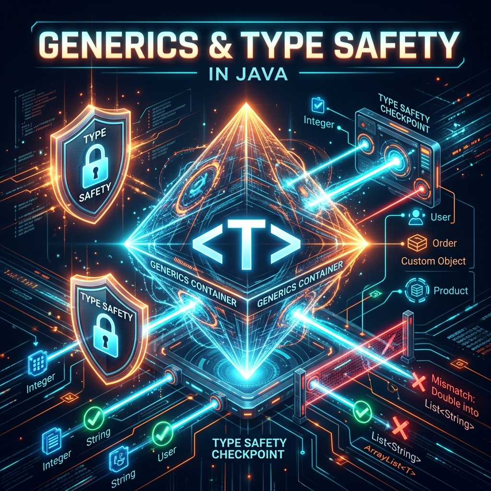
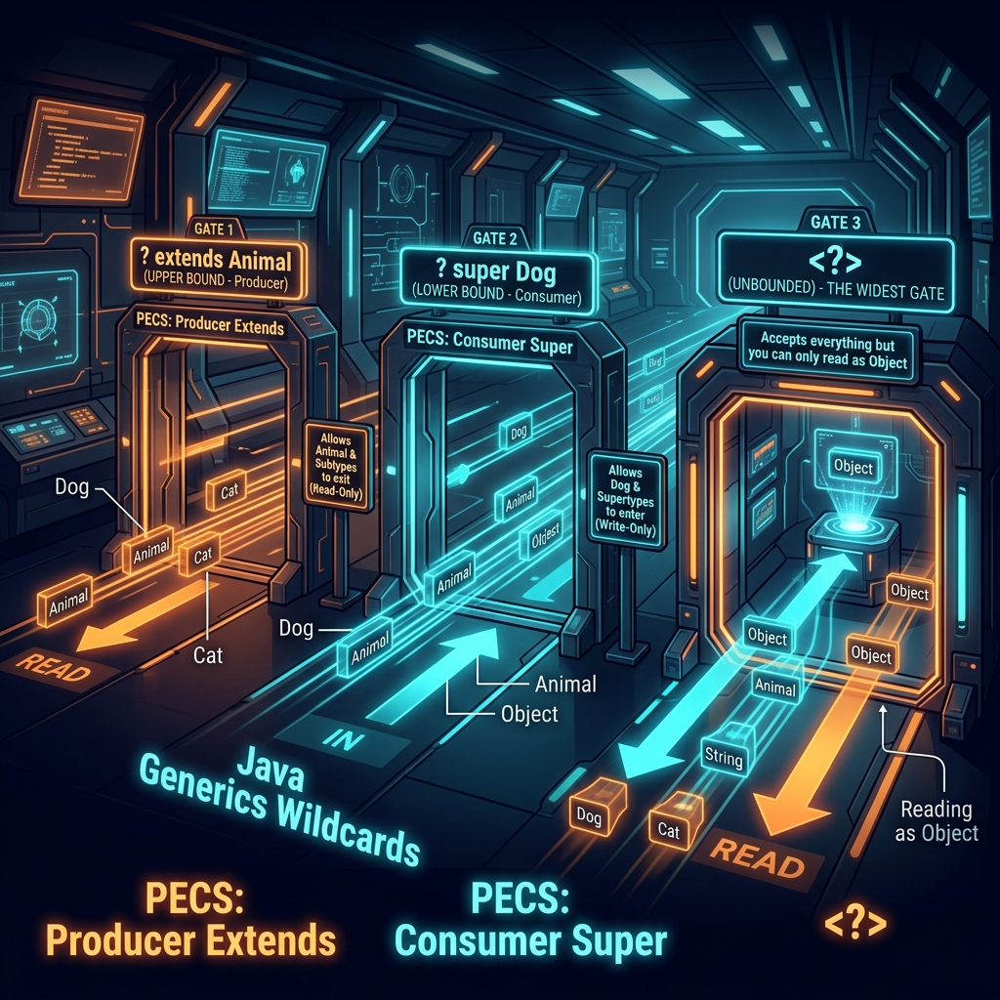
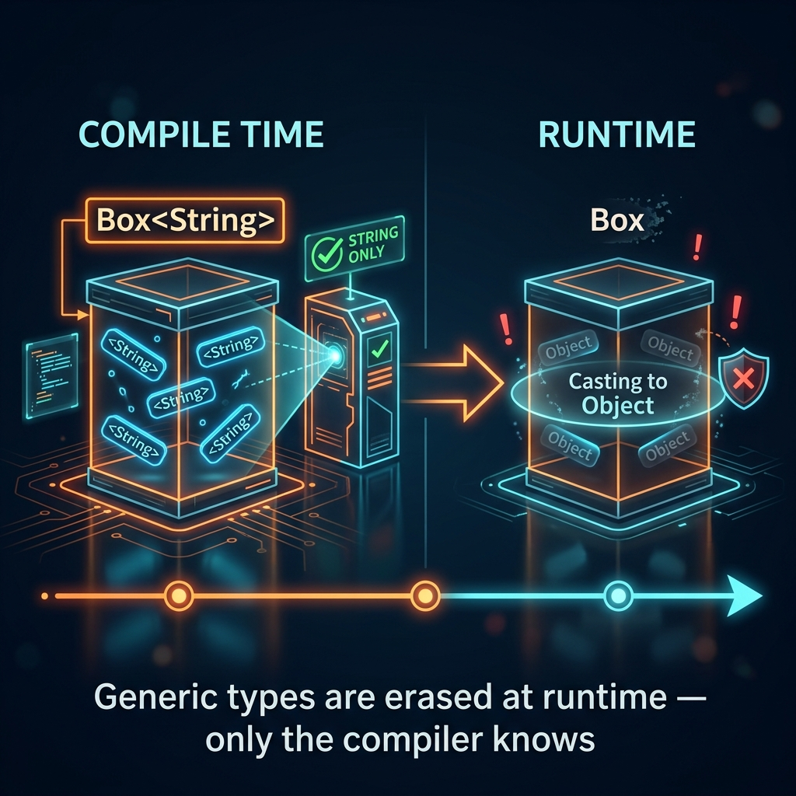

# Part 5: Generics & Type Safety

<p align="center">

</p>

> **Sources:** *Effective Java* (Bloch, Items 26–33) · *Core Java, Vol. I* (Horstmann) · *Java: The Complete Reference* (Schildt) · *Modern Java in Action* (Urma, Fusco)

---

## 🎯 Learning Objectives

By the end of this part, you will:
- Understand what generics are and why they exist
- Create generic classes, methods, and interfaces
- Master wildcards and bounded type parameters
- Understand type erasure and its implications
- Apply Bloch's PECS principle (Producer Extends, Consumer Super)

---

## 1. Why Generics?

### 1.1 Life Before Generics — The Dark Ages

Before Java 5 introduced generics, collections were untyped bags that could hold anything:

```java
// Pre-generics: a List is a bag of "Objects" — no type safety
List names = new ArrayList();
names.add("Alice");
names.add("Bob");
names.add(42);        // Compiles fine! But this is a bug waiting to happen.

// When you retrieve, you must cast — and hope for the best
String first = (String) names.get(0);  // OK
String third = (String) names.get(2);  // ClassCastException at RUNTIME!
```

> **Feynman Insight:** Imagine a filing cabinet with no labels. You can put anything in any drawer — letters, photos, bricks, live snakes. When you open a drawer expecting a letter, you might grab a snake. That's what pre-generics collections felt like. **Generics are the labels.** A `List<String>` is a drawer labeled "STRINGS ONLY" — the compiler acts as a secretary who refuses to let you put a brick in there.

### 1.2 With Generics — Compile-Time Safety

```java
List<String> names = new ArrayList<>();   // Only Strings allowed!
names.add("Alice");
names.add("Bob");
// names.add(42);    // COMPILE ERROR — caught immediately, not at runtime

String first = names.get(0);  // No cast needed — compiler knows it's a String
```

> **Bloch's Rule** (*Effective Java*, Item 26): *"Don't use raw types."* If you use `List` instead of `List<String>`, you lose all the safety guarantees that generics provide.

---

## 2. Generic Classes

### 2.1 Creating a Generic Class

```java
public class Box<T> {        // T is the "type parameter" — a placeholder
    private T content;

    public Box(T content) {
        this.content = content;
    }

    public T getContent() {
        return content;
    }

    public void setContent(T content) {
        this.content = content;
    }
}
```

**Using it:**

```java
Box<String> stringBox = new Box<>("Hello");
String value = stringBox.getContent();    // No cast needed!

Box<Integer> intBox = new Box<>(42);
int number = intBox.getContent();         // Auto-unboxing

Box<List<String>> nestedBox = new Box<>(List.of("a", "b", "c"));
```

> **Feynman Insight:** `Box<T>` is like a custom-made container. When you order `Box<String>`, the factory builds a container specifically designed for strings — with a string-shaped opening that rejects anything else. `T` is not a real type — it's a mold that gets stamped with the real type (`String`, `Integer`, etc.) when you create the box.

### 2.2 Multiple Type Parameters

```java
public class Pair<K, V> {
    private final K key;
    private final V value;

    public Pair(K key, V value) {
        this.key = key;
        this.value = value;
    }

    public K getKey() { return key; }
    public V getValue() { return value; }
}

Pair<String, Integer> nameAge = new Pair<>("Alice", 30);
Pair<Integer, List<String>> complex = new Pair<>(1, List.of("a", "b"));
```

### 2.3 Naming Conventions

| Letter | Convention | Example |
|--------|-----------|---------|
| `T` | Type | `Box<T>` |
| `E` | Element | `List<E>` |
| `K` | Key | `Map<K, V>` |
| `V` | Value | `Map<K, V>` |
| `N` | Number | `Calculator<N>` |
| `S, U` | 2nd, 3rd types | `Function<T, R>` |

---

## 3. Generic Methods

```java
public class Util {
    // Generic method — the <T> before return type declares the type parameter
    public static <T> T firstOrDefault(List<T> list, T defaultValue) {
        return list.isEmpty() ? defaultValue : list.get(0);
    }

    // Multiple type parameters
    public static <K, V> Map<K, V> mapOf(K key, V value) {
        Map<K, V> map = new HashMap<>();
        map.put(key, value);
        return map;
    }
}

// Usage — type is inferred from arguments
String name = Util.firstOrDefault(List.of("Alice", "Bob"), "Unknown");
int number = Util.firstOrDefault(List.of(1, 2, 3), 0);
Map<String, Integer> map = Util.mapOf("Alice", 30);
```

---

## 4. Bounded Type Parameters

### 4.1 Upper Bounds — `extends`

"T must be a Number or more specific":

```java
// Only accepts Number and its subclasses (Integer, Double, Long...)
public static <T extends Number> double sum(List<T> numbers) {
    double total = 0;
    for (T num : numbers) {
        total += num.doubleValue();  // We can call Number methods because T IS a Number
    }
    return total;
}

sum(List.of(1, 2, 3));        // OK — Integer extends Number
sum(List.of(1.5, 2.5, 3.5));  // OK — Double extends Number
// sum(List.of("a", "b"));    // COMPILE ERROR — String doesn't extend Number
```

### 4.2 Multiple Bounds

```java
// T must be both Comparable AND Serializable
public static <T extends Comparable<T> & Serializable> T max(T a, T b) {
    return a.compareTo(b) >= 0 ? a : b;
}
```

> **Rule:** You can have at most one class bound (and it must come first), followed by any number of interface bounds.

---

## 5. Wildcards — The Flexibility Tool

Wildcards (`?`) let you write methods that work with a *family* of generic types, not just one specific type.

<p align="center">

</p>

### 5.1 Unbounded Wildcard: `<?>`

"I accept any type, but I can only read as Object":

```java
public static void printAll(List<?> list) {
    for (Object item : list) {
        System.out.println(item);
    }
    // list.add("hello");  // COMPILE ERROR — can't add to List<?>
}

printAll(List.of("Alice", "Bob"));
printAll(List.of(1, 2, 3));
```

### 5.2 Upper Bounded: `? extends T` (Producer)

"I accept T or any of its subtypes" — you can **read** from it but not **write**:

```java
public static double sumOfList(List<? extends Number> numbers) {
    double sum = 0;
    for (Number n : numbers) {   // Safe to read as Number
        sum += n.doubleValue();
    }
    // numbers.add(42);  // COMPILE ERROR — can't add! What if it's List<Double>?
    return sum;
}

sumOfList(List.of(1, 2, 3));       // List<Integer> — OK
sumOfList(List.of(1.5, 2.5));      // List<Double> — OK
```

### 5.3 Lower Bounded: `? super T` (Consumer)

"I accept T or any of its supertypes" — you can **write** T into it but only **read** as Object:

```java
public static void addNumbers(List<? super Integer> list) {
    list.add(1);    // Safe to add Integer — list accepts Integer or wider
    list.add(2);
    list.add(3);

    // Integer n = list.get(0);  // COMPILE ERROR — might return Object or Number
    Object obj = list.get(0);    // Only safe read is as Object
}

addNumbers(new ArrayList<Integer>());  // OK
addNumbers(new ArrayList<Number>());   // OK — Number is a super of Integer
addNumbers(new ArrayList<Object>());   // OK — Object is a super of Integer
```

### 5.4 PECS — The Master Rule

> **Bloch's PECS Principle** (*Effective Java*, Item 31): **Producer Extends, Consumer Super.**
>
> - If the collection **produces** values (you read FROM it) → use `? extends T`
> - If the collection **consumes** values (you write TO it) → use `? super T`
> - If it both produces and consumes → use exact type `T`

```java
// Producer (extends) — reads from src
// Consumer (super) — writes to dst
public static <T> void copy(List<? extends T> src, List<? super T> dst) {
    for (T item : src) {       // Read from producer
        dst.add(item);         // Write to consumer
    }
}
```

> **Feynman Insight — PECS as a mailroom:** Think of `? extends Animal` as a mailroom that only **sends out** packages. You know every package contains an Animal (or a subtype), so you can safely read them as Animals. But you can't put packages IN because you don't know what specific type the mailroom expects. `? super Dog` is a mailroom that only **receives** packages. You can safely put Dogs in, because it accepts Dogs and everything broader. But you can't read specific types out because you don't know what's actually in there.

---

## 6. Type Erasure — Java's Compromise

<p align="center">

</p>

Generics in Java are a **compile-time** feature. At runtime, all generic type information is **erased**. This was a deliberate design choice for backward compatibility with pre-Java 5 code.

```java
// What you write:
List<String> strings = new ArrayList<>();
strings.add("Hello");
String s = strings.get(0);

// What the compiler generates (after erasure):
List strings = new ArrayList();
strings.add("Hello");
String s = (String) strings.get(0);  // Compiler inserts the cast for you
```

> **Feynman Insight:** Type erasure is like an airport security check. At the security gate (compile time), your bag is thoroughly inspected — only approved items (correct types) are allowed through. But once you're past security (runtime), nobody checks bags anymore. The airport trusts that security did its job. The downside? You can't inspect bags again later.

### 6.1 Consequences of Type Erasure

```java
// 1. Cannot use instanceof with generic types
// if (list instanceof List<String>) { }  // COMPILE ERROR

// 2. Cannot create arrays of generic types
// T[] array = new T[10];  // COMPILE ERROR

// 3. Cannot create instances of type parameters
// T obj = new T();  // COMPILE ERROR

// 4. Two methods with same erasure cannot coexist
// void process(List<String> list) { }
// void process(List<Integer> list) { }  // COMPILE ERROR — both erase to process(List)
```

---

## 7. Generic Interfaces

```java
public interface Repository<T, ID> {
    T findById(ID id);
    List<T> findAll();
    void save(T entity);
    void delete(T entity);
}

// Implementing with concrete types
public class UserRepository implements Repository<User, Long> {
    @Override
    public User findById(Long id) { /* ... */ return null; }

    @Override
    public List<User> findAll() { /* ... */ return List.of(); }

    @Override
    public void save(User entity) { /* ... */ }

    @Override
    public void delete(User entity) { /* ... */ }
}
```

---

## 8. Best Practices

1. **Never use raw types** — `List<String>` not `List` (Bloch, Item 26)
2. **Eliminate unchecked warnings** — use `@SuppressWarnings("unchecked")` only when you can prove it's safe (Bloch, Item 27)
3. **Prefer lists to arrays** for generic code — arrays are covariant and reified; generics are invariant and erased (Bloch, Item 28)
4. **Favor generic types and methods** — write `Stack<E>` not `Stack` with casts (Bloch, Items 29–30)
5. **Use PECS** for maximum flexibility (Bloch, Item 31)
6. **Use type inference** — `new ArrayList<>()` instead of `new ArrayList<String>()`
7. **Prefer `? extends T` in method parameters** — makes your API more flexible

---

## 9. Exercises

1. **Generic Stack:** Implement a `Stack<T>` class with `push()`, `pop()`, `peek()`, and `isEmpty()` using an internal array.
2. **Generic Pair:** Create a `Pair<L, R>` class with `getLeft()` and `getRight()`. Write a method `swap()` that returns a new `Pair<R, L>`.
3. **Bounded Method:** Write a generic `max()` method that finds the largest element in a `List<T extends Comparable<T>>`.
4. **PECS Practice:** Write a `merge()` method that takes two `List<? extends Comparable<? super T>>` and returns a sorted `List<T>`.
5. **Generic Repository:** Create a generic CRUD `Repository<T, ID>` interface and implement it for a `Product` entity.

---

## 📖 References

- *Effective Java*, Joshua Bloch — Items 26–33 (Generics)
- *Core Java, Volume I — Fundamentals*, Cay S. Horstmann — Chapter 8 (Generic Programming)
- *Java: The Complete Reference*, Herbert Schildt — Chapter 14 (Generics)
- *Modern Java in Action*, Urma/Fusco — Chapter 8 (Collection API Enhancements)

---

[← Part 4: Exception Handling](Part-04-Exception-Handling.md) | [Back to Course Index](../README.md) | [Next: Part 6 — Lambda Expressions →](Part-06-Lambda-Expressions.md)
