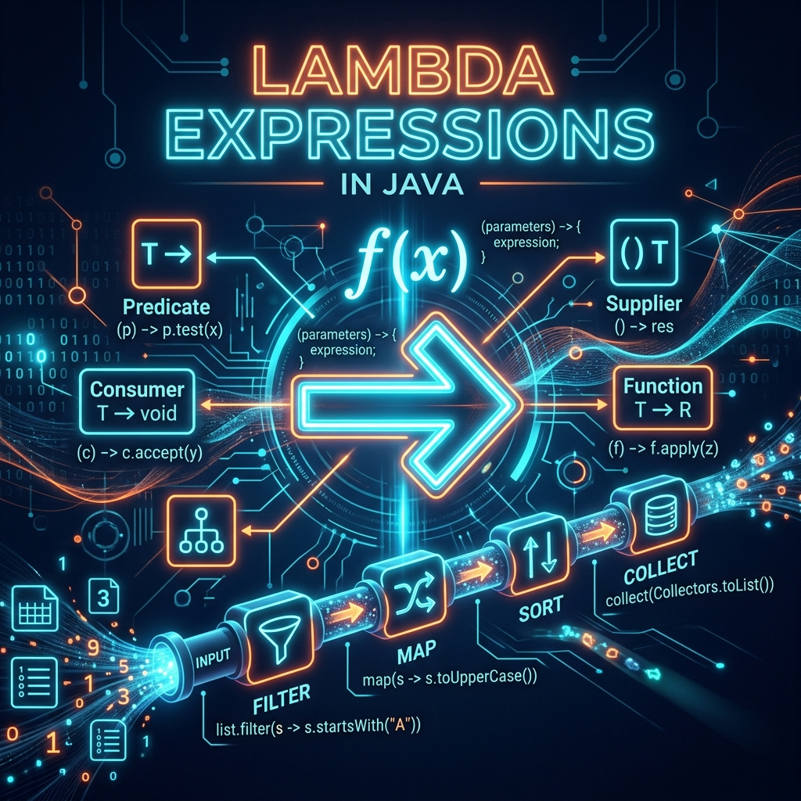
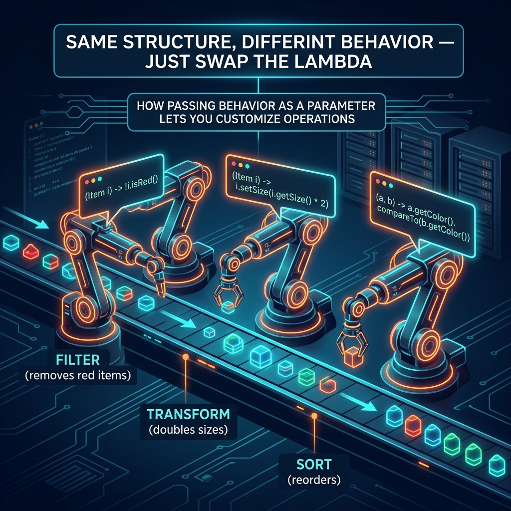

# Part 6: Lambda Expressions

<p align="center">

</p>

> **Sources:** *Modern Java in Action* (Urma, Fusco) · *Effective Java* (Bloch, Items 42–44) · *Core Java, Vol. I* (Horstmann) · *Java: The Complete Reference* (Schildt)

---

## 🎯 Learning Objectives

By the end of this part, you will:
- Understand what lambda expressions are and why they revolutionized Java
- Master functional interfaces and the key types in `java.util.function`
- Use method references as shorthand for lambdas
- Apply behavioral parameterization to write flexible, reusable code
- Compose functions using `andThen()`, `compose()`, and predicate chaining

---

## 1. The Big Idea — Behavioral Parameterization

### 1.1 The Problem: Code Duplication

Urma and Fusco (*Modern Java in Action*) open with a brilliant example. Imagine you're filtering apples:

```java
// Version 1: Filter green apples
public static List<Apple> filterGreenApples(List<Apple> apples) {
    List<Apple> result = new ArrayList<>();
    for (Apple apple : apples) {
        if ("green".equals(apple.getColor())) {
            result.add(apple);
        }
    }
    return result;
}

// Version 2: Filter heavy apples — almost identical code!
public static List<Apple> filterHeavyApples(List<Apple> apples) {
    List<Apple> result = new ArrayList<>();
    for (Apple apple : apples) {
        if (apple.getWeight() > 150) {  // Only this line changed!
            result.add(apple);
        }
    }
    return result;
}
```

90% of the code is identical. The only thing that changes is the **condition**. What if we could pass the condition as a parameter?

<p align="center">

</p>

### 1.2 The Solution: Pass Behavior as a Parameter

> **Feynman Insight:** Before lambdas, Java could only pass *data* as parameters — numbers, strings, objects. But often, what you want to pass is *behavior* — "filter using this rule" or "sort using this comparison." Lambdas let you treat a block of code like a value that can be passed around, stored in variables, and given to methods. It's like giving someone a recipe card instead of cooking the meal yourself.

```java
// With lambdas — ONE method, infinite behaviors:
List<Apple> greenApples = filter(apples, apple -> "green".equals(apple.getColor()));
List<Apple> heavyApples = filter(apples, apple -> apple.getWeight() > 150);
List<Apple> redAndHeavy = filter(apples, apple -> "red".equals(apple.getColor()) && apple.getWeight() > 150);
```

---

## 2. Lambda Syntax

A lambda expression is an anonymous function — a block of code you can pass around:

```java
// Full syntax
(parameters) -> { statement; statement; return result; }

// Simplified forms
(Apple a) -> a.getWeight() > 150                   // Type declared
a -> a.getWeight() > 150                            // Type inferred (single param)
() -> System.out.println("Hello")                   // No parameters
(a, b) -> a.compareTo(b)                           // Multiple parameters
(String s) -> { System.out.println(s); return s.length(); }  // Multi-line body
```

**Simplification rules:**
1. If there's only **one parameter**, you can drop the parentheses: `a -> a.length()`
2. If the body is a **single expression**, you can drop the braces and `return`: `a -> a.length()`
3. **Type inference** — the compiler usually figures out parameter types: `(a, b) -> a + b`

---

## 3. Functional Interfaces

A functional interface is any interface with exactly **one abstract method**. Lambdas are the implementation of that one method.

### 3.1 The Core Four

Urma (*Modern Java in Action*) calls these the "essential toolkit":

| Interface | Signature | Description | Example |
|-----------|-----------|-------------|---------|
| `Predicate<T>` | `T → boolean` | Tests a condition | `s -> s.isEmpty()` |
| `Function<T,R>` | `T → R` | Transforms | `s -> s.length()` |
| `Consumer<T>` | `T → void` | Performs action | `s -> System.out.println(s)` |
| `Supplier<T>` | `() → T` | Produces value | `() -> new ArrayList<>()` |

```java
// Predicate — answers yes/no
Predicate<String> isLong = s -> s.length() > 10;
boolean result = isLong.test("Hello, World!");  // true

// Function — transforms
Function<String, Integer> toLength = String::length;
int len = toLength.apply("Hello");  // 5

// Consumer — performs side effects
Consumer<String> printer = System.out::println;
printer.accept("Hello!");  // prints "Hello!"

// Supplier — produces from nothing
Supplier<List<String>> listMaker = ArrayList::new;
List<String> newList = listMaker.get();
```

### 3.2 Specialized Variants

```java
// BiFunction — two inputs
BiFunction<String, String, String> concat = (a, b) -> a + " " + b;
concat.apply("Hello", "World");  // "Hello World"

// BiPredicate — two-input test
BiPredicate<String, Integer> hasLength = (s, len) -> s.length() == len;
hasLength.test("Hello", 5);  // true

// UnaryOperator — same input and output type
UnaryOperator<String> toUpper = String::toUpperCase;
toUpper.apply("hello");  // "HELLO"

// BinaryOperator — two same-type inputs, same-type output
BinaryOperator<Integer> add = Integer::sum;
add.apply(3, 4);  // 7
```

> **Bloch, Item 44:** *"Favor the use of standard functional interfaces."* Don't create your own `StringPredicate` when `Predicate<String>` already exists.

---

## 4. Method References

Method references are shorthand for lambdas that simply call an existing method:

```java
// Lambda                         →  Method Reference
s -> s.toUpperCase()              →  String::toUpperCase
s -> System.out.println(s)        →  System.out::println
s -> Integer.parseInt(s)          →  Integer::parseInt
() -> new ArrayList<>()           →  ArrayList::new
(a, b) -> a.compareTo(b)         →  String::compareTo
```

**Four kinds of method references:**

| Kind | Syntax | Lambda Equivalent |
|------|--------|-------------------|
| Static method | `Integer::parseInt` | `s -> Integer.parseInt(s)` |
| Instance method (bound) | `System.out::println` | `s -> System.out.println(s)` |
| Instance method (unbound) | `String::toUpperCase` | `s -> s.toUpperCase()` |
| Constructor | `ArrayList::new` | `() -> new ArrayList<>()` |

> **Bloch, Item 43:** *"Prefer method references to lambdas."* They're more concise and self-documenting — `String::toUpperCase` immediately tells you what's happening, while `s -> s.toUpperCase()` requires reading a lambda.

---

## 5. Function Composition

Lambdas can be **chained** together:

### 5.1 Predicate Composition

```java
Predicate<String> isLong = s -> s.length() > 5;
Predicate<String> startsWithA = s -> s.startsWith("A");

Predicate<String> isLongAndStartsWithA = isLong.and(startsWithA);
Predicate<String> isLongOrStartsWithA = isLong.or(startsWithA);
Predicate<String> isShort = isLong.negate();

isLongAndStartsWithA.test("Algorithm");  // true
isShort.test("Hi");                       // true
```

### 5.2 Function Composition

```java
Function<String, String> toUpper = String::toUpperCase;
Function<String, String> addExclaim = s -> s + "!";

// andThen: apply first, THEN second
Function<String, String> shout = toUpper.andThen(addExclaim);
shout.apply("hello");  // "HELLO!"

// compose: apply second FIRST, then first
Function<String, String> exclaim = toUpper.compose(addExclaim);
exclaim.apply("hello");  // "HELLO!"  (addExclaim first → "hello!" → toUpper → "HELLO!")
```

> **Feynman Insight:** Function composition is like an assembly line. `andThen` means "do this step, THEN do the next step." `compose` means "do the other step FIRST, then run the result through me." It's the difference between "cook, then plate" vs. "plate first, then cook" (which makes less sense with food, but is useful in math!).

---

## 6. Comparator Composition

One of the most powerful uses of lambdas — building complex sorting logic:

```java
List<Person> people = List.of(
    new Person("Alice", 30),
    new Person("Bob", 25),
    new Person("Charlie", 30),
    new Person("Alice", 28)
);

// Sort by age
people.sort(Comparator.comparing(Person::getAge));

// Sort by age, then by name for ties
people.sort(Comparator
    .comparing(Person::getAge)
    .thenComparing(Person::getName));

// Sort by age descending, then by name ascending
people.sort(Comparator
    .comparing(Person::getAge).reversed()
    .thenComparing(Person::getName));

// Null-safe sorting
people.sort(Comparator.comparing(Person::getName,
    Comparator.nullsLast(Comparator.naturalOrder())));
```

---

## 7. Closures and Variable Capture

Lambdas can capture variables from their enclosing scope — but with a restriction:

```java
int multiplier = 3;  // effectively final
Function<Integer, Integer> multiply = x -> x * multiplier;
multiply.apply(5);  // 15

// multiplier = 4;  // COMPILE ERROR — captured variables must be effectively final
```

> **Feynman Insight:** When a lambda captures a variable, it takes a *snapshot* of that variable's value — like taking a photo. If you could change the original variable after the lambda captured it, the photo and reality would disagree, causing confusion. Java prevents this by requiring captured variables to be "effectively final" (never changed after assignment).

---

## 8. Best Practices

1. **Prefer lambdas to anonymous classes** for functional interfaces (Bloch, Item 42)
2. **Prefer method references to lambdas** when they're clearer (Bloch, Item 43)
3. **Use standard functional interfaces** from `java.util.function` (Bloch, Item 44)
4. **Keep lambdas short** — if it's more than 3 lines, extract it to a method
5. **Use descriptive variable names** — `Predicate<String> isActive` not `Predicate<String> p`
6. **Avoid side effects in lambdas** — pure functions are easier to reason about

---

## 9. Exercises

1. **Filter and Sort:** Given a list of strings, use lambdas to filter strings longer than 3 characters, sort alphabetically, and convert to uppercase.
2. **Custom Comparator:** Sort a list of products first by price ascending, then by name alphabetically.
3. **Function Pipeline:** Create a chain of `Function<String, String>` operations: trim → lowercase → replace spaces with hyphens.
4. **Predicate Builder:** Write a method that takes multiple `Predicate<T>` instances and combines them with AND logic.

---

## 📖 References

- *Modern Java in Action*, Urma, Fusco — Chapters 1–3 (Lambdas, Behavioral Parameterization)
- *Effective Java*, Joshua Bloch — Items 42–44 (Lambdas and Method References)
- *Core Java, Volume I*, Cay S. Horstmann — Chapter 6 (Lambda Expressions)
- *Java: The Complete Reference*, Herbert Schildt — Chapter 15 (Lambda Expressions)

---

[← Part 5: Generics & Type Safety](Part-05-Generics-And-Type-Safety.md) | [Back to Course Index](../README.md) | [Next: Part 7 — Streams API →](Part-07-Streams-API.md)
