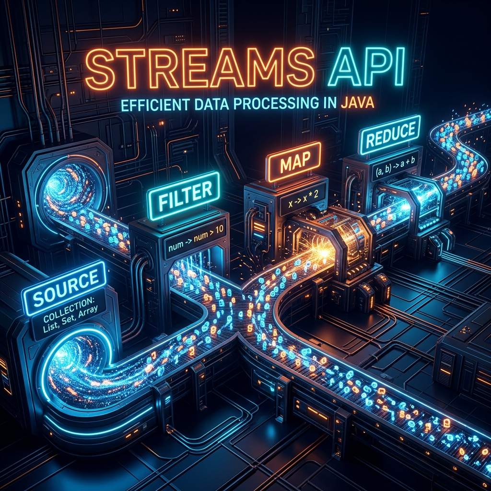
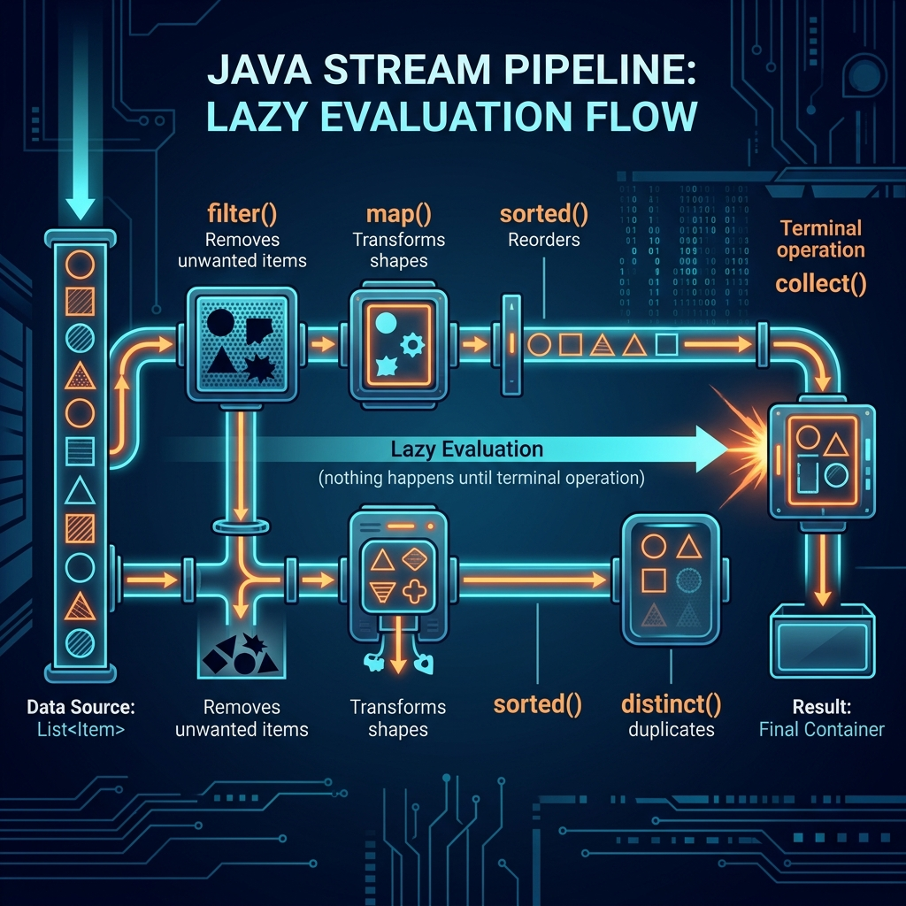

# Part 7: Streams API

<p align="center">

</p>

> **Sources:** *Modern Java in Action* (Urma, Fusco) · *Effective Java* (Bloch, Items 45–48) · *Core Java, Vol. I* (Horstmann) · *Java: The Complete Reference* (Schildt)

---

## 🎯 Learning Objectives

By the end of this part, you will:
- Understand the stream pipeline architecture (source → intermediate → terminal)
- Master core operations: filter, map, flatMap, reduce, collect
- Write powerful data processing pipelines in a declarative style
- Use Collectors for grouping, partitioning, and summarizing data
- Understand parallel streams — when to use them and when they hurt performance

---

## 1. What Is a Stream?

> **Feynman Insight:** A Stream is like an assembly line in a factory. Raw materials (data) enter on one end, pass through processing stations (filter, map, sort), and finished products come out the other end. The key insight is that **you describe WHAT you want**, not HOW to do it. You say "filter the red apples, sort by weight, return the top 3" — and the stream figures out the mechanics.

A Stream is **not** a data structure. It doesn't store data. It's a **pipeline** for processing data from a source.

<p align="center">

</p>

### 1.1 Stream vs Collection

| Feature | Collection | Stream |
|---------|-----------|--------|
| Purpose | Store data | Process data |
| Iteration | External (you write the loop) | Internal (stream manages it) |
| Traversal | Can traverse multiple times | Can traverse **only once** |
| Lazy? | No — all elements exist | Yes — computed on demand |
| Modifies source? | Yes | **No** — produces new results |

```java
// Collection way — HOW to do it (imperative)
List<String> result = new ArrayList<>();
for (String name : names) {
    if (name.startsWith("A")) {
        result.add(name.toUpperCase());
    }
}
Collections.sort(result);

// Stream way — WHAT to do (declarative)
List<String> result = names.stream()
    .filter(name -> name.startsWith("A"))
    .map(String::toUpperCase)
    .sorted()
    .collect(Collectors.toList());
```

---

## 2. Creating Streams

```java
// From a Collection
List<String> names = List.of("Alice", "Bob", "Charlie");
Stream<String> stream = names.stream();

// From values
Stream<String> stream = Stream.of("Alice", "Bob", "Charlie");

// From an array
int[] numbers = {1, 2, 3, 4, 5};
IntStream intStream = Arrays.stream(numbers);

// Infinite streams
Stream<Integer> infiniteOdds = Stream.iterate(1, n -> n + 2);  // 1, 3, 5, 7, ...
Stream<Double> randoms = Stream.generate(Math::random);          // random, random, ...

// Range
IntStream range = IntStream.range(1, 10);      // 1 to 9
IntStream rangeClosed = IntStream.rangeClosed(1, 10);  // 1 to 10

// From files
Stream<String> lines = Files.lines(Path.of("data.txt"));
```

---

## 3. Intermediate Operations (Lazy)

These operations are **lazy** — they don't execute until a terminal operation triggers them. They return a new Stream.

### 3.1 filter — Keep What Matches

```java
List<Integer> evens = numbers.stream()
    .filter(n -> n % 2 == 0)
    .collect(Collectors.toList());
```

### 3.2 map — Transform Each Element

```java
List<String> upperNames = names.stream()
    .map(String::toUpperCase)
    .collect(Collectors.toList());

List<Integer> nameLengths = names.stream()
    .map(String::length)
    .collect(Collectors.toList());
```

### 3.3 flatMap — Flatten Nested Structures

> **Feynman Insight:** `map` wraps each element in a new stream. If your elements are themselves collections, you get a "stream of streams" — like a box of boxes. `flatMap` opens all the inner boxes and spreads their contents into one flat stream.

```java
List<List<String>> nestedNames = List.of(
    List.of("Alice", "Bob"),
    List.of("Charlie", "Diana"),
    List.of("Eve")
);

// map would give: Stream<List<String>> — not what we want!
// flatMap gives: Stream<String> — perfect!
List<String> allNames = nestedNames.stream()
    .flatMap(Collection::stream)    // Flatten each inner list
    .collect(Collectors.toList());
// ["Alice", "Bob", "Charlie", "Diana", "Eve"]
```

### 3.4 Other Intermediate Operations

```java
stream.distinct()                          // Remove duplicates
stream.sorted()                            // Natural order
stream.sorted(Comparator.reverseOrder())   // Custom order
stream.peek(System.out::println)           // Debug — see elements as they pass
stream.limit(5)                            // Take first 5
stream.skip(3)                             // Skip first 3
stream.takeWhile(n -> n < 10)              // Take while condition holds (Java 9+)
stream.dropWhile(n -> n < 10)              // Skip while condition holds (Java 9+)
```

---

## 4. Terminal Operations (Eager)

These trigger the pipeline and produce a result. Once a terminal operation runs, the stream is consumed.

### 4.1 collect — Gather Results

```java
// To List
List<String> list = stream.collect(Collectors.toList());
List<String> list = stream.toList();  // Java 16+ (unmodifiable)

// To Set
Set<String> set = stream.collect(Collectors.toSet());

// To Map
Map<String, Integer> nameToAge = people.stream()
    .collect(Collectors.toMap(Person::getName, Person::getAge));

// Joining strings
String csv = names.stream().collect(Collectors.joining(", "));  // "Alice, Bob, Charlie"
```

### 4.2 reduce — Combine All Elements

> **Feynman Insight:** `reduce` is like a snowball rolling downhill. It starts with an initial value (identity), picks up each element, and combines them using a function. By the time it reaches the bottom, all elements have been combined into one result.

```java
// Sum
int sum = numbers.stream().reduce(0, Integer::sum);

// Product
int product = numbers.stream().reduce(1, (a, b) -> a * b);

// Max (returns Optional because list might be empty)
Optional<Integer> max = numbers.stream().reduce(Integer::max);

// String concatenation
String combined = words.stream().reduce("", (a, b) -> a + " " + b);
```

### 4.3 Other Terminal Operations

```java
stream.forEach(System.out::println);   // Perform action on each
stream.count();                        // Count elements
stream.min(Comparator.naturalOrder()); // Find minimum (returns Optional)
stream.max(Comparator.naturalOrder()); // Find maximum (returns Optional)
stream.findFirst();                    // First element (Optional)
stream.findAny();                      // Any element (Optional) — useful in parallel
stream.anyMatch(n -> n > 10);          // true if ANY match
stream.allMatch(n -> n > 0);           // true if ALL match
stream.noneMatch(n -> n < 0);          // true if NONE match
stream.toArray();                      // Convert to array
```

---

## 5. Collectors — The Power Tools

### 5.1 Grouping

```java
// Group people by city
Map<String, List<Person>> byCity = people.stream()
    .collect(Collectors.groupingBy(Person::getCity));

// Group and count
Map<String, Long> countByCity = people.stream()
    .collect(Collectors.groupingBy(Person::getCity, Collectors.counting()));

// Group and calculate average age
Map<String, Double> avgAgeByCity = people.stream()
    .collect(Collectors.groupingBy(Person::getCity, 
             Collectors.averagingInt(Person::getAge)));

// Multi-level grouping
Map<String, Map<String, List<Person>>> byCityAndGender = people.stream()
    .collect(Collectors.groupingBy(Person::getCity,
             Collectors.groupingBy(Person::getGender)));
```

### 5.2 Partitioning

```java
// Split into two groups (true/false)
Map<Boolean, List<Person>> adults = people.stream()
    .collect(Collectors.partitioningBy(p -> p.getAge() >= 18));

List<Person> adultList = adults.get(true);
List<Person> minorList = adults.get(false);
```

### 5.3 Summarizing

```java
IntSummaryStatistics stats = people.stream()
    .collect(Collectors.summarizingInt(Person::getAge));

stats.getCount();    // 100
stats.getSum();      // 3500
stats.getAverage();  // 35.0
stats.getMin();      // 18
stats.getMax();      // 65
```

---

## 6. Optional — The Null Killer

Streams return `Optional` for operations that might not have a result:

```java
Optional<String> longest = names.stream()
    .max(Comparator.comparingInt(String::length));

// Safe ways to use Optional
longest.ifPresent(System.out::println);           // Only if present
String value = longest.orElse("default");          // Default value
String value = longest.orElseThrow();              // Throw if empty
longest.map(String::toUpperCase).ifPresent(...);   // Transform if present
```

> **Bloch, Item 55:** *"Return optionals judiciously."* Use `Optional` as a return type when a method might legitimately have no result. Never use `Optional` for fields, method parameters, or collection elements.

---

## 7. Parallel Streams

```java
// Sequential
long count = numbers.stream()
    .filter(n -> isPrime(n))
    .count();

// Parallel — uses all CPU cores via Fork/Join Framework
long count = numbers.parallelStream()
    .filter(n -> isPrime(n))
    .count();
```

> **Bloch, Item 48:** *"Use caution when making streams parallel."* Parallel streams are NOT always faster:

| ✅ Good for parallel | ❌ Bad for parallel |
|---------------------|-------------------|
| Large datasets (>10,000 elements) | Small datasets |
| CPU-bound operations | I/O-bound operations |
| `ArrayList`, arrays (good splittability) | `LinkedList`, `Stream.iterate` |
| Stateless operations | Stateful operations (`sorted`, `distinct`) |
| Independent elements | Side effects or shared mutable state |

---

## 8. Real-World Pipeline Examples

```java
// Example 1: Top 3 most expensive products
List<String> topProducts = products.stream()
    .sorted(Comparator.comparing(Product::getPrice).reversed())
    .limit(3)
    .map(Product::getName)
    .collect(Collectors.toList());

// Example 2: Total revenue by category
Map<String, Double> revenueByCategory = orders.stream()
    .collect(Collectors.groupingBy(
        Order::getCategory,
        Collectors.summingDouble(Order::getTotal)));

// Example 3: Find the employee with the highest salary in each department
Map<String, Optional<Employee>> topEarners = employees.stream()
    .collect(Collectors.groupingBy(
        Employee::getDepartment,
        Collectors.maxBy(Comparator.comparing(Employee::getSalary))));
```

---

## 9. Best Practices

1. **Prefer streams over loops** for data processing pipelines (Bloch, Item 45)
2. **Avoid side effects** in stream operations (Bloch, Item 46)
3. **Use `collect()` over `reduce()`** for mutable results (Bloch, Item 46)
4. **Prefer Collection as return type** over Stream (Bloch, Item 47)
5. **Profile before parallelizing** — parallel is often slower for small datasets (Bloch, Item 48)
6. **Keep pipelines short and readable** — break complex ones into named steps
7. **Use method references** when they improve readability

---

## 10. Exercises

1. **Transaction Analysis:** Given a list of transactions, find all transactions from 2024, sort by value, and return the trader names.
2. **Word Frequency:** Read a text file and produce a `Map<String, Long>` with word frequencies using streams.
3. **Nested FlatMap:** Given a list of orders (each containing a list of line items), produce a flat list of all product names.
4. **Custom Collector:** Write a collector that groups strings by their first letter.
5. **Parallel Benchmark:** Compare sequential vs parallel stream performance for computing prime numbers up to 10 million.

---

## 📖 References

- *Modern Java in Action*, Urma, Fusco — Chapters 4–7 (Streams, Collectors, Parallel)
- *Effective Java*, Joshua Bloch — Items 45–48 (Streams)
- *Core Java, Volume I*, Cay S. Horstmann — Chapter 1 (Streams)
- *Java: The Complete Reference*, Herbert Schildt — Chapter 29 (Stream API)

---

[← Part 6: Lambda Expressions](Part-06-Lambda-Expressions.md) | [Back to Course Index](../README.md) | [Next: Part 8 — Concurrency →](Part-08-Concurrency.md)
