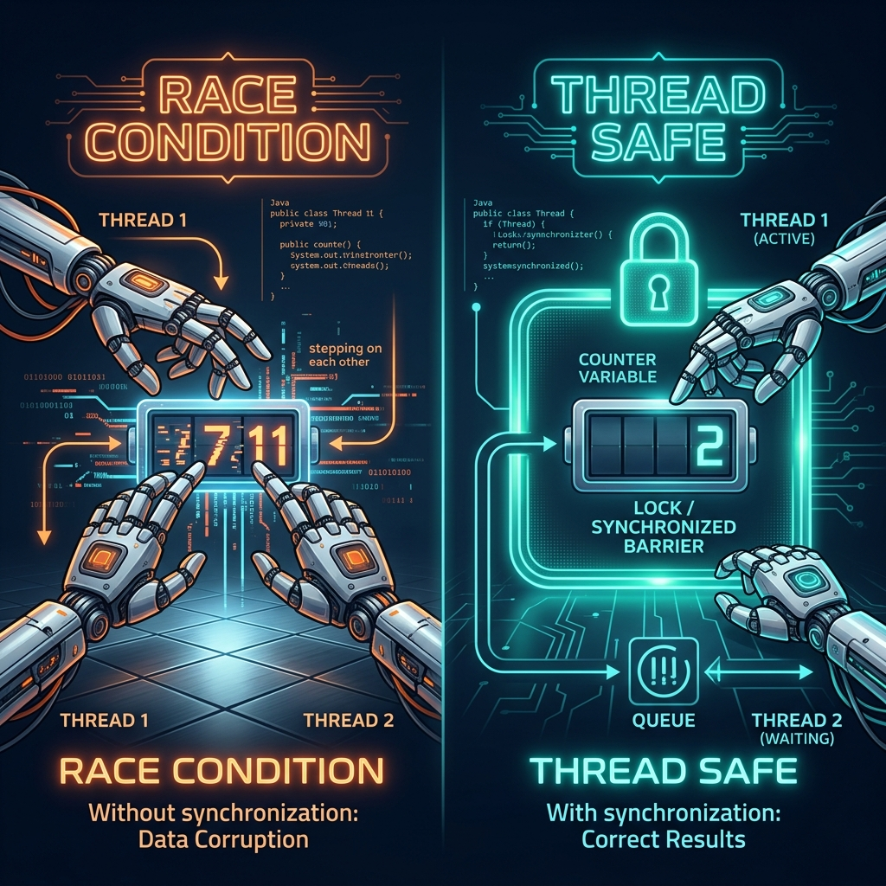
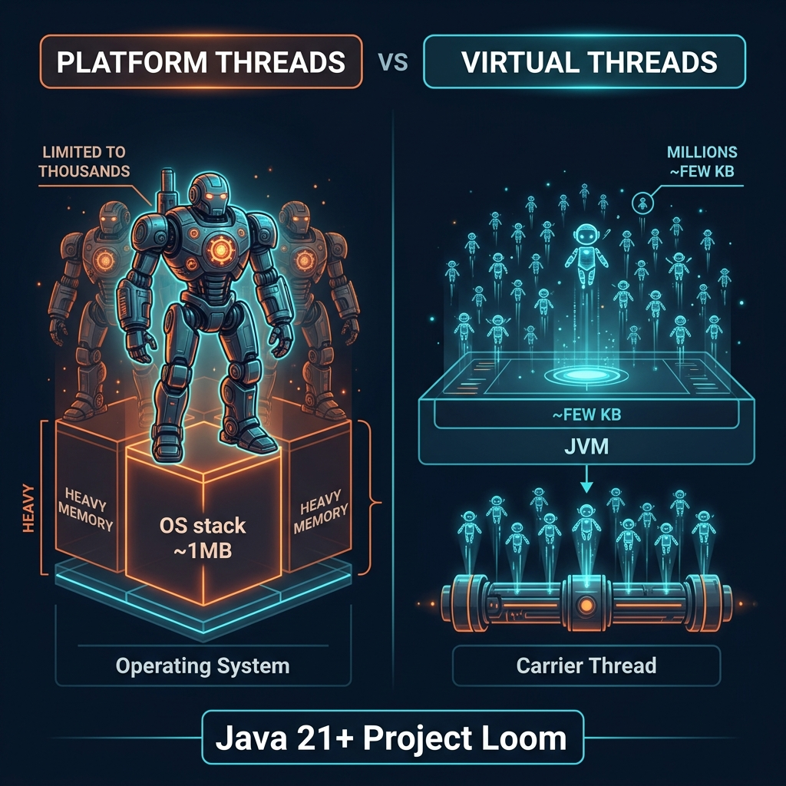

# Part 8: Concurrency

<p align="center">

</p>

> **Sources:** *Java Concurrency in Practice* (Goetz) · *Effective Java* (Bloch, Items 78–84) · *Core Java, Vol. I* (Horstmann) · *Modern Java in Action* (Urma, Fusco)

---

## 🎯 Learning Objectives

By the end of this part, you will:
- Understand threads, synchronization, and the Java Memory Model
- Use `synchronized`, `volatile`, and `java.util.concurrent` utilities
- Work with `ExecutorService`, `Future`, and `CompletableFuture`
- Understand thread-safe collections and atomic operations
- Know when and how to use Virtual Threads (Java 21+)

---

## 1. Threads — The Basics

> **Feynman Insight:** Imagine a restaurant kitchen. A single chef (single thread) can only do one thing at a time — chop onions, THEN heat the pan, THEN cook. With multiple chefs (multiple threads), one chops while another heats — tasks happen simultaneously. But if two chefs reach for the same knife at the same time, chaos ensues. **Concurrency is the art of coordinating multiple workers to share resources safely.**

### 1.1 Creating Threads

```java
// Method 1: Implement Runnable (preferred — separation of concerns)
Runnable task = () -> System.out.println("Running in: " + Thread.currentThread().getName());
Thread thread = new Thread(task);
thread.start();  // Starts a NEW thread — never call run() directly!

// Method 2: Extend Thread (less flexible — can't extend anything else)
class MyThread extends Thread {
    @Override
    public void run() {
        System.out.println("Running in: " + getName());
    }
}
new MyThread().start();
```

> **Bloch, Item 80:** *"Prefer executors, tasks, and streams to threads."* Creating raw threads is the assembly language of concurrency — powerful but error-prone. Use `ExecutorService` instead.

### 1.2 Thread Lifecycle

```
NEW  →  RUNNABLE  →  RUNNING  →  TERMINATED
              ↕
         BLOCKED / WAITING / TIMED_WAITING
```

---

## 2. Thread Safety — The Core Problem

<p align="center">

</p>

### 2.1 Race Conditions

Goetz (*Java Concurrency in Practice*) defines a race condition as: "Getting the wrong answer because of unlucky timing."

```java
// UNSAFE — race condition!
public class UnsafeCounter {
    private int count = 0;

    public void increment() {
        count++;  // NOT atomic! Read → increment → write = 3 steps
    }
}
```

> **Feynman Insight:** `count++` looks like one step, but it's actually three: (1) read the current value, (2) add 1, (3) write the new value. If Thread A reads `count = 5` and Thread B also reads `count = 5` before A writes, both write `6` — losing one increment entirely.

### 2.2 Synchronized — The Lock

```java
public class SafeCounter {
    private int count = 0;

    public synchronized void increment() {  // Only one thread can enter at a time
        count++;
    }

    public synchronized int getCount() {
        return count;
    }
}
```

### 2.3 The `volatile` Keyword

```java
// volatile guarantees visibility across threads — but NOT atomicity
private volatile boolean running = true;

// Thread 1
public void run() {
    while (running) {  // Without volatile, this might loop forever
        doWork();       // due to CPU caching
    }
}

// Thread 2
public void stop() {
    running = false;  // volatile ensures Thread 1 sees this change
}
```

> **Goetz's Rule:** `volatile` is sufficient when a variable is written by one thread and read by others. For compound operations (read-modify-write), you need synchronization or atomics.

---

## 3. java.util.concurrent — The Modern Toolkit

### 3.1 Atomic Classes

```java
// AtomicInteger — lock-free thread safety using CAS (Compare-And-Swap)
AtomicInteger counter = new AtomicInteger(0);
counter.incrementAndGet();    // Thread-safe increment → 1
counter.addAndGet(5);         // Thread-safe add → 6
counter.compareAndSet(6, 10); // Only sets to 10 if current value is 6

// Other atomics: AtomicLong, AtomicBoolean, AtomicReference<T>
```

### 3.2 ExecutorService — The Thread Pool

```java
// Fixed thread pool — reuses a fixed number of threads
ExecutorService executor = Executors.newFixedThreadPool(4);

// Submit tasks
Future<String> future = executor.submit(() -> {
    Thread.sleep(1000);
    return "Result from background thread";
});

// Get result (blocks until ready)
String result = future.get();  // Blocks here until the task completes

// ALWAYS shut down when done!
executor.shutdown();
executor.awaitTermination(5, TimeUnit.SECONDS);
```

### 3.3 CompletableFuture — Async Pipelines

```java
CompletableFuture<String> future = CompletableFuture
    .supplyAsync(() -> fetchDataFromAPI())        // Run async
    .thenApply(data -> parseJSON(data))            // Transform result
    .thenApply(parsed -> enrichWithMetadata(parsed))
    .exceptionally(ex -> "Fallback: " + ex.getMessage());  // Handle errors

// Combining futures
CompletableFuture<String> user = CompletableFuture.supplyAsync(() -> fetchUser());
CompletableFuture<String> order = CompletableFuture.supplyAsync(() -> fetchOrder());

CompletableFuture<String> combined = user.thenCombine(order,
    (u, o) -> "User: " + u + ", Order: " + o);
```

### 3.4 Thread-Safe Collections

```java
// ConcurrentHashMap — high-performance concurrent map
ConcurrentHashMap<String, Integer> map = new ConcurrentHashMap<>();
map.put("key", 1);
map.computeIfAbsent("key2", k -> 42);  // Atomic compute

// CopyOnWriteArrayList — for read-heavy, write-rare scenarios
CopyOnWriteArrayList<String> list = new CopyOnWriteArrayList<>();

// BlockingQueue — producer-consumer pattern
BlockingQueue<String> queue = new LinkedBlockingQueue<>(100);
queue.put("item");          // Blocks if full
String item = queue.take(); // Blocks if empty
```

---

## 4. Synchronization Utilities

```java
// CountDownLatch — wait for N tasks to complete
CountDownLatch latch = new CountDownLatch(3);
// Each worker calls latch.countDown() when done
latch.await();  // Main thread blocks until count reaches 0

// Semaphore — limit concurrent access
Semaphore semaphore = new Semaphore(3);  // Max 3 concurrent permits
semaphore.acquire();  // Block if all permits taken
try {
    accessResource();
} finally {
    semaphore.release();
}

// ReentrantLock — more flexible than synchronized
ReentrantLock lock = new ReentrantLock();
lock.lock();
try {
    criticalSection();
} finally {
    lock.unlock();  // ALWAYS in finally!
}
```

---

## 5. Virtual Threads (Java 21+)

<p align="center">

</p>

> **Feynman Insight:** Platform threads are like hiring full-time employees — each one costs ~1MB of memory and is limited by OS resources (thousands). Virtual threads are like hiring freelancers — the JVM can create millions of them, each weighing just a few KB. When a virtual thread blocks (waiting for I/O), the JVM detaches it from the carrier thread and puts another virtual thread on, maximizing efficiency.

```java
// Creating virtual threads
Thread.startVirtualThread(() -> {
    System.out.println("Running in virtual thread");
});

// Virtual thread executor — one virtual thread per task
try (var executor = Executors.newVirtualThreadPerTaskExecutor()) {
    // Launch 100,000 concurrent tasks — no problem with virtual threads!
    for (int i = 0; i < 100_000; i++) {
        executor.submit(() -> {
            Thread.sleep(Duration.ofSeconds(1));
            return "Done";
        });
    }
}
```

---

## 6. Best Practices

1. **Prefer executors over raw threads** (Bloch, Item 80)
2. **Prefer concurrency utilities** (`AtomicInteger`, `ConcurrentHashMap`) over `synchronized` (Bloch, Item 81)
3. **Make objects immutable** — immutable objects are automatically thread-safe (Bloch, Item 17)
4. **Minimize shared mutable state** — the root of all concurrency evil (Goetz)
5. **Use `CompletableFuture`** for async pipelines instead of blocking `Future.get()`
6. **Use virtual threads** for I/O-bound tasks in Java 21+
7. **Always release locks in `finally`** blocks

---

## 7. Exercises

1. **Thread-Safe Counter:** Implement a counter using `synchronized`, `AtomicInteger`, and `ReentrantLock`. Benchmark all three.
2. **Producer-Consumer:** Implement a producer-consumer pattern with `BlockingQueue`.
3. **Async Pipeline:** Use `CompletableFuture` to fetch data from multiple "APIs" concurrently and merge results.
4. **Virtual Threads:** Create 10,000 virtual threads that each sleep for 1 second. Measure total elapsed time.

---

## 📖 References

- *Java Concurrency in Practice*, Brian Goetz — The definitive guide (all chapters)
- *Effective Java*, Joshua Bloch — Items 78–84 (Concurrency)
- *Core Java, Volume I*, Cay S. Horstmann — Chapter 12 (Concurrency)
- *Modern Java in Action*, Urma, Fusco — Chapter 15 (CompletableFuture)

---

[← Part 7: Streams API](Part-07-Streams-API.md) | [Back to Course Index](../README.md) | [Next: Part 9 — I/O & NIO →](Part-09-IO-And-NIO.md)
