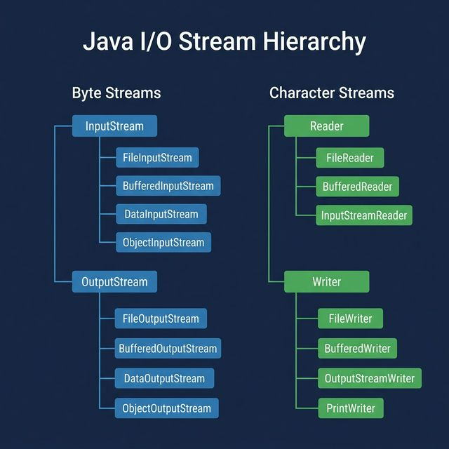

# Part 9: I/O, NIO, and File Handling

> **Sources:** *Thinking in Java* (Ch. 12) · *OCP Java SE 8 Programmer II* (Ch. 8–9)

---

## 🎯 Learning Objectives

- Use classic I/O streams (`InputStream`, `OutputStream`, `Reader`, `Writer`)
- Master NIO.2 with `Path`, `Files`, and `FileSystem`
- Handle file reading/writing, directory traversal, and watching
- Understand serialization and deserialization
- Work with regular expressions

---

## 1. Classic I/O Streams

### Stream Hierarchy

<p align="center">

</p>

### Reading Files

```java
// Byte stream — raw bytes
try (FileInputStream fis = new FileInputStream("data.bin")) {
    byte[] buffer = new byte[1024];
    int bytesRead;
    while ((bytesRead = fis.read(buffer)) != -1) {
        // Process buffer[0..bytesRead-1]
    }
}

// Character stream — text
try (BufferedReader reader = new BufferedReader(new FileReader("data.txt"))) {
    String line;
    while ((line = reader.readLine()) != null) {
        System.out.println(line);
    }
}

// Modern approach
String content = Files.readString(Path.of("data.txt"));
List<String> lines = Files.readAllLines(Path.of("data.txt"));
```

### Writing Files

```java
// Character stream
try (BufferedWriter writer = new BufferedWriter(new FileWriter("output.txt"))) {
    writer.write("Hello, World!");
    writer.newLine();
    writer.write("Second line");
}

// Modern approach
Files.writeString(Path.of("output.txt"), "Hello, World!");
Files.write(Path.of("output.txt"), List.of("Line 1", "Line 2"));

// Append mode
Files.writeString(Path.of("output.txt"), "Appended text", 
    StandardOpenOption.APPEND, StandardOpenOption.CREATE);
```

### PrintWriter & PrintStream

```java
try (PrintWriter pw = new PrintWriter(new FileWriter("report.txt"))) {
    pw.println("Report Title");
    pw.printf("Name: %s, Score: %.2f%n", "Alice", 95.5);
    pw.println("Done");
}
```

---

## 2. NIO.2 — Modern File I/O

### Path — File System Paths

```java
import java.nio.file.*;

Path p1 = Path.of("data.txt");                    // Relative
Path p2 = Path.of("/Users/alice/data.txt");        // Absolute
Path p3 = Path.of("/Users", "alice", "data.txt");  // With segments
Path p4 = Paths.get("data.txt");                   // Equivalent (legacy)

// Path operations
p2.getFileName()       // data.txt
p2.getParent()         // /Users/alice
p2.getRoot()           // /
p2.getNameCount()      // 3
p2.getName(0)          // Users
p2.subpath(0, 2)       // Users/alice
p2.toAbsolutePath()    // /Users/alice/data.txt
p2.normalize()         // Resolves . and ..

// Combining paths
Path base = Path.of("/Users/alice");
Path resolved = base.resolve("documents/file.txt");  // /Users/alice/documents/file.txt
Path relative = base.relativize(Path.of("/Users/alice/documents")); // documents
```

### Files — File Operations

```java
import java.nio.file.*;

// Check existence
Files.exists(path);
Files.notExists(path);
Files.isRegularFile(path);
Files.isDirectory(path);
Files.isReadable(path);
Files.isWritable(path);
Files.isExecutable(path);

// Create
Files.createFile(path);
Files.createDirectory(path);
Files.createDirectories(path);  // Includes parent dirs
Files.createTempFile("prefix", ".suffix");

// Copy, Move, Delete
Files.copy(source, target, StandardCopyOption.REPLACE_EXISTING);
Files.move(source, target, StandardCopyOption.ATOMIC_MOVE);
Files.delete(path);             // Throws if not exists
Files.deleteIfExists(path);     // Returns boolean

// Attributes
Files.size(path);               // File size in bytes
Files.getLastModifiedTime(path);
Files.getOwner(path);
```

### Directory Traversal

```java
// List directory contents (non-recursive)
try (DirectoryStream<Path> stream = Files.newDirectoryStream(dir, "*.java")) {
    for (Path entry : stream) {
        System.out.println(entry.getFileName());
    }
}

// Walk directory tree (recursive)
try (Stream<Path> tree = Files.walk(dir)) {
    tree.filter(Files.isRegularFile)
        .filter(p -> p.toString().endsWith(".java"))
        .forEach(System.out::println);
}

// Find files matching a pattern
try (Stream<Path> found = Files.find(dir, Integer.MAX_VALUE,
        (path, attrs) -> attrs.isRegularFile() && path.toString().endsWith(".java"))) {
    found.forEach(System.out::println);
}

// Stream lines lazily (memory efficient for large files)
try (Stream<String> lines = Files.lines(Path.of("huge-file.txt"))) {
    long count = lines.filter(l -> l.contains("ERROR")).count();
}
```

### WatchService — File System Events

```java
WatchService watcher = FileSystems.getDefault().newWatchService();
Path dir = Path.of("/tmp/watched");

dir.register(watcher, 
    StandardWatchEventKinds.ENTRY_CREATE,
    StandardWatchEventKinds.ENTRY_MODIFY,
    StandardWatchEventKinds.ENTRY_DELETE);

while (true) {
    WatchKey key = watcher.take();  // Blocks until event
    for (WatchEvent<?> event : key.pollEvents()) {
        System.out.println(event.kind() + ": " + event.context());
    }
    key.reset();
}
```

---

## 3. Serialization

```java
import java.io.*;

public class Person implements Serializable {
    private static final long serialVersionUID = 1L;

    private String name;
    private int age;
    private transient String password;  // NOT serialized

    public Person(String name, int age, String password) {
        this.name = name;
        this.age = age;
        this.password = password;
    }
}

// Serialize
try (ObjectOutputStream oos = new ObjectOutputStream(
        new FileOutputStream("person.dat"))) {
    oos.writeObject(new Person("Alice", 30, "secret"));
}

// Deserialize
try (ObjectInputStream ois = new ObjectInputStream(
        new FileInputStream("person.dat"))) {
    Person p = (Person) ois.readObject();
    // p.password will be null (transient)
}
```

**Modern alternative:** Prefer JSON/XML serialization (Jackson, Gson) over Java serialization for data exchange.

---

## 4. Regular Expressions

```java
import java.util.regex.*;

// Simple matching
boolean matches = "hello123".matches("[a-z]+\\d+");  // true

// Pattern & Matcher
Pattern emailPattern = Pattern.compile(
    "[a-zA-Z0-9._%+-]+@[a-zA-Z0-9.-]+\\.[a-zA-Z]{2,}"
);
Matcher matcher = emailPattern.matcher("alice@example.com");
boolean found = matcher.matches();  // true

// Find all matches
Pattern wordPattern = Pattern.compile("\\b[A-Z][a-z]+\\b");
Matcher m = wordPattern.matcher("Hello World Java Programming");
while (m.find()) {
    System.out.println(m.group());  // Hello, World, Java, Programming
}

// Groups
Pattern datePattern = Pattern.compile("(\\d{4})-(\\d{2})-(\\d{2})");
Matcher dm = datePattern.matcher("Date: 2026-03-23");
if (dm.find()) {
    String year = dm.group(1);   // "2026"
    String month = dm.group(2);  // "03"
    String day = dm.group(3);    // "23"
}

// Replace
String result = "Hello World".replaceAll("[aeiou]", "*");  // "H*ll* W*rld"
```

### Common Regex Patterns

| Pattern | Matches |
|---------|---------|
| `\\d` | Digit `[0-9]` |
| `\\w` | Word char `[a-zA-Z0-9_]` |
| `\\s` | Whitespace |
| `.` | Any character |
| `^` / `$` | Start / end |
| `*` / `+` / `?` | 0+, 1+, 0 or 1 |
| `{n,m}` | Between n and m |
| `[abc]` | Character class |
| `(...)` | Capturing group |

---

## 5. Best Practices

1. **Always use try-with-resources** for I/O operations
2. **Prefer NIO.2** (`Files`, `Path`) over legacy `File` class
3. **Use `BufferedReader`/`BufferedWriter`** for text I/O performance
4. **Stream large files lazily** with `Files.lines()` instead of `readAllLines()`
5. **Specify character encoding** explicitly: `StandardCharsets.UTF_8`
6. **Avoid Java serialization** for data exchange — use JSON/Protobuf
7. **Compile regex patterns once** — reuse `Pattern` instances

---

## 6. Exercises

1. **File Analyzer:** Count lines, words, and characters in a text file using NIO.2
2. **Directory Size Calculator:** Walk a directory tree and compute total size recursively
3. **Log Parser:** Use regex to extract timestamps, log levels, and messages from log files
4. **CSV Reader:** Build a CSV parser using `BufferedReader` that handles quoted fields
5. **File Watcher:** Create a utility that watches a directory and logs all file changes

---

## 📖 References

- *Thinking in Java*, Bruce Eckel — Ch. 12 (The Java I/O System)
- *OCP Java SE 8 Programmer II Study Guide* — Ch. 8 (IO) & Ch. 9 (NIO.2)

---

[← Part 8: Concurrency](Part-08-Concurrency.md) | [Back to Course Index](../README.md) | [Next: Part 10 — Advanced OOP →](Part-10-Advanced-OOP.md)
