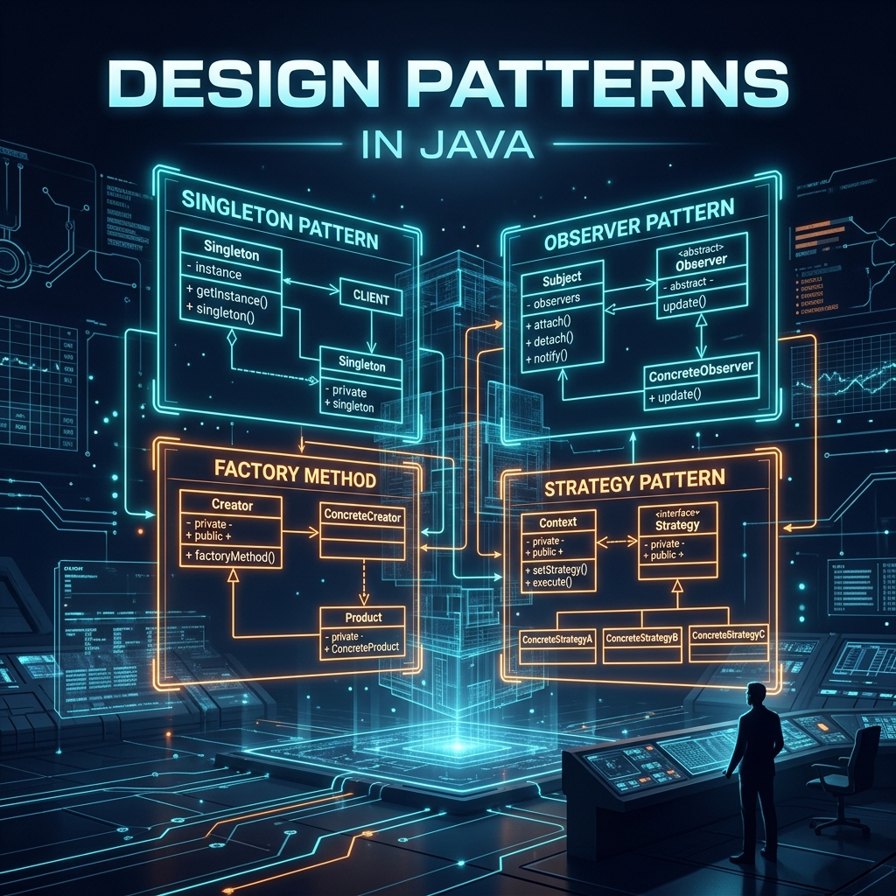

# Part 10: Design Patterns in Java

<p align="center">

</p>

> **Sources:** *Effective Java* (Bloch, Items 1–5, 17–20) · *Core Java, Vol. I* (Horstmann) · *Head First Java* (Sierra, Bates) · *Java: The Complete Reference* (Schildt)

---

## 🎯 Learning Objectives

By the end of this part, you will:
- Apply Creational patterns: Singleton, Factory Method, Abstract Factory, Builder
- Apply Structural patterns: Decorator, Adapter, Proxy, Facade
- Apply Behavioral patterns: Strategy, Observer, Template Method, Command
- Understand SOLID principles and how patterns implement them
- Implement modern Java patterns using lambdas and functional interfaces

---

## 1. What Are Design Patterns?

> **Feynman Insight:** Design patterns are like architectural blueprints for a building. When an architect needs to design "a room that people can enter but not see inside from outside," they use a pattern called a "mud room" or "airlock entry." They don't ask *how* to build it from scratch every time — they use the *established pattern*. Similarly, design patterns are named, battle-tested solutions to recurring software design problems. They're shared vocabulary: when you say "use the Strategy pattern," every Java developer immediately knows what shape the code should take.

---

## 2. Creational Patterns — How Objects Are Born

### 2.1 Singleton — The One True Instance

> **Feynman Insight:** A Singleton is like the President of a country. There can be only ONE at a time, no matter how many citizens ask "who is the president?" Everyone gets the same answer — the same object. The challenge isn't the concept; it's preventing two people from "electing a president" simultaneously in a multi-threaded world.

```java
// The BEST Singleton: use an Enum (Bloch, Item 3)
// Thread-safe, serialization-safe, reflection-proof — for free!
public enum AppConfig {
    INSTANCE;

    private final Properties props = new Properties();

    AppConfig() {
        try { props.load(getClass().getResourceAsStream("/config.properties")); }
        catch (IOException e) { throw new RuntimeException(e); }
    }

    public String get(String key) { return props.getProperty(key); }
}

// Usage
String dbUrl = AppConfig.INSTANCE.get("db.url");
```

> **Bloch, Item 3:** *"Use an enum type to implement Singleton."* The enum approach is simpler and provides stronger guarantees than the double-checked locking pattern.

### 2.2 Factory Method — Delegate Object Creation

> **Feynman Insight:** Imagine you want a pizza but don't care how it's made. You call a pizzeria (the factory) and say "give me a pepperoni pizza." The factory decides which actual Pizza subclass to instantiate — you just get your pizza. Your code depends on the abstraction (Pizza), not the concrete class (PepperoniPizza).

```java
public interface Notification {
    void send(String message);
}

public class EmailNotification implements Notification {
    public void send(String message) { System.out.println("Email: " + message); }
}

public class SMSNotification implements Notification {
    public void send(String message) { System.out.println("SMS: " + message); }
}

// Factory Method
public class NotificationFactory {
    public static Notification create(String type) {
        return switch (type.toLowerCase()) {
            case "email" -> new EmailNotification();
            case "sms"   -> new SMSNotification();
            default -> throw new IllegalArgumentException("Unknown: " + type);
        };
    }
}

// Client code never mentions concrete classes
Notification n = NotificationFactory.create("email");
n.send("Your order is ready!");
```

> **Bloch, Item 1:** *"Consider static factory methods instead of constructors."* Static factories have names, can return subtypes, and don't have to create a new object each time.

### 2.3 Builder — Telescoping Constructor Killer

> **Feynman Insight:** Imagine ordering a custom computer. You don't pass 15 parameters to a store clerk in one sentence: "I want a Core i9, 64GB RAM, 2TB SSD, RTX 4090, black chassis, liquid cooling, WiFi 6..." You'd fill out a form — checking boxes and writing specs. The Builder pattern is that order form. It lets you construct complex objects step by step, only specifying what you need.

```java
public class DatabaseConfig {
    private final String host;
    private final int port;
    private final String database;
    private final String username;
    private final int maxConnections;
    private final int timeoutSeconds;

    private DatabaseConfig(Builder builder) {
        this.host = builder.host;
        this.port = builder.port;
        this.database = builder.database;
        this.username = builder.username;
        this.maxConnections = builder.maxConnections;
        this.timeoutSeconds = builder.timeoutSeconds;
    }

    public static class Builder {
        private final String host;       // Required
        private final String database;   // Required
        private int port = 5432;         // Optional with defaults
        private String username = "root";
        private int maxConnections = 10;
        private int timeoutSeconds = 30;

        public Builder(String host, String database) {
            this.host = host;
            this.database = database;
        }

        public Builder port(int port) { this.port = port; return this; }
        public Builder username(String u) { this.username = u; return this; }
        public Builder maxConnections(int n) { this.maxConnections = n; return this; }
        public Builder timeout(int s) { this.timeoutSeconds = s; return this; }
        public DatabaseConfig build() { return new DatabaseConfig(this); }
    }
}

// Clean, readable construction
DatabaseConfig config = new DatabaseConfig.Builder("localhost", "mydb")
    .port(5432)
    .username("admin")
    .maxConnections(20)
    .timeout(60)
    .build();
```

> **Bloch, Item 2:** *"Consider a builder when faced with many constructor parameters."* The Builder pattern is the solution to the "telescoping constructor anti-pattern."

---

## 3. Structural Patterns — How Objects Are Composed

### 3.1 Decorator — Wrapping for Extra Behavior

> **Feynman Insight:** Think of getting dressed for a cold weather event. You put on a base layer, then a sweater, then a jacket, then a raincoat. Each layer *wraps* the previous one and *adds* new capabilities (warmth, water resistance). The Decorator pattern works exactly like this — you wrap an object to add behavior without changing its class.

```java
public interface TextProcessor {
    String process(String text);
}

// Core implementation
public class PlainTextProcessor implements TextProcessor {
    public String process(String text) { return text; }
}

// Decorators — each wraps another TextProcessor
public class TrimDecorator implements TextProcessor {
    private final TextProcessor wrapped;
    public TrimDecorator(TextProcessor wrapped) { this.wrapped = wrapped; }
    public String process(String text) { return wrapped.process(text).trim(); }
}

public class UppercaseDecorator implements TextProcessor {
    private final TextProcessor wrapped;
    public UppercaseDecorator(TextProcessor wrapped) { this.wrapped = wrapped; }
    public String process(String text) { return wrapped.process(text).toUpperCase(); }
}

// Stack decorators like Russian dolls
TextProcessor processor = new UppercaseDecorator(
                            new TrimDecorator(
                              new PlainTextProcessor()));

processor.process("  hello world  ");  // "HELLO WORLD"
```

### 3.2 Adapter — Speaking Two Languages

> **Feynman Insight:** You travel to Europe with your American laptop charger. Your charger has American plug pins but the wall socket is European. An adapter converts one interface to another — it's a translator between incompatible standards. The Adapter pattern does the same thing in code.

```java
// Legacy interface you can't change
public interface LegacyPaymentProcessor {
    void processPayment(double amount, String currency);
}

// New interface your system uses
public interface ModernPaymentGateway {
    void charge(PaymentRequest request);
}

// Adapter bridges the gap
public class PaymentAdapter implements ModernPaymentGateway {
    private final LegacyPaymentProcessor legacy;

    public PaymentAdapter(LegacyPaymentProcessor legacy) {
        this.legacy = legacy;
    }

    @Override
    public void charge(PaymentRequest request) {
        // Translate: new interface → old interface
        legacy.processPayment(request.getAmount(), request.getCurrency().getCode());
    }
}
```

---

## 4. Behavioral Patterns — How Objects Communicate

### 4.1 Strategy — Pluggable Algorithms

> **Feynman Insight:** A GPS navigation app can find a route in multiple ways: fastest, shortest, avoid highways, scenic route. The strategy changes but the overall navigation structure stays the same. The Strategy pattern lets you swap algorithms at runtime by defining them as interchangeable objects (or, in modern Java, lambdas).

```java
@FunctionalInterface
public interface PricingStrategy {
    double calculatePrice(double basePrice, int quantity);
}

public class OrderProcessor {
    private PricingStrategy strategy;

    public OrderProcessor(PricingStrategy strategy) {
        this.strategy = strategy;
    }

    public double calculateTotal(double price, int qty) {
        return strategy.calculatePrice(price, qty);
    }
}

// Different strategies as lambdas
PricingStrategy standard   = (price, qty) -> price * qty;
PricingStrategy bulk       = (price, qty) -> qty > 100 ? price * qty * 0.8 : price * qty;
PricingStrategy vip        = (price, qty) -> price * qty * 0.7;

OrderProcessor processor = new OrderProcessor(bulk);
processor.calculateTotal(10.0, 150);  // 10 * 150 * 0.8 = 1200.0
```

### 4.2 Observer — Event Notification System

> **Feynman Insight:** Imagine subscribing to a YouTube channel. You (the observer) tell YouTube "notify me when this channel posts." When the channel (the subject) posts a video, YouTube automatically notifies ALL subscribers. You don't have to keep checking — you just wait for the notification. The Observer pattern is this publish-subscribe mechanism.

```java
public interface StockObserver {
    void onPriceChange(String symbol, double newPrice);
}

public class StockMarket {
    private final Map<String, List<StockObserver>> observers = new HashMap<>();
    private final Map<String, Double> prices = new HashMap<>();

    public void subscribe(String symbol, StockObserver observer) {
        observers.computeIfAbsent(symbol, k -> new ArrayList<>()).add(observer);
    }

    public void updatePrice(String symbol, double price) {
        prices.put(symbol, price);
        observers.getOrDefault(symbol, List.of())
                 .forEach(o -> o.onPriceChange(symbol, price));
    }
}

// Usage with lambdas
StockMarket market = new StockMarket();
market.subscribe("AAPL", (symbol, price) -> System.out.printf("%s: %.2f%n", symbol, price));
market.subscribe("AAPL", (symbol, price) -> {
    if (price > 200) System.out.println("ALERT: AAPL above $200!");
});

market.updatePrice("AAPL", 210.50);  // Both observers are notified
```

---

## 5. SOLID Principles

| Principle | Description | Pattern Example |
|-----------|-------------|-----------------|
| **S** — Single Responsibility | One class = one reason to change | `UserRepository` only handles DB ops |
| **O** — Open/Closed | Extend behavior without modifying existing code | Strategy, Decorator |
| **L** — Liskov Substitution | Subtypes must honor the parent's contract | Careful inheritance design |
| **I** — Interface Segregation | Many small interfaces > one fat interface | `Readable`, `Writable` vs `ReadWritable` |
| **D** — Dependency Inversion | Depend on abstractions, not concrete classes | Factory, Constructor Injection |

---

## 6. Exercises

1. **Plugin System:** Implement a plugin loader that discovers classes implementing a `Plugin` interface using the Strategy pattern.
2. **Order Builder:** Create a fluent `Order` builder with required/optional fields and validation in `build()`.
3. **Event Bus:** Build a typed `EventBus<T>` using the Observer pattern with generic event types.
4. **Logging Decorator:** Create a `LoggingDecorator<T>` that wraps any service and logs method calls.
5. **Payment Adapter:** Adapt a `LegacyPaymentProcessor` to a modern `PaymentGateway` interface.

---

## 📖 References

- *Effective Java*, Joshua Bloch — Items 1–5 (Static factories, Builders, Singletons), 17–20 (Composition)
- *Core Java, Volume I*, Cay S. Horstmann — Chapter 6 (Interfaces and Lambda Expressions)
- *Head First Java*, Sierra, Bates — Chapters on Design Patterns
- *Java: The Complete Reference*, Herbert Schildt — Chapter 11 (Inheritance)

---

[← Part 9: I/O & NIO](Part-09-IO-And-NIO.md) | [Back to Course Index](../README.md) | [Next: Part 11 — Testing →](Part-11-Testing.md)
