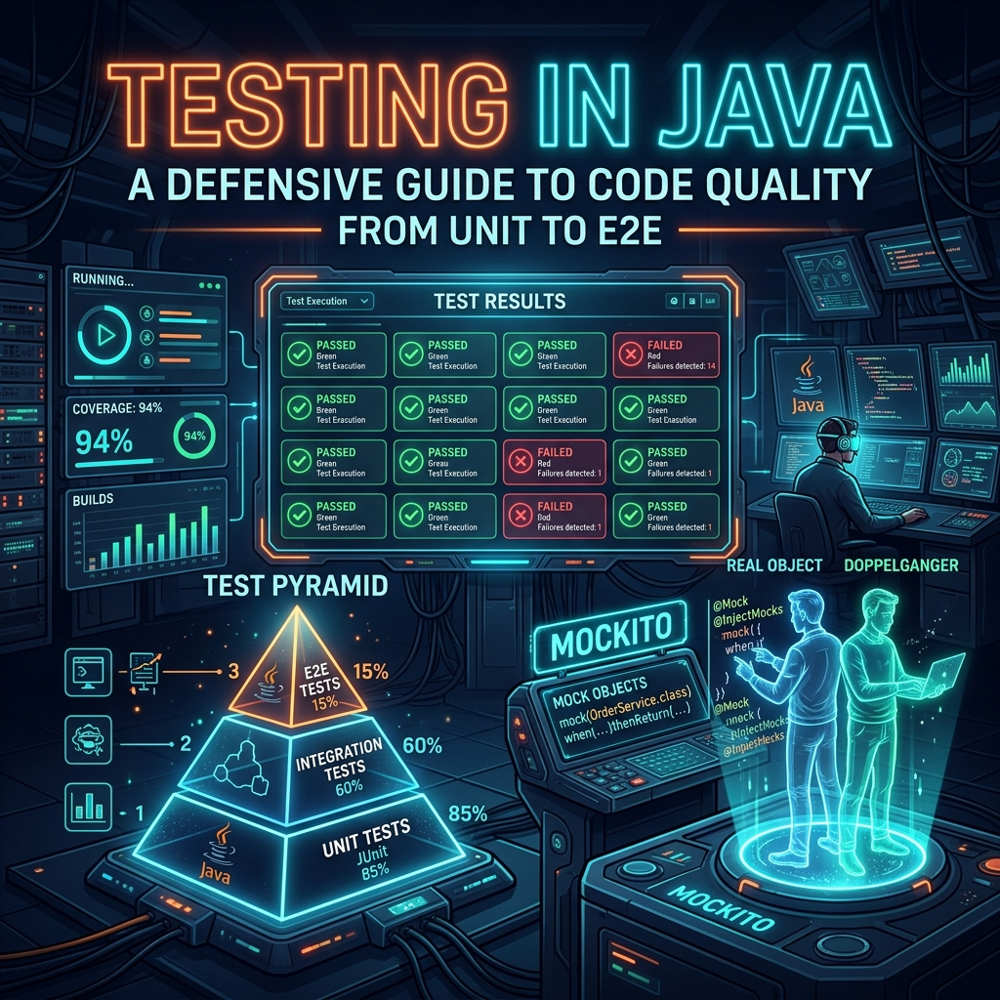
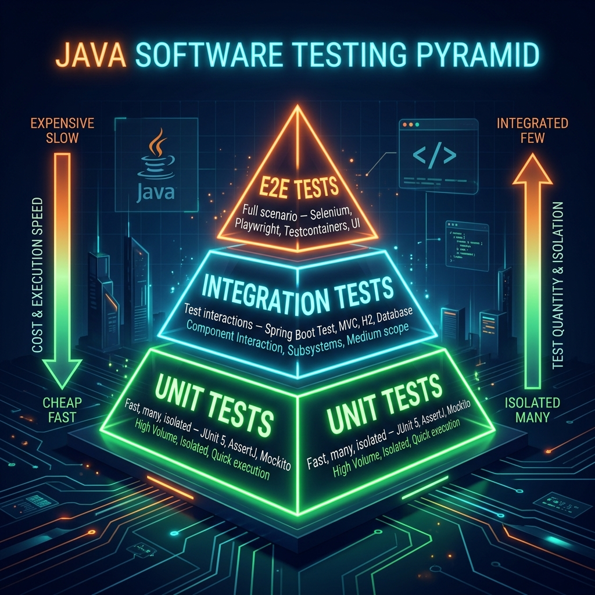

# Part 11: Testing in Java

<p align="center">

</p>

> **Sources:** *Effective Java* (Bloch) · *Core Java, Vol. I* (Horstmann) · *Java: A Beginner's Guide* (Schildt) · *Head First Java* (Sierra, Bates)

---

## 🎯 Learning Objectives

By the end of this part, you will:
- Write clean, focused unit tests with JUnit 5
- Use Mockito to isolate dependencies and test behaviour
- Understand the Test Pyramid and when to use each level
- Apply TDD (Test-Driven Development) workflow
- Write parameterized, exception, and lifecycle tests

---

## 1. Why Testing Matters

> **Feynman Insight:** Imagine you're a surgeon who is about to perform an operation on a patient. Before you touch the patient, you run checks — equipment working? correct patient? right procedure? Tests in software are those pre-operation checks. Without them, you're operating blind. The moment you change one piece of code without tests, you have no way to know if you've accidentally broken something else. Tests are your safety net, your documentation, and your confidence.

<p align="center">

</p>

The **Testing Pyramid** tells us the ideal balance:
- 🟢 **Unit Tests** — many, fast, isolated (the foundation)
- 🔵 **Integration Tests** — fewer, test component interaction
- 🟠 **E2E Tests** — very few, test the full system

---

## 2. JUnit 5 — The Unit Testing Framework

### 2.1 Basic Test Structure

```java
import org.junit.jupiter.api.*;
import static org.junit.jupiter.api.Assertions.*;

class CalculatorTest {

    private Calculator calc;

    @BeforeEach     // Runs before EACH test — fresh state
    void setUp() {
        calc = new Calculator();
    }

    @AfterEach      // Runs after EACH test — cleanup
    void tearDown() {
        calc = null;
    }

    @BeforeAll      // Runs ONCE before all tests — static!
    static void initAll() { System.out.println("Starting tests..."); }

    @AfterAll       // Runs ONCE after all tests — static!
    static void tearDownAll() { System.out.println("All tests done."); }

    @Test
    @DisplayName("Adding two positive numbers returns their sum")
    void testAdd() {
        int result = calc.add(3, 4);
        assertEquals(7, result, "3 + 4 should equal 7");
    }

    @Test
    void testDivideByZero() {
        // Verify that the specific exception is thrown
        assertThrows(ArithmeticException.class, () -> calc.divide(10, 0));
    }

    @Test
    @Disabled("Not yet implemented")
    void testSquareRoot() { }
}
```

> **Feynman Insight — Test naming:** Name your tests like sentences describing behavior: `"Adding two positive numbers returns their sum"`. This way, when a test fails, you immediately know WHAT broke without reading the code.

### 2.2 Assertions

```java
// Basic
assertEquals(expected, actual);
assertNotEquals(expected, actual);
assertTrue(condition);
assertFalse(condition);
assertNull(object);
assertNotNull(object);

// Arrays & Collections
assertArrayEquals(new int[]{1, 2, 3}, result);

// Exception testing
Exception ex = assertThrows(IllegalArgumentException.class, () -> method());
assertTrue(ex.getMessage().contains("negative"));

// Multiple assertions — don't stop on first failure
assertAll("User properties",
    () -> assertEquals("Alice", user.getName()),
    () -> assertEquals(30, user.getAge()),
    () -> assertNotNull(user.getEmail())
);

// Custom message (computed lazily — efficient)
assertEquals(7, result, () -> "Expected sum of 3+4 but got: " + result);
```

### 2.3 Parameterized Tests

> **Feynman Insight:** Writing the same test 10 times with different inputs is like a chef tasting the same dish 10 times instead of tasting 10 different dishes. Parameterized tests let you define the test structure once and run it with many different inputs automatically.

```java
@ParameterizedTest
@ValueSource(strings = {"Alice", "Bob", "Charlie"})
void testNameIsValid(String name) {
    assertTrue(validator.isValidName(name));
}

@ParameterizedTest
@CsvSource({
    "3, 4, 7",
    "0, 0, 0",
    "-1, 1, 0",
    "100, 200, 300"
})
void testAdd(int a, int b, int expected) {
    assertEquals(expected, calc.add(a, b));
}

// From a method source — for complex objects
@ParameterizedTest
@MethodSource("userProvider")
void testUserValidation(User user, boolean expectedValid) {
    assertEquals(expectedValid, validator.isValid(user));
}

static Stream<Arguments> userProvider() {
    return Stream.of(
        Arguments.of(new User("Alice", 30), true),
        Arguments.of(new User("", 30), false),      // Empty name
        Arguments.of(new User("Bob", -1), false)    // Negative age
    );
}
```

---

## 3. Mockito — Isolating Dependencies

> **Feynman Insight:** Unit testing means testing ONE thing in isolation. But your `UserService` depends on a `UserRepository`, which depends on a database. You don't want a database in your unit tests — they'd be slow, flaky, and require setup. Mockito creates **mock objects** — fake substitutes that look like the real thing but do nothing by default. You tell the mock what to return when specific methods are called, then verify that your code interacted with the mock correctly.

```java
@ExtendWith(MockitoExtension.class)
class UserServiceTest {

    @Mock
    UserRepository userRepository;      // Mockito creates a fake repo

    @InjectMocks
    UserService userService;            // Mockito injects the mock into this

    @Test
    void getUserById_returnsUser_whenFound() {
        // ARRANGE: Tell the mock what to return
        User alice = new User(1L, "Alice", "alice@example.com");
        when(userRepository.findById(1L)).thenReturn(Optional.of(alice));

        // ACT: Call the real service method
        User result = userService.getUserById(1L);

        // ASSERT: Verify the result
        assertEquals("Alice", result.getName());

        // VERIFY: The mock was called exactly once with correct argument
        verify(userRepository, times(1)).findById(1L);
    }

    @Test
    void getUserById_throwsException_whenNotFound() {
        when(userRepository.findById(99L)).thenReturn(Optional.empty());

        assertThrows(UserNotFoundException.class,
            () -> userService.getUserById(99L));
    }

    @Test
    void createUser_savesUser() {
        User newUser = new User("Bob", "bob@example.com");
        when(userRepository.save(any(User.class))).thenReturn(
            new User(2L, "Bob", "bob@example.com"));

        User created = userService.createUser(newUser);

        assertNotNull(created.getId());
        verify(userRepository).save(newUser);  // Verifies save was called
    }
}
```

### 3.1 Mockito Argument Matchers

```java
when(repo.findByName(anyString())).thenReturn(List.of());
when(repo.findById(eq(1L))).thenReturn(Optional.of(user));

// Capture arguments for inspection
ArgumentCaptor<User> captor = ArgumentCaptor.forClass(User.class);
verify(repo).save(captor.capture());
User savedUser = captor.getValue();
assertEquals("Alice", savedUser.getName());
```

---

## 4. Test-Driven Development (TDD)

> **Feynman Insight:** TDD is counterintuitive — you write the test BEFORE the code. It's like writing the answer key for an exam before the student takes it. Why? Because it forces you to think about WHAT the code should do before thinking about HOW. The cycle is: 🔴 Red (write a failing test) → 🟢 Green (write minimal code to pass) → 🔵 Refactor (clean up).

**Example — TDD for a password validator:**

```java
// Step 1: RED — write the test first (it won't even compile yet!)
@Test
void password_mustBeAtLeast8Characters() {
    PasswordValidator validator = new PasswordValidator();
    assertFalse(validator.isValid("abc"));
    assertTrue(validator.isValid("abcdefgh"));
}

// Step 2: GREEN — write the MINIMUM code to pass
public class PasswordValidator {
    public boolean isValid(String password) {
        return password != null && password.length() >= 8;
    }
}

// Step 3: REFACTOR — add more tests, improve the code
@Test
void password_mustContainUppercase() {
    assertFalse(validator.isValid("abcdefgh")); // All lowercase — invalid
    assertTrue(validator.isValid("Abcdefgh"));  // Has uppercase — valid
}
```

---

## 5. Best Practices

1. **F.I.R.S.T. principle:** Tests should be **Fast**, **Independent**, **Repeatable**, **Self-validating**, **Timely**
2. **One assertion per test** (ideally) — makes failure diagnosis easy
3. **Use `@DisplayName`** for human-readable test descriptions
4. **Test edge cases:** null inputs, empty collections, max values, boundary conditions
5. **Don't test private methods** — test the public API; private methods are implementation details
6. **Use `assertAll()`** when you need multiple assertions to all pass
7. **Keep tests in the same package** as the class they test (but in `src/test/`)

---

## 6. Exercises

1. **Calculator TDD:** Write tests FIRST for: add, subtract, multiply, divide (including divide-by-zero), then implement the Calculator class.
2. **Mock a Service:** Create a `WeatherService` that calls a `WeatherApiClient`. Mock the client and test the service's logic.
3. **Parameterized Email Validator:** Write a parameterized test with 10 valid and 10 invalid email addresses.
4. **Lifecycle:** Create a test class with `@BeforeAll`, `@BeforeEach`, `@AfterEach`, `@AfterAll` that logs when each runs.

---

## 📖 References

- *Effective Java*, Joshua Bloch — Items 89–90 (Testing practices)
- *Core Java, Volume I*, Cay S. Horstmann — Chapter 5 (Inheritance, Testing)
- *Java: A Beginner's Guide*, Herbert Schildt — Chapter 15 (Best Practices)
- *Head First Java*, Sierra, Bates — Chapter 16 (Distributed Computing, Testing)

---

[← Part 10: Design Patterns](Part-10-Design-Patterns.md) | [Back to Course Index](../README.md) | [Next: Part 12 — Modern Java Features →](Part-12-Modern-Java-Features.md)
