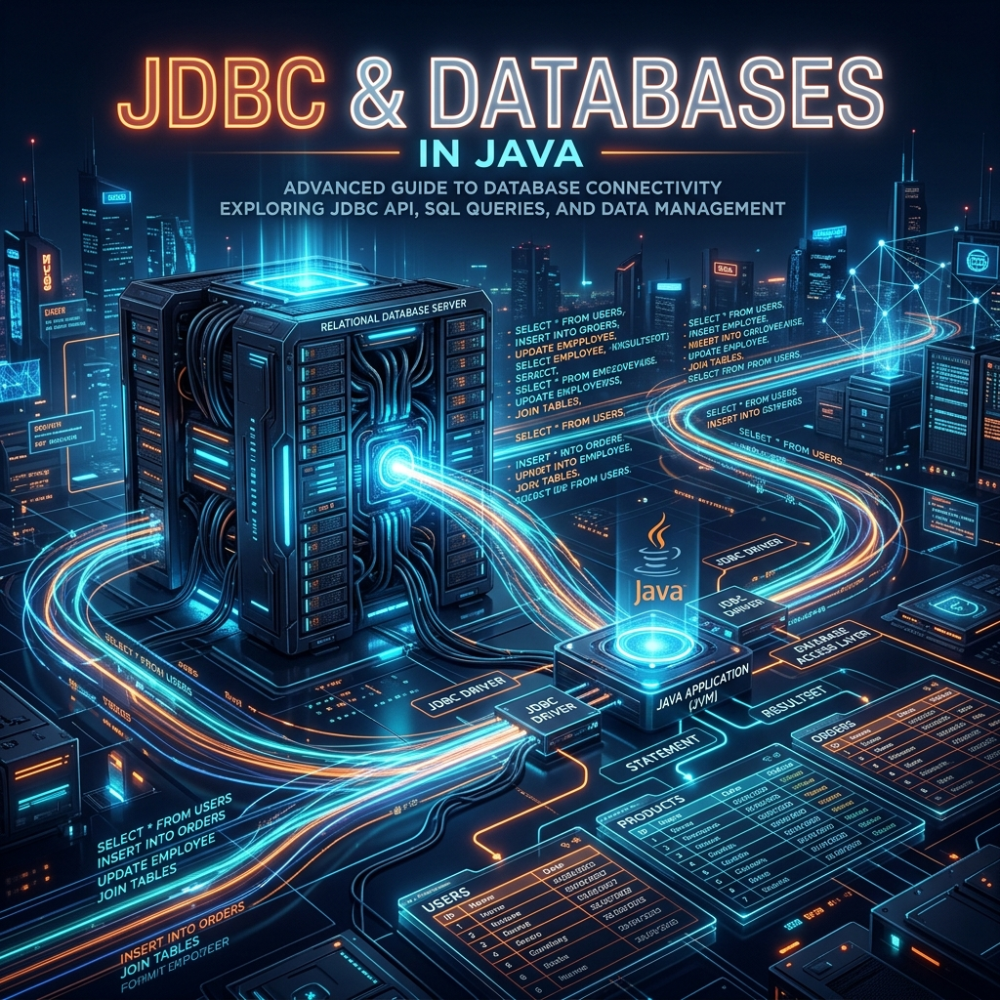

# Part 13: JDBC & Databases

<p align="center">

</p>

> **Sources:** *Core Java, Vol. I* (Horstmann) · *Java: The Complete Reference* (Schildt) · *Effective Java* (Bloch) · *Java: A Beginner's Guide* (Schildt)

---

## 🎯 Learning Objectives

By the end of this part, you will:
- Connect to relational databases using JDBC
- Execute SQL queries safely using `PreparedStatement`
- Manage transactions and understand ACID guarantees
- Use connection pooling with HikariCP
- Understand ORMs (Hibernate/JPA) and when to use them

---

## 1. What Is JDBC?

> **Feynman Insight:** Imagine you want to call someone in France but you only speak English. You need an interpreter — someone who converts your English into French and their French back to English. JDBC (Java Database Connectivity) is that interpreter between your Java code and any relational database. You speak Java + SQL; JDBC translates and handles the connection protocol. The beauty of JDBC is that you use the same Java API whether your database is PostgreSQL, MySQL, SQLite, or Oracle — only the driver (the specific interpreter) changes.

The JDBC architecture:
```
Your Java Code
       ↓
   JDBC API         ← Standard interface (java.sql)
       ↓
  JDBC Driver       ← Database-specific implementation
       ↓
   Database         ← PostgreSQL, MySQL, H2, etc.
```

---

## 2. Connecting to a Database

```java
// Step 0: Add driver dependency (Maven)
// <dependency>
//   <groupId>org.postgresql</groupId>
//   <artifactId>postgresql</artifactId>
//   <version>42.7.0</version>
// </dependency>

// Step 1: Establish connection
String url = "jdbc:postgresql://localhost:5432/mydb";

try (Connection conn = DriverManager.getConnection(url, "username", "password")) {
    System.out.println("Connected! Auto-commit: " + conn.getAutoCommit());
    // All database work happens here
} // Connection is automatically closed by try-with-resources
```

> **Bloch, Item 9:** Always use try-with-resources for database connections, statements, and result sets — they must be closed to prevent connection/cursor leaks.

---

## 3. Querying Data

### 3.1 Statement — Simple Queries (No User Input!)

```java
try (Connection conn = getConnection();
     Statement stmt = conn.createStatement();
     ResultSet rs = stmt.executeQuery("SELECT id, name, email FROM users")) {

    while (rs.next()) {
        long id       = rs.getLong("id");
        String name   = rs.getString("name");
        String email  = rs.getString("email");
        System.out.printf("%-3d %-20s %s%n", id, name, email);
    }
}
```

### 3.2 PreparedStatement — The Safe Way (Always Prefer This!)

> **Feynman Insight — SQL Injection:** If you build SQL by concatenating strings with user input — `"SELECT * FROM users WHERE name = '" + userInput + "'"` — a malicious user can input `'; DROP TABLE users; --` and destroy your database. This is SQL Injection. `PreparedStatement` prevents this because parameters are sent separately from the SQL template — the database never confuses data with code. It's like writing the order template first, then filling in the customer's name separately.

```java
String sql = "SELECT * FROM users WHERE email = ? AND active = ?";

try (Connection conn = getConnection();
     PreparedStatement pstmt = conn.prepareStatement(sql)) {

    pstmt.setString(1, userEmail);   // Parameter 1 — replaces first ?
    pstmt.setBoolean(2, true);       // Parameter 2 — replaces second ?

    try (ResultSet rs = pstmt.executeQuery()) {
        while (rs.next()) {
            System.out.println(rs.getString("name"));
        }
    }
}

// Insert with PreparedStatement
String insertSql = "INSERT INTO users (name, email, created_at) VALUES (?, ?, ?)";
try (PreparedStatement pstmt = conn.prepareStatement(insertSql,
     Statement.RETURN_GENERATED_KEYS)) {

    pstmt.setString(1, "Alice");
    pstmt.setString(2, "alice@example.com");
    pstmt.setTimestamp(3, Timestamp.from(Instant.now()));

    int affected = pstmt.executeUpdate();
    System.out.println("Rows inserted: " + affected);

    // Get the auto-generated ID
    try (ResultSet generatedKeys = pstmt.getGeneratedKeys()) {
        if (generatedKeys.next()) {
            long newId = generatedKeys.getLong(1);
            System.out.println("New user ID: " + newId);
        }
    }
}
```

---

## 4. Transactions — ACID Guarantees

> **Feynman Insight:** Imagine transferring $500 from your savings to your checking account. This involves TWO operations: (1) subtract $500 from savings, (2) add $500 to checking. What if the power fails between step 1 and step 2? Your money vanishes! A **transaction** groups operations so they either ALL succeed (commit) or ALL fail (rollback). It's like signing a contract — either both parties sign and it's valid, or nobody signs and nothing changes.

**ACID:**
- **A**tomicity — All operations succeed or none do
- **C**onsistency — Database stays in a valid state
- **I**solation — Concurrent transactions don't interfere
- **D**urability — Committed data survives crashes

```java
Connection conn = getConnection();
conn.setAutoCommit(false);  // Disable auto-commit — we control transactions

try {
    // Transfer $500: debit savings
    try (PreparedStatement debit = conn.prepareStatement(
         "UPDATE accounts SET balance = balance - ? WHERE id = ?")) {
        debit.setBigDecimal(1, new BigDecimal("500.00"));
        debit.setLong(2, savingsAccountId);
        debit.executeUpdate();
    }

    // Credit checking
    try (PreparedStatement credit = conn.prepareStatement(
         "UPDATE accounts SET balance = balance + ? WHERE id = ?")) {
        credit.setBigDecimal(1, new BigDecimal("500.00"));
        credit.setLong(2, checkingAccountId);
        credit.executeUpdate();
    }

    conn.commit();  // ✅ Both succeeded — make changes permanent
    System.out.println("Transfer complete!");

} catch (SQLException e) {
    conn.rollback();  // ❌ Something failed — undo EVERYTHING
    throw new RuntimeException("Transfer failed — rolled back", e);
} finally {
    conn.setAutoCommit(true);  // Restore default behaviour
    conn.close();
}
```

---

## 5. Connection Pooling — Production-Grade

> **Feynman Insight:** Creating a database connection is like hiring a new employee every time you need a task done, then firing them when it's done. It's extremely expensive. A **connection pool** keeps a set of pre-established connections ready to use. When your code needs a connection, it borrows one from the pool. When done, it returns it. This is like a bike-sharing scheme — the bikes (connections) are always ready; you just pick one up and return it.

```java
// HikariCP — the fastest connection pool for Java
HikariConfig config = new HikariConfig();
config.setJdbcUrl("jdbc:postgresql://localhost:5432/mydb");
config.setUsername("admin");
config.setPassword("secret");
config.setMaximumPoolSize(10);          // Max 10 concurrent connections
config.setMinimumIdle(2);              // Keep at least 2 warm
config.setConnectionTimeout(30_000);   // 30 seconds to wait for a connection
config.setIdleTimeout(600_000);        // Close idle connections after 10 min

HikariDataSource dataSource = new HikariDataSource(config);

// Usage — same Connection API, but now from the pool
try (Connection conn = dataSource.getConnection()) {
    // Use connection normally
    // When try block exits, connection is RETURNED TO POOL, not closed!
}
```

---

## 6. Mapping Results to Objects

```java
public class UserRepository {
    private final DataSource dataSource;

    public Optional<User> findById(long id) throws SQLException {
        String sql = "SELECT id, name, email, created_at FROM users WHERE id = ?";

        try (Connection conn = dataSource.getConnection();
             PreparedStatement pstmt = conn.prepareStatement(sql)) {

            pstmt.setLong(1, id);

            try (ResultSet rs = pstmt.executeQuery()) {
                if (rs.next()) {
                    return Optional.of(mapToUser(rs));
                }
                return Optional.empty();
            }
        }
    }

    public List<User> findAll() throws SQLException {
        String sql = "SELECT id, name, email, created_at FROM users ORDER BY name";
        List<User> users = new ArrayList<>();

        try (Connection conn = dataSource.getConnection();
             PreparedStatement pstmt = conn.prepareStatement(sql);
             ResultSet rs = pstmt.executeQuery()) {

            while (rs.next()) {
                users.add(mapToUser(rs));
            }
        }
        return users;
    }

    // Single private method to map ResultSet rows to User objects
    private User mapToUser(ResultSet rs) throws SQLException {
        return new User(
            rs.getLong("id"),
            rs.getString("name"),
            rs.getString("email"),
            rs.getTimestamp("created_at").toInstant()
        );
    }
}
```

---

## 7. JDBC vs ORM — When to Use Which

| | **JDBC** | **JPA/Hibernate (ORM)** |
|-|----------|-------------------------|
| **SQL control** | Full control | Abstracted (JPQL/HQL) |
| **Performance** | Optimal | Some overhead |
| **Complexity** | More verbose | Less boilerplate |
| **Best for** | Complex queries, stored procs, batch | Standard CRUD, domain objects |
| **Learning curve** | Lower | Higher |

> **Rule of thumb:** Use JDBC directly when you need fine-grained SQL control (analytics, ETL, batch). Use JPA/Spring Data when you're building a typical CRUD application with a domain model.

---

## 8. Best Practices

1. **Always use `PreparedStatement`** — never concatenate user input into SQL
2. **Use try-with-resources** for `Connection`, `Statement`, and `ResultSet`
3. **Use a connection pool** (HikariCP) — never create raw connections per request
4. **Manage transactions explicitly** for multi-step operations
5. **Return `Optional<T>`** from `findById` methods, not `null`
6. **Separate SQL from Java** — use constant strings or resource files for queries
7. **Log queries** in development — use `p6spy` or database query logs

---

## 9. Exercises

1. **User CRUD:** Implement full CRUD (Create, Read, Update, Delete) for a `User` table using JDBC and HikariCP.
2. **Transaction:** Implement a bank transfer that uses a transaction to move money between two accounts.
3. **Batch Insert:** Use `PreparedStatement.addBatch()` to insert 10,000 records efficiently.
4. **Repository Pattern:** Create a generic `CrudRepository<T, ID>` interface and implement it for `Product`.

---

## 📖 References

- *Core Java, Volume I*, Cay S. Horstmann — Chapter 5 (JDBC, Database Programming)
- *Java: The Complete Reference*, Herbert Schildt — Chapter 30 (Servlets and Database Access)
- *Effective Java*, Joshua Bloch — Item 9 (try-with-resources for resources)
- *Java: A Beginner's Guide*, Herbert Schildt — Chapter 16 (Database Access)

---

[← Part 12: Modern Java Features](Part-12-Modern-Java-Features.md) | [Back to Course Index](../README.md)
