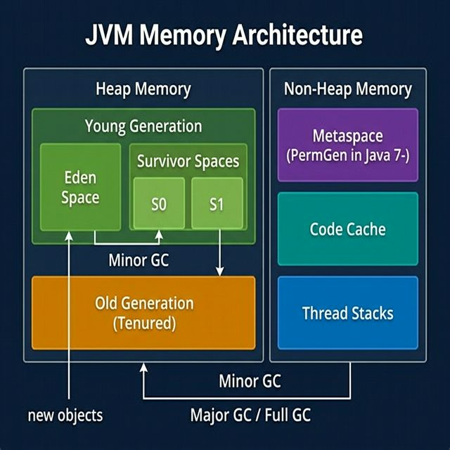
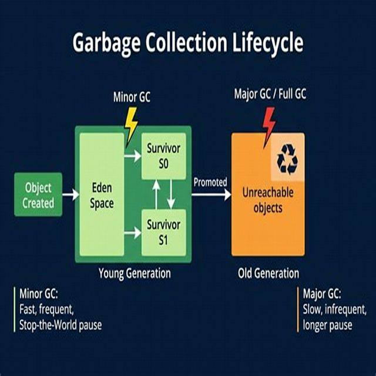
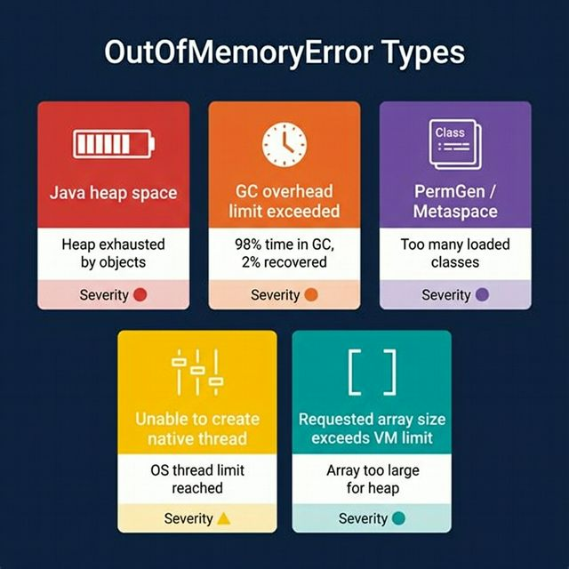
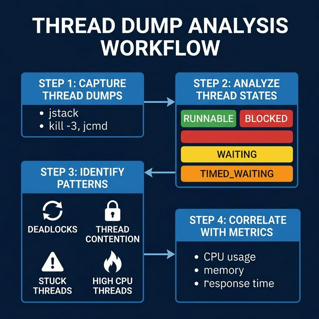

# Part 13: JVM Troubleshooting & Performance Tuning

> **Source:** *JVM Troubleshooting Handbook* — Pierre-Hugues Charbonneau (Java Code Geeks)

---

## 🎯 Learning Objectives

By the end of this part, you will:
- Understand JVM memory architecture and heap regions in depth
- Master garbage collection analysis and tuning strategies
- Diagnose and resolve `OutOfMemoryError` problems
- Perform thread dump analysis to find deadlocks and bottlenecks
- Use heap dump analysis with MAT to find memory leaks
- Understand class loading issues and their resolution
- Apply a systematic 5-step JVM tuning methodology

---

## 1. JVM Memory Architecture

<p align="center">

</p>

### 1.1 Heap Memory

The Java Heap is where all object instances live. It's divided into generational spaces:

| Region | Purpose | GC Type | Key Flag |
|--------|---------|---------|----------|
| **Eden Space** | New object allocation | Minor GC | `-Xmn` (Young Gen size) |
| **Survivor S0/S1** | Objects that survived Minor GC | Minor GC | `-XX:SurvivorRatio` |
| **Old Generation** | Long-lived objects promoted from Young Gen | Major GC / Full GC | `-Xmx` (max heap) |

```bash
# Common heap sizing flags
java -Xms512m -Xmx2048m -Xmn512m \
     -XX:SurvivorRatio=8 \
     -XX:NewRatio=2 \
     MyApplication
```

**Key relationships:**
- `-Xms` — Initial heap size (set equal to `-Xmx` to avoid resizing overhead)
- `-Xmx` — Maximum heap size
- `-Xmn` — Young Generation size (Eden + Survivors)
- `NewRatio=2` means Old Gen is 2× the size of Young Gen

### 1.2 Non-Heap Memory

| Region | Purpose | Key Flag |
|--------|---------|----------|
| **Metaspace** (Java 8+) | Class metadata, method bytecode | `-XX:MaxMetaspaceSize` |
| **PermGen** (Java 7−) | Same as Metaspace (older JVMs) | `-XX:MaxPermSize` |
| **Code Cache** | JIT-compiled native code | `-XX:ReservedCodeCacheSize` |
| **Thread Stacks** | Per-thread method call stacks | `-Xss` (stack size per thread) |

### 1.3 Memory Footprint: Static vs. Dynamic

Understanding the two components of your application's memory footprint is critical:

- **Static footprint** — Memory consumed by loaded classes, JARs, configuration, connection pools, caches. This is predictable and relatively constant.
- **Dynamic footprint** — Memory consumed by live request processing: HTTP sessions, Java objects created per transaction, serialization buffers. This fluctuates with traffic.

```
Total Heap Needed = Static Footprint 
                  + (Dynamic Footprint × Concurrent Users)
                  + GC Breathing Room (~30% buffer)
```

> **Rule of thumb:** Your Old Gen should never exceed 70–75% utilization during sustained load. If it does, either your heap is too small or you have a memory leak.

---

## 2. Garbage Collection Deep Dive

<p align="center">

</p>

### 2.1 GC Types

| GC Type | Scope | Impact | Trigger |
|---------|-------|--------|---------|
| **Minor GC** | Young Generation only | Short pause (ms) | Eden space full |
| **Major GC** | Old Generation | Longer pause (100ms–seconds) | Old Gen filling up |
| **Full GC** | Entire heap + Metaspace | Longest pause | System.gc(), OOM prevention |

### 2.2 GC Collectors

| Collector | Flag | Best For | Pause Behavior |
|-----------|------|----------|----------------|
| **Serial** | `-XX:+UseSerialGC` | Small heaps, single-core | Stop-the-world |
| **Parallel** | `-XX:+UseParallelGC` | Throughput, batch jobs | Stop-the-world (multi-thread) |
| **CMS** | `-XX:+UseConcMarkSweepGC` | Low-latency (deprecated Java 14) | Mostly concurrent |
| **G1** | `-XX:+UseG1GC` | Large heaps, balanced | Predictable pauses |
| **ZGC** | `-XX:+UseZGC` | Ultra-low latency (Java 15+) | Sub-millisecond pauses |
| **Shenandoah** | `-XX:+UseShenandoahGC` | Low latency (OpenJDK) | Concurrent compaction |

### 2.3 Enabling and Reading Verbose GC

```bash
# Java 8
java -verbose:gc -XX:+PrintGCDetails -XX:+PrintGCDateStamps \
     -Xloggc:gc.log MyApplication

# Java 9+ (Unified Logging)
java -Xlog:gc*:file=gc.log:time,uptime,level,tags MyApplication
```

**Sample GC log output (Java 8):**

```
2026-03-23T10:15:30.123+0100: [GC (Allocation Failure)
    [PSYoungGen: 524288K->87040K(611840K)]
    1048576K->614400K(2010112K), 0.0523456 secs]
    [Times: user=0.15 sys=0.02, real=0.05 secs]
```

**How to read it:**

| Field | Meaning |
|-------|---------|
| `GC (Allocation Failure)` | Minor GC triggered because Eden was full |
| `PSYoungGen: 524288K->87040K` | Young Gen: 512 MB before → 85 MB after |
| `1048576K->614400K` | Total heap: 1 GB before → 600 MB after |
| `0.0523456 secs` | GC pause duration (~52 ms) |

### 2.4 Key GC Metrics to Monitor

| Metric | Healthy | Warning | Critical |
|--------|---------|---------|----------|
| GC pause time | < 100ms | 100ms–1s | > 1s |
| GC frequency (Full GC) | < 1/hour | 1–10/hour | > 10/hour |
| Old Gen utilization after Full GC | < 60% | 60–80% | > 80% (leak?) |
| Time spent in GC | < 5% | 5–10% | > 10% |

### 2.5 GC Overhead Limit Exceeded

```
java.lang.OutOfMemoryError: GC overhead limit exceeded
```

This error (introduced in Java 6) fires when:
- **More than 98%** of total time is spent in garbage collection
- **Less than 2%** of the heap is recovered per collection

It's an early warning — the JVM detects that it's effectively stuck in a GC loop. The fix is **not** to disable the check (`-XX:-UseGCOverheadLimit`), but to find the root cause.

---

## 3. OutOfMemoryError — Diagnosis & Resolution

<p align="center">

</p>

### 3.1 Java Heap Space

```
java.lang.OutOfMemoryError: Java heap space
```

**Root causes:**
1. **Memory leak** — Objects accumulate and are never eligible for GC
2. **Undersized heap** — Application genuinely needs more memory
3. **Large data payloads** — Processing huge XML/JSON/CSV in memory
4. **Thread-retained memory** — Stuck threads holding onto object references

**Diagnosis steps:**

```bash
# Step 1: Enable heap dump on OOM
java -XX:+HeapDumpOnOutOfMemoryError \
     -XX:HeapDumpPath=/tmp/heapdumps/ MyApplication

# Step 2: Analyze with Eclipse MAT or VisualVM
# Look for: Dominator tree → largest retained objects
# Look for: Leak suspects report → automatic analysis

# Step 3: Monitor with JConsole/JVisualVM
jconsole <pid>
jvisualvm
```

### 3.2 Metaspace / PermGen

```
java.lang.OutOfMemoryError: Metaspace
java.lang.OutOfMemoryError: PermGen space    # Java 7 and earlier
```

**Root causes:**
- Too many classes loaded (common in app servers with hot-deploy)
- Class loader leaks — old versions of classes not being garbage collected
- Heavy use of dynamic proxies, reflection, or bytecode generation

```bash
# Increase Metaspace
java -XX:MaxMetaspaceSize=512m MyApplication

# Monitor class loading
java -verbose:class MyApplication
```

### 3.3 Unable to Create New Native Thread

```
java.lang.OutOfMemoryError: unable to create new native thread
```

**Root causes:**
- OS thread limit reached (`ulimit -u`)
- Too many threads created by the application or container
- Thread stack size too large, consuming all virtual memory

```bash
# Check current limits
ulimit -u    # max user processes
ulimit -n    # max open files

# Reduce thread stack size (default is usually 512KB–1MB)
java -Xss256k MyApplication

# Monitor thread count
jcmd <pid> Thread.print | grep -c "Thread"
```

### 3.4 File Descriptor Exhaustion

```
java.net.SocketException: Too many open files
```

File descriptors are required for **both** file handles and socket connections. In high-throughput servers, each inbound/outbound connection requires a file descriptor.

```bash
# Check file descriptor limits
ulimit -n                              # Soft limit
cat /proc/<pid>/limits                 # Linux: per-process limits

# Check current usage
ls /proc/<pid>/fd | wc -l             # Linux
lsof -p <pid> | wc -l                 # macOS / Linux

# Increase the limit
ulimit -n 65536
```

---

## 4. Thread Dump Analysis

<p align="center">

</p>

### 4.1 Capturing Thread Dumps

```bash
# Method 1: jstack (most common)
jstack <pid> > thread_dump.txt

# Method 2: jcmd (recommended for modern JDK)
jcmd <pid> Thread.print > thread_dump.txt

# Method 3: kill signal (Unix/macOS)
kill -3 <pid>    # Output goes to stdout/stderr

# Method 4: Programmatic
ThreadMXBean threadMXBean = ManagementFactory.getThreadMXBean();
ThreadInfo[] threadInfos = threadMXBean.dumpAllThreads(true, true);
```

> **Best practice:** Capture **3–5 thread dumps** at **10-second intervals** to identify trends and distinguish between transient and persistent issues.

### 4.2 Reading a Thread Dump

```
"http-nio-8080-exec-42" #87 daemon prio=5 os_prio=0
   java.lang.Thread.State: BLOCKED (on object monitor)
        at com.example.service.OrderService.processOrder(OrderService.java:145)
        - waiting to lock <0x00000006c7b8a9d0> (a java.util.HashMap)
        at com.example.controller.OrderController.createOrder(OrderController.java:67)
```

**Key fields:**

| Field | Meaning |
|-------|---------|
| Thread name | `http-nio-8080-exec-42` — Tomcat worker thread |
| State | `BLOCKED` — Waiting for a lock held by another thread |
| Stack trace | Shows exactly where the thread is stuck |
| Lock info | `waiting to lock <0x...>` — The object it wants to lock |

### 4.3 Thread States

| State | Meaning | Action |
|-------|---------|--------|
| **RUNNABLE** | Executing or ready to execute | Check if consuming CPU |
| **BLOCKED** | Waiting for a monitor lock | Look for lock contention |
| **WAITING** | Waiting indefinitely (`Object.wait()`, `Thread.join()`) | Check what it's waiting for |
| **TIMED_WAITING** | Waiting with timeout (`Thread.sleep()`, timed `wait()`) | Usually normal |

### 4.4 Common Thread Dump Patterns

**Deadlock — Two threads holding locks the other needs:**

```
"Thread-1":
  waiting to lock <0xABC> (held by "Thread-2")
  locked <0xDEF>

"Thread-2":
  waiting to lock <0xDEF> (held by "Thread-1")
  locked <0xABC>
```

**Thread contention — Many threads blocked on the same lock:**

```
"http-exec-1": BLOCKED waiting to lock <0x123> (a ConnectionPool)
"http-exec-2": BLOCKED waiting to lock <0x123> (a ConnectionPool)
"http-exec-3": BLOCKED waiting to lock <0x123> (a ConnectionPool)
... (50+ threads blocked on same lock)
```

**Stuck threads — Thread running for an abnormally long time:**

```
"http-exec-22": RUNNABLE
  at java.net.SocketInputStream.socketRead0(Native Method)
  at com.example.client.ExternalApiClient.callService(ExternalApiClient.java:89)
  # This thread has been here for 600+ seconds — the remote service is not responding
```

### 4.5 Automated Detection

```bash
# JVM built-in deadlock detection
jcmd <pid> Thread.print | grep -A 5 "deadlock"

# Using jstack
jstack <pid> | grep -i "deadlock"
```

---

## 5. Heap Dump Analysis with Eclipse MAT

### 5.1 Generating Heap Dumps

```bash
# On OutOfMemoryError (recommended — always enable in production)
java -XX:+HeapDumpOnOutOfMemoryError \
     -XX:HeapDumpPath=/var/dumps/ MyApplication

# On-demand with jmap
jmap -dump:format=b,file=heapdump.hprof <pid>

# On-demand with jcmd
jcmd <pid> GC.heap_dump /tmp/heapdump.hprof
```

### 5.2 Analysis Workflow with MAT

| Step | MAT Feature | What to Look For |
|------|-------------|-----------------|
| 1 | **Leak Suspects Report** | Automatic detection of likely leaks |
| 2 | **Histogram** | Which classes consume the most memory |
| 3 | **Dominator Tree** | Which objects "retain" the most memory |
| 4 | **Thread Overview** | Per-thread retained memory (often the real culprit) |
| 5 | **Path to GC Roots** | Why an object can't be garbage collected |

### 5.3 Key Concepts

**Shallow vs. Retained Size:**

| Metric | Definition | Example |
|--------|-----------|---------|
| **Shallow size** | Memory consumed by the object itself | `HashMap` header = ~48 bytes |
| **Retained size** | Memory freed if this object were garbage collected (including all objects it references exclusively) | `HashMap` + all its entries + keys + values = 500 MB |

> **Always look at retained size** — an object with a tiny shallow size can retain gigabytes of objects through its references.

### 5.4 Thread-Retained Memory Pattern

This is one of the most misdiagnosed patterns. The book describes a real production case:

1. **Symptom:** `OutOfMemoryError: Java heap space` during peak load
2. **Initial assumption:** Memory leak in new code
3. **Actual root cause:** STUCK threads retaining large JSON payloads

**What happens:**
- Threads processing HTTP requests hold references to request/response data
- If a remote call is slow (e.g., 600+ seconds), the thread's local variables retain their data
- Short-lived objects (JSON payloads, XML buffers) get promoted to Old Gen
- With many stuck threads, the Old Gen fills up rapidly

**Investigation:**

```
MAT Histogram → Filter by "ExecuteThread"
  210 threads × ~4 MB retained each = 806 MB
  (On a 1 GB Old Gen → game over)
```

**Resolution checklist:**
1. Set proper connection/read timeouts on all remote calls
2. Implement circuit breakers (e.g., Resilience4j)
3. Monitor thread pool utilization and stuck thread counts
4. Consider reducing max thread pool size if per-thread memory is high

---

## 6. ClassLoader Problems

### 6.1 ClassNotFoundException

```
java.lang.ClassNotFoundException: com.example.MyClass
```

**Occurs at runtime when:**
- `Class.forName("com.example.MyClass")` — class not on classpath
- `ClassLoader.loadClass("com.example.MyClass")` — class not found by this loader

**Resolution:**

```bash
# Check classpath
java -cp "lib/*:classes" MyApp

# Verify the class exists in a JAR
jar tf mylib.jar | grep MyClass

# Check for typos in class names
# Check for missing JAR files in deployment
```

### 6.2 NoClassDefFoundError

```
java.lang.NoClassDefFoundError: com/example/ReferencingClass
```

This is **more subtle** than `ClassNotFoundException`. The class **was** found at compile time but **cannot be loaded** at runtime. Common causes:

| Cause | Scenario |
|-------|----------|
| **Missing dependency JAR** | ClassA references ClassB, but ClassB's JAR is not deployed |
| **Class loader isolation** | ClassA loaded by parent loader, ClassB only in child loader |
| **Static initializer failure** | Class's `static {}` block threw an exception on first load |

**Key concept — Class Loader Delegation Model:**

```
Bootstrap ClassLoader (rt.jar, core Java)
       ↑ delegates to parent first
Extension ClassLoader (ext/*.jar)
       ↑ delegates to parent first
Application ClassLoader (classpath)
       ↑ delegates to parent first
Custom ClassLoader (web apps, plugins)
```

**Parent-first delegation** means: if a class is found by a parent loader, the child loader's version is ignored. This can cause `NoClassDefFoundError` when the parent loads ClassA but can't see ClassB (which is only in the child loader).

---

## 7. The 5-Step JVM Tuning Methodology

This systematic approach from the book ensures thorough and effective tuning:

### Step 1: Establish a Baseline

```bash
# Enable comprehensive monitoring
java -Xlog:gc*:file=gc.log:time,uptime,level,tags \
     -XX:+HeapDumpOnOutOfMemoryError \
     -XX:HeapDumpPath=/var/dumps/ \
     MyApplication
```

- Measure static memory footprint (after startup, before load)
- Measure dynamic footprint under realistic load
- Record GC frequency, pause times, and Old Gen utilization

### Step 2: Size the Heap Properly

```bash
# Start with a generous heap, then refine
java -Xms2g -Xmx2g -Xmn768m MyApplication
```

| Guideline | Recommendation |
|-----------|---------------|
| Min heap = Max heap | Avoids resize overhead |
| Young Gen | 25–40% of total heap |
| Old Gen after Full GC | Should be < 60% utilized |
| Survivor ratio | Default (8) is usually fine |

### Step 3: Select and Tune the GC Collector

```bash
# For most modern applications: G1GC
java -XX:+UseG1GC \
     -XX:MaxGCPauseMillis=200 \
     -XX:G1HeapRegionSize=16m \
     MyApplication

# For ultra-low-latency (Java 17+): ZGC
java -XX:+UseZGC \
     -XX:+ZGenerational \
     MyApplication
```

### Step 4: Plan for Fail-Over and Spikes

- Keep Old Gen below 70% under normal load
- Reserve 30% buffer for traffic spikes and fail-over scenarios
- Test with simulated fail-over (redirect traffic from one node)

### Step 5: Divide and Conquer

When a single JVM can't be tuned effectively:
- Split application into multiple JVM processes
- Use horizontal scaling (multiple nodes)
- Each process gets smaller, more manageable heap
- Reduces GC pause times and tuning complexity

---

## 8. Essential JVM Diagnostic Tools

| Tool | Purpose | Command |
|------|---------|---------|
| **jps** | List Java processes | `jps -lv` |
| **jstack** | Thread dump | `jstack <pid>` |
| **jmap** | Heap dump, histogram | `jmap -dump:format=b,file=dump.hprof <pid>` |
| **jstat** | GC statistics | `jstat -gcutil <pid> 1000` |
| **jcmd** | All-in-one diagnostic | `jcmd <pid> help` |
| **jinfo** | JVM flags and system properties | `jinfo <pid>` |
| **Eclipse MAT** | Heap dump analysis | GUI tool |
| **JVisualVM** | Real-time monitoring | GUI tool |
| **async-profiler** | CPU/allocation profiling | Low-overhead production profiler |

### Quick Diagnostic Commands

```bash
# List all Java processes with details
jps -lv

# GC statistics every second
jstat -gcutil <pid> 1000
#   S0     S1     E      O      M     CCS    YGC   YGCT    FGC   FGCT    CGC   CGCT     GCT
# 45.23   0.00  67.89  34.56  97.12  93.45   127   2.345    3   1.234    12   0.567   4.146

# Class loading statistics
jstat -class <pid> 1000

# Thread dump with locks
jstack -l <pid>

# Heap histogram (live objects)
jmap -histo:live <pid> | head -30

# Complete diagnostic (Java 11+)
jcmd <pid> VM.info
jcmd <pid> GC.heap_info
jcmd <pid> VM.native_memory summary
```

---

## 9. Production Checklist

### Must-Have JVM Arguments

```bash
java \
  # Heap sizing
  -Xms4g -Xmx4g \
  -Xmn1536m \
  
  # GC selection
  -XX:+UseG1GC \
  -XX:MaxGCPauseMillis=200 \
  
  # GC logging
  -Xlog:gc*:file=gc.log:time,uptime,level,tags:filecount=5,filesize=50m \
  
  # Heap dump on OOM
  -XX:+HeapDumpOnOutOfMemoryError \
  -XX:HeapDumpPath=/var/dumps/ \
  
  # JMX remote monitoring
  -Dcom.sun.management.jmxremote \
  -Dcom.sun.management.jmxremote.port=9090 \
  -Dcom.sun.management.jmxremote.ssl=false \
  
  # Error file
  -XX:ErrorFile=/var/logs/hs_err_%p.log \
  
  MyApplication
```

### Monitoring Alerts

| Metric | Warning Threshold | Critical Threshold |
|--------|-------------------|-------------------|
| Heap usage | > 75% | > 90% |
| Full GC frequency | > 5/hour | > 20/hour |
| GC pause time | > 500ms | > 2s |
| Thread count | > 500 | > 1000 |
| CPU usage (GC threads) | > 10% | > 25% |

---

## 10. Best Practices

1. **Always enable GC logging and heap dump on OOM in production** — the overhead is negligible
2. **Set `-Xms` equal to `-Xmx`** — avoids heap resizing overhead
3. **Use G1GC for most applications** (Java 9+) — balanced throughput and latency
4. **Never catch `OutOfMemoryError`** — the JVM state is unreliable after OOM
5. **Set timeouts on all remote calls** — prevent stuck threads from retaining memory
6. **Monitor thread pools** — thread contention is a hidden memory problem
7. **Capture multiple thread dumps** — a single snapshot is rarely enough
8. **Look at retained size, not shallow size** — in heap dump analysis
9. **Test with realistic data volumes** — synthetic tests with tiny payloads miss real-world issues
10. **Plan for fail-over** — keep 30% heap headroom for traffic spikes

---

## 11. Exercises

1. **GC Analysis:** Run a Java application with `-Xlog:gc*` and analyze the output. Identify Minor GC frequency, Major GC events, and calculate time spent in GC.
2. **Thread Dump Investigation:** Create a program with a deliberate deadlock (two threads, two locks). Capture a thread dump with `jstack` and identify the deadlock.
3. **Heap Dump Analysis:** Use `-XX:+HeapDumpOnOutOfMemoryError` with a program that deliberately creates a memory leak. Open the dump in Eclipse MAT and find the leak.
4. **Tuning Lab:** Start with a poorly tuned JVM (`-Xmx64m`, serial GC) and iteratively tune it for a sample web application. Document each change and its effect on GC behavior.
5. **ClassLoader Puzzle:** Create a program that demonstrates `NoClassDefFoundError` by splitting classes across parent and child class loaders.

---

## 📖 References

- *JVM Troubleshooting Handbook*, Pierre-Hugues Charbonneau — JavaCodeGeeks
- [Oracle JVM Troubleshooting Guide](https://docs.oracle.com/en/java/javase/17/troubleshoot/)
- [Eclipse Memory Analyzer (MAT)](https://www.eclipse.org/mat/)
- [G1GC Tuning Guide](https://docs.oracle.com/en/java/javase/17/gctuning/)
- [Java Platform, Standard Edition Troubleshooting Guide](https://docs.oracle.com/javase/8/docs/technotes/guides/troubleshoot/)

---

[← Part 12: JNI & Project Panama](Part-12-JNI-And-Panama.md) | [Back to Course Index](../README.md)
