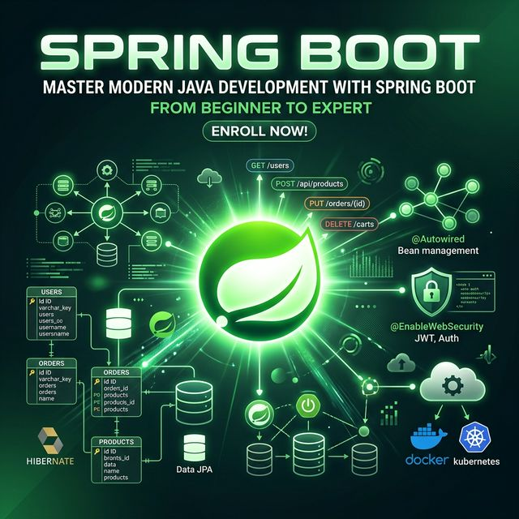

# 🍃 Spring Boot Course

> A comprehensive course on **Spring Boot 3**, **Spring 6**, and **Hibernate** — from REST APIs to advanced AOP and ORM deep dives.

---

## 📚 Source Materials

| Book / Course | Topics Covered |
|---------------|---------------|
| **Spring Boot 3, Spring 6 & Hibernate** (Udemy — Chad Darby) | Spring Core, IoC, REST APIs, Spring MVC, Security, JPA/Hibernate, AOP |
| **Hibernate in Action** | ORM architecture, mapping, object lifecycle, transactions, caching, querying |
| **AspectJ in Action** (2nd Ed) | AOP concepts, join point model, AspectJ syntax, Spring AOP, design patterns |

---

## 🗺️ Course Map

| Part | Topic | Source | Difficulty |
|------|-------|--------|-----------|
| [Part 1](docs/Part-01-Spring-Core-And-JPA-CRUD.md) | **Spring Core & JPA CRUD** | Udemy Sections 1-3 | ⭐ Beginner |
| [Part 3](docs/Part-03-REST-CRUD-APIs.md) | **REST CRUD APIs** | Udemy Section 4 | ⭐ Beginner |
| [Part 4](docs/Part-04-REST-API-Security.md) | **REST API Security** | Udemy Section 5 | ⭐⭐ Intermediate |
| [Part 5](docs/Part-05-Spring-MVC.md) | **Spring MVC** | Udemy Section 6 | ⭐⭐ Intermediate |
| [Part 6](docs/Part-06-Spring-MVC-CRUD.md) | **Spring MVC CRUD** | Udemy Section 7 | ⭐⭐ Intermediate |
| [Part 7](docs/Part-07-Spring-MVC-Security.md) | **Spring MVC Security** | Udemy Section 8 | ⭐⭐⭐ Advanced |
| [Part 8](docs/Part-08-JPA-Advanced-Mappings.md) | **JPA Advanced Mappings** | Udemy Section 9 | ⭐⭐⭐ Advanced |
| [Part 9](docs/Part-09-AOP.md) | **Aspect-Oriented Programming** | Udemy Section 10 | ⭐⭐⭐ Advanced |
| [Part 10](docs/Part-10-Hibernate-Deep-Dive.md) | **Hibernate Deep Dive** | Hibernate in Action | ⭐⭐⭐ Advanced |
| [Part 11](docs/Part-11-AspectJ-Deep-Dive.md) | **AspectJ Deep Dive** | AspectJ in Action | ⭐⭐⭐ Advanced |

---

## 🛤️ Learning Paths

### Path A: Backend API Developer
1. Part 1 → Part 3 → Part 4 → Part 8 → Part 10

### Path B: Full-Stack Spring Developer
1. Part 1 → Part 3 → Part 5 → Part 6 → Part 7

### Path C: Advanced Architecture
1. Part 9 → Part 11 → Part 8 → Part 10

---

## 📖 Each Part Includes

- 📝 **Detailed explanations** with conceptual diagrams
- 💻 **Code examples** with annotations
- ⚠️ **Common pitfalls** and troubleshooting
- 🎯 **Best practices** from industry experience
- 📎 **References** to source materials

---

## 🗂️ Additional Resources

- [Project Catalog](PROJECT-CATALOG.md) — All practice projects indexed by section
- [Sample Projects](spring-boot-3-spring-6-hibernate-for-beginners-main/) — Companion code repository

---

## 🛠️ Prerequisites

- **Java 17+** (Java 21 recommended)
- **Maven** or **Gradle**
- **IntelliJ IDEA** (recommended) or Eclipse/VS Code
- Basic SQL knowledge
- Completion of the [Java Course](../Java/README.md) or equivalent experience

---

[← Back to Java & Spring Boot Home](../README.md)
