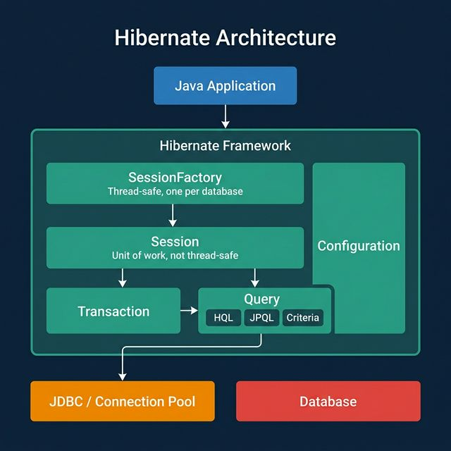
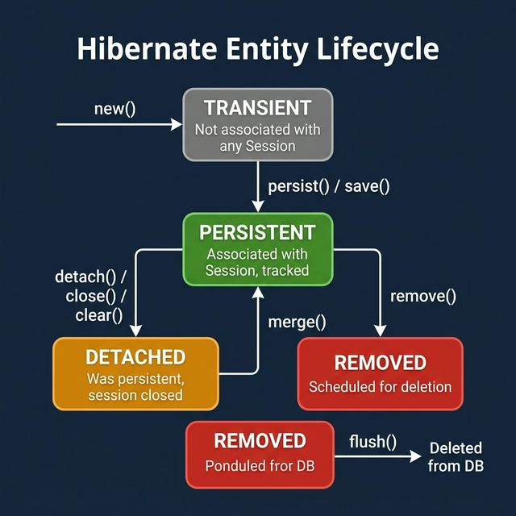

# Part 10: Hibernate Deep Dive

> **Source:** *Hibernate in Action* — Manning Publications

---

## 🎯 Learning Objectives

- Understand ORM fundamentals and the impedance mismatch problem
- Master Hibernate architecture: SessionFactory, Session, Transaction
- Configure advanced mapping strategies: inheritance, associations, components
- Manage object lifecycle and persistence states
- Optimize performance with caching, batch fetching, and query tuning

---

## 1. Understanding ORM

### 1.1 The Object-Relational Impedance Mismatch

| Problem | OOP World | Relational World |
|---------|-----------|------------------|
| Granularity | Rich hierarchies, nested objects | Flat tables |
| Identity | `==` and `.equals()` | Primary keys |
| Associations | Object references, collections | Foreign keys, join tables |
| Inheritance | IS-A hierarchies | No native support |
| Data navigation | `person.getAddress().getCity()` | JOINs |

### 1.2 ORM as a Solution

ORM (Object-Relational Mapping) bridges these worlds by:
1. Mapping classes to tables, fields to columns
2. Translating object operations to SQL
3. Managing object identity and lifecycle
4. Handling association lazy/eager loading

---

## 2. Hibernate Architecture

### 2.1 Core Components

<p align="center">

</p>

### 2.2 SessionFactory & Session

```java
// Building SessionFactory (modern approach with Spring Boot)
@Configuration
public class HibernateConfig {

    @Bean
    public LocalSessionFactoryBean sessionFactory(DataSource dataSource) {
        LocalSessionFactoryBean factory = new LocalSessionFactoryBean();
        factory.setDataSource(dataSource);
        factory.setPackagesToScan("com.example.entity");
        factory.setHibernateProperties(hibernateProperties());
        return factory;
    }

    private Properties hibernateProperties() {
        Properties props = new Properties();
        props.put("hibernate.dialect", "org.hibernate.dialect.PostgreSQLDialect");
        props.put("hibernate.show_sql", "true");
        props.put("hibernate.format_sql", "true");
        props.put("hibernate.hbm2ddl.auto", "validate");
        return props;
    }
}

// Using Session directly
@Repository
public class EmployeeDAO {
    @Autowired
    private SessionFactory sessionFactory;

    public Employee findById(Long id) {
        Session session = sessionFactory.getCurrentSession();
        return session.get(Employee.class, id);
    }

    public void save(Employee employee) {
        Session session = sessionFactory.getCurrentSession();
        session.persist(employee);
    }
}
```

---

## 3. Mapping Strategies

### 3.1 Basic Entity Mapping

```java
@Entity
@Table(name = "employees")
public class Employee {

    @Id
    @GeneratedValue(strategy = GenerationType.IDENTITY)
    private Long id;

    @Column(name = "first_name", nullable = false, length = 50)
    private String firstName;

    @Column(name = "last_name", nullable = false, length = 50)
    private String lastName;

    @Column(unique = true)
    private String email;

    @Enumerated(EnumType.STRING)
    private EmployeeStatus status;

    @Temporal(TemporalType.TIMESTAMP)
    @Column(name = "created_at")
    private Date createdAt;

    @Embedded
    private Address address;
}
```

### 3.2 Embeddable Components

```java
@Embeddable
public class Address {
    private String street;
    private String city;
    private String state;

    @Column(name = "zip_code")
    private String zipCode;
}
```

### 3.3 Inheritance Mapping

**Three strategies:**

```java
// Strategy 1: SINGLE_TABLE (default) — all classes in one table
@Entity
@Inheritance(strategy = InheritanceType.SINGLE_TABLE)
@DiscriminatorColumn(name = "payment_type")
public abstract class Payment {
    @Id @GeneratedValue
    private Long id;
    private double amount;
}

@Entity
@DiscriminatorValue("CREDIT")
public class CreditCardPayment extends Payment {
    private String cardNumber;
}

@Entity
@DiscriminatorValue("BANK")
public class BankTransfer extends Payment {
    private String bankAccount;
}

// Strategy 2: JOINED — separate table per class, joined with FK
@Inheritance(strategy = InheritanceType.JOINED)

// Strategy 3: TABLE_PER_CLASS — complete table per concrete class
@Inheritance(strategy = InheritanceType.TABLE_PER_CLASS)
```

| Strategy | Pros | Cons |
|----------|------|------|
| SINGLE_TABLE | Fast queries, simple | Nullable columns, wasted space |
| JOINED | Normalized, no nulls | Joins required for queries |
| TABLE_PER_CLASS | No joins for concrete type queries | Union for polymorphic queries |

### 3.4 Association Mappings

```java
// One-to-Many / Many-to-One
@Entity
public class Department {
    @OneToMany(mappedBy = "department", cascade = CascadeType.ALL, fetch = FetchType.LAZY)
    private List<Employee> employees = new ArrayList<>();
}

@Entity
public class Employee {
    @ManyToOne(fetch = FetchType.LAZY)
    @JoinColumn(name = "department_id")
    private Department department;
}

// Many-to-Many
@Entity
public class Student {
    @ManyToMany(cascade = {CascadeType.PERSIST, CascadeType.MERGE})
    @JoinTable(
        name = "student_course",
        joinColumns = @JoinColumn(name = "student_id"),
        inverseJoinColumns = @JoinColumn(name = "course_id")
    )
    private Set<Course> courses = new HashSet<>();
}

// One-to-One
@Entity
public class User {
    @OneToOne(cascade = CascadeType.ALL, fetch = FetchType.LAZY)
    @JoinColumn(name = "profile_id")
    private UserProfile profile;
}
```

---

## 4. Object Lifecycle & Persistence States

<p align="center">

</p>

### Dirty Checking

Hibernate **automatically detects changes** to persistent objects:

```java
@Transactional
public void updateSalary(Long id, double newSalary) {
    Employee emp = session.get(Employee.class, id);  // PERSISTENT
    emp.setSalary(newSalary);  // Dirty checking detects this
    // No explicit save() needed! Hibernate auto-flushes on commit
}
```

---

## 5. Fetching Strategies

### 5.1 Lazy vs. Eager Loading

```java
// LAZY (default for collections) — loaded on demand
@OneToMany(fetch = FetchType.LAZY)
private List<Order> orders;

// EAGER — loaded immediately with parent
@ManyToOne(fetch = FetchType.EAGER)
private Customer customer;
```

### 5.2 The N+1 Problem

```java
// BAD — N+1 queries
List<Department> departments = session.createQuery("FROM Department", Department.class).list();
for (Department dept : departments) {
    dept.getEmployees().size();  // Each triggers a separate query!
}

// GOOD — JOIN FETCH (single query)
List<Department> departments = session.createQuery(
    "FROM Department d JOIN FETCH d.employees", Department.class
).list();

// GOOD — Entity Graph
@EntityGraph(attributePaths = {"employees", "employees.address"})
List<Department> findAll();

// GOOD — Batch fetching
@BatchSize(size = 25)
@OneToMany(mappedBy = "department")
private List<Employee> employees;
```

---

## 6. Caching

### 6.1 First-Level Cache (Session Cache)

- **Automatic** — enabled per Session
- **Scope:** Single transaction/session
- Objects loaded once per session are returned from cache
- Cleared on `session.clear()` or `session.evict(obj)`

### 6.2 Second-Level Cache (Shared)

```java
// Enable in application.properties
// spring.jpa.properties.hibernate.cache.use_second_level_cache=true
// spring.jpa.properties.hibernate.cache.region.factory_class=org.hibernate.cache.ehcache.EhCacheRegionFactory

@Entity
@Cache(usage = CacheConcurrencyStrategy.READ_WRITE)
public class Country {
    @Id
    private String code;
    private String name;
}
```

| Strategy | Use Case |
|----------|----------|
| READ_ONLY | Reference data that never changes |
| READ_WRITE | Data that's read frequently, updated occasionally |
| NONSTRICT_READ_WRITE | Tolerable staleness |
| TRANSACTIONAL | Full transactional guarantees |

### 6.3 Query Cache

```java
// Enable query cache
// spring.jpa.properties.hibernate.cache.use_query_cache=true

List<Country> countries = session.createQuery("FROM Country", Country.class)
    .setCacheable(true)
    .list();
```

---

## 7. Querying

### 7.1 HQL / JPQL

```java
// Simple query
List<Employee> emps = session.createQuery(
    "FROM Employee e WHERE e.salary > :minSalary", Employee.class)
    .setParameter("minSalary", 50000.0)
    .list();

// Aggregate
Double avgSalary = session.createQuery(
    "SELECT AVG(e.salary) FROM Employee e WHERE e.department.name = :dept", Double.class)
    .setParameter("dept", "Engineering")
    .uniqueResult();

// Pagination
List<Employee> page = session.createQuery("FROM Employee ORDER BY e.lastName", Employee.class)
    .setFirstResult(20)
    .setMaxResults(10)
    .list();
```

### 7.2 Criteria API

```java
CriteriaBuilder cb = session.getCriteriaBuilder();
CriteriaQuery<Employee> query = cb.createQuery(Employee.class);
Root<Employee> root = query.from(Employee.class);

query.select(root)
    .where(
        cb.and(
            cb.greaterThan(root.get("salary"), 50000.0),
            cb.equal(root.get("department").get("name"), "Engineering")
        )
    )
    .orderBy(cb.desc(root.get("salary")));

List<Employee> results = session.createQuery(query).getResultList();
```

### 7.3 Native SQL

```java
List<Object[]> results = session.createNativeQuery(
    "SELECT e.first_name, e.salary FROM employees e WHERE e.salary > ?1")
    .setParameter(1, 50000.0)
    .list();
```

---

## 8. Transactions & Concurrency

### 8.1 Optimistic Locking

```java
@Entity
public class Product {
    @Id @GeneratedValue
    private Long id;
    private String name;
    private double price;

    @Version  // Optimistic locking — auto-incremented on update
    private int version;
}
// If two transactions update the same row, the second gets OptimisticLockException
```

### 8.2 Pessimistic Locking

```java
Employee emp = session.find(Employee.class, id, LockModeType.PESSIMISTIC_WRITE);
// SELECT ... FOR UPDATE — database-level lock
```

---

## 9. Best Practices

1. **Always use `FetchType.LAZY`** for collections — fetch eagerly only when needed (JOIN FETCH)
2. **Watch for N+1 queries** — use batch fetching, entity graphs, or JOIN FETCH
3. **Use `@Version` for optimistic locking** in concurrent environments
4. **Enable SQL logging in dev** — `hibernate.show_sql=true` + `hibernate.format_sql=true`
5. **Don't use `hibernate.hbm2ddl.auto=update` in production** — use Flyway/Liquibase
6. **Keep Sessions short-lived** — don't hold open sessions across user interactions
7. **Use DTOs for read-only queries** — avoids unnecessary object tracking
8. **Configure second-level cache** for frequently-read, rarely-changed data
9. **Profile with Hibernate Statistics** — `hibernate.generate_statistics=true`

---

## 10. Exercises

1. **Entity Modeling:** Model a library system (Book, Author, Publisher, Genre) with all association types
2. **Inheritance Mapping:** Implement a payment system with SINGLE_TABLE vs JOINED, compare queries
3. **N+1 Fix:** Given a deliberately N+1 query, fix it three different ways
4. **Caching Lab:** Configure second-level cache for `Country` entity, measure hit rates
5. **Optimistic Locking:** Simulate a concurrent update scenario, handle `OptimisticLockException`

---

## 📖 References

- *Hibernate in Action*, Christian Bauer & Gavin King — Complete Hibernate reference
- [Hibernate ORM Documentation](https://hibernate.org/orm/documentation/)
- [Spring Data JPA Reference](https://docs.spring.io/spring-data/jpa/docs/current/reference/html/)

---

[← Part 9: AOP](Part-09-AOP.md) | [Back to Course Index](../README.md) | [Next: Part 11 — AspectJ Deep Dive →](Part-11-AspectJ-Deep-Dive.md)
