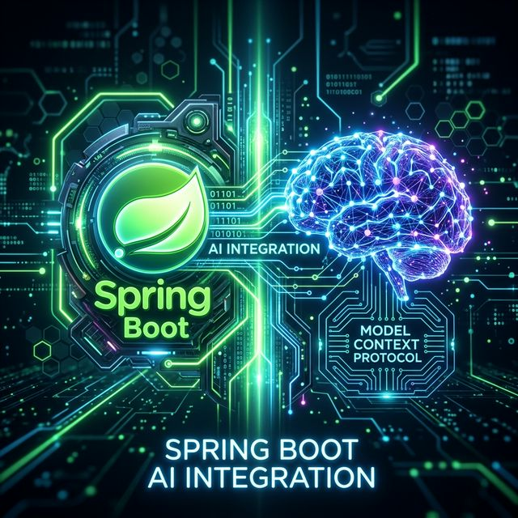
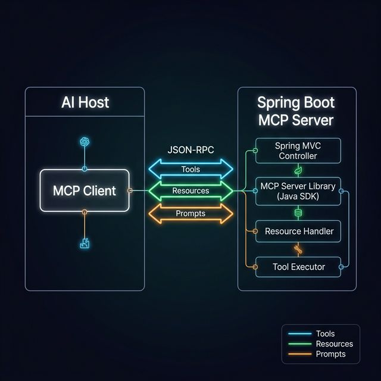

# Building a Model Context Protocol (MCP) Server with Spring Boot

<p align="center">
  
</p>

## Introduction to MCP

The **Model Context Protocol (MCP)**, introduced by Anthropic in late 2024, is an open standard designed to enable Artificial Intelligence (AI) systems (like Claude Desktop, GitHub Copilot, or custom LLM agents) to securely connect to external data sources, tools, and systems.

Instead of writing custom API integrations for every single AI model, MCP acts as a universal "USB-C" connector for AI. You build one MCP Server, and any compliant AI Client can immediately discover your resources, read your data, and execute your tools natively.

### The Problem it Solves
Traditionally, to give an LLM access to your database, you had to write custom function-calling logic explicitly for the OpenAI API, then rewrite it for Anthropic, and then rewrite it for Gemini. 

MCP standardizes this. An **MCP Host** (e.g., Claude Desktop) connects to an **MCP Server** (Your Spring Boot app) via standard JSON-RPC. The server exposes:
1. **Tools:** Executable functions the AI can call (e.g., `checkoutCart()`, `deleteUser()`).
2. **Resources:** Read-only contextual data the AI can read (e.g., `application-logs://prod`, `database://schema`).
3. **Prompts:** Pre-defined conversation templates.

---

## Spring AI MCP Architecture

<p align="center">
  
</p>

The **Spring AI** project provides an official Java SDK and a seamless Spring Boot Starter (`spring-ai-mcp-server-webmvc-spring-boot-starter`) that makes building MCP servers incredibly declarative.

### Key Annotations
By utilizing Java Annotations, Spring completely eliminates the JSON-RPC boilerplate:
- `@McpTool` - Exposes a Java method as an executable AI tool. It automatically generates the JSON Schema for the AI using Reflection!
- `@McpResource` - Exposes a data endpoint for the AI to ingest.

---

## Building the Spring Boot MCP Server

Let's build a fully functioning Spring Boot MCP Server. This server will expose a "Weather Configuration Resource" and a "Mathematical Calculator Tool" to the AI.

### 1. The `pom.xml` Dependencies

We must include the highly specialized `spring-ai-mcp-server-webmvc-spring-boot-starter`. This exposes the MCP Server over standard HTTP **Server-Sent Events (SSE)**, which is perfect for microservices.

```xml
<dependencies>
    <dependency>
        <groupId>org.springframework.boot</groupId>
        <artifactId>spring-boot-starter-web</artifactId>
    </dependency>
    <!-- The official Spring AI MCP Server Starter -->
    <dependency>
        <groupId>org.springframework.ai</groupId>
        <artifactId>spring-ai-mcp-server-webmvc-spring-boot-starter</artifactId>
        <version>1.0.0-M6</version> 
    </dependency>
</dependencies>
```

### 2. Application Configuration
In `application.yml`, we configure the server to run in **Sync** mode (for straightforward request-response logic) and we enable the Annotation Scanner so Spring automatically detects our `@McpTool` beans.

```yaml
server:
  port: 8080

spring:
  ai:
    mcp:
      server:
        type: SYNC
        annotation-scanner:
          enabled: true
```

### 3. The Implementation Code

Here is the magic. We simply annotate standard Spring `@Component` beans.

**`McpWeatherConfig.java` (Exposing Resources)**
```java
package com.example.mcpserver;

import org.springframework.ai.mcp.server.annotation.McpResource;
import org.springframework.stereotype.Component;

@Component
public class McpWeatherConfig {

    // The AI can 'read' this URI to gain context about our system's current state.
    @McpResource(uri = "config://weather/default-city", name = "Default Weather Configuration")
    public String getDefaultCityConfig() {
        return "{\n" +
               "  \"city\": \"Madrid\",\n" +
               "  \"country\": \"Spain\",\n" +
               "  \"timezone\": \"CET\"\n" +
               "}";
    }
}
```

**`McpCalculatorTool.java` (Exposing Executable Tools)**
```java
package com.example.mcpserver;

import org.springframework.ai.mcp.server.annotation.McpTool;
import org.springframework.ai.mcp.server.annotation.McpToolParam;
import org.springframework.stereotype.Component;

@Component
public class McpCalculatorTool {

    // This method is instantly converted into an LLM tool. 
    // Spring AI uses reflection to generate the JSON Schema automatically!
    @McpTool(name = "enterprise_calculator", description = "Add two massive integers together.")
    public int addNumbers(
            @McpToolParam(description = "The highly complex first integer", required = true) int a,
            @McpToolParam(description = "The highly complex second integer", required = true) int b) {
        
        System.out.println("AI requested calculation: " + a + " + " + b);
        return a + b;
    }
}
```

**`McpServerApplication.java` (Entry Point)**
```java
package com.example.mcpserver;

import org.springframework.boot.SpringApplication;
import org.springframework.boot.autoconfigure.SpringBootApplication;

@SpringBootApplication
public class McpServerApplication {
    public static void main(String[] args) {
        SpringApplication.run(McpServerApplication.class, args);
    }
}
```

That's it! When this Spring Boot application starts, it automatically exposes the `/mcp/message` endpoint, listening for SSE JSON-RPC connections from an AI Client.

---

## Dockerizing the MCP Server

To run this reliably across environments (and to allow contained AI agents to communicate with it over an internal Docker network), we Dockerize the application.

### 1. The `Dockerfile`
We use a **Multi-Stage Build** to compile the Java 21 code using Maven, and then package it into a minimal JRE container.

**`Dockerfile`**
```dockerfile
# Stage 1: Build the Application
FROM maven:3.9.6-eclipse-temurin-21 AS BUILDER
WORKDIR /build

# Copy the pom.xml and download dependencies to aggressively cache them natively
COPY pom.xml .
RUN mvn dependency:go-offline

# Copy source code and package the Spring Boot executable JAR natively
COPY src ./src
RUN mvn clean package -DskipTests

# Stage 2: Create the highly optimized Production Image
FROM eclipse-temurin:21-jre-jammy
WORKDIR /app

# Expose the default Spring Boot port
EXPOSE 8080

# Safely copy the compiled artifact from the Builder stage
COPY --from=BUILDER /build/target/*.jar mcp-server.jar

# Run the Spring Boot application natively
ENTRYPOINT ["java", "-jar", "mcp-server.jar"]
```

### 2. The `docker-compose.yml`
```yaml
services:
  spring-mcp-server:
    build: .
    ports:
      - "8080:8080"
    environment:
      - SPRING_PROFILES_ACTIVE=prod
    restart: unless-stopped
```

### How to Run Locally

1. Place your `pom.xml`, `src/`, `Dockerfile`, and `docker-compose.yml` in an empty directory.
2. Build and start the infrastructure natively:
   ```bash
   docker compose up --build -d
   ```
3. Watch the logs verify that Spring AI has registered your annotated Tools!
   ```bash
   docker compose logs -f
   # Output: Mapped tool 'enterprise_calculator' to method 'addNumbers'
   # Output: MCP Server started on http://localhost:8080/mcp/message
   ```

### Integrating with Claude Desktop (Optional)

If you have Anthropic's Claude Desktop installed, you can natively configure it to talk to your Dockerized Spring Boot server!

Edit your Claude Desktop `claude_desktop_config.json`:
```json
{
  "mcpServers": {
    "spring-boot-server": {
        "command": "curl",
        "args": ["-N", "http://localhost:8080/mcp/message"]
    }
  }
}
```

Now, when you ask Claude: *"What is 45892 + 99482 using the enterprise calculator?"*, Claude will physically route the JSON-RPC execution request over HTTP SSE into your Dockerized Spring Boot backend, process the Java method, and return the exact answer!
