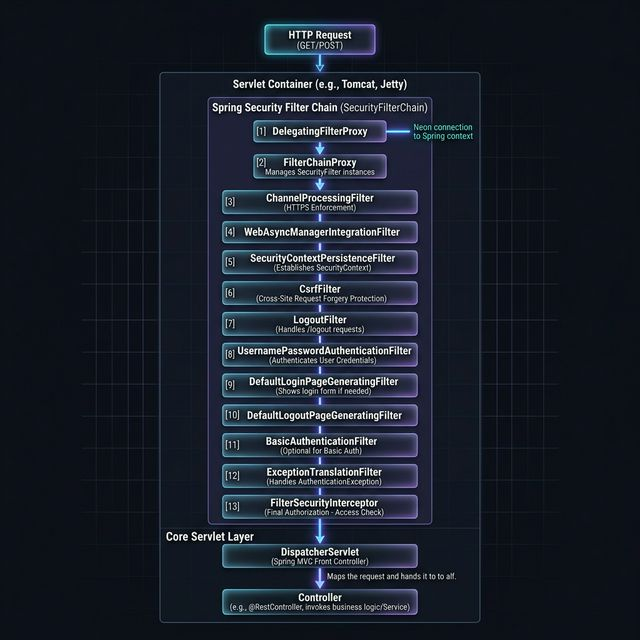
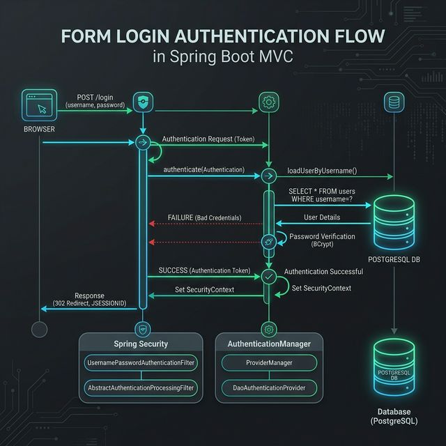

# Chapter 8: Deep Dive into Spring MVC Security (Thymeleaf)

This guide is your authoritative resource for securing stateful **Spring MVC Web Applications** (serving full HTML pages via **Thymeleaf**) using the robust architecture of **Spring Security**. 

Unlike stateless REST APIs that rely on JWT tokens, securing a traditional MVC application revolves around **Form Logins**, **Session Cookies (JSESSIONID)**, and ironclad **CSRF (Cross-Site Request Forgery) protection**. 

By the end of this chapter, you will understand the theoretical engine driving Spring Security and construct a fully functioning, containerized application mapping actual HTTP sessions to a PostgreSQL database.

---

## 🏗 Theoretical Architecture

Before diving into the code, you must understand how Spring Security hijacks incoming HTTP requests. Spring Security operates at the **Servlet Filter** layer, meaning it analyzes packets long before they ever reach your standard Spring `@Controller` classes.

### 1. The Security Filter Chain

Spring Security is not a single monolith. It is a highly ordered chain of specialized filters. When an HTTP Request hits your Tomcat/Jetty container, it encounters a singular checkpoint called the `DelegatingFilterProxy`. This proxy acts as a native Servlet Filter but internally delegates the security processing to an orchestrated Spring Bean called the `FilterChainProxy`. 

The `FilterChainProxy` manages multiple stacked **Security Filters**, each hunting for specific vulnerabilities or authentication headers.

<p align="center">
  
</p>

*As visualized above, an incoming request must successfully run the gauntlet of filters (such as the `CsrfFilter`, preventing forged submissions, and the `UsernamePasswordAuthenticationFilter`, intercepting login prompts) before it is finally dispatched to your Controller.*

### 2. The Form Login Flow

When a user submits their credentials via a traditional HTML Form (`POST /login`), the payload never reaches your application code. The `UsernamePasswordAuthenticationFilter` automatically intercepts the POST request and initiates the **Authentication Flow**.

<p align="center">
  
</p>

1. The Filter extracts the raw credentials and asks the central `AuthenticationManager` to verify them.
2. The Manager delegates this to the `DaoAuthenticationProvider` (Database Access Object).
3. The Provider queries your PostgreSQL Database to retrieve the registered user.
4. It compares the raw password mathematically against the database's `bcrypt` hashes.
5. Upon success, a `SecurityContext` is created in server memory, and the user receives a `JSESSIONID` cookie allowing subsequent requests to bypass login.

---

## 🛠 Project Implementation

Let's build this architecture!

### 1. Project Dependencies (`pom.xml`)

We need strict dependency mapping for Web, Security, the database, and crucially, the Thymeleaf Security Dialect which permits DOM manipulation based on backend roles.

```xml
    <dependencies>
        <!-- Spring Foundation -->
        <dependency>
            <groupId>org.springframework.boot</groupId>
            <artifactId>spring-boot-starter-web</artifactId>
        </dependency>
        <dependency>
            <groupId>org.springframework.boot</groupId>
            <artifactId>spring-boot-starter-security</artifactId>
        </dependency>

        <!-- Dynamic HTML Templates -->
        <dependency>
            <groupId>org.springframework.boot</groupId>
            <artifactId>spring-boot-starter-thymeleaf</artifactId>
        </dependency>

        <!-- Thymeleaf Security Dialect (sec:authorize) -->
        <dependency>
            <groupId>org.thymeleaf.extras</groupId>
            <artifactId>thymeleaf-extras-springsecurity6</artifactId>
        </dependency>

        <!-- Database Connectors -->
        <dependency>
            <groupId>org.springframework.boot</groupId>
            <artifactId>spring-boot-starter-jdbc</artifactId>
        </dependency>
        <dependency>
            <groupId>org.postgresql</groupId>
            <artifactId>postgresql</artifactId>
            <scope>runtime</scope>
        </dependency>
    </dependencies>
```

---

### 2. Docker & Environment Blueprint

We completely containerize both the Spring Application and the attached PostgreSQL server to guarantee perfect local execution environments explicitly bypassing host Java conflicts.

**`docker-compose.yml`**
```yaml
version: '3.8'

services:
  db:
      image: postgres:15-alpine
      container_name: mvc_security_db
      environment:
        POSTGRES_USER: springsecurity
        POSTGRES_PASSWORD: springsecurity
        POSTGRES_DB: security_demo
      ports:
        - "5432:5432"
      volumes:
        - pg_mvc_data:/var/lib/postgresql/data
        # Auto-initialize our users table!
        - ./init.sql:/docker-entrypoint-initdb.d/init.sql

  app:
    build: .
    container_name: mvc_security_app
    ports:
      - "8080:8080"
    depends_on:
      - db
    environment:
      - SPRING_DATASOURCE_URL=jdbc:postgresql://db:5432/security_demo

volumes:
  pg_mvc_data:
```

**`Dockerfile`**
```dockerfile
# Immutable Multi-stage execution environment
FROM maven:3.9.6-eclipse-temurin-21-jammy AS build
WORKDIR /app
COPY pom.xml .
COPY src ./src
RUN mvn clean package -DskipTests

# Lean Runtime
FROM eclipse-temurin:21-jre-jammy
WORKDIR /app
COPY --from=build /app/target/*.jar app.jar
EXPOSE 8080
ENTRYPOINT ["java", "-jar", "app.jar"]
```

---

### 3. Database Initialization (`init.sql`)

Spring Security provides default implementations that automatically look for tables named `users` and `authorities`. Create this initialization payload at your project root. 
*(Note: Every password below is `test123` encrypted mathematically using BCrypt).*

```sql
CREATE TABLE users (
  username VARCHAR(50) NOT NULL PRIMARY KEY,
  password VARCHAR(68) NOT NULL,
  enabled BOOLEAN NOT NULL
);

CREATE TABLE authorities (
  username VARCHAR(50) NOT NULL,
  authority VARCHAR(50) NOT NULL,
  CONSTRAINT authorities_idx_1 UNIQUE (username, authority),
  CONSTRAINT authorities_ibfk_1 FOREIGN KEY (username) REFERENCES users (username)
);

-- Three users with exactly 'test123' as their password
INSERT INTO users (username, password, enabled) VALUES 
('john','{bcrypt}$2a$10$qeS0HEh7urweMojsnwNAR.vcXJeI1OEeUVyX0Uj33I.3wL9z5gGg6',true),
('mary','{bcrypt}$2a$10$qeS0HEh7urweMojsnwNAR.vcXJeI1OEeUVyX0Uj33I.3wL9z5gGg6',true),
('susan','{bcrypt}$2a$10$qeS0HEh7urweMojsnwNAR.vcXJeI1OEeUVyX0Uj33I.3wL9z5gGg6',true);

-- Role mapping
INSERT INTO authorities (username, authority) VALUES 
('john','ROLE_EMPLOYEE'),
('mary','ROLE_EMPLOYEE'),
('mary','ROLE_MANAGER'),
('susan','ROLE_EMPLOYEE'),
('susan','ROLE_MANAGER'),
('susan','ROLE_ADMIN');
```

---

### 4. Application Properties

Map the Spring Boot JDBC drivers dynamically toward the database instance. Add this to `application.properties`:

```properties
spring.datasource.url=${SPRING_DATASOURCE_URL:jdbc:postgresql://localhost:5432/security_demo}
spring.datasource.username=springsecurity
spring.datasource.password=springsecurity
```

---

## 🛡 Form-Secured Application Coding

### The Security Configuration (`DemoSecurityConfig.java`)

This is the architectural heart of the application. We instruct the `SecurityFilterChain` perfectly on which HTTP endpoints demand which specific user Roles. We also define custom HTML render paths for login failures and general 403 Access Denied occurrences.

> [!IMPORTANT]
> **CSRF is ACTIVE!** By default, MVC Security Filter Chains aggressively hunt for a specific hidden CSRF authorization token sent in HTML POST requests. If your form lacks it, the payload is explicitly annihilated regardless of authorization status.

```java
package com.luv2code.springboot.demo.security;

import org.springframework.context.annotation.Bean;
import org.springframework.context.annotation.Configuration;
import org.springframework.security.config.annotation.web.builders.HttpSecurity;
import org.springframework.security.provisioning.JdbcUserDetailsManager;
import org.springframework.security.provisioning.UserDetailsManager;
import org.springframework.security.web.SecurityFilterChain;

import javax.sql.DataSource;

@Configuration
public class DemoSecurityConfig {

    // Plug Spring directly into our PostgreSQL setup implicitly mapping users/authorities
    @Bean
    public UserDetailsManager userDetailsManager(DataSource dataSource) {
        return new JdbcUserDetailsManager(dataSource);
    }

    @Bean
    public SecurityFilterChain filterChain(HttpSecurity http) throws Exception {

        http.authorizeHttpRequests(configurer ->
                configurer
                        .requestMatchers("/").hasRole("EMPLOYEE")
                        .requestMatchers("/leaders/**").hasRole("MANAGER")
                        .requestMatchers("/systems/**").hasRole("ADMIN")
                        .anyRequest().authenticated()
                )
            .formLogin(form ->
                    form
                        .loginPage("/showMyLoginPage")          // Triggers our custom UI Controller
                        .loginProcessingUrl("/authenticateTheUser") // Spring natively intercepts this internal URL POST
                        .permitAll()                            // Universal access completely bypassing roles
                )
            .logout(logout -> 
                    logout.permitAll()
                          .logoutSuccessUrl("/showMyLoginPage?logout")
                )
            .exceptionHandling(configurer ->
                    configurer.accessDeniedPage("/access-denied")    // Triggers custom 403 handling
                );

        return http.build();
    }
}
```

### Routing Controllers

We require entirely naked Endpoints that strictly serve our Thymeleaf files.

**`LoginController.java`**
```java
package com.luv2code.springboot.demo.controller;

import org.springframework.stereotype.Controller;
import org.springframework.web.bind.annotation.GetMapping;

@Controller
public class LoginController {

    @GetMapping("/showMyLoginPage")
    public String showMyLoginPage() {
        return "fancy-login"; // Dispatches to src/main/resources/templates/fancy-login.html
    }

    @GetMapping("/access-denied")
    public String showAccessDenied() {
        return "access-denied"; 
    }
}
```

**`DemoController.java`**
```java
package com.luv2code.springboot.demo.controller;

import org.springframework.stereotype.Controller;
import org.springframework.web.bind.annotation.GetMapping;

@Controller
public class DemoController {

    @GetMapping("/")
    public String showHome() { return "home"; }

    @GetMapping("/leaders")
    public String showLeaders() { return "leaders"; }

    @GetMapping("/systems")
    public String showSystems() { return "systems"; }
}
```

---

## 🎨 Interactive Thymeleaf Templates

These templates use the critical `sec:authorize` and `<form th:action=...>` bindings.

> [!TIP]
> The exact syntax `th:action="@{/authenticateTheUser}"` acts as a macro. Thymeleaf analyzes the Action string, and strictly embeds a hidden `input type="hidden" name="_csrf"` into your DOM seamlessly mapping security across the transaction!

### 1. `src/main/resources/templates/fancy-login.html`
```html
<!DOCTYPE html>
<html lang="en" xmlns:th="http://www.thymeleaf.org">
<head>
    <title>Secure Access Gateway</title>
    <meta charset="utf-8" />
    <link href="https://cdn.jsdelivr.net/npm/bootstrap@5.2.3/dist/css/bootstrap.min.css" rel="stylesheet" />
</head>
<body class="bg-dark text-white">
    <div class="container mt-5">
        <div class="col-md-4 offset-md-4">
            <div class="card border-primary bg-secondary shadow-lg">
                <div class="card-header bg-primary fw-bold text-center">System Authentication</div>
                <div class="card-body">

                    <!-- Crucial POST payload to Spring Security Architecture -->
                    <form action="#" th:action="@{/authenticateTheUser}" method="POST">
                        <div th:if="${param.error}" class="alert alert-danger fw-bold">Invalid Authorization Payload.</div>
                        <div th:if="${param.logout}" class="alert alert-success">Session Gracefully Terminated.</div>

                        <div class="mb-3">
                            <input type="text" name="username" placeholder="Username" class="form-control" />
                        </div>
                        <div class="mb-3">
                            <input type="password" name="password" placeholder="Password" class="form-control" />
                        </div>

                        <button type="submit" class="btn btn-warning w-100 fw-bold">Execute Login</button>
                    </form>

                </div>
            </div>
        </div>
    </div>
</body>
</html>
```

### 2. `src/main/resources/templates/home.html` (Dynamic Role Enforcement)

Notice how the `sec:authorize="hasRole('MANAGER')"` attribute physically prevents the server from delivering HTML code specifically if the `SecurityContext` lacks the appropriate flags.

```html
<!DOCTYPE html>
<html xmlns:th="http://www.thymeleaf.org" xmlns:sec="http://www.thymeleaf.org/extras/spring-security">
<head>
    <title>Company Node Core</title>
    <link href="https://cdn.jsdelivr.net/npm/bootstrap@5.2.3/dist/css/bootstrap.min.css" rel="stylesheet" />
</head>
<body class="container mt-5 bg-dark text-light">

    <h2>Node Internal Architecture</h2>
    <hr class="border-light"/>
    
    <div class="alert alert-secondary">
        <p class="mb-0">Logged in Entity: <strong><span sec:authentication="principal.username" class="text-primary"></span></strong></p>
        <p class="mb-0">Clearance Level: <strong><span sec:authentication="principal.authorities" class="text-danger"></span></strong></p>
    </div>

    <!-- Tiered Structural Rendering -->
    <div sec:authorize="hasRole('MANAGER')" class="card text-bg-warning mb-3">
        <div class="card-body">
            <h5 class="card-title">Level II Protocols</h5>
            <a th:href="@{/leaders}" class="btn btn-dark">Access Leadership Module</a>
        </div>
    </div>

    <div sec:authorize="hasRole('ADMIN')" class="card text-bg-danger mb-3">
        <div class="card-body">
            <h5 class="card-title">Root Operations</h5>
            <a th:href="@{/systems}" class="btn btn-dark">Engage Direct Override</a>
        </div>
    </div>

    <form action="#" th:action="@{/logout}" method="POST" class="mt-4">
        <button type="submit" class="btn btn-outline-danger">Disconnect Session</button>
    </form>
</body>
</html>
```

### 3. `access-denied.html`

```html
<!DOCTYPE html>
<html lang="en" xmlns:th="http://www.thymeleaf.org">
<body class="bg-black text-danger text-center mt-5">
    <h1 class="display-1 fw-bold">403</h1>
    <h3 class="font-monospace">FATAL: INSUFFICIENT PERMISSIONS</h3>
    <p>Your SecurityContext was audited and summarily rejected from the requested module.</p>
    <a th:href="@{/}" class="btn btn-danger mt-3 fw-bold">Return to Authorized Zone</a>
</body>
</html>
```

*(Create placeholder `leaders.html` and `systems.html` files respectively to complete the routing map.)*

---

## 🚀 Docker Deployment & Validation

1. Spin up the full topological architecture: `docker compose up --build -d`
2. Open your web browser and target `http://localhost:8080`
3. The `UsernamePasswordAuthenticationFilter` correctly blocks you, enforcing a 302 Redirect to `/showMyLoginPage`.
4. **Validation Routine:**
   * Login as `john` *(password: `test123`)*. The framework grants you exactly `ROLE_EMPLOYEE`. The UI dynamically hides all classified buttons.
   * Attempt to literally brute-force the URL bar via `http://localhost:8080/systems`. The `SecurityFilterChain` immediately interrupts the controller and renders `access-denied.html`!
   * Disconnect.
   * Login as `susan` *(password: `test123`)*. Susan maintains `ROLE_ADMIN` context. The UI comprehensively unlocks and the URL requests render accurately!
