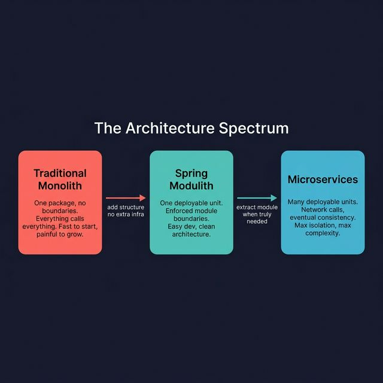
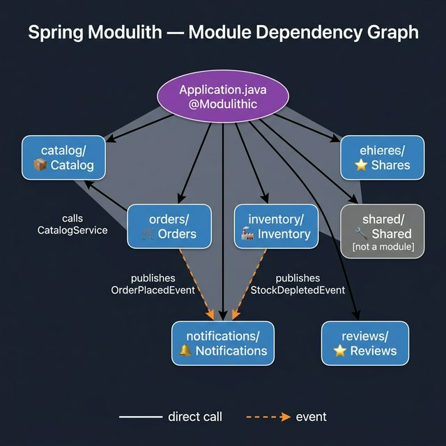
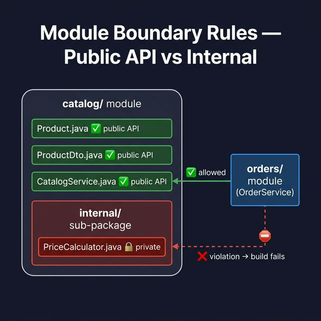
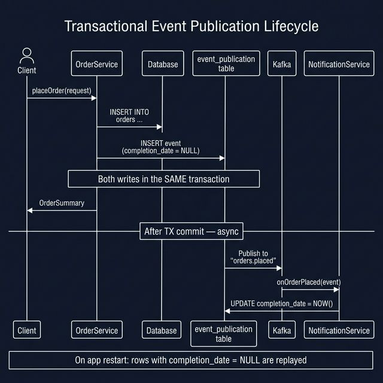
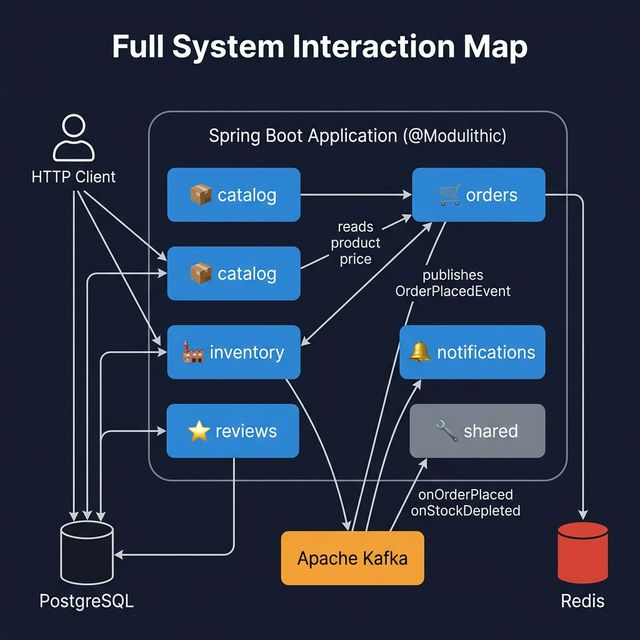

# Spring Modulith — Introduction

> **Framework:** Spring Modulith 1.x (requires Spring Boot 3.x)
> **Reference project:** [`Tests-with-Modular-SpringBoot`](https://github.com/chemacabeza/Tests-with-Modular-SpringBoot)

---

## The Problem Spring Modulith Solves

A standard Spring Boot application puts everything in one package tree. After a few months it devolves into a **Big Ball of Mud**: every class can call every other class, business boundaries dissolve, and adding a feature in one area silently breaks another.

The usual escape route is to split the monolith into **microservices** — but that trades spaghetti code for network latency, distributed transactions, and operational complexity you may not need yet.

Spring Modulith sits in between: it imposes **module boundaries inside a single Spring Boot application** and enforces them at compile/test time. You get the development simplicity of a monolith with the logical separation of microservices — and you can externalize modules to real services later if needed.



---

## Core Concepts

### 1. Modules = Java Packages

Each **top-level sub-package** of your main application package is a module. There is no XML, no configuration — just the package structure.

```
com.example.modular/          ← application root
├── Application.java
├── catalog/                  ← module: Catalog
├── orders/                   ← module: Orders
├── inventory/                ← module: Inventory
├── notifications/            ← module: Notifications
├── reviews/                  ← module: Reviews
└── shared/                   ← not a module (shared utilities)
```

Spring Modulith detects these automatically by scanning from the class annotated `@Modulithic`.



> Solid arrows = direct service calls (allowed if public API). Dashed arrows = event-based communication (preferred for cross-module decoupling).

### 2. `@Modulithic` — the Entry Point

Replace nothing — just add this annotation to your `@SpringBootApplication` class:

```java
@SpringBootApplication
@Modulithic(
    systemName = "Spring Modulith Reference App",
    useFullyQualifiedModuleNames = false
)
@EnableCaching
public class Application {
    public static void main(String[] args) {
        SpringApplication.run(Application.class, args);
    }
}
```

| Property | Purpose |
|----------|---------|
| `systemName` | Human-readable name used in generated documentation and Actuator output |
| `useFullyQualifiedModuleNames` | `false` → module name is just `catalog`; `true` → `com.example.modular.catalog` |

### 3. Module Boundaries — What Is and Isn't Allowed

By default, only **public types in the module's root package** form the public API. Anything in a sub-package (e.g. `catalog/internal/`) is private to that module.

```
catalog/
├── Product.java          ← public — other modules may reference this
├── ProductDto.java       ← public
├── CatalogService.java   ← public — callable from OrderService
└── internal/
    └── PriceCalculator.java  ← private — violation if used by another module
```

Spring Modulith's test support will **fail the build** if a module reaches into another module's internals.



---

## Domain Events — Decoupling Modules

Instead of calling another module's service directly (tight coupling), modules communicate via **domain events**. Spring Modulith integrates with Spring's `ApplicationEventPublisher` and adds:

- **Transactional publication** — events are persisted to an `event_publication` table *within the same transaction* that triggered them. If the transaction rolls back, the event is never dispatched.
- **Guaranteed delivery** — if the app crashes after committing but before the listener runs, the event is replayed on restart.
- **Externalization** — events can be automatically forwarded to Kafka (or RabbitMQ, SQS …) with a single annotation.



### Publishing an Event

```java
// orders/OrderService.java
@Transactional
public OrderSummary placeOrder(PlaceOrderRequest request) {
    // ... business logic ...
    var order = orderRepository.save(new Order(...));

    // Spring Modulith persists this to event_publication within the transaction,
    // then forwards it to Kafka asynchronously after the commit.
    eventPublisher.publishEvent(OrderPlacedEvent.from(order));

    return OrderSummary.from(order);
}
```

### Defining an Event

Events are plain Java records. Add `@Externalized` to route them to a Kafka topic automatically:

```java
// orders/OrderPlacedEvent.java
@Externalized("orders.placed")          // ← Kafka topic name
public record OrderPlacedEvent(
    Long orderId,
    Long productId,
    int quantity,
    String customerEmail) {

    static OrderPlacedEvent from(Order order) {
        return new OrderPlacedEvent(
            order.getId(),
            order.getProductId(),
            order.getQuantity(),
            order.getCustomerEmail());
    }
}
```

> **Tip:** Keep event records free of references to other module types so they carry no compile-time cross-module dependency.

```java
// inventory/StockDepletedEvent.java
@Externalized("inventory.stock-depleted")
public record StockDepletedEvent(
    Long productId,
    int requestedQuantity,
    int availableQuantity) {}
```

### Listening to Events — `@ApplicationModuleListener`

Use `@ApplicationModuleListener` instead of `@EventListener`. It runs the listener in a **new transaction**, after the publishing transaction has committed:

```java
// notifications/NotificationService.java
@Service
public class NotificationService {

    @ApplicationModuleListener
    public void onOrderPlaced(OrderPlacedEvent event) {
        log.info("[NOTIFICATION] Sending confirmation to {} for order #{}",
            event.customerEmail(), event.orderId());
        // Call SendGrid, Twilio, etc.
    }

    @ApplicationModuleListener
    public void onStockDepleted(StockDepletedEvent event) {
        log.warn("[NOTIFICATION] Stock alert! Product {} is out of stock.",
            event.productId());
        // Page the warehouse team.
    }
}
```

The `notifications` module depends on *event types* from `orders` and `inventory` — but never directly calls their services. Removing the notifications module has zero effect on the rest of the system.

---

## Maven Dependencies

Add the Spring Modulith BOM to your parent `pom.xml`, then pick the starters you need in your module's `pom.xml`:

```xml
<!-- Core (module detection, validation, documentation) -->
<dependency>
    <groupId>org.springframework.modulith</groupId>
    <artifactId>spring-modulith-starter-core</artifactId>
</dependency>

<!-- Transactional event publication with JPA -->
<dependency>
    <groupId>org.springframework.modulith</groupId>
    <artifactId>spring-modulith-starter-jpa</artifactId>
</dependency>

<!-- Forward events to Kafka -->
<dependency>
    <groupId>org.springframework.modulith</groupId>
    <artifactId>spring-modulith-events-kafka</artifactId>
</dependency>

<!-- Actuator endpoint: /actuator/modulith -->
<dependency>
    <groupId>org.springframework.modulith</groupId>
    <artifactId>spring-modulith-actuator</artifactId>
</dependency>

<!-- Distributed tracing spans for module interactions -->
<dependency>
    <groupId>org.springframework.modulith</groupId>
    <artifactId>spring-modulith-observability</artifactId>
</dependency>

<!-- Test support -->
<dependency>
    <groupId>org.springframework.modulith</groupId>
    <artifactId>spring-modulith-starter-test</artifactId>
    <scope>test</scope>
</dependency>
```

---

## Testing Module Integrity

Spring Modulith ships a JUnit 5 extension that verifies your architectural rules automatically:

```java
@Test
void verifiesModularStructure() {
    ApplicationModules.of(Application.class).verify();
}
```

This will **fail** if:
- A module accesses another module's internal sub-packages
- There are circular dependencies between modules
- An event listener is in the wrong module

Run it as a regular unit test in CI — no extra tooling needed.

---

## The `event_publication` Table

When you use `spring-modulith-starter-jpa`, Modulith creates an `event_publication` table automatically:

| Column | Purpose |
|--------|---------|
| `id` | UUID primary key |
| `event_type` | Fully-qualified class name of the event |
| `serialized_event` | JSON payload |
| `publication_date` | When the event was recorded (within the TX) |
| `completion_date` | `NULL` until the listener completes successfully |

**On startup**, Spring Modulith re-publishes any rows where `completion_date` is `NULL` — this is the guaranteed-delivery mechanism. No manual retry code needed.

---

## Actuator Integration

With `spring-modulith-actuator` on the classpath, a new endpoint appears:

```
GET /actuator/modulith
```

It returns a JSON description of all detected modules, their dependencies, and their published/consumed event types. Useful for onboarding new team members or generating architecture diagrams.

---

## Module Structure at a Glance

```
com.example.modular/
│
├── catalog/                     # Public API: Product, ProductDto, CatalogService
│   ├── Product.java
│   ├── ProductDto.java
│   ├── ProductRepository.java
│   ├── CatalogService.java
│   └── CatalogController.java
│
├── orders/                      # Publishes: OrderPlacedEvent
│   ├── Order.java
│   ├── OrderPlacedEvent.java    ← @Externalized("orders.placed")
│   ├── OrderRepository.java
│   ├── OrderService.java        ← eventPublisher.publishEvent(...)
│   └── OrderController.java
│
├── inventory/                   # Publishes: StockDepletedEvent
│   ├── StockItem.java
│   ├── StockDepletedEvent.java  ← @Externalized("inventory.stock-depleted")
│   ├── StockItemRepository.java
│   └── InventoryService.java
│
├── notifications/               # Listens to: OrderPlacedEvent, StockDepletedEvent
│   └── NotificationService.java ← @ApplicationModuleListener
│
├── reviews/                     # Independent CRUD module
│   ├── Review.java
│   ├── ReviewDto.java
│   ├── ReviewRepository.java
│   ├── ReviewService.java
│   └── ReviewController.java
│
└── shared/                      # Cross-cutting config (Redis, Kafka, exception handler)
    ├── RedisConfig.java
    ├── KafkaTopicsConfig.java
    └── GlobalExceptionHandler.java
```

The same structure as a module interaction map:



---

## When to Use Spring Modulith

| Scenario | Good fit? |
|----------|----------|
| Monolith that is growing chaotic | ✅ Yes — enforce boundaries without the ops cost of microservices |
| Team wants clear domain ownership | ✅ Yes — each module maps to a bounded context |
| You plan to extract services later | ✅ Yes — modules are ready-made extraction units |
| Tiny app with 2–3 controllers | ⚠️ Overkill — plain layered architecture is sufficient |
| Already a distributed system | ⚠️ Better to apply patterns per-service than add Modulith on top |

---

## Further Reading

- [Spring Modulith Reference Documentation](https://docs.spring.io/spring-modulith/reference/)
- [Spring Modulith GitHub](https://github.com/spring-projects/spring-modulith)
- [Reference project: `Tests-with-Modular-SpringBoot`](https://github.com/chemacabeza/Tests-with-Modular-SpringBoot) — the live codebase these examples come from
