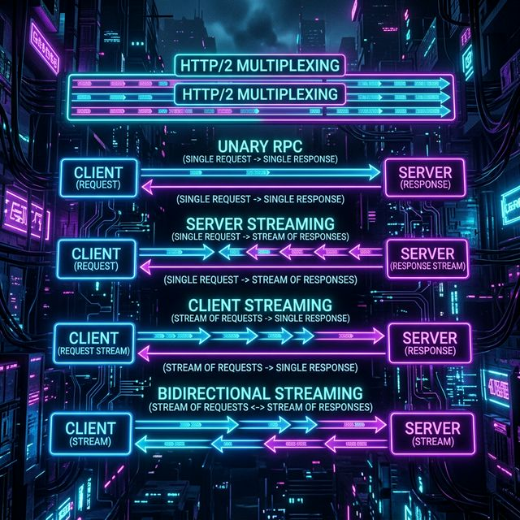

# High-Performance Microservices with gRPC and Spring Boot

<p align="center">
  
</p>

## Introduction

As microservice architectures scale, communication overhead becomes an existential bottleneck. RESTful JSON APIs are ubiquitous but inefficient: JSON is verbose, parsing text is CPU-cycle expensive, and standard HTTP/1.1 connections suffer from head-of-line blocking. 

Enter **gRPC**, an open-source high-performance Remote Procedure Call (RPC) framework developed by Google. Instead of human-readable text over HTTP/1.1, gRPC sends heavily compressed binary data streams over HTTP/2.

In the Spring Boot ecosystem, `net.devh:grpc-spring-boot-starter` transforms gRPC from a complex networking concept into a seamless Spring-native experience, utilizing annotations like `@GrpcService` and auto-configuring server lifecycles.

---

## 1. Protobuf: The Contract

<p align="center">
  
</p>

Unlike REST, where JSON schemas implicitly exist via OpenAPI or scattered documentation, gRPC is strictly contract-first. Services and data shapes are defined in `.proto` files.

Protobuf (Protocol Buffers) is Google's language-neutral, platform-neutral extensible mechanism for serializing structured data. 
- **Type-safe:** Generates strongly typed Java classes automatically.
- **Binary efficiency:** Fields are mapped to integer tags (`= 1`, `= 2`), entirely stripping verbose string keys from the payload.
- **Forward/Backward compatible:** Unknown fields are ignored; missing fields revert to defaults.

---

## 2. Network Paradigm: HTTP/2 and Streaming

<p align="center">
  
</p>

Because gRPC is natively built on HTTP/2, it benefits from binary framing and multiplexing (multiple requests over a single TCP connection concurrently).

This enables four powerful communication modes:
1. **Unary RPC:** Classic Request-Response (like REST).
2. **Server Streaming:** Client sends one request, server streams back a continuous sequence of messages (e.g., live market data).
3. **Client Streaming:** Client streams an array of messages, and the server returns a single response upon completion (e.g., massive file uploads).
4. **Bidirectional Streaming:** An interleaved, fully asynchronous stream where both the client and server send messages independently (e.g., multiplayer game sync, chat protocols).

---

## 🧪 EXPERT LAB: gRPC Sandbox in Spring Boot

To completely grasp gRPC, you must build both the Server and a Client, compile the Protobuf bindings, and orchestrate the HTTP/2 connection.

We've constructed a full Docker-based lab workflow containing JDK 17 and Maven.

**`docker-compose.yml`** — save this file in a new folder and run from there:

```yaml
services:
  grpc-sandbox:
    image: maven:3.9-eclipse-temurin-17
    container_name: grpc-sandbox
    volumes:
      - ./lab-work:/work
    working_dir: /work
    command: >
      bash -c "echo '--- SPRING BOOT gRPC SANDBOX READY ---' && sleep infinity"
    ports:
      - "8080:8080"
```

```bash
# Start the sandbox
docker compose up -d

# Enter the container
docker exec -it grpc-sandbox bash
```

### Sandbox Execution: Building the gRPC App

Run the following commands strictly inside the `grpc-sandbox` container.

**1. Create the project structure:**
```bash
mkdir -p src/main/proto src/main/java/com/demo
```

**2. Create the `pom.xml` (Dependencies & Protobuf Compiler):**
```bash
cat > pom.xml << 'EOF'
<project xmlns="http://maven.apache.org/POM/4.0.0" xmlns:xsi="http://www.w3.org/2001/XMLSchema-instance" xsi:schemaLocation="http://maven.apache.org/POM/4.0.0 http://maven.apache.org/xsd/maven-4.0.0.xsd">
    <modelVersion>4.0.0</modelVersion>
    <groupId>com.demo</groupId>
    <artifactId>grpc-lab</artifactId>
    <version>1.0</version>
    <parent>
        <groupId>org.springframework.boot</groupId>
        <artifactId>spring-boot-starter-parent</artifactId>
        <version>3.1.5</version>
    </parent>
    <dependencies>
        <dependency>
            <groupId>org.springframework.boot</groupId>
            <artifactId>spring-boot-starter-web</artifactId>
        </dependency>
        <dependency>
            <groupId>net.devh</groupId>
            <artifactId>grpc-server-spring-boot-starter</artifactId>
            <version>2.15.0.RELEASE</version>
        </dependency>
        <dependency>
            <groupId>net.devh</groupId>
            <artifactId>grpc-client-spring-boot-starter</artifactId>
            <version>2.15.0.RELEASE</version>
        </dependency>
        <dependency>
            <groupId>javax.annotation</groupId>
            <artifactId>javax.annotation-api</artifactId>
            <version>1.3.2</version>
        </dependency>
    </dependencies>
    <build>
        <extensions>
            <extension>
                <groupId>kr.motd.maven</groupId>
                <artifactId>os-maven-plugin</artifactId>
                <version>1.7.1</version>
            </extension>
        </extensions>
        <plugins>
            <plugin>
                <groupId>org.xolstice.maven.plugins</groupId>
                <artifactId>protobuf-maven-plugin</artifactId>
                <version>0.6.1</version>
                <configuration>
                    <protocArtifact>com.google.protobuf:protoc:3.24.0:exe:${os.detected.classifier}</protocArtifact>
                    <pluginId>grpc-java</pluginId>
                    <pluginArtifact>io.grpc:protoc-gen-grpc-java:1.58.0:exe:${os.detected.classifier}</pluginArtifact>
                </configuration>
                <executions>
                    <execution><goals><goal>compile</goal><goal>compile-custom</goal></goals></execution>
                </executions>
            </plugin>
        </plugins>
    </build>
</project>
EOF
```

**3. Define the Protobuf Contract:**
```bash
cat > src/main/proto/hello.proto << 'EOF'
syntax = "proto3";
option java_multiple_files = true;
option java_package = "com.demo.grpc";

service HelloService {
  rpc SayHello (HelloRequest) returns (HelloReply);
}

message HelloRequest {
  string name = 1;
}

message HelloReply {
  string message = 1;
}
EOF
```

**4. Generate the Java Code bindings from the Proto definition:**
```bash
# This triggers the protoc compiler to generate com.demo.grpc Java classes
mvn protobuf:compile protobuf:compile-custom
```

**5. Create the Spring Boot Application with Client & Server:**
```bash
cat > src/main/java/com/demo/Application.java << 'EOF'
package com.demo;

import com.demo.grpc.*;
import io.grpc.stub.StreamObserver;
import net.devh.boot.grpc.client.inject.GrpcClient;
import net.devh.boot.grpc.server.service.GrpcService;
import org.springframework.boot.SpringApplication;
import org.springframework.boot.autoconfigure.SpringBootApplication;
import org.springframework.web.bind.annotation.*;

@SpringBootApplication
public class Application {
    
    // --- gRPC SERVER IMPLEMENTATION ---
    @GrpcService
    public static class HelloServiceImpl extends HelloServiceGrpc.HelloServiceImplBase {
        @Override
        public void sayHello(HelloRequest request, StreamObserver<HelloReply> responseObserver) {
            System.out.println("SERVER: Received gRPC request for: " + request.getName());
            HelloReply reply = HelloReply.newBuilder()
                    .setMessage("Hello " + request.getName() + " from gRPC via HTTP/2!")
                    .build();
            responseObserver.onNext(reply);
            responseObserver.onCompleted();
        }
    }

    // --- REST TO gRPC CLIENT BRIDGE ---
    @RestController
    public static class ClientController {
        
        // Target pointing to ourselves via localhost config
        @GrpcClient("local-grpc-server")
        private HelloServiceGrpc.HelloServiceBlockingStub stub;

        @GetMapping("/test/{name}")
        public String callGrpcServer(@PathVariable String name) {
            HelloReply response = this.stub.sayHello(HelloRequest.newBuilder().setName(name).build());
            return "REST Interface says: " + response.getMessage();
        }
    }

    public static void main(String[] args) {
        SpringApplication.run(Application.class, args);
    }
}
EOF
```

**6. Provide Local Networking Configuration:**
```bash
cat > src/main/resources/application.yml << 'EOF'
grpc:
  server:
    port: 9090      # Port where the gRPC server will listen
  client:
    local-grpc-server:
      address: 'static://127.0.0.1:9090'
      negotiation-type: plaintext
EOF
```

**7. Run the Application:**
```bash
mvn spring-boot:run
```

Once Spring Boot initializes securely with Tomcat on `8080` and the gRPC Server bound to `9090`, pop open a second terminal on your host machine to test the connection:

```bash
# Wait for the Spring App to say "Started Application" then run:
curl http://localhost:8080/test/Developer
```

**Output on terminal (`curl`):**
> REST Interface says: Hello Developer from gRPC via HTTP/2!

**Output in Sandbox console:**
> SERVER: Received gRPC request for: Developer

You have successfully established a full Spring Boot auto-configured gRPC system, leveraging Protobuf compilation and Netty/HTTP2 backend streams!

---
[Home: Curriculum Map](../README.md)
