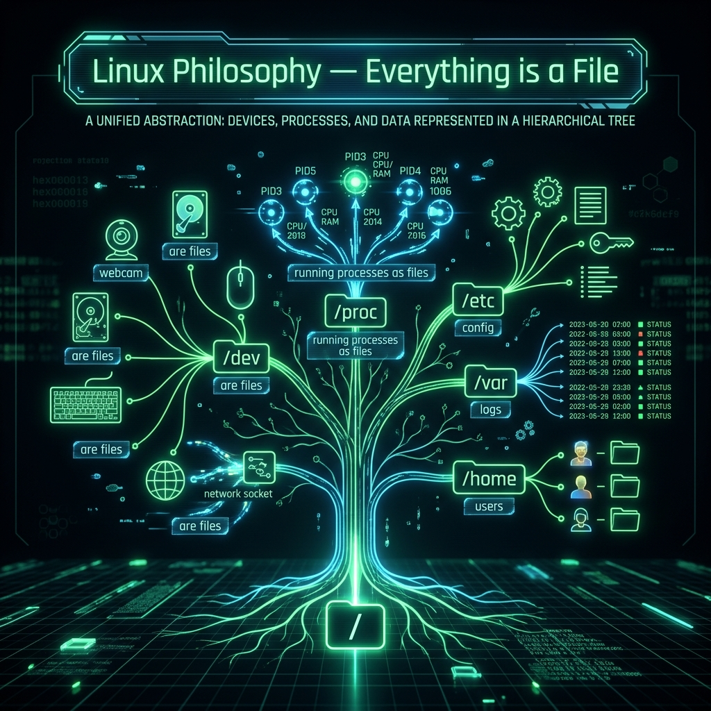

<div align="center">
  
</div>

# 01: The Linux Philosophy and the Filesystem

> 🧠 **The Feynman Hook:** Imagine a city where *every single thing* — the post office, the traffic lights, your neighbour's front door, even the phone in your pocket — has an address on the city's street grid. With one universal address system, you can write a message *to anything* using the exact same format. Linux has a similarly radical idea: **everything is a file**. Your hard drive, your webcam, a running program's memory, a network connection — all of them have a path in the filesystem tree. This is not a metaphor. This is the literal architecture. And because every "thing" is just a file, every tool that reads files (`cat`, `grep`, `less`) can be used to interact with any piece of hardware on the system.

**🎯 The Big Goal:** Master the two golden rules of UNIX — everything is a file, and the filesystem is your operating manual for the entire system.

---

## 1. Golden Rule #1: Everything is a File

> **Feynman Insight:** Windows hides your webcam behind a stack of device driver menus. Linux shows you `/dev/video0` — a file. You can read from it, write to it, and permissions control who can access the camera, using exactly the same `chmod` commands you use on text files. This is the power of the abstraction: one unified model for interacting with everything on the system.

| What It Is | How Linux Represents It |
|---|---|
| Hard drive | `/dev/sda` |
| Webcam | `/dev/video0` |
| Terminal | `/dev/tty` |
| The digital void | `/dev/null` — writes go in, nothing comes out |
| Random number generator | `/dev/random` or `/dev/urandom` |
| Running process memory | `/proc/1234/mem` |

---

## 2. The Filesystem Hierarchy Standard (FHS)

> **Feynman Insight:** Linux has no `C:\` or `D:\` drive letters. There is one single tree, starting at the **root** `/`. Think of it like the root of a physical tree: every branch, every leaf, every acorn hangs off the same single trunk. The FHS defines what each branch *means* — not just an arbitrary naming convention, but a contract. If you know the FHS, you know where to find configuration files on any Linux distribution in the world.

| Directory | Role | Analogy |
|---|---|---|
| `/` | The root — everything starts here | The trunk of the tree |
| `/bin` | Essential commands (`ls`, `cp`, `bash`) | The toolshed |
| `/etc` | System-wide config files (no binaries!) | The filing cabinet |
| `/dev` | Device files (hardware as files) | The factory floor |
| `/proc` | Virtual RAM-based filesystem — kernel state | The live dashboard |
| `/var` | Variable data: logs, databases, spools | The growing pile |
| `/home` | User home directories | Personal offices |
| `/tmp` | Temporary files — erased on reboot | The whiteboard |
| `/usr` | Non-essential software binaries | The app store shelf |

---

## 3. Permissions, Owners, and `chmod`

> **Feynman Insight:** Linux permissions are a 9-bit security system baked directly into every file and directory. Think of them as three audience sections at a concert: the **Owner** (the artist's manager — full backstage access), the **Group** (the crew — limited access), and **Others** (the general public — restricted). Each section gets three possible tickets: **Read (r)**, **Write (w)**, **Execute (x)**. The octal numbers (4/2/1) are just the binary values of these three bits: `rwx = 111 = 7`, `r-x = 101 = 5`, `r-- = 100 = 4`.

```text
-rw-r--r-- 1 alice staff 4096 Mar 22 10:00 report.txt
 ↑↑↑↑↑↑↑↑↑
 ||||||||└─── Others: r-- = 4 (read only)
 |||||└────── Group:  r-- = 4 (read only)
 ||└───────── Owner:  rw- = 6 (read + write)
 |└────────── Type:   - = regular file
```

### The Octal System

```bash
# chmod <owner><group><others> file
chmod 754 script.sh   # Owner: rwx(7), Group: r-x(5), Others: r--(4)
chmod 600 secret.key  # Owner: rw-(6), Group: ---(0), Others: ---(0)
chmod 755 public.sh   # Owner: rwx(7), Group: r-x(5), Others: r-x(5)

# Change ownership (root only)
sudo chown bob:developers project_code
```

---

## 4. Absolute vs. Relative Paths

> **Feynman Insight:** An **absolute path** is like giving someone GPS coordinates — unambiguous from any starting point. `/var/log/nginx/access.log` means exactly that, from the root, regardless of where you currently are. A **relative path** is like giving directions from where you're standing — "go up two blocks, then left." The `..` symbol is "go up one level" and `.` is "right here where I am."

```bash
# Absolute: always starts from /
cd /var/log/nginx

# Relative: starts from current directory
cd ../../var/log      # Go up 2, then down into var/log

# Special shortcuts
cd ~      # Jump to your home directory
cd -      # Jump back to where you just were
```

---

## 🤔 Reflection Questions

<details>
<summary>💡 View Answer: Why does Linux represent hardware devices as files in /dev?</summary>

**Unified abstraction**. The "everything is a file" principle means that *every* tool capable of reading or writing files — `cat`, `dd`, `grep`, `read()` in C — can interact with hardware. Instead of needing a different API for each hardware type (network cards, disks, serial ports), you use the same POSIX file API for all of them. `/dev/random` produces entropy; `/dev/null` discards everything written to it; `/dev/sda` is your raw disk. You can `dd if=/dev/sda of=backup.img` to clone a disk using the same tool to copy a text file. This simplicity is the architectural genius of UNIX.
</details>

<details>
<summary>💡 View Answer: What does /proc actually contain, and why is it special?</summary>

`/proc` is a **pseudo-filesystem** — it is not stored on disk at all. It exists entirely in RAM and is dynamically generated by the kernel on every read. `cat /proc/cpuinfo` doesn't read a file; it causes the kernel to format and return current CPU information as text, on demand. `cat /proc/1234/maps` reveals the memory map of process 1234. `/proc/sys/` contains tuneable kernel parameters you can change by writing to its "files" (e.g., `echo 1 > /proc/sys/net/ipv4/ip_forward` enables IP forwarding). Everything you see in `/proc` is live kernel state, formatted as readable text — the kernel's own live dashboard.
</details>

---

## 🐳 Hands-On Lab: The Filesystem Hierarchy

### Setup: Docker Sandbox
```bash
docker run -it --rm ubuntu:latest bash
```

### Exercise 1: Explore the Root
> **Goal:** See the top-level directories.
```bash
ls -l /
# You see: bin, etc, dev, var, home, tmp, usr, proc, sys...
```
✅ **Expected:** Every directory follows the FHS contract — the same layout on Ubuntu, Debian, Fedora, and Amazon Linux.

### Exercise 2: "Everything is a File" — Hardware as Files
> **Goal:** Inspect device files.
```bash
ls -l /dev/null /dev/zero /dev/random
# First character 'c' = character device (not a regular file '-')
echo "This will disappear" > /dev/null
cat /dev/null  # Returns nothing — the digital void
```
✅ **Expected:** Writing to `/dev/null` is absorbed silently. Reading `/dev/urandom` produces raw binary data (random entropy).

### Exercise 3: Permissions in Practice
> **Goal:** Set and verify permissions.
```bash
touch secret.key script.sh
chmod 600 secret.key   # Only owner can read/write — no one else
chmod 755 script.sh    # Owner can execute; group/others can read and execute
ls -l secret.key script.sh
```
✅ **Expected:** `secret.key` shows `-rw-------`. `script.sh` shows `-rwxr-xr-x`.

---

## 📝 Key Interview Talking Points

- **"Everything is a file"** is not just philosophy — it enables `strace`, `lsof`, `dd`, and every POSIX I/O API to work uniformly on devices, processes, and network connections.
- **`/proc` and `/sys`** are virtual filesystems generated by the kernel in RAM — nothing on disk.
- **`/etc` contains no binaries** — only configuration text files. Important for knowing where to look on any Linux server.
- **Octal permission math**: `r=4, w=2, x=1`. `chmod 644` = `rw-r--r--`. `chmod 755` = `rwxr-xr-x`. These are the two most common permission sets.
- **`/tmp` erasure on reboot** — never store persistent data in `/tmp`.

---
[Home: Curriculum Map](./README.md) | [Next: Command Line Survival >>](./02_Command_Line_Survival.md)