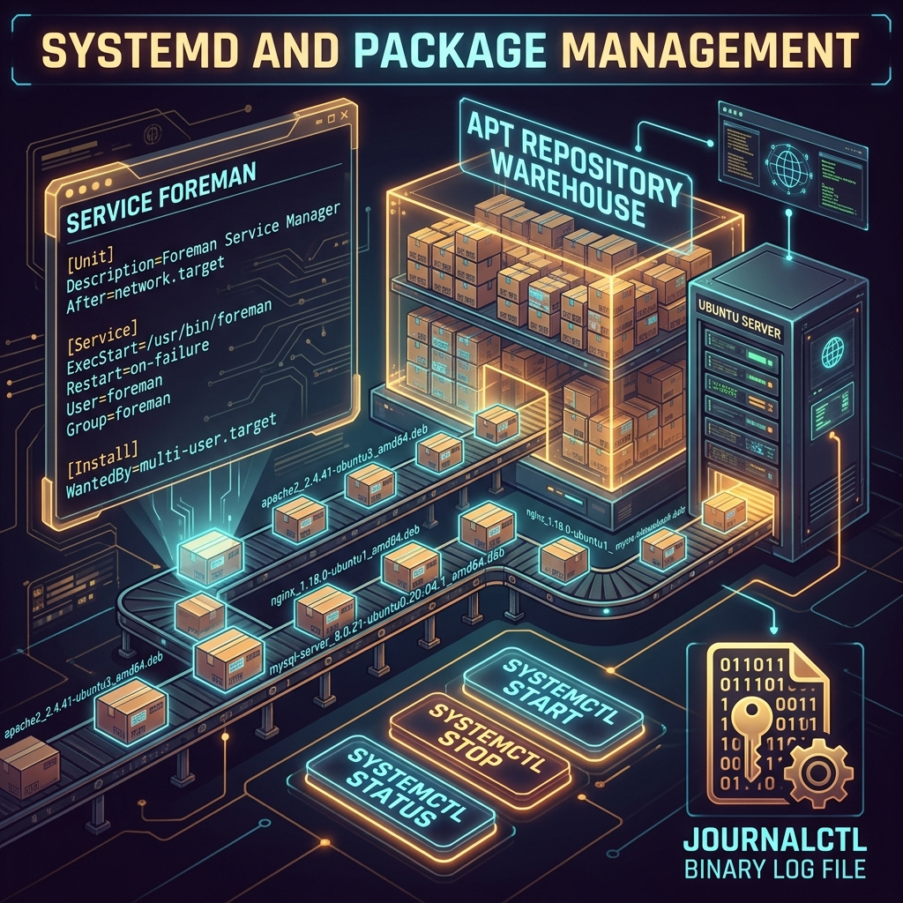

<div align="center">
  
</div>

# 03: Systemd & Package Management

> 🧠 **The Feynman Hook:** Imagine you are the manager of a large factory. You need to ensure that workers clock in on time, in the right order (the accountants can't start until the network is up; the delivery drivers can't start until the warehouse is unlocked). If any worker fails to show up, they need to be automatically replaced. And every worker's shift log needs to be stored, searchable, and queryable. **systemd** is this factory manager — it is PID 1, the first process the kernel starts, and its entire job is to orchestrate the startup, supervision, and shutdown of every other service on the system. **APT** is the factory's supply chain: a single command to source, verify, install, and manage every piece of software from a trusted warehouse.

**🎯 The Big Goal:** Master systemd service management and APT package management — the two most essential administration skills on any Debian/Ubuntu server.

---

## 1. systemd — The Factory Manager (PID 1)

> **Feynman Insight:** Before systemd, Linux used SysV init scripts — each daemon was started by a standalone shell script. Parallelisation was impossible. One slow service delayed everything. Logging was scattered. systemd replaced this with a **declarative unit file model**: you describe *what* you want (service name, executable, restart policy, dependencies) and systemd figures out *how* to start it, in what order, and with what parallelisation opportunities. The `After=network.target` directive isn't imperative ("run this command first") — it's declarative ("I cannot start until network is ready").

### Core systemctl Commands

```bash
# Start, stop, restart a service
sudo systemctl start nginx
sudo systemctl stop nginx
sudo systemctl restart nginx

# Enable AUTO-START at boot (survives reboot)
sudo systemctl enable nginx

# Disable auto-start at boot
sudo systemctl disable nginx

# Check current status (processes, exit code, recent logs)
systemctl status nginx

# Reload service config WITHOUT restarting
sudo systemctl reload nginx      # nginx reads config without dropping connections

# List all running services
systemctl list-units --type=service --state=running
```

---

## 2. Writing Your Own systemd Unit File

> **Feynman Insight:** A unit file is a short declarative contract with systemd. The `[Unit]` section tells systemd about the service's identity and dependencies. The `[Service]` section tells it what to run and how to handle failures. The `[Install]` section tells it which "target" (runlevel equivalent) should activate this service. The most powerful field: `Restart=on-failure` — systemd will automatically restart your service if it dies, acting as a self-healing supervisor.

```ini
# /etc/systemd/system/myapp.service

[Unit]
Description=My Production Web Application
After=network.target postgresql.service   # Start only AFTER network + DB are ready

[Service]
Type=simple
User=appuser                               # Run as non-root
WorkingDirectory=/opt/myapp
ExecStart=/usr/bin/python3 /opt/myapp/server.py
Restart=on-failure                         # Auto-restart if it crashes
RestartSec=5s                              # Wait 5s before restarting
EnvironmentFile=/opt/myapp/.env            # Load environment variables

[Install]
WantedBy=multi-user.target                 # Start in normal multi-user mode
```

```bash
# Activate the unit file (required after creation/changes)
sudo systemctl daemon-reload
sudo systemctl enable --now myapp.service  # Enable + start immediately
```

---

## 3. journalctl — Structured Binary Logging

> **Feynman Insight:** Traditional syslog is a plain text file. A log explosion (a database printing 10M lines in 2 seconds) can fill your disk and corrupt the plain text file. systemd's **journal** stores logs in a structured binary format, meaning it can *index* and *query* them: show logs from the last hour, from a specific service, with a specific priority, within a date range — instantly, without `grep`-ing through gigabytes. This is the difference between a pile of printed emails and a searchable database.

```bash
# All logs from the NGINX service
journalctl -u nginx

# Live tail (like 'tail -f', but structured)
journalctl -u nginx -f

# Show only errors and above (0-7 priority scale: 0=emerg, 3=error)
journalctl -p err

# Last 100 lines from this boot
journalctl -b -n 100

# Logs between two timestamps
journalctl --since "2024-01-15 08:00" --until "2024-01-15 10:00"
```

---

## 4. APT — The Software Supply Chain

> **Feynman Insight:** APT (Advanced Package Tool) is the automated supply chain for software. A **repository** is a trusted warehouse maintained by the distribution (Ubuntu, Debian) or a third party. `apt update` is like checking the latest warehouse catalogue — it downloads the list of available package versions. `apt install` is like placing an order — APT automatically resolves all dependencies (Package A needs Library B version ≥ 2.3, which needs Library C) and fetches everything in the right order from the warehouse.

```bash
# Update the package index (always do this first!)
sudo apt update

# Install a package (and all its dependencies)
sudo apt install nginx postgresql python3-pip

# Remove a package (keeps config files)
sudo apt remove nginx

# Remove a package AND its config files
sudo apt purge nginx

# Upgrade all installed packages to latest versions
sudo apt upgrade

# Search available packages
apt search "web server"

# Show package details, dependencies, size
apt show nginx
```

---

## 🤔 Reflection Questions

<details>
<summary>💡 View Answer: What is the difference between systemctl enable and systemctl start?</summary>

`systemctl start` makes the service run **right now** in the current session. If you reboot the machine, the service does not start again. `systemctl enable` creates symbolic links in the appropriate systemd target directories — this means systemd will automatically start the service **on every future boot**. It does NOT start the service right now. The common idiom is `systemctl enable --now myservice` which atomically combines "enable for boot" + "start immediately." `systemctl disable` removes the symbolic links (stops auto-start at boot) but does NOT stop a currently running service.
</details>

<details>
<summary>💡 View Answer: Why does systemd store logs in binary format instead of plain text?</summary>

Three concrete advantages: (1) **Structured fields** — each log entry has typed metadata fields (service name, PID, priority, timestamp) that can be queried exactly, not grep-pattern-matched. `journalctl -u nginx -p err --since today` is a structured query, not a text search. (2) **Integrity** — the binary format includes cryptographic sealing so that log tampering is detectable. (3) **Space efficiency** — binary storage with compression is significantly smaller than plain text for high-volume logging. The disadvantage: you can no longer use raw `cat`/`grep`/`awk` on the log files directly — you must use `journalctl`.
</details>

---

## 🐳 Hands-On Lab: Systemd Services

### Setup: Docker Sandbox
```bash
# Note: A Docker container with systemd requires --privileged
# For basic APT practice, a regular container works fine:
docker run -it --rm ubuntu:latest bash
apt-get update && apt-get install -y nginx
```

### Exercise 1: APT Package Management
> **Goal:** Install, inspect, and remove a package.
```bash
apt-get install -y curl
curl --version
apt-get remove curl
curl --version  # Should fail — package removed
```
✅ **Expected:** curl installed, functional, then removed.

### Exercise 2: Explore a systemd Unit File
> **Goal:** Understand the structure of a real unit file.
```bash
# On a host system (not Docker) or a privileged container:
cat /lib/systemd/system/ssh.service
# Observe: After=, ExecStart=, Restart= fields
```
✅ **Expected:** A declarative unit file showing the SSH daemon configuration.

### Exercise 3: journalctl Queries
> **Goal:** Query journal with filters.
```bash
# On a real systemd host:
journalctl -n 20          # Last 20 lines across all services
journalctl -p err -n 10   # Last 10 error-level entries
journalctl --disk-usage   # Total space used by the journal
```
✅ **Expected:** Filtered, readable log output — far more usable than grepping /var/log/syslog.

---

## 📝 Key Interview Talking Points

- **PID 1 significance**: systemd is PID 1 — it is started directly by the kernel. All user-space processes are children or descendants of systemd. If systemd dies, the machine kernel panics.
- **`Restart=on-failure` vs `Restart=always`**: `on-failure` restarts only on non-zero exit code. `always` restarts even after clean exit (use for services that should never stop).
- **Socket activation**: systemd can hold a listening socket and start the service only when the first connection arrives — reducing boot time by deferring service startup.
- **`journalctl --vacuum-size=500M`** prunes the journal to 500MB — essential for managing journal size in production.
- **APT `apt-get` vs `apt`**: `apt` is the newer, human-friendly interface with progress bars. `apt-get` is the scripting-safe stable interface for use in scripts and CI/CD pipelines.

---
[<< Previous: Command Line Survival](./02_Command_Line_Survival.md) | [Home: Curriculum Map](./README.md) | [Next: Bash Scripting Mastery >>](./04_Bash_Scripting_Mastery.md)