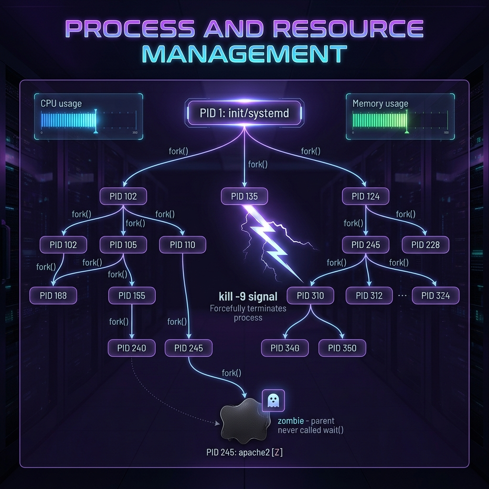

<div align="center">
  
</div>

# 05: Process and Resource Management

> 🧠 **The Feynman Hook:** Think of your operating system as an enormous factory. The processor (CPU) is the factory floor where work happens; the memory (RAM) is the workbench space. A "program" like Google Chrome is just a blueprint sitting in a filing cabinet (your hard drive). When you double-click Chrome, you are giving that blueprint to the **Factory Foreman** (the Kernel), who creates a living, breathing worker called a **Process**. The foreman gives this worker a unique ID badge (PID), assigns them workbench space (Memory), and schedules their shifts on the factory floor (CPU time). System administration is simply managing this factory floor — knowing exactly who is working, who is slacking off, and who needs to be fired.

**🎯 The Big Goal:** Master process visibility (`top`, `ps`), lifecycle control (`fork`, `kill`), and the ultimate illusion of modern containerization (`cgroups` and `namespaces`).

---

## 1. Top, Htop, and ps — The Foreman's Clipboard

> **Feynman Insight:** There are two ways to look at the factory floor. `top` and `htop` are **CCTV cameras** — they provide a live, continuously updating stream of who is using the most CPU and memory *right now*. `ps` is a **polaroid photograph** — it captures exactly what every process was doing at the precise millisecond you pressed Enter. You use `htop` when the fan is spinning loudly. You use `ps` piped into `grep` when you need to hunt down a specific hidden background worker.

Every program executing on the operating system is tracked via a **Process ID (PID)**.

### Mastering `ps`
Because `ps` is static, we pipe it into `grep` to hunt down rogue software.

```bash
# Snapshot every single process running on the OS (`e` = everywhere, `f` = full format)
ps -ef 

# Find the exact hidden PID of the "nginx" master process
ps -ef | grep "nginx" 
```

The output contains standard columns: 
- `UID`: Under which user is this running? (usually `root` or your username)
- `PID`: The ID badge of the worker.
- `PPID`: Parent Process ID (Who hired this worker?).
- `CMD`: The exact command that started them.

---

## 2. Fork and `exec()` — How Workers are Born

> **Feynman Insight:** Linux rarely builds new workers from scratch; it uses a bizarre replication system. When you type `ls` in your Bash terminal, Bash doesn't create `ls`. Instead, Bash invokes `fork()`. The kernel takes the heavy Bash process and **clones it perfectly** — like mitosis. You now have two identical Bash processes. The clone (the Child Process) immediately invokes `exec()`, which throws away its Bash brain and replaces it entirely with the binary code of `/bin/ls`. The original Bash (the Parent) goes to sleep (`wait()`) until `ls` finishes and reports back its Exit Code.

1. **Fork**: Parent clones itself.
2. **Exec**: Clone replaces its own memory with the new program.
3. **Wait**: Parent sleeps, waits for child to finish and report exit status.

### The Zombie Process Danger
If a Child Process finishes, it dies. But its exit code remains in the kernel's clipboard, waiting for the Parent to read it via `wait()`. If the Parent Process has crashed or is poorly programmed and *never reads the clipboard*, the dead child's body cannot be cleared from the system. It becomes a **Zombie** `[Z]`. It uses zero CPU or RAM, but permanently occupies a slot in the Linux Process Table. If you accumulate 32,000 Zombies, the factory is "full" and your server catastrophically crashes (`Resource temporarily unavailable`).

---

## 3. Process Signals (`kill`) — Communicating with Workers

> **Feynman Insight:** You do not "delete" a process in Linux. You send it electrical signals. The `kill` command is terribly named — it should be called `signal`. Sending a signal is like blowing a specific whistle on the factory floor. The worker hears the whistle and executes their pre-programmed response to that specific frequency.

| Signal Number | Signal Name | Factory Analogy | Actual Behavior |
| :--- | :--- | :--- | :--- |
| `15` | `SIGTERM` | "Please finish your current task and clock out." | **Terminate**. This is the default. It politely asks the process to save its data and self-destruct gracefully. |
| `9` | `SIGKILL` | *The Sniper Rifle.* | **Kill**. The kernel instantly rips the process permanently out of RAM. The process gets absolutely zero warning. Data corruption is likely. Use only when frozen! |
| `1` | `SIGHUP` | "Read the new manual, but don't stop working." | **Hangup**. Originally for modems. Now expertly used to tell daemons (like `nginx`) to silently reload their `.conf` files without dropping active user connections! |

```bash
# Politely ask Nginx to shut down (sends 15)
sudo kill 3452

# Nginx is frozen and won't respond to 15. The nuclear option.
sudo kill -9 3452

# Tell nginx to refresh its config without dropping users
sudo kill -1 `cat /run/nginx.pid`
```

---

## 4. Virtual Filesystems (`/proc`)

> **Feynman Insight:** The `/proc` directory is a complete illusion. It doesn't exist on your hard drive. It is a live portal projected directly into your RAM by the Linux Kernel. Opening a file here is effectively asking the Kernel a direct question about its internal state.

Inside `/proc`, you will see a folder matching every active `PID` running on the machine.

```bash
# Peer directly into the raw memory allocation of the machine!
cat /proc/meminfo

# See the direct CPU hardware topology mapped by the Kernel!
cat /proc/cpuinfo

# What is process 1234 exactly running? Look into its namespace!
ls -l /proc/1234/exe   # Points to the exact binary executing on disk
cat /proc/1234/environ # Prints all hidden environment variables belonging to the app
cat /proc/1234/status  # RAM usage exclusively for that PID
```

---

## 5. Cgroups and Namespaces (The Docker Illusion)

> **Feynman Insight:** Historically, all workers on the factory floor could see each other (`ps`), shout at each other (`kill`), and see every room (`/`). In modern Linux, the Kernel provides two ultimate isolation mechanics to build invisible glass walls around workers: **cgroups** and **namespaces**.

1. **Control Groups (cgroups):** Limits *how much* a process can use. You constrain process 5001 to an absolute maximum of 256MB of RAM. If it tries to use 257MB, the Kernel invokes the OOM (Out of Memory) Sniper and instantly shoots the process.
2. **Namespaces:** Limits *what* a process can see. You execute a process inside an isolated Network Namespace. It literally looks around and believes it is the only process on earth. It cannot see port 80 being used by the host.

**This is what Docker is.**
Docker is not virtualization (like VirtualBox or VMware). Docker does not boot a fake operating system. Docker is simply an elegant Go wrapper that downloads a `.tar.gz` folder of files, calls `clone()` to put a process inside a Namespace glass cage, and applies a `cgroup` resource limit constraint.

---

## 🤔 Reflection Questions

<details>
<summary>💡 View Answer: If 'kill -9' guarantees the process stops, why shouldn't we use it as the default?</summary>

Because the process gets no warning. `SIGTERM` (15) is sent to the application, allowing its written code to catch the signal, flush pending database transactions to disk, securely close network sockets, and write a "shutting down" log message before exiting gracefully. `SIGKILL` (9) is handled purely by the kernel — the application is instantly wiped from memory mid-instruction. If it was halfway through writing a file to disk, that file is now permanently corrupted.
</details>

<details>
<summary>💡 View Answer: How is a Zombie process different from an Orphan process?</summary>

A **Zombie** child has finished executing and died, but its parent is still alive and has simply failed to call `wait()` to collect the exit code. The child's body cannot be cleared. An **Orphan** child is still actively running, but its Parent process unexpectedly crashed or died. Linux handles Orphans elegantly: the ultimate master process, `init` (PID 1, usually `systemd`), instantly "adopts" all orphans and promises to `wait()` on them when they eventually finish, preventing them from becoming Zombies.
</details>

---

## 🐳 Hands-On Lab: Understanding Processes

### Setup: Docker Sandbox
```bash
docker run -it --rm ubuntu:latest bash
apt-get update -qq && apt-get install -y -qq procps htop
```

### Exercise 1: The Process Tree
> **Goal:** Visualize parent-child relationships.
```bash
ps -ef --forest
```
✅ **Expected:** A hierarchical tree view where you can see `bash` (PID 1) running the `ps` command structure natively.

### Exercise 2: Background Jobs
> **Goal:** Push a process to the background while keeping the shell active.
```bash
sleep 100 > /dev/null &
jobs
```
✅ **Expected:** The terminal returns immediately, and `jobs` shows `[1]+ Running sleep 100 &`. The trailing `&` detaches it.

### Exercise 3: Exploring /proc
> **Goal:** Prove `/proc` is a live kernel interface.
```bash
cat /proc/1/status | grep -i threads
```
✅ **Expected:** Shows the number of threads currently spawned by PID 1. This file isn't static text; the kernel dynamically generates the integer the exact millisecond you run `cat`.

---

## 📝 Key Interview Talking Points

- **`top` vs `ps`**: `top` is live monitoring; `ps -ef` is a static snapshot used heavily for `grep` hunting.
- **Zombie processes**: Take up no RAM or CPU, but occupy slots in the process table. They indicate buggy parent code that isn't `wait()`ing on its children.
- **`SIGTERM` vs `SIGKILL`**: Always use 15 (`SIGTERM`) first for graceful shutdown. Only use 9 (`SIGKILL`) if the process is hard-frozen or deadlocked.
- **Docker is not a VM**: Docker uses the host kernel. It relies on **namespaces** for isolation (what the process can see) and **cgroups** for resource management (what the process can use). 

---
[<< Previous: Bash Scripting Mastery](./04_Bash_Scripting_Mastery.md) | [Home: Curriculum Map](./README.md) | [Next: Networking & Security >>](./06_Networking_and_Security.md)