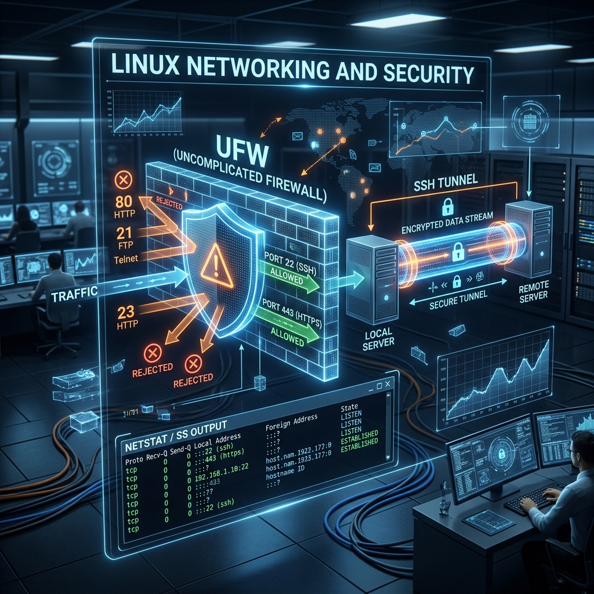

<div align="center">
  
</div>

# 06: Networking, Firewalls, and SSH Tunnels

> 🧠 **The Feynman Hook:** Imagine a massive corporate office building. The IP address is the physical street address of the building. But mail isn't delivered just to the building — it needs to go to a specific department. **Ports** are the floor numbers (Web Server on Floor 80, Database on Floor 5432). The **Firewall (`ufw`)** is the heavily armed security guard at the front door holding a clipboard specifying exactly who is allowed onto which floor. And an **SSH Tunnel** is a secret encrypted elevator shaft drilled through solid rock: it allows you to safely bypass the front desk and connect directly to a restricted internal floor from the outside.

**🎯 The Big Goal:** Master Linux networking utilities (`ip`, `ss`), robust kernel firewalls (`ufw`), and encrypted port forwarding (`ssh` tunnels) to orchestrate and secure server traffic.

---

## 1. Network Interfaces (`ip`) — The New Standard

> **Feynman Insight:** Linux networking has moved far beyond the legacy `ifconfig` (which is functionally deprecated). Modern distributions rely exclusively on the `iproute2` suite. The `ip` command is the absolute master switch to view, modify, and route everything happening on the physical Ethernet cards.

```bash
# View all Network Interfaces (NICs) and their IP addresses
ip addr show

# View the Default Gateway (Routing table)
ip route show

# Completely disable a network interface!
sudo ip link set eth0 down

# Assign a static IP address temporarily instantly
sudo ip addr add 192.168.1.150/24 dev eth0
```

---

## 2. Port Hunting (`ss`)

> **Feynman Insight:** When your application won't start because "Port 8080 is already in use," you must isolate the process holding the port hostage. `ss` (Socket Statistics) is vastly superior and infinitely faster than the deprecated `netstat`. `ss` talks directly to the kernel to instantaneously dump active socket connections.

The holy grail command syntax you will type thousands of times:
```bash
# View all actively LISTENING ports with their associated PID
sudo ss -tulpen
```

**Breaking it down:**
- `t` = TCP connections
- `u` = UDP connections
- `l` = Listening (Waiting for incoming connections)
- `p` = Show exactly WHICH Program PID is holding the socket (requires sudo)
- `e` = Extended information (user ID, inode)
- `n` = Show numeric Port/IP instead of trying to resolve DNS names (e.g., show `:80` instead of `:http`)

```bash
# Isolate port 8080 specifically
sudo ss -tulpen | grep ":8080"
```

Once you find the offending `PID` (e.g., 5432), you send a `SIGKILL` (Module 05) to rip it out of memory:
```bash
sudo kill -9 5432
```

---

## 3. The Uncomplicated Firewall (`UFW` / `iptables`)

> **Feynman Insight:** At its absolute core, the Linux network firewall is `netfilter/iptables`. It sits inside the Kernel and intercepts packets *before* they even reach user-space applications. However, `iptables` syntax is famously brutal. Ubuntu and Debian wrap it in `ufw` (Uncomplicated Firewall) — providing human-readable commands that compile down into complex raw kernel rules.

```bash
# 1. Check current status
sudo ufw status verbose

# 2. Add explicit Allow rules BEFORE enabling!
sudo ufw allow ssh          # Standard Port 22
sudo ufw allow 80/tcp       # Web HTTP
sudo ufw allow 443/tcp      # Web HTTPS

# 3. Add an explicit Block rule
sudo ufw deny from 192.168.1.50 to any

# 4. Turn the firewall on
# DANGER: If you are connected remotely via SSH and did not `allow ssh` first, 
# you will permanently lock yourself out of the server forever!
sudo ufw enable
```

---

## 4. SSH (Secure Shell) Mastery and Tunneling

> **Feynman Insight:** SSH is not just a remote terminal; it is an encrypted, military-grade transport layer. 

### Public-Key Authentication
Never use passwords for servers. They are brute-forced continuously. Generate an asymmetric keypair (Ed25519 is currently the strongest, most efficient standard). The **Private Key** stays on your laptop securely. The **Public Key** acts as a complex lock you install on the server.

```bash
# 1. Generate the absolute strongest algorithm key locally
ssh-keygen -t ed25519 -C "admin_key"

# 2. Push the highly sensitive PUBLIC Key to the remote server effortlessly
ssh-copy-id username@remote-server.com

# 3. Connect securely!
ssh username@remote-server.com
```

### SSH Tunnels (Port Forwarding)
A developer's ultimate secret weapon. Imagine an internal company database locked safely behind a firewall on Port 5432. You cannot access it directly from your home laptop. You can instruct SSH to drill a "tunnel" through the firewall.

```bash
# Local Port Forwarding Syntax (-L)
ssh -L <Local_Port>:<Target_IP>:<Target_Port> username@jump-server

# Example Scenario:
# We bind our laptop's port 9000. SSH encrypts the traffic, sends it to the jump server, 
# which unwraps it and forwards it internally to localhost:5432
ssh -N -L 9000:localhost:5432 production_user@db-server.com
```

The `-N` flag means "Do not open an interactive shell, just hold the tunnel open."
Now, you open DataGrip or pgAdmin on your laptop, connect to `localhost:9000`, and you instantly have direct access to the heavily guarded production database through the encrypted pipeline. 

---

## 🤔 Reflection Questions

<details>
<summary>💡 View Answer: Why does 'ss -tulpen' require sudo to see the PID?</summary>

Security boundaries. The Linux kernel considers process ownership strictly isolated. A normal user is not allowed to inspect the internal socket details (like the underlying Packet Inode or PID) of a process owned by another user (like a root database process). By escalating with `sudo`, you act as the kernel admin, bypassing these boundaries and forcing the kernel to report exactly which process ID holds which socket.
</details>

<details>
<summary>💡 View Answer: Why should you explicitly use 'ufw allow ssh' before running 'ufw enable' on a remote VPS?</summary>

Because `ufw enable` drops a massive steel door. The default behavior of UFW is to **deny all incoming connections**. If you are connected via SSH to an Amazon EC2 instance and run `ufw enable` without pre-authorizing the SSH port (22), UFW instantly drops your active packets and rejects your next SSH attempt. You have effectively sawed off the branch you were sitting on, and will likely need to nuke the server unless cloud console recovery tools are available.
</details>

---

## 🐳 Hands-On Lab: Network Troubleshooting

### Setup: Docker Sandbox
Standard containers are explicitly forbidden from modifying kernel firewalls. To practice `ufw` policies, you must grant the container `NET_ADMIN` capabilities. But for basic routing checks, standard containers work.

```bash
docker run -it --rm ubuntu:latest bash
apt-get update -qq && apt-get install -y -qq iproute2 iputils-ping dnsutils netcat-traditional openssh-client
```

### Exercise 1: Finding Your IP
> **Goal:** Inspect local network config.
```bash
ip addr show eth0
```
✅ **Expected:** Shows the IPv4 address (e.g., `172.17.x.x`) assigned to the container. Notice how much cleaner the output is compared to the outdated `ifconfig`.

### Exercise 2: Port Scanning with Netcat
> **Goal:** Verify if a firewall is blocking a port on a remote server.
```bash
# nc: netcat; -z: scan mode (zero I/O); -v: verbose output
nc -zv 8.8.8.8 53
```
✅ **Expected:** Reports that the connection to Google's DNS server on port 53 succeeded. If this blocked, you'd know outbound port 53 is firewalled.

### Exercise 3: SSH Key Generation
> **Goal:** Create an ed25519 keypair.
```bash
ssh-keygen -t ed25519 -f ~/.ssh/id_ed25519 -N ""
cat ~/.ssh/id_ed25519.pub
```
✅ **Expected:** The terminal prints your public key string (starting with `ssh-ed25519`). This is the *only* part you share with remote servers.

---

## 📝 Key Interview Talking Points

- **`iproute2` vs `net-tools`**: Professional engineers use `ip addr` and `ss`. Mentioning `ifconfig` or `netstat` immediately dates your training to pre-2010 environments.
- **`ss -tulpen`**: The muscle-memory command for isolating "Address already in use" errors. Know what the flags mean.
- **SSH Tunnels (-L)**: A highly prized skill. Explain it as mapping a local port securely through an encrypted bastion host to reach an isolated internal resource.
- **Asymmetric Encryption**: The private key never leaves your laptop. The public key is the lock. This entirely defeats password brute-forcing and dictionary attacks.
- **`UFW` vs `iptables`**: UFW is a front-end that translates simple rules (`ufw allow 80`) into complex Netfilter block chains inside the Linux kernel. 

---
[<< Previous: Process & Resource Mgmt](./05_Process_and_Resource_Management.md) | [Home: Curriculum Map](./README.md) | [Next: The Linux Kernel >>](./07_The_Linux_Kernel.md)