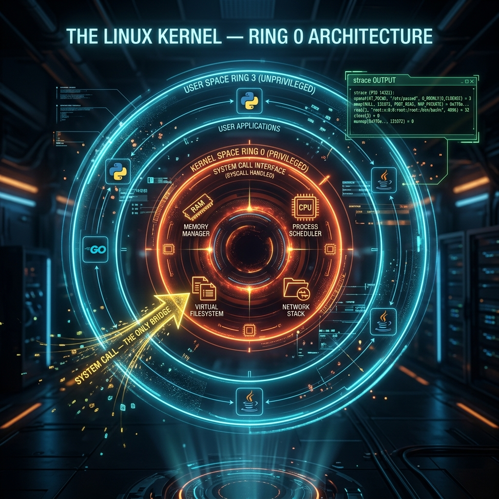

<div align="center">
  
</div>

# 07: The Linux Kernel & System Calls

> 🧠 **The Feynman Hook:** Imagine a heavily fortified Kingdom. The citizens (your applications: Python, Go, Java) live in the sprawling outer town (**Ring 3 / User Space**). They can play, do math, and organize data safely. But the citizens have zero access to the Kingdom's resources: the armory (Disk), the Treasury (RAM), or the messangers (Network). To get anything done, a citizen must walk up to the castle wall and submit a formal, highly structured request slip through a tiny, heavily guarded slot. This request slip is a **System Call (Syscall)**. Inside the walls, the absolute monarch — **The Kernel (Ring 0 / Kernel Space)** — verifies the request, commands the physical hardware to perform the action, and slips the result back out through the wall.

**🎯 The Big Goal:** Step directly into Ring-0 hardware context. Fundamentally understand the rigid boundary between User Space and Kernel Space, and how to use `strace` to observe the Syscalls bridging the two.

---

## 1. User Space vs. Kernel Space

> **Feynman Insight:** Everything you have ever written (Java, Go, Python, Bash Scripts) runs safely in **User Space (Ring 3)**. If your application crashes, memory leaks, or hits an infinite loop, it only kills itself. The OS survives. The Kernel runs in **Kernel Space (Ring 0)**. It manages all raw electrical signals and CPU scheduling. If a Kernel Module crashes, the entire physical machine instantly drops dead into a Kernel Panic. The boundary between the two is enforced dynamically by the physical CPU hardware itself.

### Monolithic Architecture
Linux is profoundly unique because it is a **Monolithic Kernel**.

- **Microkernel (e.g., Windows NT, macOS Mach):** Hardware drivers and filesystems are isolated into modular user-space services. Safer (driver crash doesn't kill OS), but incredibly slow due to heavy IPC (Inter-Process Communication) message passing overhead between services over the wall.
- **Monolithic (Linux, BSD):** Everything resides perfectly packed inside one massive binary executable executing natively in Ring 0. Drivers, Networking, Filesystem — all in one blob. It is phenomenally, dangerously fast. Components communicate with zero overhead directly via simple C function calls. 

---

## 2. System Calls (Syscalls)

Your User Space program literally has zero authority to talk to the hardware. 

If your Python program wants to print `"Hello World"` to the terminal monitor, it cannot independently send electrical signals to the GPU. It must trap into the Kernel and explicitly request permission.

When you write `fmt.Println("Hi")` in Go:
1. Go places `"Hi"` into a memory buffer.
2. Go executes the exact CPU architecture-level instruction `syscall` (specifically `SYS_WRITE` / ID `0x01`).
3. The CPU **Context Switches**. It completely halts User Space execution, dramatically switches its hardware privilege ring from Ring-3 to Ring-0, and launches into the locked Linux Kernel code.
4. The Kernel verifies you have permission to write to that terminal mapping (`stdout`).
5. The Kernel executes the hardware driver logic.
6. The CPU execution **Context Switches** *again* back out to User Space to resume your Go code.

### You DO NOT write Syscalls Directly
No C programmer actually writes assembly `syscall` instructions. They rely heavily on the **C Standard Library** (`glibc`). When you call `printf()` in C, Linux's `glibc` perfectly handles the ugly, architecture-specific `syscall` assembly wrapper for you.

---

## 3. The `strace` Diagnostics Tool

> **Feynman Insight:** As an expert, when a process mysteriously freezes, you do not guess. You do not re-read your Python code. Your code is irrelevant if it's waiting on the OS. You hook an X-ray machine up to the castle wall's request slot using `strace`. This tool intercepts and prints every single System Call the application submits to the Kernel in real-time.

```bash
# Attach 'strace' directly onto the running Nginx proxy server PID
sudo strace -p 1234
```

You will see exactly what the Kernel is currently fielding.
- `openat("/etc/nginx/nginx.conf") = -1` -> It requested a file, but the Kernel said "No (-1), missing."
- `connect(...)` -> Wait, it submitted a socket request and it's hanging forever?

### A classic scenario:
Developer: *"My Python architecture is completely broken on production, but works locally!"*
Sysadmin: *Runs `strace`* -> `open("/var/log/app.log", O_WRONLY) = -1 EACCES (Permission denied)`
Sysadmin: *"Linux denied your software permission to write to that file. Run chown."*

`strace` bypasses all application logging (which is likely broken) and reveals the absolute truth occurring between the software and the hardware.

---

## 4. Kernel Modules (.ko)

Because Linux is Monolithic, traditionally you would have to entirely recompile the massive Kernel binary and physically reboot the whole server just to add a new hardware driver.

To avoid this downtime, Linux supports **Loadable Kernel Modules (`.ko` objects)**. They allow you to securely inject compiled C code directly into the running Kernel's Ring 0 memory layout dynamically on the fly. 

```bash
# List every currently loaded kernel module natively
lsmod

# Inject a new module (e.g., a hardware driver) into the running kernel
sudo modprobe my_custom_driver

# Manually remove a module
sudo rmmod usb_storage
```

---

## 🤔 Reflection Questions

<details>
<summary>💡 View Answer: Why are Context Switches between User and Kernel space considered expensive?</summary>

When a CPU changes from Ring 3 to Ring 0, it is not a simple function call. The CPU must flush pipelines, save the exact state of all User Space execution registers to memory, load the Kernel's execution registers, validate security boundaries, and potentially flush the Translation Lookaside Buffer (TLB cache). This hardware gymnastics takes time. If a poorly written application executes millions of tiny `write()` syscalls (1 byte at a time) instead of one large buffered `write()` (1 megabyte at a time), the server will spend 90% of its CPU power purely doing Context Switches rather than actual work.
</details>

<details>
<summary>💡 View Answer: If strace is so powerful, why not run it constantly in production?</summary>

`strace` fundamentally alters how the kernel processes syscalls for the target application by injecting debugging halts (via the `ptrace` system call). Every time the target app makes a syscall, `strace` physically stops the app, inspects the registers, prints to the screen, and resumes the app. This introduces catastrophic performance overhead — often slowing down the application by 10x to 50x. It is purely a diagnostic tool for isolated debugging, not a production monitoring agent.
</details>

---

## 🐳 Hands-On Lab: Probing the Kernel

### Setup: Docker Sandbox
Standard Docker containers block the `ptrace` system call for critical security reasons, meaning `strace` will fail! You must explicitly grant `SYS_PTRACE` capabilities.
```bash
docker run -it --rm --cap-add=SYS_PTRACE ubuntu:latest bash
apt-get update -qq && apt-get install -y -qq strace curl kmod
```

### Exercise 1: Strace a Command
> **Goal:** Watch exactly what the Kernel does when you curl a website.
```bash
strace curl -s https://google.com > /dev/null
```
✅ **Expected:** A massive flood of syscalls. Look for `socket()` (creating the network connection), `connect()` (reaching out to Google's IP), and `read()`/`write()` (TLS handshake data).

### Exercise 2: Identify Kernel Version
> **Goal:** Check the running kernel architecture.
```bash
uname -a
uname -r
```
✅ **Expected:** Shows the exact kernel release string (e.g., `6.5.0-xx-generic`). Note: The container completely inherits this from the host machine kernel. 

### Exercise 3: Inspect Loaded Modules
> **Goal:** View dynamically loaded kernel modules.
```bash
lsmod | head -10
```
✅ **Expected:** A list of modules (drivers, filesystems) currently loaded in the host kernel. Again, looking from the container actually views the Host's Ring-0 state!

---

## 📝 Key Interview Talking Points

- **Kernel Space vs User Space**: Crucial boundary. Ring 3 is untrusted, isolated app memory. Ring 0 is absolute hardware authority.
- **The Monolithic Advantage**: Linux combines all logic into one massive kernel space blob. This eliminates IPC overhead, making file system and network calls blisteringly fast.
- **System Calls (Syscalls)**: The only legitimate bridge across the wall. Apps cannot talk to hardware; they request the kernel do it via syscalls.
- **`strace`**: The ultimate debugging tool. It proves whether an issue is application logic or an OS-level denial (missing files, blocked network ports, permissions).
- **Context Switching**: The hidden performance killer. High syscall volume = high context switching = low throughput.

---
[<< Previous: Networking & Security](./06_Networking_and_Security.md) | [Home: Curriculum Map](./README.md) | [Next: Kernel Module Development >>](./08_Kernel_Module_Development.md)