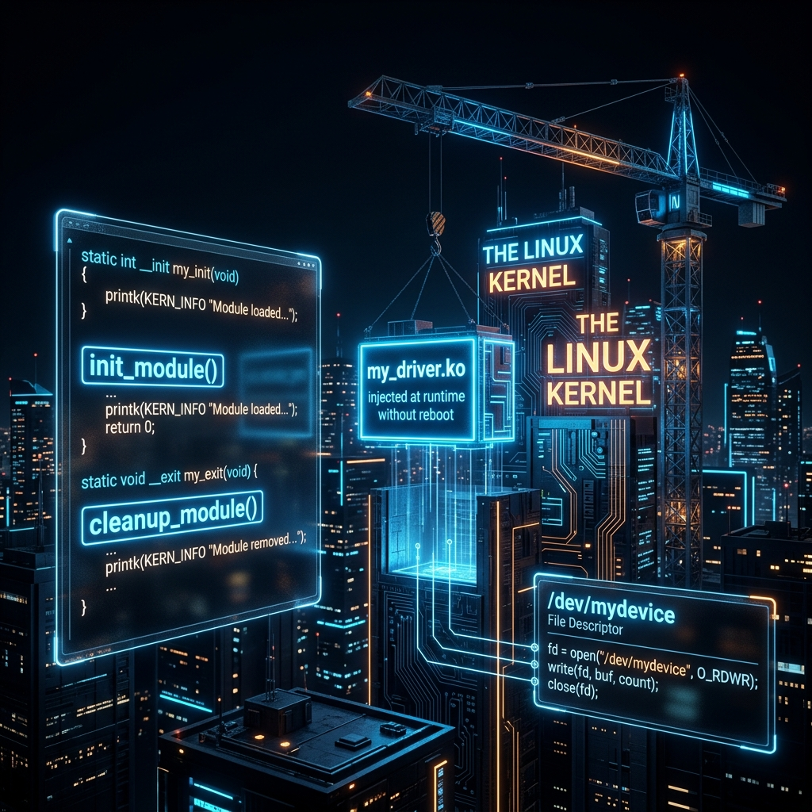

<div align="center">
  
</div>

# 08: Kernel Module Development (Writing a Device Driver)

> 🧠 **The Feynman Hook:** In Module 07, we saw the fortress wall separating User Space (your apps) from the Kernel (the monarch's core). But what happens if the Kernel doesn't know how to speak to a brand-new mechanical device, like a proprietary robotic arm you just bought? You can't just send a Syscall, because the underlying translation logic doesn't exist. You must write a translation manual — a **Device Driver** — and literally slide it under the fortress door into Ring 0. The Kernel dynamically loads this C code into its own brain without needing to reboot the castle. Suddenly, User Space can start sending `read()` and `write()` syscalls to a fake file in `/dev`, and your custom Kernel code intercepts them and drives the hardware.

**🎯 The Big Goal:** Write, compile, and securely inject a native C Character Device Driver into the monolithic Linux Kernel, bridging the gap between User Space commands and Ring 0 execution.

---

## 1. The Anatomy of a C Device Driver

> **Feynman Insight:** Writing a driver is simply filling out a questionnaire for the Kernel. You create a `file_operations` structure in C. You tell the kernel: "When a user program calls `read()` on my device, execute *this* C function. When they call `write()`, execute *that* function." 

The most critical danger zone is passing data: you cannot directly read the `buffer` pointer passed from User Space, because user memory might be paged out or malicious. You **MUST** use the secure `copy_to_user` and `copy_from_user` APIs, which safely chaperone data across the Ring 3/Ring 0 boundary.

**`mastery_device.c` (Core Excerpts)**
```c
#include <linux/init.h>
#include <linux/module.h>
#include <linux/fs.h>      // Required for character device registration
#include <linux/uaccess.h> // Secure Ring 3 -> Ring 0 memory traversal

#define DEVICE_NAME "mastery_device"
static char message[256] = {0};
static short message_len = 0;

// Triggered when User Space runs `cat /dev/mastery_device`
static ssize_t dev_read(struct file *filep, char *buffer, size_t len, loff_t *offset) {
    // SECURELY copy the kernel memory into the user's memory space.
    // Direct pointer access here = Kernel Panic.
    copy_to_user(buffer, message, message_len);
    return message_len;
}

// Triggered when User Space runs `echo "Hi" > /dev/mastery_device`
static ssize_t dev_write(struct file *filep, const char *buffer, size_t len, loff_t *offset) {
    // SECURELY pull the untrusted data out of User Space into the Kernel buffer
    copy_from_user(message, buffer, len);
    message_len = len;
    return len;
}

// Map the User-Space Syscalls to our custom C functions!
static struct file_operations fops = {
    .read = dev_read,
    .write = dev_write,
};

// ... Module init (register_chrdev) and exit routines omitted for brevity ...
```

---

## 2. Advanced Context Constraints (The Danger Zone)

> **Feynman Insight:** The CPU inside the Kernel is schizophrenic — it exists in two completely different states depending on *why* it was called. 

1. **Process Context**: A user application politely asked the Kernel to do something via a Syscall (like `read()` in our driver above). The Kernel is working "on behalf" of that process. If the hard drive needs time to spin up, the Kernel can safely put the process to "sleep" (`mutex_lock`), yield the CPU, and do other things.
2. **Atomic/Interrupt Context**: A physical piece of hardware (like a network card) violently shoots an electrical Interrupt Request (IRQ) to the CPU. The CPU instantly drops everything to run your Interrupt Handler function. 

> [!CAUTION]
> **You CANNOT sleep in Atomic Context!**
> If you call a sleeping function (like `mutex_lock` or allocate memory with `kmalloc` without `GFP_ATOMIC`) inside a hardware interrupt handler, the Kernel will instantly trigger an unrecoverable **System Deadlock**. The CPU scheduler is physically deactivated during interrupts! The box freezes. You pull the power plug.

### The Solution: Workqueues (Top Half / Bottom Half)
If your interrupt handler needs to do heavy I/O (like writing a keylogger event to disk), it uses a pattern called **Top Half / Bottom Half**:
- **Top Half (Atomic):** Acknowledges the hardware interrupt, grabs the raw data (e.g., the key byte), pushes it into a lightweight memory queue, and exits in 0.001 microseconds.
- **Bottom Half (Process Context):** A persistent background Kernel Thread (a **Workqueue**) gracefully wakes up later, pulls the data from the queue, safely sleeps while waiting for the SSD, and writes the log.

---

## 3. Compiling and Injecting the Driver

A Kernel Module (`.ko` file) isn't compiled like normal software. It must be woven directly against the exact Linux Headers that match your currently running kernel version (`uname -r`). We use a specialized Makefile.

**`Makefile`**
```makefile
obj-m += mastery_device.o

all:
	make -C /lib/modules/$(shell uname -r)/build M=$(PWD) modules
```

### The Injection Process

```bash
# 1. Compile the C code into a .ko module against the Kernel Headers
make

# 2. Inject it into Ring 0 dynamically (Root required)
sudo insmod mastery_device.ko

# 3. Read the Kernel Ring Buffer to see our initialization logs
sudo dmesg | tail -n 5
# Look for: "Registered with Major ID 240"

# 4. Create the fake hardware file natively! (Use the Major ID from step 3)
sudo mknod /dev/mastery_device c 240 0
sudo chmod 666 /dev/mastery_device

# 5. Play with your new Kernel Driver via User Space tools!
echo "Injected straight to Ring 0" > /dev/mastery_device
cat /dev/mastery_device

# 6. Clean up Memory
sudo rm /dev/mastery_device
sudo rmmod mastery_device
```

---

## 🤔 Reflection Questions

<details>
<summary>💡 View Answer: Why must we use 'copy_to_user' instead of just returning a pointer to our kernel array?</summary>

Security and memory mechanics. First, the pointer space is utterly different: the Kernel uses unified high-memory physical addresses, while the User Space application is operating inside an MMU-generated virtual hallucination. The user process literally cannot comprehend the kernel's memory address. Second, security. If the Kernel trusted a user-provided pointer directly, a malicious application could pass a pointer to sensitive Kernel structures (like password hashes or process credentials) and trick the Kernel into overwriting itself, seizing root control of the machine.
</details>

<details>
<summary>💡 View Answer: What is the defining difference between Process Context and Atomic Context?</summary>

**Permission to sleep.** In Process Context, the kernel is running on behalf of a specific user process; it is perfectly safe to block, wait for a lock, or wait for disk I/O, because the scheduler can just pause that specific process and run other software on the CPU. In Atomic Context (handling a hardware interrupt), the kernel is running essentially outside the bounds of the scheduler. It *preempted* everything. If you try to sleep or wait for a resource here, the scheduler cannot swap you out. The CPU halts entirely. Deadlock.
</details>

---

## 🐳 Hands-On Lab: Module Operations

*Note: True compiling requires matching host kernel headers. For this sandbox, we'll practice the administration side of modules.*

### Setup: Docker Sandbox
```bash
docker run -it --rm ubuntu:latest bash
apt-get update -qq && apt-get install -y -qq kmod
```

### Exercise 1: Exploring Installed Modules
> **Goal:** Traverse the filesystem where kernel modules are physically stored.
```bash
ls -l /lib/modules/$(uname -r)/kernel/drivers/net/
```
✅ **Expected:** You will see lists of `.ko` (Kernel Object) files for various networking hardware drivers (e.g., ethernet, wireless).

### Exercise 2: Module Dependencies
> **Goal:** Check what a specific module requires to run.
```bash
modinfo overlay || echo "Overlay module not available in this container config"
```
✅ **Expected:** The `modinfo` command reads the metadata encoded inside the compiled `.ko` file, exposing authors, license (GPL), and dependent modules needed before this one can load.

---

## 📝 Key Interview Talking Points

- **`insmod`/`rmmod`**: The tools used to dynamically insert and remove compiled kernel `.ko` objects at runtime, eliminating the need for server reboots.
- **`file_operations` struct**: The C structure that maps standard POSIX syscalls (`read`, `write`, `open`) to the custom C functions you wrote in your driver.
- **`copy_to_user` Security**: Crossing the Ring 3 / Ring 0 boundary requires memory sanitization. Never trust a user-space pointer implicitly.
- **The Top/Bottom Half Pattern**: The architectural solution to the "Cannot Sleep in Atomic Context" restriction. Handle the hard interrupt instantly, defer I/O Workqueues to Process Context.

---
[<< Previous: The Linux Kernel](./07_The_Linux_Kernel.md) | [Home: Curriculum Map](./README.md) | [Next: Memory & Storage Internals >>](./09_Memory_and_Storage_Internals.md)