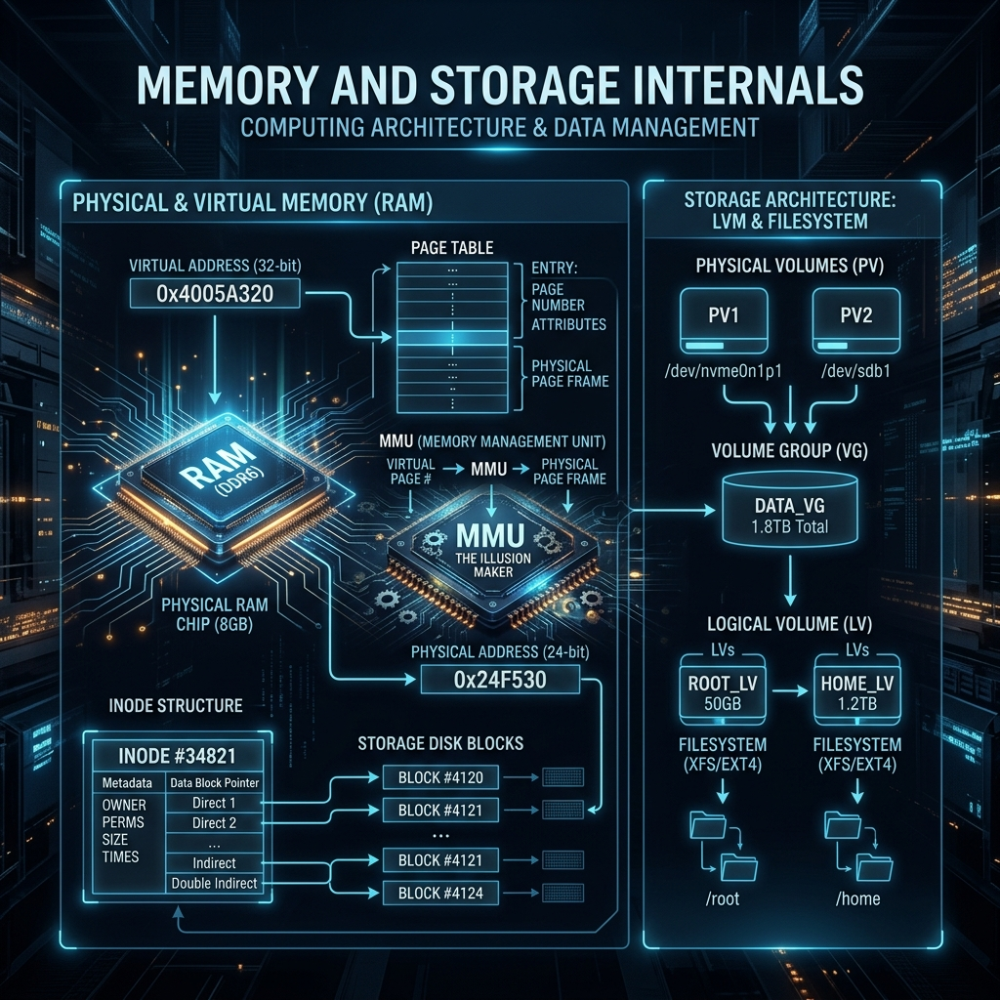

<div align="center">
  
</div>

# 09: Memory and Storage Internals

> 🧠 **The Feynman Hook:** When you write a C program and print a pointer variable, it outputs `0x7ffe420a9a10`. You naturally assume that address corresponds to a physical silicon grouping on your RAM stick. **It does not. It is entirely fake.** The Linux Kernel is the ultimate illusionist. It creates a matrix-like hallucination for *every single program* on the computer. Every app believes it has access to 256 Terabytes of continuous flat memory and is the only program running. Behind the curtain, the Kernel and the CPU use a frantic, invisible mapping system to translate those fake addresses to tiny scattered chunks of actual metal under the hood.

**🎯 The Big Goal:** Comprehend the abstraction layers that make modern computing viable: Virtual Memory (MMU translating fake RAM requests), Inodes (abstracting physical disk addresses), and LVM (abstracting entire physical hard drives).

---

## 1. Virtual Memory (The MMU Illusion)

> **Feynman Insight:** Linux chunks your physical RAM into fixed-size pieces called **Pages** (exactly 4 Kilobytes each). The Kernel maintains a giant dictionary called the **Page Table**. When Google Chrome asks to read from fake address `0xABC`, the CPU's hardware chip (the MMU - Memory Management Unit) intercepts it, looks up `0xABC` in the Kernel's dictionary, finds it mapped to actual physical silicon chunk `0x123`, and retrieves the data dynamically.

### Paging and Swap Space
If you open 500 Chrome tabs on an 8GB laptop, Linux physically runs out of silicon. To survive, the Kernel initiates **Swapping**.

1. The Kernel viciously hunts down 4KB Pages belonging to Chrome tabs you haven't viewed in 20 minutes.
2. It explicitly copies those RAM chunks down to the spinning Hard Drive (Swap Space).
3. It deletes the copies in physical RAM, freeing space for new applications.
4. It secretly updates the Page Table dictionary: "If Chrome asks for this memory again, it's actually on the SSD now."

When you click the old Chrome tab, your screen freezes for 3 seconds. The hardware hits a **Page Fault** — the MMU realizes the data isn't in RAM. The Kernel frantically drops active RAM to disk, pages the old Chrome data back up into physical RAM, and patches the dictionary. This frantic IO stalling is called **Thrashing**.

```bash
# View active physical RAM and Swap memory allocation instantly
free -h

# Example output snippet:
#               total        used        free      shared  buff/cache   available
# Mem:           15Gi       8.2Gi       2.1Gi       1.2Gi       5.4Gi       6.0Gi
# Swap:         8.0Gi       1.5Gi       6.5Gi
```

---

## 2. Inodes and the VFS (Virtual Filesystem)

> **Feynman Insight:** In Linux, a filename (`script.sh` or `logo.png`) is merely a human convenience. The operating system doesn't care about names. Files are mathematically identified by an integer called an **Inode**. The filename is just a sticky note attached to the Inode number.

The Inode exclusively contains the critical metadata:
- Size of the file in bytes.
- Octal permissions (`rwxr-xr-x`).
- Ownership IDs (UID/GID).
- An absolute array of **Data Block Pointers** indicating exactly where the raw 1s and 0s physically reside on the spinning platter — completely ignorant of the file's name.

```bash
# View the underlying Inodes attached to the fake filenames! (-i flag)
ls -li
# Output: 3482103 -rw-r--r-- 1 root root 8202 Mar 10 config.txt
# ^ The Inode number!
```
*Note: This is why you can safely rename an open file while a process is writing to it. The process is writing to the Inode descriptor underneath the sticky note. It doesn't care if you peel off the "config.txt" note and stick on "old-config.txt".*

### Filesystem Formatting: Ext4 vs. XFS
The exact structure of Inodes and layout optimization depends on the driver formatting the disk.
- **Ext4 (The Benchmark):** The stable default for Debian/Ubuntu. Reliable, journaled (prevents corruption during power loss).
- **XFS (The Beast):** Engineered for massively parallel I/O. If you are running an Enterprise PostgreSQL database accepting 10,000 writes a second concurrently, you format the partition natively in XFS for its parallel scalability.

---

## 3. LVM (Logical Volume Management)

> **Feynman Insight:** Classic 1990s computing bound a filesystem strictly to a hard drive partition (`/dev/sda1`). If that partition filled up, your database crashed, and you spent the weekend taking the system offline to copy everything to a bigger drive. **LVM** abstracts physical limits completely.

LVM creates a liquid pool of storage.
1. You take three physical 1TB hard drives (Physical Volumes - PV).
2. You melt them down into a single massive 3TB liquid pool (Volume Group - VG).
3. You pour out a 50GB slice for your operating system and a 1.2TB slice for your database (Logical Volumes - LV).

If your database fills up, you physically hot-plug a new 1TB drive into the rack, pour it into the VG pool without taking the system offline, and dynamically expand the database LV:
```bash
# Expand the running database filesystem online with absolutely zero downtime!
sudo lvextend -L +1T /dev/mapper/vg_data-database
sudo resize2fs /dev/mapper/vg_data-database
```

---

## 🤔 Reflection Questions

<details>
<summary>💡 View Answer: Describe how an attacker could crash a server with 'No space left on device' when the disk is still 50% empty.</summary>

**Inode Exhaustion.** An Inode is consumed every single time a file is created. A 1 Terabyte filesystem might only be formatted to hold 20 million Inodes. If an attacker writes a script that continuously creates 1-byte files (or entirely empty files), the disk space used remains negligible. However, once 20 million fake, empty files are generated, the filesystem runs out of Inodes to assign. Any subsequent attempt to create a file — by the database, system logs, or user — will fail with a `No space left on device` error, causing immense destruction despite leaving 500GB of physical capacity totally untouched.
</details>

<details>
<summary>💡 View Answer: Why do we want memory to show up under 'buff/cache' in the 'free -h' output?</summary>

Unused RAM is wasted RAM. Linux heavily caches disk reads. When you read a 1GB file, Linux loads it into RAM to give it to your app. But when the app is done, Linux *does not clear the RAM*. It leaves it there under `buff/cache`. If you request that file again, it is delivered instantaneously from silicon instead of spinning disk. If a new application launches and suddenly needs actual working RAM, the kernel instantly throws away the lowest-priority cached files to free up space. High `buff/cache` is proof of an efficient kernel accelerating I/O.
</details>

---

## 🐳 Hands-On Lab: Memory Visibility

### Setup: Docker Sandbox
```bash
docker run -it --rm ubuntu:latest bash
```

### Exercise 1: Decode /proc/meminfo
> **Goal:** Check raw hardware memory counters dynamically.
```bash
cat /proc/meminfo | head -10
```
✅ **Expected:** Detailed byte-level counters. Look specifically at `MemTotal` vs `MemAvailable`, and the size of `Buffers` and `Cached`.

### Exercise 2: Viewing Inodes
> **Goal:** Prove that filenames are separated from data descriptors.
```bash
touch my_test_file.txt
ls -i
# Find the inode number, e.g., 123456
```
✅ **Expected:** The `ls -i` command prints the unique integer Inode pointing to the zero-byte data block allocation.

### Exercise 3: Process Memory Map
> **Goal:** See exactly how the MMU illusion is laid out for your current running shell.
```bash
cat /proc/$$/maps | head -10
```
✅ **Expected:** The virtual memory layout for your `bash` shell (`$$` = current PID). Notice the massive hexadecimal ranges detailing executable space, the heap, and shared C libraries mapped invisibly into your address space.

---

## 📝 Key Interview Talking Points

- **Virtual Memory / MMU**: Pointers in code are virtual. The CPU/Kernel translates them to physical addresses instantly via Page Tables. This provides total security isolation.
- **OOM mapping & Swapping**: When physical RAM runs out, 4KB pages belonging to inactive processes are copied down to the hard drive (Swap). If this happens too fast, it creates I/O locks called Thrashing.
- **Inodes**: The true identifier of a file containing all metadata and disk block pointers, but NOT the filename. Exhausting Inodes crashes the disk just as surely as exhausting bytes.
- **LVM Liquid Storage**: Abstraction separating Logical Volumes from physical hard drive boundaries, allowing zero-downtime hot-expansion.

---
[<< Previous: Kernel Module Development](./08_Kernel_Module_Development.md) | [Home: Curriculum Map](./README.md) | [Next: Unix Systems Programming >>](./10_Unix_Systems_Programming.md)