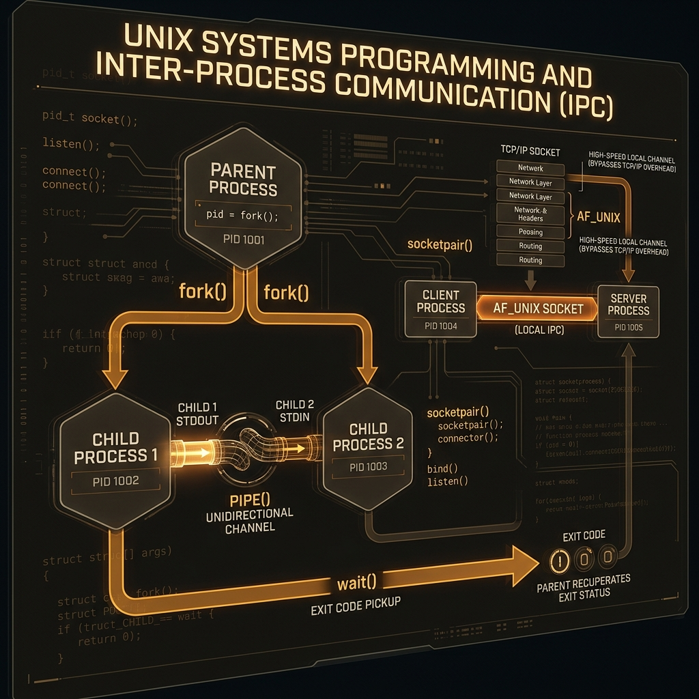

<div align="center">
  
</div>

# 10: UNIX Systems Programming & IPC

> 🧠 **The Feynman Hook:** Imagine two soundproof glass rooms. In Room A is an Accountant. In Room B is a Salesperson. They cannot yell to each other, and they cannot wave because the glass is opaque. How do they collaborate? They must use the building's pneumatic tube system controlled by the Building Manager (the Kernel). This tube system is **Inter-Process Communication (IPC)**. UNIX systems programming is the art of writing the C code that asks the Building Manager to duplicate rooms (`fork`), wait for people to finish their tasks (`wait`), and build pneumatic tubes so completely isolated workers can pass messages (`pipes` and `sockets`).

**🎯 The Big Goal:** Master native C system calls to orchestrate isolated multi-processing, leveraging `fork()`, `wait()`, Pipes, and high-performance UNIX Domain Sockets.

---

## 1. Creating Life (`fork` and `wait`) in C

> **Feynman Insight:** As we learned, Linux only creates new workers via mitosis. In C, when you call `fork()`, the universe forks into two alternate realities. The code literally branches. In Reality A (The Parent), `fork()` returns the ID of the new child. In Reality B (The Child), `fork()` returns `0`. The programmer writes an `if/else` statement to tell each reality what to do next.

**`daemon.c`**
```c
#include <stdio.h>
#include <stdlib.h>
#include <unistd.h>
#include <sys/wait.h>

int main() {
    // The moment this line executes, TWO identical programs are running identically.
    pid_t pid = fork();

    if (pid < 0) {
        fprintf(stderr, "FATAL: Fork Failed\n");
        return 1;
    } 
    else if (pid == 0) {
        // --- CHILD REALITY ---
        printf("[CHILD] My PID is %d. I will do CPU-heavy work now...\n", getpid());
        sleep(2);
        printf("[CHILD] Work complete. Terminating successfully.\n");
        exit(0); // Exit Code 0 (Success). The Child dies here.
    } 
    else {
        // --- PARENT REALITY ---
        printf("[PARENT] I spawned Child %d.\n", pid);

        // DO NOT CREATE ZOMBIES!
        // The Parent halts execution here until the pneumatic tube delivers the Child's death certificate.
        int status;
        waitpid(pid, &status, 0);

        if (WIFEXITED(status)) {
            printf("[PARENT] Child exited gracefully with Exit Code: %d\n", WEXITSTATUS(status));
        }
    }

    return 0;
}
```

---

## 2. IPC: The UNIX Pipe (`|`)

> **Feynman Insight:** A Pipe is literally an invisible, one-way pneumatic tube created by the Kernel in RAM. It has a **Write End** and a **Read End**. If the Reader stops reading, the Writer will happily keep stuffing data into the tube until it perfectly hits 64KB (the pipe buffer size). The moment it hits 64KB, the Kernel physically **freezes (blocks)** the Writer process mid-instruction until the Reader makes some space.

**`pipe_example.c`**
```c
#include <stdio.h>
#include <unistd.h>
#include <string.h>
#include <sys/wait.h>

int main() {
    // fd[0] is the Read End.
    // fd[1] is the Write End.
    int fd[2];
    
    // Create the pneumatic tube BEFORE the mitosis! Both Parent and Child will inherit it.
    if (pipe(fd) == -1) return 1;

    pid_t pid = fork();

    if (pid == 0) { // CHILD
        close(fd[0]); // Child closes its Read end (it only writes)
        
        char message[] = "Hello Parent! This is binary IPC data.";
        write(fd[1], message, strlen(message) + 1); // Shoot data down the pipe
        
        close(fd[1]); // Close Write end, Child is done.
    } 
    else { // PARENT
        close(fd[1]); // Parent closes its Write end (it only reads)
        
        char buffer[100];
        // The Parent completely freezes (blocks) here until the child pushes data into the tube!
        read(fd[0], buffer, sizeof(buffer)); 
        
        printf("Received via Kernel Pipe: %s\n", buffer);
        
        close(fd[0]);
        wait(NULL); // Reap the child
    }

    return 0;
}
```

---

## 3. UNIX Domain Sockets (`.sock`)

> **Feynman Insight:** If you have an Nginx proxy and a Python backend running on the same server, you might connect them via `localhost:8080` (TCP/IP). **This is computationally wasteful.** TCP/IP forces the Kernel to wrap the data in Ethernet networking frames, calculate mathematically intensive checksums, enforce congestion windows, and unwrap it all — just to send data 0 millimeters away! 

Instead, experts use **UNIX Domain Sockets (`AF_UNIX`)**.
They act fundamentally like IP sockets to the programmer, but they use a *literal file path natively* (e.g., `/var/run/docker.sock`) instead of an IP address. The firewall is bypassed. The network stack is bypassed. Data simply leaps across RAM at lightning speed.

### Why Docker breaks without `sudo`
When you type `docker ps`, your terminal creates an `AF_UNIX` connection to `/var/run/docker.sock` to ask the Docker daemon for the list. Because it is a physical file, normal Linux permissions apply (`rw-rw---- root docker`). If your user is not in the `docker` group, the Kernel denies you permission to open the file! 

---

## 🤔 Reflection Questions

<details>
<summary>💡 View Answer: If Parent and Child inherit the same open Pipe, why do they both explicitly close one end?</summary>

**Half-Duplex constraints and EOF detection.** Pipes are strictly one-way (half-duplex). If the parent accidentally writes into the same tube the child is writing into, data becomes corrupted. More importantly: the `read()` function only generates an End-Of-File (EOF) signal when *every single writer* attached to that pipe closes their write descriptor. If the parent doesn't close its inherited write descriptor (even if it never intends to use it), the `read()` will hang forever waiting for more data, because the parent itself is technically still a valid potential writer!
</details>

<details>
<summary>💡 View Answer: Under what exact extreme scenario would the fork() system call fail (return -1)?</summary>

Mitosis requires resources. A `fork()` fails when the Kernel physically denies the request. The two primary reasons: **1. Absolute Process Limits:** The `ulimit -u` configuration sets a hard ceiling on the number of processes a single user can own (often to prevent fork-bomb denial-of-service attacks). **2. Memory Exhaustion:** While modern Linux uses "Copy-on-Write" optimizations so `fork()` doesn't actually duplicate gigabytes of RAM instantly, the Kernel must still allocate Page Table entries and a new Process Control Block. If the system is utterly out of Memory and Swap, the fork is denied.
</details>

---

## 🐳 Hands-On Lab: System Calls via strace

### Setup: Docker Sandbox
```bash
docker run -it --rm --cap-add=SYS_PTRACE ubuntu:latest bash
# Note: PTRACE required for strace
apt-get update -qq && apt-get install -y -qq strace gcc
```

### Exercise 1: Compile and Run C IPC
> **Goal:** Run the pipe example natively.
```bash
cat << 'EOF' > pipe_example.c
#include <stdio.h>
#include <unistd.h>
#include <string.h>
#include <sys/wait.h>
int main() {
    int fd[2]; pipe(fd);
    if (!fork()) { close(fd[0]); write(fd[1], "Hello", 6); close(fd[1]); }
    else { close(fd[1]); char b[10]; read(fd[0], b, 10); printf("Got: %s\n", b); close(fd[0]); wait(NULL); }
    return 0;
}
EOF
gcc pipe_example.c -o pipe
./pipe
```
✅ **Expected:** Beautiful stdout: `Got: Hello`. Full native IPC execution.

### Exercise 2: Trace File Operations
> **Goal:** See exactly what `cat` does under the hood.
```bash
echo "data" > test.txt
strace -e openat,read,write,close cat test.txt
```
✅ **Expected:** By filtering with `-e`, you clearly see `cat` opening the file, reading it, writing it to stdout (fd 1), and closing it.

---

## 📝 Key Interview Talking Points

- **`fork()` vs `exec()`**: `fork()` duplicates the current reality. `exec()` destroys the current reality and replaces it with a new program. Used tightly together.
- **Why UNIX Domain Sockets beat TCP/IP for local IPC**: It perfectly bypasses the massive overhead of the TCP stack, checksum algorithms, and TCP window adjustments, transferring data instantly via Kernel RAM allocation routines.
- **The Danger of Blocking `read`**: If you do not configure a pipe's File Descriptor to be non-blocking (`O_NONBLOCK`), waiting for data that never arrives will permanently freeze (hang) the application.
- **Copy-on-Write**: `fork()` is extremely fast because Linux doesn't physically duplicate the gigabytes of parent RAM. Both parent and child share the same physical memory until one of them *writes* (mutates) the data, at which point the Kernel copies only that specific 4KB page.

---
[<< Previous: Memory & Storage Internals](./09_Memory_and_Storage_Internals.md) | [Home: Curriculum Map](./README.md) | [Next: Systems Performance Metrics >>](./11_Systems_Performance_Metrics.md)