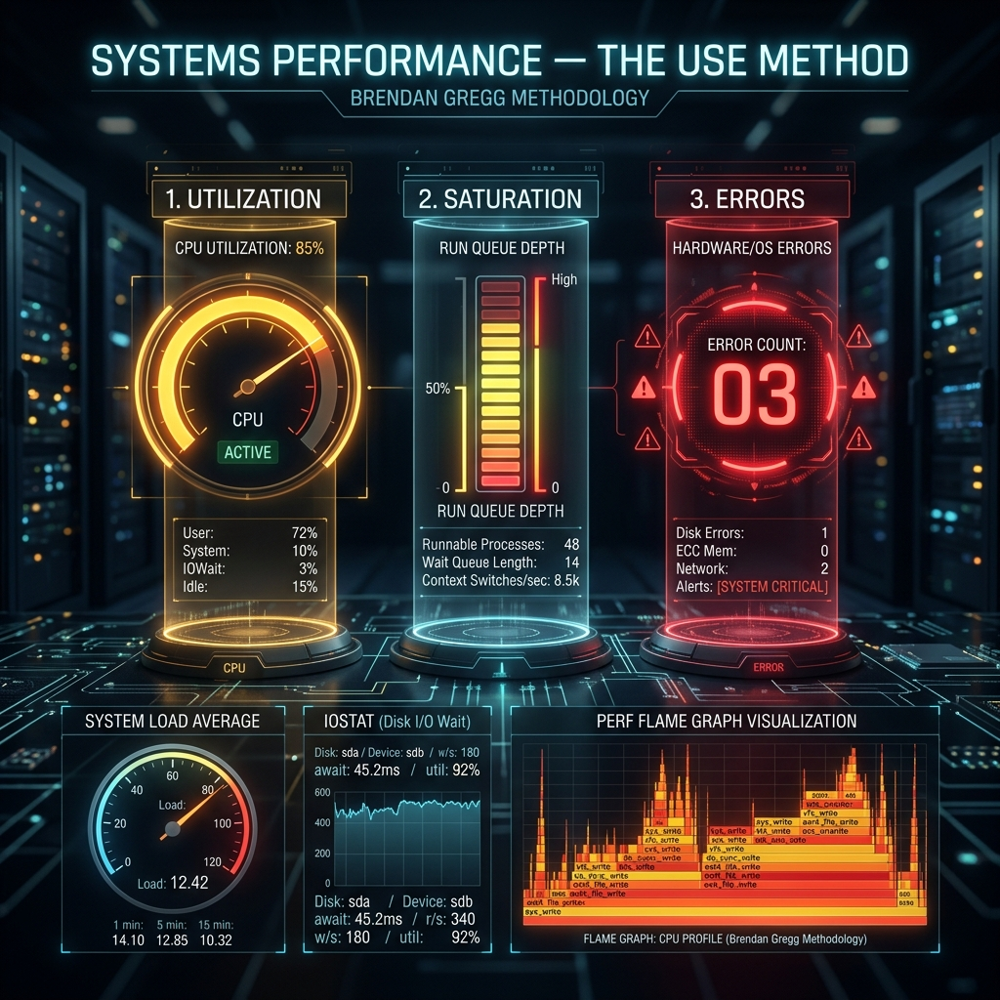

<div align="center">
  
</div>

# 11: Systems Performance and The USE Method

> 🧠 **The Feynman Hook:** A doctor rarely asks a patient, "Are you broken?" Instead, they aggressively check the vital signs: measuring the pulse (Utilization), looking for coughing fits (Saturation), and checking for fever (Errors). A server is exactly the same. When a system administrator is told the server is "slow", amateurs wildly guess and reboot machines. Experts act like the trauma surgeon: they deploy the **USE Method**. They systematically check every organ (CPU, Disk, Memory, Network) for Utilization, Saturation, and Errors. They do not look at application logs until they have mathematically proven the hardware is healthy.

**🎯 The Big Goal:** Transition from guessing to empirical profiling. Isolate severe bottlenecks using the universal USE Method, Load Averages, and advanced subsystem probes (`iostat`, `vmstat`, `perf`).

---

## 1. The USE Method 

> **Feynman Insight:** For every single hardware resource on the machine, you must determine exactly three mathematical metrics. This cuts through the noise of application logs.

1. **Utilization:** Is the resource heavily busy? (e.g., CPU is pinned at 99%. Disk is spinning 100% of the time). Utilization *alone* does not mean bad performance. It means high efficiency.
2. **Saturation:** Is there a queue of work physically waiting for the resource? (e.g., 50 threads desperately waiting for 1 CPU core). Saturation causes massive latency.
3. **Errors:** Are there hardware/software errors dropping requests? (e.g., failed network packets, disk block timeouts).

### Isolating the Bottleneck:
- **CPU Saturation:** CPU is 100% Utilized, Load Average is 15.0 on a 4-core machine. 11 processes are *Saturated* and desperately waiting in the Linux run queue. 
- **Disk Saturation:** CPU is at 5% Utilization, but the DB app takes 10 seconds to respond. You check Disk I/O. The disk is 100% Utilized, and 200 filesystem requests are waiting in the queue. You are bottlenecked on spinning rust!
- **Network Errors:** Network Utilization is only 10% capacity. No saturation. But `netstat` shows exactly 5000 TCP Retransmits per second. You have a failing switch dropping your packets!

---

## 2. Demystifying Load Averages (`uptime`)

> **Feynman Insight:** The most misunderstood metric in existence is Load Average. It is not CPU percentage! In Linux, **Load** is simply the total number of processes currently executing on a CPU core *PLUS* the number of processes stuck in the *Uninterruptible Sleep* state (`D` state in `htop` — usually waiting for a slow disk). 

```bash
# Output: load average: 2.15, 1.83, 1.50
uptime
```
The three numbers represent the exponentially damped moving average of the Load over the last **1 minute**, **5 minutes**, and **15 minutes**.

**The Golden Rule of Load:**
Think of the CPU as a bridge with lanes. If your server has exactly **4 CPU Cores**, a Load Average of `4.00` means your CPUs are perfectly busy. 4 cars crossing 4 lanes. No traffic jam, just maximum efficiency.
If your Load hits `10.00` on a 4-core machine, you have a massive traffic jam! 6 cars are stopped honking their horns (waiting in the kernel queue). The system will feel incredibly sluggish.

---

## 3. High-Speed Resource Probes

Amateurs use `top`, which aggregates too much data and hides the subsystem truth. Experts use specialized probes to isolate specific vital organs.

### Virtual Memory Statistics (`vmstat`)
`vmstat` gives a high-level overview of RAM, Swapping, and CPU context switches instantly.

```bash
# Update the metrics every 1 second, exactly 5 times.
vmstat 1 5

# Critical indicators:
# 'si' (Swap In) & 'so' (Swap Out): If these are persistently > 0, your server 
# is completely out of RAM and desperately Thrashing the hard drive linearly to survive!
# 'us' (User CPU) vs 'sy' (System CPU): If 'sy' > 50%, your app is spamming the kernel with bad syscalls.
```

### I/O Statistics (`iostat`)
When the database is unresponsive, always check the physical disks.

```bash
# Advanced disk metrics, focusing on wait queues (-x = extended)
iostat -xz 1
```
Look at the `%util` (Utilization) column. If it is 100%, your disk is pinned to the absolute physical limit. Look at `await` (Average Wait Time). If your disk `await` is 500ms, every single database query is severely delayed by physics.

### Network Statistics (`sar`)
```bash
# Instantly see all active TCP resets, retransmits, and dropped packets
sar -n TCP,ETCP 1
```

---

## 4. The Linux Profiler (`perf`)

> **Feynman Insight:** If your Go or C++ application is using 100% of a CPU core, you need to know exactly *which function* is causing the infinite loop. You can't just restart it — you must diagnose it. `perf` is a sniper rifle. It asks the CPU hardware to stop exactly 99 times a second, look at what line of code it is executing right now, and keep a tally. 

```bash
# 1. Record the CPU samples across the entire system for exactly 10 seconds (-F 99 = 99 Hertz)
sudo perf record -F 99 -a -g -- sleep 10

# 2. Automatically analyze the binary memory dump into an interactive UI!
sudo perf report
```
You will literally see: `std::vector::push_back` taking 45% of the CPU dynamically. You have mathematically proven the exact line of code causing the outage — directly from Ring 0, entirely without attaching a heavy debugger to the application!

---

## 🤔 Reflection Questions

<details>
<summary>💡 View Answer: If a 32-core server has a Load Average of 25.0, is it saturated and overloaded?</summary>

**No.** It is actually highly underutilized. Because Load Average counts the number of processes actively executing or waiting, a Load of 25 on a 32-lane bridge means 25 cars are driving smoothly, and 7 lanes are completely empty. The system will feel blazingly fast. Always compare Load Average linearly against the physical CPU core count!
</details>

<details>
<summary>💡 View Answer: Why do experts prefer sampling profilers like 'perf' over instrumentation profilers that inject timer code into every function?</summary>

**Observer Effect.** Instrumentation profilers dynamically rewrite the application's bytecode to inject "start_timer()" and "stop_timer()" inside every single function. For tight, high-frequency loops in C++, the sheer overhead of running those timing functions completely distorts the application's behavior — slowing it down 10x and hiding the real bottleneck. `perf` asks the hardware interrupts to sample the instruction pointer. It introduces barely 1% overhead, providing an incredibly accurate representation of true production behavior.
</details>

---

## 🐳 Hands-On Lab: Basic Profiling

### Setup: Docker Sandbox
```bash
# We need an inherently privileged container to read the entire system's CPU state
docker run -it --rm --privileged --pid=host ubuntu:latest bash
apt-get update -qq && apt-get install -y -qq sysstat linux-tools-common linux-tools-generic stress
```

### Exercise 1: Use `vmstat` for System Health
> **Goal:** Monitor memory, swap, IO, and CPU simultaneously.
```bash
# Run a background CPU burn process
stress --cpu 2 &
# Check the vitals
vmstat 1 5
```
✅ **Expected:** The `us` (User) CPU column will instantly spike to near 100%, and the `id` (Idle) column will drop to 0, validating that your CPU is maxed out. (Kill the stress process with `killall stress` afterwards).

### Exercise 2: Collect CPU Stats with `mpstat`
> **Goal:** View per-core CPU utilization linearly.
```bash
mpstat -P ALL 1 2
```
✅ **Expected:** Detailed CPU usage breakdown (user, sys, iowait, idle) for every single individual hardware CPU core you own!

---

## 📝 Key Interview Talking Points

- **The USE Method**: Utilization, Saturation, Errors. State that tracing an outage *always* begins with these metrics across every hardware subsystem before touching application logs.
- **Load Average vs CPU %**: Load is queue length (processes running + processes in Uninterruptible Sleep). It is relative to Core Count. CPU % is just active cycles.
- **`iostat %util` and `await`**: The definitive metrics for proving an application is I/O bottlenecked by slow hard drives.
- **`perf` Profiling**: Sampling the instruction pointer at 99Hz minimizes the Observer Effect, identifying code bottlenecks with practically zero overhead in high-throughput production environments.

---
[<< Previous: Unix Systems Programming](./10_Unix_Systems_Programming.md) | [Home: Curriculum Map](./README.md) | [Next: Deep Packet Inspection >>](./12_Deep_Packet_Inspection.md)