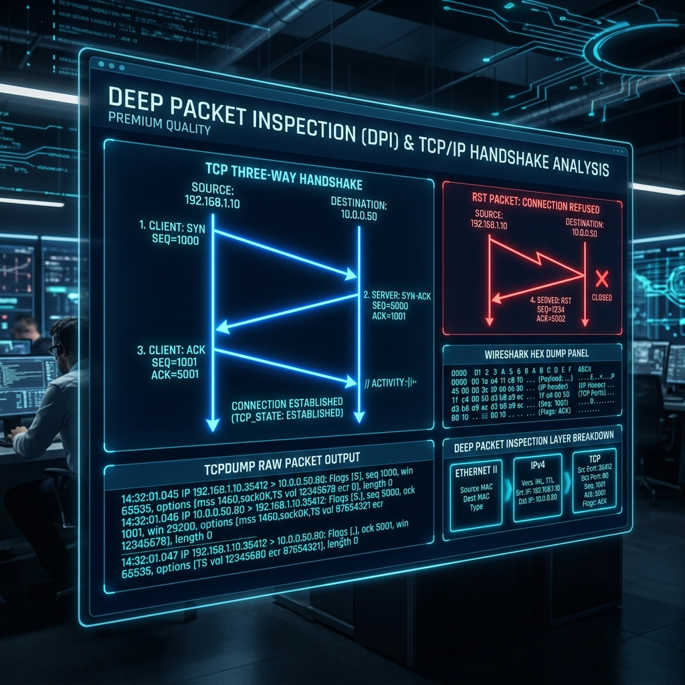

<div align="center">
  
</div>

# 12: Deep Packet Inspection (TCP/IP)

> 🧠 **The Feynman Hook:** When you mail a physical letter to a friend, you put your letter (the HTTP payload) into a sealed envelope. On the envelope, you write the Destination Address (IP) and add a tracking number (TCP Sequence). You hand it to the post office. If your friend never receives the letter, reading the actual letter content won't help you debug the issue. You need to talk to the Postal Service and track the envelope itself. **Deep Packet Inspection** is halting the postal truck on the highway (`tcpdump`), ripping open the mailbags, and verifying exactly where the envelopes are getting lost. 

**🎯 The Big Goal:** Bypass useless application-level HTTP error logs. Learn to intercept, filter, and inspect raw binary TCP/IP packets directly off the Ethernet card using `tcpdump` to prove exactly why connections are failing.

---

## 1. The TCP 3-Way Handshake (The Postal Agreement)

> **Feynman Insight:** TCP (Transmission Control Protocol) is incredibly reliable, but it requires a strict pre-agreement before any actual data is allowed to flow. Every time you connect to a database or a website, the OS kernels perform an invisible synchronized dance. Only when this dance completes does HTTP data flow.

1. **Client sends `SYN` (Synchronize):** "Hi Server, my random sequence number is 1000. Let's talk securely."
2. **Server sends `SYN-ACK` (Acknowledge):** "I got your 1000! My random sequence number is 5000."
3. **Client sends `ACK` (Acknowledge):** "I got your 5000! The pipeline is open."

### Why this matters for debugging:
- If a firewall blocks port 443, the Server never sees the `SYN`. The Client receives infinite silence, waits 3 seconds, resends the `SYN`, and eventually timeouts.
- If the Server is physically online but the Nginx software crashed, the Linux Kernel intercepts the `SYN`, realizes nothing is listening, and instantly fires back an aggressive `RST` (Reset) packet. The connection dies instantly with "Connection Refused."

---

## 2. Deep Inspection with `tcpdump`

> **Feynman Insight:** `tcpdump` is an extreme sniffer. It sits inside the Linux Kernel (using a mechanism called BPF) and perfectly copies raw packets off the network card *before* the firewall or applications even process them.

```bash
# 1. Capture absolutely everything passing through Ethernet card 'eth0'!
# (-n prevents slow DNS resolution, -nn prevents slow port/service resolution)
sudo tcpdump -i eth0 -n -nn

# 2. Extreme Filtering: Isolate traffic strictly going to Port 8080 OR coming from 10.0.0.5
sudo tcpdump -i eth0 -n -nn 'port 8080 or host 10.0.0.5'

# 3. Reading the HTTP payload dynamically!
# -A prints the packet payloads in ASCII text so you can read unencrypted HTTP Headers
# -s 0 captures the entire gigantic packet instead of truncating it
sudo tcpdump -i eth0 -n -nn -A -s 0 'port 80'
```

### Analyzing `tcpdump` Output Visually
You will see cryptic text speeding by:
`IP 192.168.1.5.54321 > 10.0.0.1.80: Flags [S], seq 1234567, length 0`

The **Flags** tell you exactly what stage the connection is in:
- `[S]`: This is the `SYN` packet! They are knocking on the door.
- `[.]`: An invisible `ACK` packet. Acknowledging data receipt.
- `[P.]`: A `PSH+ACK`. (PUSH). Real application data (like HTTP) is actively flowing!
- `[R.]`: The Sniper Rifle. A brutal TCP `RST` reset! Someone violently slammed the door.
- `[F.]`: A `FIN` (Finish). The connection is closing gracefully and politely.

---

## 3. Saving to PCAP and Wireshark Translation

> **Feynman Insight:** `tcpdump` pushes text to the terminal way too fast on a 10Gbps production switch. Your terminal will literally freeze. Instead, you instruct `tcpdump` to write the raw binary zeros and ones directly to a file (`.pcap`). You then download this file to your laptop and open it in Wireshark, which translates the matrix binary into a beautiful, searchable, color-coded UI.

```bash
# Captures 5000 massive packets rapidly to disk and then halts automatically (-c 5000)
# -w outage_capture.pcap instructs it to Write to file.
sudo tcpdump -i eth0 -w outage_capture.pcap -c 5000
```

Once opened in Wireshark locally, you can apply extremely powerful filters like `http.response.code == 502` to instantly find the exact packet that caused the gateway timeout.

---

## 🤔 Reflection Questions

<details>
<summary>💡 View Answer: If an application logs "Connection Timeout", what specific TCP flag behavior would you expect to see in tcpdump?</summary>

You would see an endless stream of `[S]` (SYN) packets leaving your server, but absolutely zero `[S.]` (SYN-ACK) packets returning from the destination. This proves the request is leaving your machine, but the destination (or a firewall in between) is blackholding the traffic and dropping it silently, forcing the TCP stack to timeout.
</details>

<details>
<summary>💡 View Answer: If an application logs "Connection Refused", what specific TCP flag behavior would you expect to see in tcpdump?</summary>

You would see your server send an `[S]` (SYN) packet, and almost instantaneously, the destination would fire back an `[R.]` (RST-ACK) packet. This proves the destination machine is perfectly online, but the OS Kernel actively rejected the connection because no underlying application was actively listening on that port.
</details>

---

## 🐳 Hands-On Lab: Packet Capture Basics

### Setup: Docker Sandbox
Standard Docker containers run on an isolated virtual `bridge` network. To sniff your actual Host network card natively, we must map the Network Namespace and run privileged.

```bash
docker run -it --rm --network host --cap-add NET_ADMIN --cap-add NET_RAW ubuntu:latest bash
apt-get update -qq && apt-get install -y -qq tcpdump curl
```

### Exercise 1: Capture Traffic to a Specific Host
> **Goal:** Use `tcpdump` to snag packets heading to example.com.
```bash
# Start tcpdump in the background
tcpdump -n host example.com &
sleep 2

# Issue the HTTP request
curl -s http://example.com > /dev/null

# Kill the background tcpdump job
kill %1
```
✅ **Expected:** You see the TCP handshake (SYN, SYN-ACK, ACK) explicitly logged before the HTTP data starts flowing, followed by the FIN tear-down.

### Exercise 2: Save and Read PCAP Files natively
> **Goal:** Save a binary trace for later analysis.
```bash
# Capture exactly 15 packets and save to file
tcpdump -i any -w trace.pcap -c 15
# Read the binary file back into the terminal cleanly
tcpdump -r trace.pcap -n
```
✅ **Expected:** The packets are written perfectly to the binary structure and retrieved perfectly without data loss.

---

## 📝 Key Interview Talking Points

- **`tcpdump` capability**: When app logs fail, network engineers fall back to `tcpdump`. It guarantees absolute truth about what is entering or leaving the physical NIC.
- **TCP Flags**: Knowing `SYN` (timeout) vs `RST` (connection refused) is the ultimate differentiator between an intermediate firewall configuration issue and an application crash issue.
- **PCAP Analysis**: Emphasize that production debugging involves capturing raw `.pcap` files on headless Linux servers using `tcpdump` and downloading them for deep UI analysis in Wireshark.

---
[<< Previous: Systems Performance Metrics](./11_Systems_Performance_Metrics.md) | [Home: Curriculum Map](./README.md) | [Next: eBPF Observability >>](./13_eBPF_Observability.md)