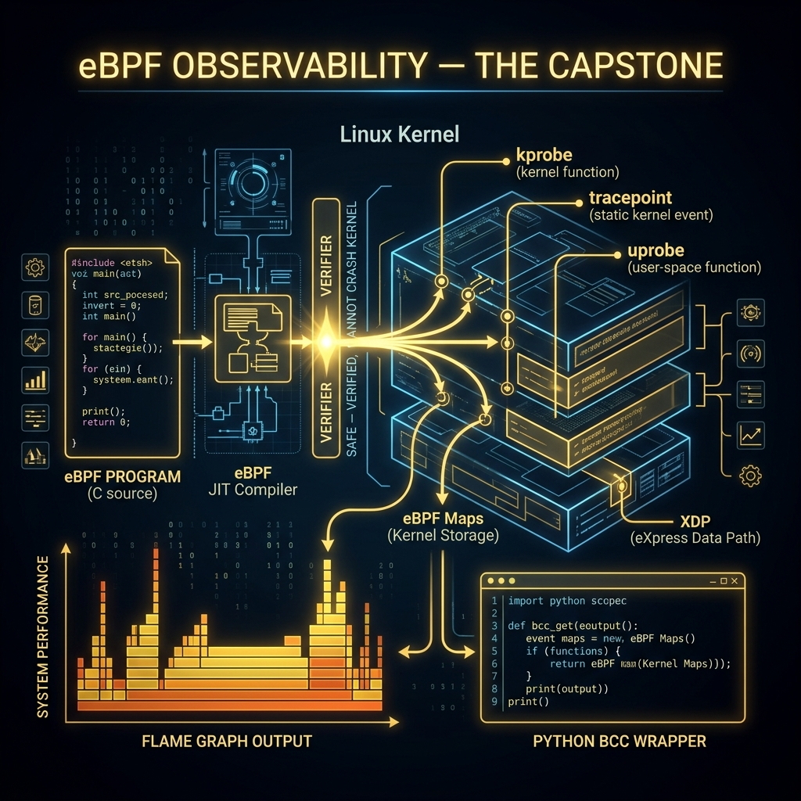

<div align="center">
  
</div>

# 13: eBPF Observability (The Capstone)

> 🧠 **The Feynman Hook:** Imagine trying to count exactly how many people enter a massive, crowded shopping mall (the Linux Kernel). In the old days, you'd freeze all the doors for 5 minutes (`strace`), or you'd require every store to mail you a report (`application logs`). eBPF is different. eBPF is like creating a microscopic, invisible drone. You program the drone with simple instructions ("count when someone enters, alert if they rob a store"). You release it into the mall. The drone executes with zero overhead, perfectly safe, in real-time, completely invisible to the shoppers.

**🎯 The Big Goal:** Understand eBPF — the revolutionary technology that allows deploying sandboxed, ultra-high-speed C code directly into the monolithic Linux Kernel for infinite observability without reboots or risk of crashes.

---

## 1. What is eBPF?

> **Feynman Insight:** Historically, if you wanted to observe deep OS events, you had to write a Loadable Kernel Module (`.ko`). If you made a typo, your code would infinitely loop, seize a CPU core, and catastrophically crash the entire production server (Kernel Panic). 

**eBPF (Extended Berkeley Packet Filter)** solves this completely.
It is an invisible Virtual Machine residing purely in Kernel space. 
1. You write a tiny C program. 
2. eBPF puts it through an extreme **Verifier**. The verifier mechanically proves the code cannot crash, cannot infinitely loop, and cannot access secure memory it shouldn't. 
3. If it passes, eBPF **JIT (Just-In-Time) Compiles** the C directly into raw CPU machine code and physically attaches it to a kernel event. 
It executes at native hardware speed with zero risk.

---

## 2. Kprobes and Uprobes (The Hooks)

You attach your eBPF drones to specific "Hook Points."

- **`kprobes` (Kernel Probes):** Triggers identically every single time a specific *Kernel* function executes. You can hook `vfs_read()` to log every single file read occurring on the server across all Docker containers simultaneously.
- **`uprobes` (User Probes):** Triggers identically every single time a specific *Application* function executes! You can attach to a specific `PostgreSQL` C function to capture exactly how long it takes to process queries natively, without modifying PostgreSQL code.
- **XDP (eXpress Data Path):** A networking hook that executes the instant an Ethernet packet lands on the physically active Network Card, *before* the Linux Kernel even realizes a packet arrived! You can drop a massive 10Gbps DDoS attack natively on the hardware before CPU utilization even registers it!

---

## 3. The `bcc` Toolkit (BPF Compiler Collection)

Writing raw eBPF assembly is brutal. Brendan Gregg created the `bcc` tools — an elegant Python wrapper around the low-level C code. 

```bash
# Ubuntu includes these pre-compiled scripts
sudo apt-get install bpfcc-tools linux-headers-$(uname -r)
```

### The Magic of Pre-Built Tools
You don't even have to write the code yourself. The toolkit provides dozens of pre-written eBPF probes ready for execution.

```bash
# 1. Analyze slow Disk I/O Latency in real-time natively!
# This traces the exact block device queue inside the Kernel.
sudo biolatency-bpfcc

# 2. Print exactly which process is constantly opening files!
# Intercepts the exact `do_sys_open()` kernel function.
sudo opensnoop-bpfcc

# 3. View active database queries arriving globally to MySQL!
# Connects a Uprobe dynamically to the running database binary.
sudo dbslower-bpfcc mysql -p $(pgrep -n mysqld) 5 
```

---

## 4. Writing Your Own eBPF Drone

Let's write a python script that injects C code into the kernel to trace whenever *any* process calls `clone()` (the syscall used by `fork` and Docker to spawn new processes).

**`trace_clone.py`**
```python
#!/usr/bin/python3
from bcc import BPF

# 1. Define the eBPF Program in pure C
bpf_program = """
    // This executes in Ring 0!
    int trace_sys_clone(struct pt_regs *ctx) {
        
        // bpf_trace_printk is a highly optimized, extremely lightweight logger 
        // that prints directly into a special Kernel buffer
        bpf_trace_printk("eBPF ALERT: A process just called clone()!\\n");
        return 0; 
    }
"""

# 2. Compile and interact with the Kernel
b = BPF(text=bpf_program)

# 3. Attach the Hook!
# We glue our C function exclusively to the Linux tracking syscall for 'clone'
b.attach_kprobe(event=b.get_syscall_fnname("clone"), fn_name="trace_sys_clone")

print("Successfully injected eBPF into the Linux Kernel. Ctrl+C to stop.")

# 4. Continuously read the specialized Kernel print buffer infinitely.
b.trace_print()
```

If you run `sudo ./trace_clone.py` in one terminal, and simply type `ls` in another, your script will instantly scream `eBPF ALERT: A process just called clone()!`. You have successfully intercepted the OS natively.

---

## 🤔 Reflection Questions

<details>
<summary>💡 View Answer: Why does eBPF require the Linux Kernel Headers to be installed?</summary>

Your eBPF C code needs to understand the exact structure and layout of the Linux Kernel's internal variables and memory (like `struct pt_regs`). Because the kernel structure changes dynamically with every single minor release version (e.g., Ubuntu 22.04 kernel is different from 24.04 kernel), `bcc` must perfectly compile your C code *on the fly* against the exact matching header files installed for the running kernel.
</details>

<details>
<summary>💡 View Answer: How is a Uprobe (User Probe) different from a Kprobe?</summary>

A `kprobe` attaches to a function defined strictly within the Linux OS Kernel itself (Ring 0) — for example, TCP send functions, filesystem read functions. A `uprobe` attaches to a specific compiled binary running in User Space (Ring 3) — for example, attaching to the compiled `malloc` code in `glibc`, or a specific TLS encryption function inside an actively running internal Nginx binary.
</details>

---

## 🐳 Hands-On Lab: BPF Concepts

*Note: True eBPF injection requires extreme host privileges (essentially Rooting the kernel). We use a privileged sandbox.*

### Setup: Docker Sandbox
```bash
docker run -it --rm --privileged -v /lib/modules:/lib/modules:ro --pid=host ubuntu:latest bash
apt-get update -qq && apt-get install -y -qq bpfcc-tools python3-bpfcc linux-headers-generic
```

### Exercise 1: Check the BPF Filesystem
> **Goal:** See the persistent VFS mounting for eBPF maps.
```bash
ls -l /sys/fs/bpf
```
✅ **Expected:** A mounted filesystem designed exclusively to hold persistent, blistering fast eBPF data mapping arrays (hash maps shared back to user space Python).

### Exercise 2: Verify JIT Compilation
> **Goal:** Prove the OS natively evaluates eBPF into machine code.
```bash
cat /proc/sys/net/core/bpf_jit_enable
```
✅ **Expected:** A value of `1` (or `2` = verbose logging). This proves the BPF Just-In-Time compiler is heavily active, ensuring performance.

### Exercise 3: Run the Golden BCC Tool (opensnoop)
> **Goal:** Watch file activity cluster-wide natively.
```bash
opensnoop-bpfcc
```
✅ **Expected:** An aggregated, instantaneous stream proving exactly which processes (by PID) are aggressively calling `open()`, reading config files, or dumping log data anywhere on the server.

---

## 📝 Key Interview Talking Points

- **The eBPF Revolution**: It is a secure, perfectly sandboxed execution environment inside the Kernel.
- **The Verifier**: The critical eBPF component that mathematically proves your injected code cannot infinitely loop or crash the OS before it allows execution.
- **XDP (eXpress Data Path)**: Highlight that eBPF programs can run on the physical NIC prior to Kernel processing, dropping massive DDoS attacks at wire-speed line rate.
- **Uprobes & Kprobes**: Knowing the difference between observing application functions dynamically vs OS functions dynamically.

---
[<< Previous: Deep Packet Inspection](./12_Deep_Packet_Inspection.md) | [Home: Curriculum Map](./README.md) | [Next: File I/O Internals >>](./14_File_IO_Internals.md)