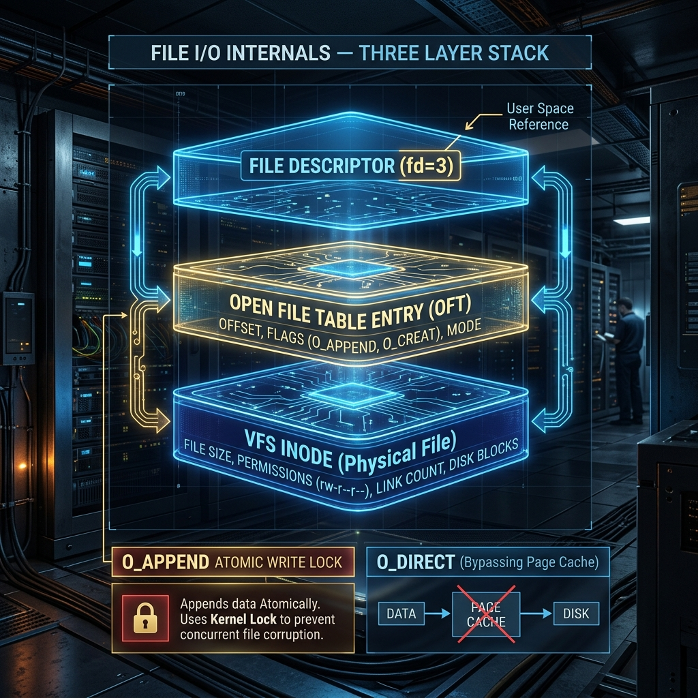

<div align="center">
  
</div>

# 14: File I/O Internals & Buffering

> 🧠 **The Feynman Hook:** Imagine a massive Library (the Hard Drive). When you write a Python script to read a book, Python doesn't actually go into the library. It asks the Librarian (the Kernel) for a book. The Librarian doesn't give you the book; they assign you a claim ticket number, like "Ticket 3" (a **File Descriptor**). Behind the desk, the Librarian maintains a highly complex ledger mapping Ticket 3 to where you left your bookmark, and mapping the bookmark to the exact physical aisle and shelf where the book resides (**Inodes**). Understanding File I/O is mastering this tracking ledger system, and realizing that when you request a "library return", the Librarian often stacks books in a cart (the Kernel Cache) and doesn't explicitly put them on the shelves until hours later!

**🎯 The Big Goal:** Descend into the raw Linux File I/O subsystem. Master File Descriptors, the 3-Layer Open File Table architecture, Race Conditions, and the extreme danger of implicit Kernel Cache buffering.

---

## 1. The Universal I/O Space (File Descriptors)

> **Feynman Insight:** The foundational brilliance of UNIX is "Everything is a file." A text file, a network socket, an interactive terminal screen, and your physical RAM are all abstracted as files. To access them, the Kernel gives you a non-negative integer called a **File Descriptor (fd)**.

There are exactly 5 universal, un-buffered C system calls used to interact with everything:
1. `open()` – Secures the numeric File Descriptor.
2. `read(fd, buffer, count)` – Extracts raw bytes into memory.
3. `write(fd, buffer, count)` – Pushes raw bytes to the destination.
4. `close(fd)` – Severs the link, freeing the integer for reuse.
5. `lseek(fd, offset)` – Moves your "bookmark" forward or backward within the file natively.

> **Why fd 0, 1, and 2?** By POSIX convention, every single program automatically gets 3 open descriptors at birth. `0` (Standard Input), `1` (Standard Output), and `2` (Standard Error). If a program writes an error, it is literally writing bytes into `fd 2`.

---

## 2. The 3-Layered File Tracking Architecture

When you call `open()`, the Kernel orchestrates a complex 3-tiered isolation architecture to ensure processes don't silently corrupt each other's reading state.

1. **The Process File Descriptor Table:** Exists *per process* in user RAM. Maps local integers (like `fd = 3`) to a kernel pointer.
2. **The Open File Table (Kernel):** A system-wide ledger. Contains the actual **File Offset** (your current bookmark position). Every discrete `open()` creates a new entry here.
3. **The i-node Table:** Maps to the physical disk hardware. Tracks file size, permissions, and raw block addresses.

### Why three layers? 
If two distinct Python scripts `open()` the exact same physical `database.db` file, they get two completely separate entries in the Open File Table (Layer 2). Script A can read at byte 100 while Script B writes at byte 500! They share the physical `i-node` (Layer 3), but their bookmarks remain completely isolated.

But... if a process calls `fork()`, the Child perfectly inherits the Parent's (Layer 1) File Descriptors! This means Parent and Child physically share the *exact same underlying Open File Table entry*. If the Parent reads 50 bytes, the Child's next read will dynamically start at byte 51!

---

## 3. Atomicity & Race Conditions

> **Feynman Insight:** If Process A and Process B both want to append lines to a shared log file, they might both use `lseek` to find the end of the file, and then call `write`. But if the CPU pauses Process A exactly *after* the seek, allows Process B to write, and then resumes Process A, **Process A will blindly overwrite Process B's new log entry.** This is a race condition. The solution is **Atomicity** — making the Kernel perform the seek and the write together, uninterrupted, like a unified block of concrete.

**The `O_APPEND` Flag**
Opening a file with `O_APPEND` physically guarantees that *every single independent write operation* explicitly appends completely safely to the absolute physical end of the file natively inside the Kernel, making `lseek` obsolete and log corruption impossible.

**The `O_EXCL` Flag**
To prevent two processes from starting simultaneously, you create a "Lock File" using `O_CREAT | O_EXCL`. The Kernel guarantees that if the file already exists, the `open` call immediately fails. It is impossible for two processes to successfully create the same lock file simultaneously.

---

## 4. The Dangerous Buffering Illusion

When you call `write()` in Python, or `System.out.print()` in Java, **your data does not immediately hit the physical hard drive.** 

1. **Language Buffering:** Python buffers your text in user RAM natively to minimize slow system calls.
2. **The Kernel Buffer Cache (Crucial):** When the `write()` syscall executes, Linux dumps the bytes into Kernel RAM (the Page Cache) and falsely reports "Success!" to your application. Your app happily continues. A completely separate background Kernel thread (`pdflush`) will physically spin the SSD and burn that dirty RAM magnetically *seconds or minutes later*.

If the physical server loses AC power before the kernel flushing thread executes, **your successfully reported database writes are perfectly, permanently destroyed.**

### Forcing Platter Commits (`fsync`)
When writing heavily transactional databases (like PostgreSQL WAL logs), you must legally force the OS to burn the RAM to magnetic disk structurally before allowing your code to proceed:

```c
// Instruct the Kernel to forcefully drain the specific Buffer Cache pages 
// physically down into the hardware disk controller instantly!
fsync(fd); 

// (fdatasync is identical, but bypassing metadata updates for extreme I/O speed)
fdatasync(fd);
```

---

## 🤔 Reflection Questions

<details>
<summary>💡 View Answer: A database opens a 5GB file using 'O_DIRECT'. Why?</summary>

Enterprise databases (Oracle, PostgreSQL) do not trust the Linux Kernel Buffer Cache. Because the database possesses deep knowledge of relational table structures, it builds its own hyper-optimized RAM caching internally. If the database uses standard I/O, the data is wastefully cached twice: once in the DB cache, and once in the Kernel cache (Double Buffering). Opening a file with `O_DIRECT` explicitly commands the Kernel to bypass the Kernel Cache entirely, passing raw data physically from User RAM directly to the underlying SAS/NVMe Hardware Controller.
</details>

<details>
<summary>💡 View Answer: Describe how Scatter-Gather I/O (writev) optimizes web servers.</summary>

If an Nginx server is generating an HTTP response, it has a static string for the HTTP Header and a massively dynamic buffer for the actual payload Body. Issuing two sequential `write()` syscalls forces two heavy Kernel Context Switches. **Scatter-Gather I/O (`writev`)** allows the programmer to pass an array of non-contiguous RAM pointers securely to the Kernel in a *single* `syscall`. The kernel then aggressively writes the separated buffers seamlessly down to the socket seamlessly, massively accelerating CPU throughput.
</details>

---

## 🐳 Hands-On Lab: Observing I/O Descriptors

### Setup: Docker Sandbox
```bash
docker run -it --rm ubuntu:latest bash
```

### Exercise 1: Identifying File Descriptors
> **Goal:** See the standard file descriptors (0, 1, 2) in dynamic action.
```bash
# $$ evaluates to the current shell PID
ls -l /proc/$$/fd/
```
✅ **Expected:** Symbolic links mapping `0`, `1`, and `2` natively to your active terminal pseudo-device (like `/dev/pts/0`).

### Exercise 2: Tracing Hidden I/O
> **Goal:** Watch `cat` utilize `read` and `write` syscalls.
```bash
apt-get update -qq && apt-get install -y strace
echo "Feynman Check" > dummy.txt
strace -e openat,read,write cat dummy.txt
```
✅ **Expected:** You will explicitly see `cat`: 1. `openat` the file (returns an integer `fd`, usually 3). 2. `read` from `fd 3`. 3. `write` natively to `fd 1` (stdout).

---
[<< Previous: eBPF Observability](./13_eBPF_Observability.md) | [Home: Curriculum Map](./README.md) | [Next: Signals and Process Lifecycle >>](./15_Signals_and_Process_Lifecycle.md)