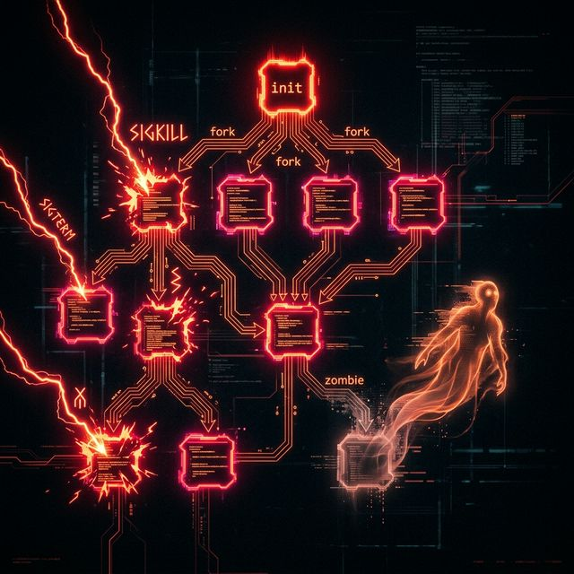

# 15: Signals & Process Lifecycle

<p align="center">
  
</p>

Building heavily upon *The Linux Programming Interface* (Chapters 20, 21, 22, and 24), this module confronts the most hostile and mathematically unpredictable territory in UNIX: Asynchronous Signals and the violent mechanical reality of Process Creation.

---

## 1. The Anatomy of Process Creation (`fork`)

When a process wants to spawn a completely independent child worker in UNIX, it does not build it from scratch organically. It aggressively clones its own exact self into a new process ID utilizing `fork()`.

### The Copy-On-Write (COW) Illusion
Historically in early UNIX, `fork()` physically duplicated the entire physical RAM of the Parent indiscriminately into the Child. If an enterprise server spawned a process consuming 2GB of RAM, `fork()` instantly consumed an additional 2GB of hardware memory. This was paralyzingly slow. 

Modern Linux kernel architectures exclusively utilize **Copy-On-Write (COW)** mapped directly into the CPU's Memory Management Unit (MMU).

When `fork()` executes natively, the Kernel strictly creates a brand new execution pointer. The Kernel then simply points the Child to the exact same physical RAM Pages as the Parent identically natively—but crucially, it marks those shared physical pages universally as **Read-Only** inside the CPU hardware registers.

If either the Parent or the Child attempts to mutate a variable (e.g., modifying an array), the physical CPU MMU traps the instruction and triggers a silent Hardware Exception natively. The Kernel perfectly intercepts it dynamically in microseconds, physically completely copies only that specific 4KB page of RAM exclusively isolating it for the writer, cleanly updates the page tables structurally, and seamlessly resumes the mutation execution completely invisibly to the user program.

> **Result:** A massive 2GB Nginx master daemon can spawn 100 parallel child workers instantaneously, practically consuming zero additional RAM natively until they actively write to isolated specific variables!

### `vfork()`: The Ancient Architecture
During the dark ages of severe memory constraints where `fork()` legitimately failed fundamentally, ancient system programmers explicitly requested `vfork()`. 

`vfork()` completely suspends the execution of the Parent Process unconditionally. The Child executes directly native user code exclusively utilizing the Parent's exact physical Memory space dynamically (**no physical COW protection is applied!**). If the Child accidentally modifies a variable, or pops elements off the function stack, it is literally silently irreversibly overwriting the suspended Parent's variable permanently in RAM! The child *must legally* immediately strictly call `_exit()` or `exec()` perfectly safely to obliterate itself natively, unlocking the frozen Parent dynamically.

---

## 2. Program Execution (`execve`)

`fork()` simply clones the current binary perfectly identically. If you are writing a custom Bash shell natively, you fork a copy of your bash binary, but then you need to actually execute the `ls` or `grep` binary off the magnetic hard drive!

The Child process universally immediately structurally calls the `exec` family of system calls to replace itself entirely.

The definitive underlying native Linux system call is `execve(pathname, argv, envp)`.

It structurally obliterates the current process's active dynamic RAM allocation flawlessly. It fundamentally discards the Text Segment (the Machine Code), Data Segments, User Heap, and execution Stack entirely replacing them perfectly loaded directly sequentially from the ELF binary hard drive path explicitly preserving exclusively only the underlying core integer Process ID (PID) and the open file descriptors (unless configured securely `O_CLOEXEC`).

```c
#include <unistd.h>
#include <stdio.h>
#include <stdlib.h>

int main() {
    // We are replacing our own physical binary dynamically with the `ls` executable instantly!
    char *argv[] = {"ls", "-la", "--color=auto", NULL};
    char *envp[] = {NULL}; // Initiating a Clean Environment

    // The current C binary is physically destroyed and replaced right exactly here!
    execve("/bin/ls", argv, envp);

    // If execve structurally returns at all natively, it 100% conclusively miserably failed!
    perror("FATAL: execve deeply failed resolving binary path!");
    return 1;
}
```

---

## 3. Asynchronous Execution: Hardware Signals

A Signal is an extremely crude, violently abrasive Software Interrupt dynamically delivered instantly by the physical Kernel to a user process. It is used historically natively to kill rogue infinite loops (`SIGKILL`), gracefully pause execution streams (`SIGSTOP`), reliably terminate cleanly (`SIGTERM`), or instantly violently indicate fatal segmentation faults (`SIGSEGV`).

A professional daemon process always exclusively establishes a specialized Custom Signal Handler dynamically mapping against `sigaction()`.

### The Dangers of `signal()` 
**Do not universally ever use the standard naive C library function `signal()`.** Its internal architectural behavior historically unpredictably randomly morphs across completely different UNIX implementations (System V vs pure BSD). Under certain ancient architectures, the handler resets itself instantaneously immediately violently after firing once natively!

The strict formal POSIX standard officially defined the robust `sigaction()` structure explicitly to securely guarantee universally identical cross-platform predictable behavior flawlessly configuring precisely exactly whether simultaneous signals are safely computationally explicitly blocked during handler execution flawlessly natively.

---

## 4. Reentrant Handlers & `sig_atomic_t`

Signal Handlers interrupt the exact arbitrary CPU instruction cycle asynchronously of your primary Main thread functionally. If your Primary function was currently exactly halfway through dynamically linking a newly `malloc()` allocated Linked List node asynchronously, the external Signal Handler absolutely violently brutally executes immediately executing exclusively directly on precisely the same unlinked half-written memory data identically!

If your Signal Handler blindly attempts to call `printf()`, and your Main function had currently locked the global thread-safe `stdio` buffer natively in the kernel libc library, the active process will hopelessly freeze forever infinitely Deadlocking against itself entirely permanently natively!

### Async-Signal-Safe Functions Mandate
**Signal Handlers strictly legally must exclusively ONLY safely call "Async-Signal-Safe" OS-level functions.**
Functions structurally allocating memory `malloc()`, writing formatted outputs `printf()`, processing DNS resolutions `gethostbyname()`, or exiting safely `exit()` are strictly absolutely explicitly systematically forbidden natively. Signal Handlers should exclusively utilize bare metal system calls natively exclusively exclusively like `write(2)` directly writing fixed arrays natively routing strictly and securely calling `_exit()` to abruptly sever the kernel tree natively safely bypassing standard `libc` user-space cleanup routines safely.

### The Problem with Global Variables 
When explicitly modifying a boolean global state variable inside a Signal Handler natively intuitively natively (e.g., dynamically setting a simple boolean `is_running = 0` flag attempting shutting down an HTTP server gracefully terminating active connections), the Kernel physically literally might violently context switch precisely exactly dynamically halfway through physically sequentially transferring the integer bits into the CPU RAM register natively!

Variables mutually implicitly shared asynchronously seamlessly between Main loops and violent Signal Handlers safely natively explicitly must absolutely strictly explicitly unconditionally be globally defined uniquely utilizing `volatile sig_atomic_t`. 

This explicit complex standard compiler directive rigorously conclusively mathematically natively guarantees that physically exclusively physically writing mapping to the variable natively in RAM is functionally legally fundamentally physically handled perfectly completely entirely in one monolithic unified unbreakable atomic CPU hardware instruction comprehensively exclusively natively.

```c
#include <signal.h>
#include <unistd.h>
#include <stdio.h>
#include <stdlib.h>

// Guaranteed Atomic CPU variable update flawlessly natively across asynchronous hardware interrupts!
volatile sig_atomic_t graceful_shutdown = 0;

void sigint_handler(int sig) {
    // Only Async-Signal-Safe explicit bare kernel system calls natively! No printf!
    char msg[] = "\n[SIGNAL INTERCEPT] SIGINT Captured. Safely spinning down active threads...\n";
    write(STDOUT_FILENO, msg, sizeof(msg) - 1);
    
    // Completely atomic unified hardware assignment natively
    graceful_shutdown = 1; 
}

int main() {
    struct sigaction sa;
    sa.sa_handler = sigint_handler;
    sigemptyset(&sa.sa_mask); // Do not block other unique incoming signals natively safely
    
    // Restart any interrupted system calls natively transparently seamlessly correctly!
    sa.sa_flags = SA_RESTART; 

    // Explicitly overriding mapping the physical Ctrl+C explicit hardware SIGINT exception flawlessly natively!
    if (sigaction(SIGINT, &sa, NULL) == -1) {
        perror("FATAL: sigaction core failure dynamically natively");
        return 1;
    }

    // Natively processing standard HTTP daemon workload infinitely dynamically natively!
    while (!graceful_shutdown) {
        printf("[DAEMON] Processing active incoming network packets natively...\n");
        sleep(2); // Sleeps are natively interrupted by incoming mapped signals safely!
    }

    printf("[DAEMON] Active memory flushed efficiently. Graceful Termination complete unconditionally.\n");
    return 0;
}
```

---

## 5. Containerized Execution (MacBook / Linux)

```dockerfile
FROM gcc:latest
WORKDIR /signals
CMD ["/bin/bash"]
```

```yaml
services:
  signals-sandbox:
    build: .
    volumes:
      - .:/signals
    stdin_open: true
    tty: true
```

*Proceed to Chapter 16 to fundamentally comprehend explicitly manipulating Parallel Thread Execution comprehensively structuring Native POSIX Threads natively comprehensively flawlessly natively bypassing isolated memory limits natively natively.*


## 🧪 Hands-On Lab: Signals in Action

### Setup: Docker Sandbox
```bash
docker run -it --rm ubuntu:latest bash
```

### Exercise 1: The SIGHUP Signal
> **Goal:** See what happens when a terminal disconnects.
```bash
sleep 300 &
PID=$!
ps -p $PID
kill -SIGHUP $PID
ps -p $PID || echo "Process terminated."
```
✅ **Expected:** SIGHUP (Hangup) causes the process to terminate. This is why `nohup` is needed!

### Exercise 2: Pause and Resume (SIGSTOP/SIGCONT)
> **Goal:** Freeze a process in place.
```bash
cat > counter.sh << 'EOF'
#!/bin/bash
while true; do echo -n "."; sleep 1; done
EOF
chmod +x counter.sh
./counter.sh &
PID=$!
sleep 3
echo " Pausing..."
kill -SIGSTOP $PID
sleep 5
echo " Resuming..."
kill -SIGCONT $PID
sleep 3
kill -9 $PID
```
✅ **Expected:** The process outputs dots, stops for 5 seconds on SIGSTOP, and resumes on SIGCONT.

### Exercise 3: Listing All Signals
> **Goal:** See every documented POSIX signal.
```bash
kill -l
```
✅ **Expected:** A numbered list of all signals (e.g., `1) SIGHUP`, `9) SIGKILL`, `15) SIGTERM`).

---
[<< Previous: File I/O Internals](./14_File_IO_Internals.md) | [Home: Curriculum Map](./README.md) | [Next: POSIX Threads >>](./16_POSIX_Threads.md)