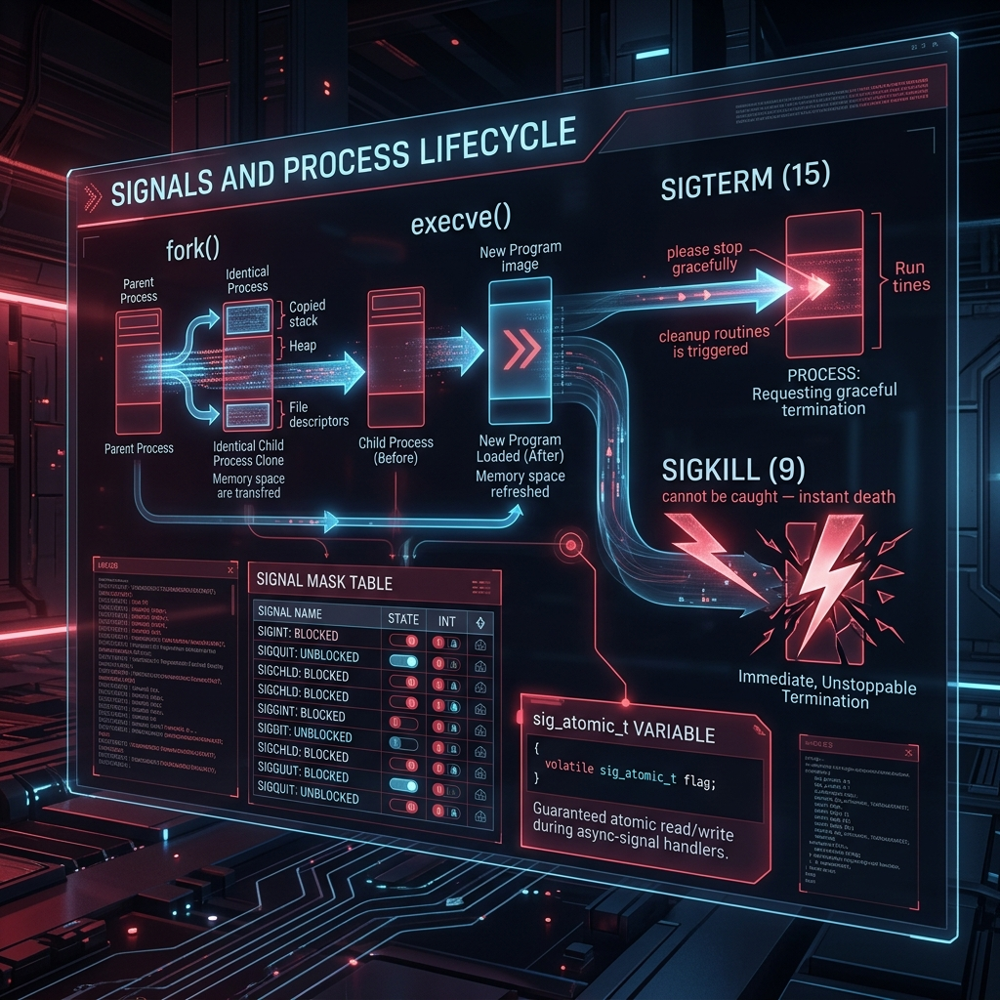

<div align="center">
  
</div>

# 15: Signals & Process Lifecycle

> 🧠 **The Feynman Hook:** When you build a house, you don't grow it from a seed. But in Linux, processes are grown *exactly* like seeds. Every new process is an identical clone (mitosis) of an existing process (`fork`). But how do you talk to a clone if it's running a million miles an hour? You can't just pass it a note. You have to throw a rock through its window with a message attached. In Linux, throwing that mathematical rock is called a **Signal**. Understanding how Linux clones memory perfectly, and how signals violently interrupt those clones, is the basis of all process management.

**🎯 The Big Goal:** Master the mathematical reality of Process Mitosis (`fork`), Memory Cloning (`COW`), Program Replacement (`execve`), and the incredibly violent asynchronous nature of POSIX Hardware Signals.

---

## 1. The Anatomy of Process Creation (`fork`)

> **Feynman Insight:** When an application wants to spawn a completely independent child worker, it does not build it from scratch. It aggressively clones its own *exact* self into a new process ID utilizing the `fork()` system call.

### The Copy-On-Write (COW) Illusion
Historically, `fork()` physically duplicated the entire physical RAM of the Parent indiscriminately. If a database using 2GB of RAM spawned a child, you instantly lost another 2GB of RAM. It was paralyzingly slow. 

Modern Linux absolutely refuses to copy RAM. It leverages the CPU hardware for an illusion called **Copy-On-Write (COW)**.
1. When `fork()` executes, the Kernel creates a new Process ID.
2. The Kernel points the Child to the *exact same physical silicon RAM Pages* as the Parent! It literally uses identical memory.
3. Crucially, the Kernel marks all of these shared pages as **Read-Only** in the CPU hardware.

If the Parent or Child attempt to mutate a variable (like `i++`), the CPU hardware traps the illegal write and fires an alarm. The Kernel intercepts the alarm instantly, *copies only that single 4KB page*, hands it to the writer, and resumes the application invisibly.

**Result:** A massive 2GB Nginx daemon can spawn 100 perfectly identical child workers instantaneously, collectively consuming 0 additional RAM until they uniquely write to specific variables!

---

## 2. Program Execution (`execve`)

> **Feynman Insight:** If a Parent clones itself precisely, how does the Child become an entirely different program? How does a `bash` shell become the `ls` command? It commits suicide and reincarnates.

The Child immediately calls the `execve()` system call.
`execve` violently obliterates the Child's current Machine Code, Heap, and Stack memory. It functionally shreds the mind of the clone. It then loads an entirely new binary off the solid-state drive (like `/bin/ls`), injects it into the now-empty cloned shell, and starts it. The only things that survive this reincarnation are the unique Process ID (PID) and the open File Descriptors inherited from the Parent!

---

## 3. Asynchronous Execution: Hardware Signals

> **Feynman Insight:** If a process is stuck in an infinite loop, you press `Ctrl+C`. How does the terminal stop it? It throws a rock (**a Signal**). A Signal is an abrasive Software Interrupt dynamically delivered instantly by the physical Kernel.

- `SIGKILL (9)`: The Sniper Rifle. Instantly wipes the process from memory. No warnings.
- `SIGINT (2)`: Sent by `Ctrl+C`. Politely asks the application to terminate.
- `SIGSTOP (19)`: The Freeze Ray. Completely suspends the application natively in the Kernel.

### The Danger: Reentrant Interrupts
Signal Handlers interrupt the arbitrary CPU instruction cycle asynchronously. If your Main function is exactly halfway through dynamically linking a newly `malloc()` allocated Linked List, the Signal Handler violently executes *immediately*, using the same globally unlinked half-written memory dynamically!

If your Signal Handler attempts to call `printf()`, and your Main function had actively locked the thread-safe `stdio` buffer library, the active process will hopelessly freeze forever infinitely Deadlocking against itself!

### Async-Signal-Safe Functions Mandate
**You cannot print inside a Signal Handler.** Signal handlers legally must exclusively use "Async-Signal-Safe" bare-metal OS functions. You cannot allocate memory. You cannot make DNS requests. You can only flip simple boolean integers or write raw un-buffered bytes perfectly securely to `fd 1`.

---

## 4. Building a True Signal Handler (`sig_atomic_t`)

If you want an Nginx server to gracefully shut down, you must intercept the `SIGINT` signal, definitively update a boolean "shutdown" variable, and let the main loop naturally notice the shutdown request. 

However, because the Signal Interrupt is violently asynchronous, the CPU might be interrupted exactly while moving the integer bits into the boolean variable cache. To guarantee mathematical safety, you must strictly utilize `volatile sig_atomic_t`. This guarantees to the C compiler that reading/writing to this specific variable natively occurs in exactly *one* unified unbreakable CPU hardware instruction.

**`signal_daemon.c`**
```c
#include <signal.h>
#include <unistd.h>
#include <stdio.h>

// Guaranteed Atomic CPU variable update flawlessly across hardware interrupts!
volatile sig_atomic_t graceful_shutdown = 0;

void sigint_handler(int sig) {
    // Only Async-Signal-Safe explicit bare kernel system calls natively! No printf!
    char msg[] = "\n[INTERCEPT] SIGINT Captured. Safely shutting down...\n";
    write(1, msg, sizeof(msg) - 1);
    
    // Completely atomic hardware assignment natively
    graceful_shutdown = 1; 
}

int main() {
    struct sigaction sa;
    sa.sa_handler = sigint_handler;
    sigemptyset(&sa.sa_mask); 
    sa.sa_flags = SA_RESTART; 

    // Explicitly map the physical Ctrl+C interrupt
    sigaction(SIGINT, &sa, NULL);

    while (!graceful_shutdown) {
        printf("[DAEMON] Processing active incoming network packets...\n");
        sleep(2); 
    }

    printf("[DAEMON] Active memory flushed. Graceful Termination complete.\n");
    return 0;
}
```

---

## 🤔 Reflection Questions

<details>
<summary>💡 View Answer: Describe how Copy-on-Write (COW) leverages the Memory Management Unit (MMU) to avoid copying memory during fork.</summary>

The Virtual Memory Page Tables contain permissions for the physical silicon. When `fork()` executes, the Kernel explicitly sets the Page permissions strictly to Read-Only (`R--`) for both Parent and Child. When either process attempts to execute a Write (`W`) instruction mathematically, the CPU's MMU hardware actively blocks the illegal instruction and instantly generates a hardware Exception called a Page Fault. The Linux Kernel catches this fault instantly, dynamically clones exactly that specific 4KB memory page strictly into new silicon, updates the Page Table permissions to `RW-` exclusively for the writer, and seamlessly replays the failed CPU instruction perfectly invisibly.
</details>

<details>
<summary>💡 View Answer: Why is 'printf()' fundamentally illegal inside a Signal Handler?</summary>

`printf()` is not Async-Signal-Safe because it utilizes dynamic hidden state locks inside the C standard library to ensure multiple threads don't print on top of each other. If the main program locks the hidden `stdout` mutex to print "Hello", is violently interrupted asynchronously by a Signal, and the Signal Handler then calls `printf("Alert")`, the Handler will wait infinitely for the mutex lock that the interrupted main thread is holding! A permanent system deadlock ensues instantly.
</details>

---

## 🐳 Hands-On Lab: Signals in Action

### Setup: Docker Sandbox
```bash
docker run -it --rm ubuntu:latest bash
```

### Exercise 1: The SIGHUP Signal (Hangup)
> **Goal:** Watch what happens when a terminal disconnects.
```bash
# Start a sleep job infinitely in the background
sleep 300 &
PID=$!
ps -p $PID

# Send SIGHUP (literally simulates closing the terminal window)
kill -SIGHUP $PID

# Check if it survived
ps -p $PID || echo "Process cleanly terminated by SIGHUP."
```
✅ **Expected:** It dies instantly. This is precisely why you must prefix background jobs with `nohup` (No Hangup) so they aggressively ignore this specific signal definitively!

### Exercise 2: Pause and Resume (SIGSTOP/SIGCONT)
> **Goal:** Freeze a live process computationally in place.
```bash
cat > counter.sh << 'EOF'
#!/bin/bash
while true; do echo -n "."; sleep 1; done
EOF
chmod +x counter.sh
./counter.sh &
PID=$!
sleep 3

echo " Pausing with SIGSTOP..."
kill -SIGSTOP $PID
sleep 5

echo " Resuming with SIGCONT..."
kill -SIGCONT $PID
sleep 3

kill -9 $PID
```
✅ **Expected:** The process aggressively outputs dots, mathematically stops completely for 5 seconds natively without consuming CPU, and perfectly resumes precisely where it left off utilizing `SIGCONT`.

---
[<< Previous: File I/O Internals](./14_File_IO_Internals.md) | [Home: Curriculum Map](./README.md) | [Next: POSIX Threads >>](./16_POSIX_Threads.md)