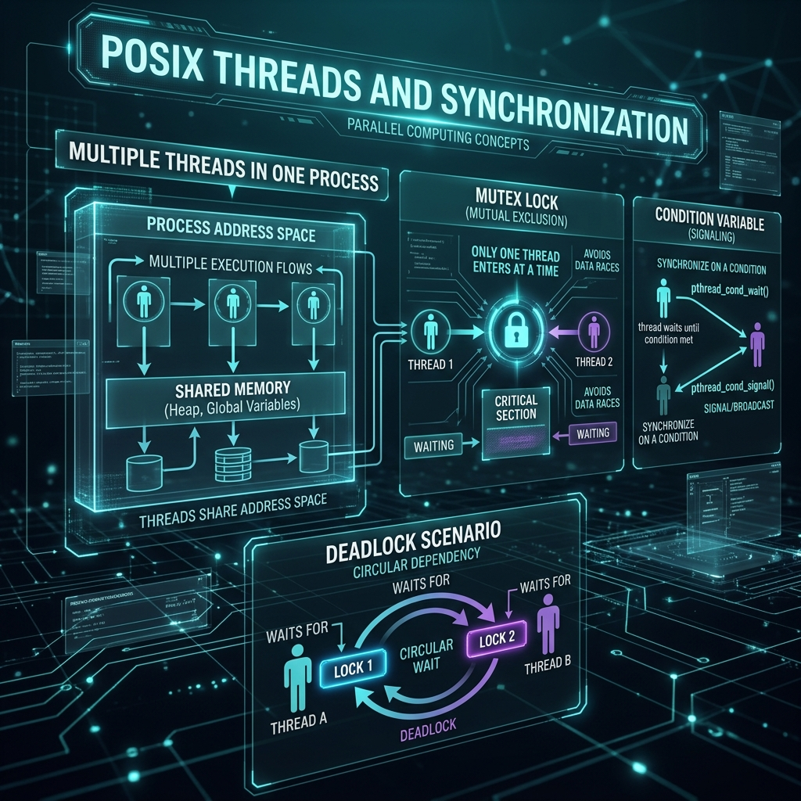

<div align="center">
  
</div>

# 16: POSIX Threads (Pthreads)

> 🧠 **The Feynman Hook:** If a kitchen needs to cook 1,000 meals (processes), you could build 1,000 completely identical kitchens (`fork`), each with its own stove, fridge, and chef. This provides absolute security (no one steals your ingredients), but uses immense resources. **Threads** are different. Threads are putting 1,000 chefs perfectly into *one single kitchen*. They all share the exact same fridge (the Heap memory) and the same stoves (Global variables). It is incredibly fast and efficient, but if two chefs try to grab the exact same knife (variable constraint) at the exact same millisecond, they violently crash contextually into each other. Mastering Pthreads is mastering kitchen traffic control (**Mutexes**).

**🎯 The Big Goal:** Advance from isolated processes into concurrent, shared-memory thread programming. Master POSIX Mutexes (traffic control), Condition Variables (sleeping), and identifying Race Conditions.

---

## 1. Thread Anatomy vs. Process Anatomy

> **Feynman Insight:** When you spawn a thread exclusively using `pthread_create()`, the Kernel absolutely does not duplicate memory. It simply creates a new parallel execution pointer physically inside the exact same house.

**Shared globally by ALL threads in the process:**
- The enormous Data Heap (`malloc()`).
- Global defined Variables.
- Open File Descriptors (Pipes, Sockets).

**Private exclusively to EACH specific Thread:**
- A unique Execution Stack (local function variables and recursion).
- Unique CPU Registers (tracking what line of code this specific Chef is actively cooking!).
- Thread-Local Storage (TLS).

### The Mathematical Horror of Race Conditions
Because the Heap is shared perfectly, two parallel CPU cores executing parallel threads can try to violently update a simple global integer counter `i++` precisely simultaneously. 

At the hardware CPU assembly level, `i++` takes 3 explicitly distinct operations: 
`READ i` → `ADD 1` → `WRITE i`

If both threads hit `READ` at identically the same 0.1 nanoseconds, they both actively read `10`. They both natively calculate `11`. They both overwrite memory with `11`. You just successfully mathematically lost a counter increment silently! This is a **Race Condition**.

---

## 2. Mutexes (Mutual Exclusion)

To prevent violent kitchen collisions, we must explicitly lock the knives. We utilize a structurally guaranteed Kernel-backed lock called `pthread_mutex_t`. It guarantees that exclusively only *one* thread can cross into the highly sensitive "Critical Section" of the code at exactly one time.

```c
#include <pthread.h>

// Initialize the global kitchen lock
pthread_mutex_t mtx = PTHREAD_MUTEX_INITIALIZER;
int shared_resource = 0;

void* worker(void* arg) {
    for(int i = 0; i < 1000000; i++) {
        // 1. ACQUIRE LOCK (If another chef holds it, the Kernel puts me to sleep here instantly!)
        pthread_mutex_lock(&mtx);   
        
        // 2. CRITICAL SECTION (Completely safe! I am mathematically the only chef in here!)
        shared_resource++;          
        
        // 3. RELEASE LOCK (Wake up the next waiting chef sequentially)
        pthread_mutex_unlock(&mtx); 
    }
    return NULL;
}
```

### The Ultimate Danger: Deadlocks
If Thread A definitively locks Mutex 1 and natively waits for Mutex 2, while concurrently Thread B explicitly locks Mutex 2 and structurally waits for Mutex 1, the program stops forever mathematically. Neither will legally yield. The entire application violently halts into an irrecoverable **Deadlock**.
> **The Golden Architecture Rule:** If your architecture requires multiple locks, you must program every single thread universally to lock them in the exact identical strict order globally (e.g., *always* lock 1 then realistically lock 2).

---

## 3. Condition Variables: Intelligent Sleeping

How does a Consumer thread optimally verify when a Producer thread has actively added data to a completely shared queue? 
- **Spinning (Horrible):** `while(queue.empty()) {}` — You continuously open and slam the oven door burning 100% of a CPU core dynamically doing literally nothing!
- **Sleeping (Bad):** `sleep(1)` — High latency. If the data arrives in 0.1s, the user waits 0.9s permanently.
- **Condition Variables (Architecturally Perfect):** `pthread_cond_t` allows exactly a thread to safely **sleep with 0% CPU consumption natively** until it is actively structurally awakened by another specific thread!

### The Intelligent Condition Flow
```c
pthread_mutex_lock(&mtx); // Secure the kitchen

while (queue_is_empty()) {
    // 1. Atomically explicitly UNLOCKS the mutex constraint!
    // 2. Puts the thread perfectly to SLEEP natively with 0% CPU!
    // 3. When violently signaled sequentially by the Producer, it WAKES UP and instantly RE-ACQUIRES the lock perfectly!
    pthread_cond_wait(&cond, &mtx);
}

data = get_from_queue();
pthread_mutex_unlock(&mtx);
```

---

## 🤔 Reflection Questions

<details>
<summary>💡 View Answer: Describe why older 'errno' implementations broke spectacularly in multi-threaded programs.</summary>

In classical C definitions, `errno` was a single, absolute global integer natively defined at the exact root of the application data segment natively. If Thread A powerfully failed a file open system call and set `errno = 2` (File not found), but before it could physically read it, Thread B structurally failed a networking system call and set `errno = 5` (I/O error), Thread A would incorrectly interpret its failure dynamically as an I/O error universally! Modern Linux absolutely structurally fixes this inherently by converting `errno` dynamically into a highly optimized macro exclusively utilizing **Thread-Local Storage (TLS)**, ensuring every uniquely executing thread natively possesses its own isolated `errno` copy structurally.
</details>

<details>
<summary>💡 View Answer: How does NPTL (Native POSIX Thread Library) effectively utilize the Linux 'clone' system call under the hood natively?</summary>

In traditional operating systems, "Threads" and "Processes" are mathematically vastly different kernel objects physically. Linux explicitly considers everything structurally a "Task." When you invoke `pthread_create()`, Linux ultimately executes exactly the same `clone()` system call it natively utilizes for standard process `fork()` creation! The massive difference natively is merely the strict mathematical flags passed: passing exclusively `CLONE_VM`, `CLONE_FILES`, and `CLONE_SIGHAND` physically explicitly instructs the OS Kernel to intentionally completely identically share the Virtual Memory, Open Files, and Signal Handlers strictly between the new Task and the spawning Task dynamically instead of comprehensively universally duplicating them independently.
</details>

---

## 🐳 Hands-On Lab: Practice POSIX Threads

### Setup: Docker Sandbox
```bash
docker run -it --rm ubuntu:latest bash
apt-get update -qq && apt-get install -y -qq gcc
```

### Exercise 1: Compile a Basic Multithreaded App
> **Goal:** Build an application executing tasks concurrently natively.
```bash
cat > threaded_app.c << 'EOF'
#include <stdio.h>
#include <pthread.h>

void *worker(void *arg) {
    long id = (long)arg;
    printf("Parallel Thread %ld is successfully running natively!\n", id);
    return NULL;
}

int main() {
    pthread_t t1, t2;
    // Launch parallel chefs into the kitchen!
    pthread_create(&t1, NULL, worker, (void *)1);
    pthread_create(&t2, NULL, worker, (void *)2);
    
    // Explicitly wait perfectly cleanly natively for the chefs to finish!
    pthread_join(t1, NULL);
    pthread_join(t2, NULL);
    
    printf("All threads dynamically completed natively.\n");
    return 0;
}
EOF

# Crucial: You absolutely MUST dynamically link the pthread library natively!
gcc threaded_app.c -o threaded_app -lpthread
./threaded_app
```
✅ **Expected:** You will explicitly see Thread 1 and Thread 2 executing simultaneously flawlessly inside identically the same process boundary sequentially!

---
[<< Previous: Signals and Process Lifecycle](./15_Signals_and_Process_Lifecycle.md) | [Home: Curriculum Map](./README.md) | [Next: Socket Programming >>](./17_Socket_Programming.md)
