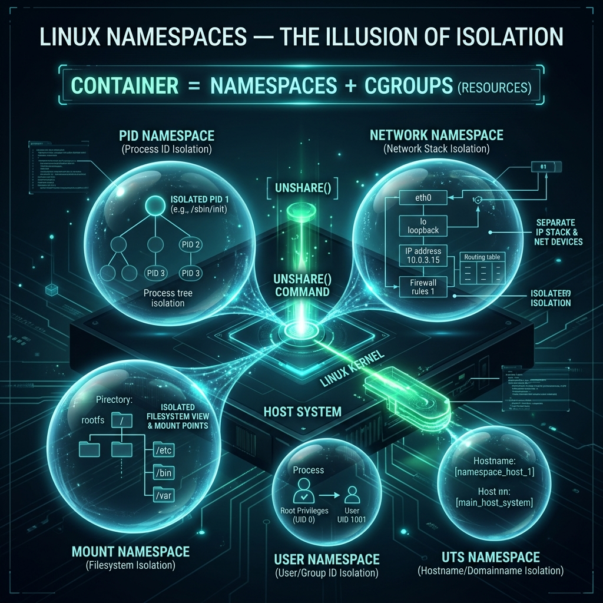

<div align="center">
  
</div>

# 19: Linux Namespaces - The Illusion of Isolation

> 🧠 **The Feynman Hook:** Imagine a bustling corporate skyscraper. Everyone uses the same elevators, drinks from the same water cooler, and can see the CEO sitting in office #1. This is a standard Linux Kernel. **Namespaces** are VR headsets. The Kernel locks a worker in a room and straps a VR headset to their face. The headset projects a completely empty building. The worker looks at office #1 and sees *themselves* as the CEO! They look at the network cables and see a totally private internet. They are physically still inside the busy skyscraper, but mathematically, the Kernel is lying to them. This exact lie is what we call a "Container."

**🎯 The Big Goal:** Shatter the mystique of Docker. Understand that "Containers" do not exist natively in the kernel. Linux relies on manipulating 6 distinct Namespaces to create parallel, isolated universes for standard processes.

---

## 1. The 6 Parallel Universes

A Namespace is functionally a filter placed instantly upon a process. It intercepts kernel queries and returns mathematically isolated answers.

| Namespace | The Virtual Reality Illusion | Technical Reality |
| :--- | :--- | :--- |
| **PID** | "I am the very first person on Earth." | The process believes its ID is `1` (init). It absolutely cannot see the thousands of host processes actually running via `ps`. |
| **Network (net)** | "I have my own private router and ethernet cables." | The process receives its own virtual Network Interfaces (`veth`), IPs, and Routing Tables. It cannot see `eth0` natively. |
| **Mount (mnt)** | "I have a completely private hard drive." | The process can mount and unmount filesystems inside its namespace without physically altering the host's `/etc` or `/tmp`. |
| **User (user)** | "I am the undisputed Root King." | A standard, unprivileged user (UID `1000`) on the host becomes `root` (UID `0`) exclusively *inside* the namespace. If it breaks out, it drops back to `1000`. |
| **UTS** | "This planet is named after me." | The process can change its own Hostname (`hostname`) without altering the host server's name. |
| **IPC** | "My radio signal is fully encrypted." | The process receives isolated System V IPC queues and POSIX message buses. |

---

## 2. Breaking the Matrix with `unshare`

> **Feynman Insight:** We do not need Docker to build a parallel universe. We can command the Kernel directly utilizing the `unshare` command-line tool, which maps physically to the `unshare()` C system call.

### Creating a Ghost Universe (PID and Mount Isolation)

Let's launch a Bash shell that thinks it's completely alone on the server.

```bash
# -p: Create a brand new PID Namespace
# -f: Fork perfectly into a new execution thread
# --mount-proc: Force the new universe to have its own private `/proc` directory
sudo unshare -p -f --mount-proc /bin/bash
```

If you type `ps aux` natively inside this new shell, **you will strictly only see two processes**. You are `PID 1`. The thousands of background Linux daemons are completely invisible. Yet, if you open a separate terminal on the host, you will clearly see your "isolated" bash script running natively as `PID 48291`! 

The Kernel is explicitly protecting the host by deceiving the child.

---

## 3. Behind the Scenes: The `/proc` Links

How does Linux mathematically track which process belongs to which parallel universe? 

Every single process executing on Linux has a dedicated physical directory inside `/proc`. Look inside:

```bash
# View the namespace associations for the current shell ($$)
ls -l /proc/$$/ns/
```
You will literally see exact mathematical inode pointers:
`net -> net:[4026531992]`
`pid -> pid:[4026531836]`

If two completely separate processes both have `net:[4026531992]`, they are natively in the exact same network universe! If the inode differs, they are physically walled off. 

Docker's entire core logic is simply aggressively manipulating these inode associations.

---

## 4. Why the User Namespace Changed Everything

Historically, running Docker required permanent raw `root` access. Because containers ran as absolute `root`, if a hacker escaped the container via a Kernel exploit, they owned the complete host infrastructure immediately.

The **User Namespace** was the architectural savior (Rootless Docker).
It mathematically securely maps `UID 0` (Root) inside the container strictly to `UID 100000` (an absolute nobody) physically on the host. 
The containerized application is blissfully happy—it can happily dynamically install `.deb` packages and bind to port `80` inside its VR headset. But if that application successfully breaks out of the container natively onto the host, it is instantly brutally rejected by the Kernel because its true physical identity is an unprivileged user!

---

## 🤔 Reflection Questions

<details>
<summary>💡 View Answer: If a Docker container is just a normal Linux process wrapped in a Namespace, why does it boot in milliseconds compared to a Virtual Machine (VM)?</summary>

A Virtual Machine (VMBox/VMware) must physically simulate a complete fake motherboard, boot a fake BIOS, dynamically start a fake kernel, mount virtual hard drives, and launch hundreds of `systemd` daemons sequentially. It is a computer inside a computer. A Linux Namespace does none of this. The host Kernel simply changes a few mathematical pointers for the new process, loads the binary, and immediately begins execution. It dynamically leverages the exact same actively running Host Kernel. The startup time is identical to simply spawning `bash`.
</details>

<details>
<summary>💡 View Answer: Describe how the Network Namespace prevents port conflicts (e.g., running two Nginx containers on Port 80).</summary>

Normally, if two processes try to aggressively `bind()` to Port 80 generically on the same network interface, the second one physically crashes (`Address Already in Use`). However, the Network Namespace explicitly provisions a totally unique isolated virtual TCP/IP networking stack per container. Container A has `eth0` with IP `172.17.0.2`. Container B has `eth0` with IP `172.17.0.3`. Because they exist in totally separate IP universes, they can natively both aggressively successfully bind flawlessly to Port 80 exclusively within their own isolated VR headsets without any collision on the Host OS.
</details>

---

## 🐳 Hands-On Lab: Isolating Environments natively

### Setup: Docker Sandbox
*Warning: To explicitly manipulate Kernels Namespaces natively, our Docker container must mathematically temporarily possess extreme `SYS_ADMIN` privileges acting as a host surrogate.*
```bash
docker run -it --rm --privileged ubuntu:latest bash
apt-get update -qq && apt-get install -y -qq util-linux iproute2
```

### Exercise 1: Create a UTS Namespace
> **Goal:** Isolate a process's Hostname perception completely from the parent system natively.
```bash
# Check the host's actual native hostname
hostname

# Dive actively into a brand new isolated UTS universe natively
unshare --uts /bin/bash

# Change the universe's internal hostname physically explicitly
hostname isolated-hologram-box
hostname

# Sever the VR headset connection cleanly
exit  

# Boom! The parent OS mathematically preserved its original absolute hostname safely!
hostname
```
✅ **Expected:** Inside the `unshare` session, the hostname is forcefully dynamically overwritten. Upon exiting, the original host configuration remains flawlessly untouched natively!

### Exercise 2: Network Namespace Deep Dive
> **Goal:** Prove isolation of internet routing tables dynamically.
```bash
# View active IP routing explicitly
ip a

# Branch explicitly into a completely isolated mathematical Network vacuum!
unshare --net /bin/bash

# You are physically universally offline! Even localhost (lo) is offline dynamically natively!
ip a
exit
```
✅ **Expected:** Natively inside the Network Namespace, `ifconfig` or `ip a` will absolutely unconditionally return a completely blank, totally unconfigured networking table. The Kernel explicitly severed all virtual ethernet ties completely natively.

---
[<< Previous: Linux Firewalls](./18_Linux_Firewalls_iptables.md) | [Home: Curriculum Map](./README.md) | [Next: Control Groups (cgroups) >>](./20_Control_Groups_cgroups.md)